# Central Redesign API — Execution Prompt

> **Workflow**: `docs/workflows/pending/central-redesign-api-workflow.md`
> **Project**: `platform-core-api`
> **Dependencies**: MariaDB (multi_tenant_db), Redis (platform-core-redis), certificate-authority (trust broker)

---

## 0. Pre-Execution Checklist

> **Temporal parallel**: Worker startup validation -- the executor MUST complete
> these checks before running any step. If any check fails, STOP and resolve.

- [ ] Read `docs/directives/CLAUDE.md` -- hard rules, architecture, module graph
- [ ] Read `docs/directives/AI-CODE-REF.md` -- coding standards, test conventions, detection rules
- [ ] Read `docs/design/DESIGN.md` -- clean architecture mapping, multi-tenancy model
- [ ] Read reference files listed in Phase 1 Step 1
- [ ] Verify MariaDB dev stack is running: `docker compose -f docker-compose.dev.yml up trust-broker multi_tenant_db platform-core-redis`
- [ ] Verify current build is green: `mvn clean install -DskipTests`
- [ ] Confirm no `task-service` module already exists in the project
- [ ] Confirm parent `pom.xml` `<modules>` section is accessible for new module registration

---

## 1. Execution Rules

### Universal Rules

1. **One step at a time** -- complete each step fully before moving to the next.
2. **Verify after each step** -- run the step's verification command. If it fails, fix before proceeding.
3. **Never skip steps** -- the DAG (S2) defines the only valid execution order.
4. **Commit at phase boundaries** -- each phase ends with a commit message. Commit only when the phase verification gate passes.
5. **Log execution** -- after each step, append to the Execution Log (S6).
6. **On failure** -- follow the Recovery Protocol (S5). Never brute-force past errors.

### Deterministic Constraints

> **Temporal parallel**: Workflow code must be deterministic -- same input
> produces same output. No side-channel reasoning.

- Do not introduce randomness, timestamps, or environment-dependent logic into the execution order.
- If a step's precondition is not met, STOP -- do not guess or skip.
- If a step produces unexpected output, log it and consult S5 before continuing.
- Each step's verification must pass before its dependents run -- no optimistic execution.

### Project-Specific Rules

- **OpenAPI first**: Define YAML spec, generate DTOs/interfaces via `openapi-generator-maven-plugin`, then implement. Never hand-write DTOs that the generator should produce.
- **Constants for all strings**: Every error message, log message, and magic string must be a `public static final` constant in the class that uses it. Tests import and reference the constant -- never duplicate the string.
- **Multi-tenant composite keys**: All new entities extend `TenantScoped` and use `@IdClass` with `(tenantId, entityId)`. The `EntityIdAssigner` generates IDs automatically -- entities never set their own IDs.
- **Copyright header**: Every new `.java` file must include the ElatusDev copyright header (2026).
- **Javadoc**: Required on all public classes, methods, and constants.
- **Clean Architecture structure**: Each aggregate follows `{aggregate}/interfaceadapters/` (controllers, repositories) and `{aggregate}/usecases/` (services, domain logic).
- **Testing Given-When-Then**: All tests use `shouldDoX_whenY()` naming, `@Nested` classes with `@DisplayName`, zero `any()` matchers, exact mock stubbing.
- **No `Exception` or `Throwable` catches**: Always catch specific exception types.
- **IDs always `Long`**: Never `Integer` for entity identifiers.
- **Methods < 20 lines**: Cyclomatic complexity < 10.
- **No cross-module use-case imports**: Domain modules may import repositories from other domain modules but NEVER import use cases. Use-case-to-use-case calls are restricted to the `application` module.
- **Soft delete**: All entities use `@SQLDelete` + `@SQLRestriction` -- no physical deletes.
- **Schema changes**: Add new tables to `db_init/00-schema-dev.sql` and `db_init_dev/00-schema.sql`. No Flyway -- this project uses init scripts.

---

## 2. Execution DAG

> **Temporal parallel**: Workflow definition graph -- all steps, dependencies,
> and valid execution paths. The executor follows this graph top-to-bottom.
> Nodes at the same level with no dependency edge can be executed in any order.

```mermaid
graph TD
    P1S1["P1.S1 -- Read existing patterns"] --> P1S2["P1.S2 -- Create task-service module skeleton"]
    P1S2 --> P1S3["P1.S3 -- OpenAPI spec: task-service-module.yaml"]
    P1S3 --> P1S4["P1.S4 -- Generate DTOs and interfaces"]
    P1S4 --> P1S5["P1.S5 -- JPA entities in multi-tenant-data"]
    P1S5 --> P1S6["P1.S6 -- Schema DDL for task tables"]
    P1S6 --> P1S7["P1.S7 -- Repository layer"]
    P1S7 --> P1S8["P1.S8 -- Service layer (use cases)"]
    P1S8 --> P1S9["P1.S9 -- Controller layer"]
    P1S9 --> P1S10["P1.S10 -- Scheduled overdue-task job"]
    P1S10 --> P1S11["P1.S11 -- Security configuration"]
    P1S11 --> P1S12["P1.S12 -- Register module in parent pom.xml"]
    P1S12 --> P1Gate{"Phase 1 Gate"}
    P1Gate -->|pass| P1Commit["Phase 1 Commit"]

    P1Commit --> P2S1["P2.S1 -- OpenAPI spec: analytics endpoints"]
    P2S1 --> P2S2["P2.S2 -- Generate DTOs"]
    P2S2 --> P2S3["P2.S3 -- Repository queries (JPQL/native)"]
    P2S3 --> P2S4["P2.S4 -- Service layer with Redis caching"]
    P2S4 --> P2S5["P2.S5 -- Controller layer"]
    P2S5 --> P2S6["P2.S6 -- Cache configuration"]
    P2S6 --> P2Gate{"Phase 2 Gate"}
    P2Gate -->|pass| P2Commit["Phase 2 Commit"]

    P2Commit --> P3S1["P3.S1 -- Unit tests: task-service"]
    P3S1 --> P3S2["P3.S2 -- Unit tests: analytics"]
    P3S2 --> P3S3["P3.S3 -- Component tests: task-service"]
    P3S3 --> P3S4["P3.S4 -- Component tests: analytics"]
    P3S4 --> P3S5["P3.S5 -- Multi-tenant isolation tests"]
    P3S5 --> P3Gate{"Phase 3 Gate"}
    P3Gate -->|pass| P3Commit["Phase 3 Commit"]

    style P1S1 fill:#e1f5fe
    style P1Gate fill:#fff9c4
    style P1Commit fill:#c8e6c9
    style P2Gate fill:#fff9c4
    style P2Commit fill:#c8e6c9
    style P3Gate fill:#fff9c4
    style P3Commit fill:#c8e6c9
```



> **Edge types**:
> - `-->` dependency (must complete before)
> - `-.->` compensation (undo edge -- used during rollback)
> - `==>` signal point (may require user input or external action)

---

## 3. Compensation Registry

> **Temporal parallel**: Saga pattern -- each step that creates or modifies state
> registers its undo action. On failure, the executor unwinds the compensation
> stack in reverse order (last registered -> first registered).

| Step | Forward Action | Compensation (Undo) | Idempotent? |
|------|---------------|---------------------|:-----------:|
| P1.S2 | Create `task-service/` module directory + `pom.xml` | Delete `task-service/` directory | Yes |
| P1.S3 | Create `task-service-module.yaml` OpenAPI spec | Delete the YAML file | Yes |
| P1.S4 | Generate code from OpenAPI spec | `mvn clean -pl task-service` removes generated sources | Yes |
| P1.S5 | Add JPA entities to `multi-tenant-data` | Delete the new entity classes | Yes |
| P1.S6 | Add DDL to schema init scripts | Remove the added DDL blocks | Yes |
| P1.S7 | Create repository interfaces in `task-service` | Delete the repository files | Yes |
| P1.S8 | Create use-case classes in `task-service` | Delete the use-case files | Yes |
| P1.S9 | Create controller class in `task-service` | Delete the controller file | Yes |
| P1.S10 | Create scheduled job class in `task-service` | Delete the scheduled job file | Yes |
| P1.S11 | Create security configuration in `task-service` | Delete the security config file | Yes |
| P1.S12 | Add `<module>task-service</module>` to parent pom.xml | Remove the module entry | Yes |
| P2.S1 | Create/extend analytics OpenAPI spec in `application` module | Delete the analytics YAML file | Yes |
| P2.S2 | Generate analytics DTOs | `mvn clean -pl application` removes generated sources | Yes |
| P2.S3 | Create repository query methods / custom repository impls | Delete the new repository methods/classes | Yes |
| P2.S4 | Create analytics use-case classes with `@Cacheable` | Delete the use-case files | Yes |
| P2.S5 | Create analytics controller | Delete the controller file | Yes |
| P2.S6 | Add Redis cache configuration | Revert cache config changes | Yes |
| P3.S1-S5 | Create test classes | Delete the test files | Yes |

> **Usage**: When S5 Recovery Protocol triggers a phase rollback, execute
> compensations in reverse order for all completed steps in that phase.

---

## Phase 1 -- Task Management Module

### Step 1.1 -- Read Existing Patterns

| Attribute | Value |
|-----------|-------|
| **Preconditions** | Pre-execution checklist complete |
| **Action** | Read reference files to understand existing patterns |
| **Postconditions** | Executor has context on module structure, entity patterns, OpenAPI conventions |
| **Verification** | N/A -- reading step |
| **Retry Policy** | N/A |
| **Heartbeat** | N/A |
| **Compensation** | N/A |
| **Blocks** | P1.S2 |

Read these files to understand patterns before writing any code:

```bash
# Module pom.xml pattern
cat notification-system/pom.xml

# Entity pattern: TenantScoped, composite keys, soft delete
cat multi-tenant-data/src/main/java/com/akademiaplus/notifications/NotificationDataModel.java
cat multi-tenant-data/src/main/java/com/akademiaplus/notifications/NotificationId.java

# OpenAPI module spec pattern (how module.yaml references sub-specs)
cat notification-system/src/main/resources/openapi/notification-system-module.yaml
cat notification-system/src/main/resources/openapi/notification.yaml

# Repository pattern
cat notification-system/src/main/java/com/akademiaplus/notification/interfaceadapters/NotificationRepository.java

# Use case pattern
cat notification-system/src/main/java/com/akademiaplus/notification/usecases/NotificationCreationUseCase.java

# Controller pattern
cat notification-system/src/main/java/com/akademiaplus/notification/interfaceadapters/NotificationController.java

# Security configuration pattern
cat notification-system/src/main/java/com/akademiaplus/config/*

# Schema DDL pattern
cat db_init/00-schema-dev.sql

# Existing controller advice pattern (for exception handling)
cat notification-system/src/main/java/com/akademiaplus/config/NotificationControllerAdvice.java

# Test patterns (for Phase 3 reference)
find notification-system/src/test -name "*Test.java" -o -name "*ComponentTest.java" | head -10
```

---

### Step 1.2 -- Create task-service Module Skeleton

| Attribute | Value |
|-----------|-------|
| **Preconditions** | P1.S1 complete -- patterns understood |
| **Action** | Create Maven module directory structure and `pom.xml` |
| **Postconditions** | `task-service/pom.xml` exists with correct parent and dependencies |
| **Verification** | `mvn validate -pl task-service` |
| **Retry Policy** | On failure: fix `pom.xml` syntax. Max 3 attempts. |
| **Heartbeat** | N/A |
| **Compensation** | Delete `task-service/` directory |
| **Blocks** | P1.S3 |

Create the following directory structure:

```
task-service/
├── pom.xml
└── src/
    ├── main/
    │   ├── java/
    │   │   └── com/akademiaplus/
    │   │       ├── config/
    │   │       └── task/
    │   │           ├── interfaceadapters/
    │   │           └── usecases/
    │   └── resources/
    │       └── openapi/
    └── test/
        ├── java/
        │   └── com/akademiaplus/
        │       └── task/
        └── resources/
```

**`pom.xml`** -- follow the `notification-system/pom.xml` pattern:
- Parent: `com.akademiaplus:platform-core-api:1.0`
- ArtifactId: `task-service`
- Module name property: `task.service`
- Dependencies:
  - `multi-tenant-data` (1.0) -- JPA entities
  - `security` (1.0) -- JWT auth, security filters
  - `spring-boot-starter-web`
  - `openapi-generator` (org.openapitools)
  - `jakarta.servlet-api` (provided)
  - `modelmapper`
  - `jackson-databind-nullable`
  - `spring-boot-starter-scheduling` (for `@Scheduled` annotation support -- verify if it's already pulled transitively from `spring-boot-starter-web`)
  - Test: `mockito-core`, `mockito-junit-jupiter`, `h2`, `infra-common` (test-jar), `spring-boot-starter-test`, `spring-boot-starter-webmvc-test`, `testcontainers`, `testcontainers:mariadb`, `testcontainers:junit-jupiter`, `mariadb-java-client`
- Build plugins: `maven-clean-plugin`, `openapi-generator-maven-plugin`, `maven-antrun-plugin`, `maven-surefire-plugin`, `maven-failsafe-plugin`

---

### Step 1.3 -- OpenAPI Spec: task-service-module.yaml

| Attribute | Value |
|-----------|-------|
| **Preconditions** | P1.S2 complete |
| **Action** | Write OpenAPI 3.0.3 specification for all 6 task endpoints |
| **Postconditions** | Valid YAML spec at `task-service/src/main/resources/openapi/task-service-module.yaml` |
| **Verification** | YAML is well-formed (validated during P1.S4 generation) |
| **Retry Policy** | On failure: fix YAML syntax. Max 3 attempts. |
| **Heartbeat** | N/A |
| **Compensation** | Delete the YAML file |
| **Blocks** | P1.S4 |

**Paths to define**:

```yaml
/v1/tasks:
  get:    # listTasks -- pagination + filters (status, assigneeId, priority, overdue boolean)
  post:   # createTask

/v1/tasks/{taskId}:
  get:    # getTaskById
  put:    # updateTask
  delete: # deleteTask (soft delete)

/v1/tasks/{taskId}/complete:
  patch:  # markTaskComplete
```

**Schemas to define**:

- `CreateTaskRequestDTO` -- title, description, assigneeId, assigneeType (STUDENT/EMPLOYEE/TUTOR/COLLABORATOR), dueDate, priority (LOW/MEDIUM/HIGH/URGENT)
- `UpdateTaskRequestDTO` -- title, description, assigneeId, assigneeType, dueDate, priority, status
- `TaskDTO` -- id, title, description, assigneeId, assigneeType, dueDate, priority, status (PENDING/IN_PROGRESS/COMPLETED/OVERDUE), createdBy, createdAt, completedAt
- `TaskListResponseDTO` -- content[], totalElements, totalPages, page, size
- `CompleteTaskResponseDTO` -- taskId, completedAt

**Enums**:
- `TaskPriorityDTO` -- LOW, MEDIUM, HIGH, URGENT
- `TaskStatusDTO` -- PENDING, IN_PROGRESS, COMPLETED, OVERDUE
- `AssigneeTypeDTO` -- STUDENT, EMPLOYEE, TUTOR, COLLABORATOR

**Tag**: `Tasks`

---

### Step 1.4 -- Generate DTOs and Interfaces

| Attribute | Value |
|-----------|-------|
| **Preconditions** | P1.S3 complete |
| **Action** | Run Maven to generate Java interfaces and DTOs |
| **Postconditions** | Generated sources in `task-service/target/generated-sources/openapi/` |
| **Verification** | `mvn clean generate-sources -pl task-service -am -DskipTests && find task-service/target/generated-sources -name "*.java" \| wc -l` |
| **Retry Policy** | On failure: fix OpenAPI YAML. Max 3 attempts. |
| **Heartbeat** | N/A |
| **Compensation** | `mvn clean -pl task-service` |
| **Blocks** | P1.S5 |

---

### Step 1.5 -- JPA Entities in multi-tenant-data

| Attribute | Value |
|-----------|-------|
| **Preconditions** | P1.S4 complete |
| **Action** | Create JPA entity for Task in `multi-tenant-data` |
| **Postconditions** | Entity compiles, follows TenantScoped pattern |
| **Verification** | `mvn compile -pl multi-tenant-data -am -DskipTests` |
| **Retry Policy** | On failure: fix entity definitions. Max 3 attempts. |
| **Heartbeat** | N/A |
| **Compensation** | Delete entity files |
| **Blocks** | P1.S6 |

Create in `multi-tenant-data/src/main/java/com/akademiaplus/task/`:

**1. `TaskDataModel.java`**
- Extends `TenantScoped`
- `@IdClass(TaskId.class)`
- Fields: `taskId` (Long), `tenantId` (Long), `title` (String, max 200), `description` (String, max 2000, nullable), `assigneeId` (Long), `assigneeType` (String -- STUDENT/EMPLOYEE/TUTOR/COLLABORATOR), `dueDate` (LocalDate), `priority` (String -- LOW/MEDIUM/HIGH/URGENT), `status` (String -- PENDING/IN_PROGRESS/COMPLETED/OVERDUE, default PENDING), `createdByUserId` (Long), `createdAt` (Instant), `completedAt` (Instant, nullable)
- `@SQLDelete`, `@SQLRestriction` for soft delete

**2. `TaskId.java`**
- `implements Serializable`
- Fields: `tenantId` (Long), `taskId` (Long)

---

### Step 1.6 -- Schema DDL for Task Tables

| Attribute | Value |
|-----------|-------|
| **Preconditions** | P1.S5 complete |
| **Action** | Add CREATE TABLE for tasks to schema init scripts |
| **Postconditions** | DDL added to `db_init/00-schema-dev.sql` and `db_init_dev/00-schema.sql` |
| **Verification** | SQL syntax validated against MariaDB |
| **Retry Policy** | On failure: fix SQL syntax. Max 3 attempts. |
| **Heartbeat** | N/A |
| **Compensation** | Remove DDL blocks |
| **Blocks** | P1.S7 |

```sql
--      TASK MODULE       --

CREATE TABLE tasks (
    tenant_id BIGINT NOT NULL,
    task_id BIGINT NOT NULL,
    title VARCHAR(200) NOT NULL,
    description VARCHAR(2000),
    assignee_id BIGINT NOT NULL,
    assignee_type VARCHAR(20) NOT NULL,
    due_date DATE NOT NULL,
    priority VARCHAR(10) NOT NULL DEFAULT 'MEDIUM',
    status VARCHAR(15) NOT NULL DEFAULT 'PENDING',
    created_by_user_id BIGINT NOT NULL,
    created_at TIMESTAMP DEFAULT CURRENT_TIMESTAMP,
    completed_at TIMESTAMP NULL,
    updated_at TIMESTAMP DEFAULT CURRENT_TIMESTAMP ON UPDATE CURRENT_TIMESTAMP,
    deleted_at TIMESTAMP NULL,
    PRIMARY KEY (tenant_id, task_id),
    FOREIGN KEY (tenant_id) REFERENCES tenants(tenant_id),
    INDEX idx_task_assignee (tenant_id, assignee_id, assignee_type, deleted_at),
    INDEX idx_task_status (tenant_id, status, deleted_at),
    INDEX idx_task_priority (tenant_id, priority, deleted_at),
    INDEX idx_task_due_date (tenant_id, due_date, status, deleted_at)
);
```

Also add to `task-service/src/test/resources/00-schema-dev.sql`.

---

### Step 1.7 -- Repository Layer

| Attribute | Value |
|-----------|-------|
| **Preconditions** | P1.S6 complete |
| **Action** | Create JPA repository interface |
| **Postconditions** | Repository compiles with custom query methods |
| **Verification** | `mvn compile -pl task-service -am -DskipTests` |
| **Retry Policy** | On failure: fix query syntax. Max 3 attempts. |
| **Heartbeat** | N/A |
| **Compensation** | Delete repository file |
| **Blocks** | P1.S8 |

Create `task-service/src/main/java/com/akademiaplus/task/interfaceadapters/TaskRepository.java`:
- Extends `JpaRepository<TaskDataModel, TaskId>`
- `findByTenantIdAndTaskId(Long tenantId, Long taskId)`
- `findAllByTenantId(Long tenantId, Pageable pageable)`
- `findAllByTenantIdAndStatus(Long tenantId, String status, Pageable pageable)`
- `findAllByTenantIdAndAssigneeId(Long tenantId, Long assigneeId, Pageable pageable)`
- `findAllByTenantIdAndPriority(Long tenantId, String priority, Pageable pageable)`
- Custom `@Query` for overdue filter: `status != 'COMPLETED' AND due_date < CURRENT_DATE`
- Custom `@Query` for combined filters (status + assigneeId + priority + overdue) using dynamic JPQL or `Specification`
- `@Modifying @Query` for bulk overdue update: `UPDATE TaskDataModel t SET t.status = 'OVERDUE' WHERE t.dueDate < :now AND t.status NOT IN ('COMPLETED', 'OVERDUE')`

---

### Step 1.8 -- Service Layer (Use Cases)

| Attribute | Value |
|-----------|-------|
| **Preconditions** | P1.S7 complete |
| **Action** | Create use-case classes for task business logic |
| **Postconditions** | All use cases compile with proper annotations |
| **Verification** | `mvn compile -pl task-service -am -DskipTests` |
| **Retry Policy** | On failure: fix compilation errors. Max 3 attempts. |
| **Heartbeat** | After creating 3 use cases, verify compilation |
| **Compensation** | Delete use-case files |
| **Blocks** | P1.S9 |

Create in `task-service/src/main/java/com/akademiaplus/task/usecases/`:

**1. `CreateTaskUseCase.java`**
- `@Service`, `@Transactional`
- Validates: title not blank, dueDate in future, valid priority/assigneeType enums
- Creates `TaskDataModel` with status = PENDING
- Error constants: `ERROR_TITLE_REQUIRED`, `ERROR_DUE_DATE_IN_PAST`, `ERROR_INVALID_PRIORITY`, `ERROR_INVALID_ASSIGNEE_TYPE`

**2. `GetTaskByIdUseCase.java`**
- `@Service`, `@Transactional(readOnly = true)`
- Returns mapped DTO
- Error constant: `ERROR_TASK_NOT_FOUND`

**3. `ListTasksUseCase.java`**
- `@Service`, `@Transactional(readOnly = true)`
- Applies filters: status, assigneeId, priority, overdue flag
- Returns paginated response

**4. `UpdateTaskUseCase.java`**
- `@Service`, `@Transactional`
- Validates: task exists, field validations same as create
- Updates only provided (non-null) fields
- Error constant: `ERROR_TASK_NOT_FOUND`

**5. `CompleteTaskUseCase.java`**
- `@Service`, `@Transactional`
- Sets status = COMPLETED, completedAt = Instant.now()
- Validates: task exists, task not already completed
- Error constants: `ERROR_TASK_NOT_FOUND`, `ERROR_TASK_ALREADY_COMPLETED`

**6. `DeleteTaskUseCase.java`**
- `@Service`, `@Transactional`
- Soft delete via repository `deleteById()` (triggers `@SQLDelete`)
- Error constant: `ERROR_TASK_NOT_FOUND`

---

### Step 1.9 -- Controller Layer

| Attribute | Value |
|-----------|-------|
| **Preconditions** | P1.S8 complete |
| **Action** | Create controller implementing generated API interface |
| **Postconditions** | Controller compiles, implements all 6 endpoints |
| **Verification** | `mvn compile -pl task-service -am -DskipTests` |
| **Retry Policy** | On failure: fix compilation errors. Max 3 attempts. |
| **Heartbeat** | N/A |
| **Compensation** | Delete controller file |
| **Blocks** | P1.S10 |

Create `task-service/src/main/java/com/akademiaplus/task/interfaceadapters/TaskController.java`:
- `@RestController` implementing the generated API interface
- Inject all 6 use cases via constructor
- Extract `tenantId` from `TenantContextHolder` and `userId` from security context

Create `task-service/src/main/java/com/akademiaplus/config/TaskControllerAdvice.java`:
- Follow `NotificationControllerAdvice` pattern

---

### Step 1.10 -- Scheduled Overdue-Task Job

| Attribute | Value |
|-----------|-------|
| **Preconditions** | P1.S9 complete |
| **Action** | Create a scheduled job to mark overdue tasks |
| **Postconditions** | Scheduler class compiles, annotated with `@Scheduled` |
| **Verification** | `mvn compile -pl task-service -am -DskipTests` |
| **Retry Policy** | On failure: fix scheduler config. Max 3 attempts. |
| **Heartbeat** | N/A |
| **Compensation** | Delete scheduler file |
| **Blocks** | P1.S11 |

Create `task-service/src/main/java/com/akademiaplus/task/usecases/OverdueTaskScheduler.java`:
- `@Service`
- `@Scheduled(cron = "0 0 1 * * *")` -- runs daily at 1:00 AM
- Calls `TaskRepository.markOverdueTasks()` (the `@Modifying @Query` from P1.S7)
- Logs: number of tasks marked overdue
- Error constant: `LOG_OVERDUE_TASKS_MARKED`

Create `task-service/src/main/java/com/akademiaplus/config/TaskSchedulingConfiguration.java`:
- `@Configuration`, `@EnableScheduling`

---

### Step 1.11 -- Security Configuration

| Attribute | Value |
|-----------|-------|
| **Preconditions** | P1.S10 complete |
| **Action** | Create module security configuration |
| **Postconditions** | Task endpoints are JWT-protected |
| **Verification** | `mvn compile -pl task-service -am -DskipTests` |
| **Retry Policy** | On failure: fix config. Max 3 attempts. |
| **Heartbeat** | N/A |
| **Compensation** | Delete security config file |
| **Blocks** | P1.S12 |

Create `task-service/src/main/java/com/akademiaplus/config/TaskSecurityConfiguration.java`:
- All `/v1/tasks/**` endpoints require authentication

---

### Step 1.12 -- Register Module in Parent pom.xml

| Attribute | Value |
|-----------|-------|
| **Preconditions** | P1.S11 complete -- module compiles independently |
| **Action** | Add `task-service` to parent pom.xml and `application/pom.xml` |
| **Postconditions** | Module part of the default build |
| **Verification** | `mvn clean install -DskipTests` (full build including new module) |
| **Retry Policy** | On failure: fix pom.xml entries. Max 3 attempts. |
| **Heartbeat** | N/A |
| **Compensation** | Remove module entries |
| **Blocks** | Phase 1 Gate |

Edit `pom.xml` (root):
1. Add `<module>task-service</module>` to the default `<modules>` section
2. Add `<module>task-service</module>` to the `platform-core-api` profile modules

Also add `task-service` as a dependency in `application/pom.xml`:
```xml
<dependency>
    <groupId>com.akademiaplus</groupId>
    <artifactId>task-service</artifactId>
    <version>1.0</version>
</dependency>
```

---

### Phase 1 -- Verification Gate

> **Temporal parallel**: Activity completion callback -- the phase only
> "completes" when all postconditions across all steps are met.

```bash
mvn clean install -DskipTests
```

**Checkpoint**: `task-service` module exists with OpenAPI spec, generated DTOs, JPA entity in `multi-tenant-data`, repository + use-case + controller layers, scheduled overdue job, security config. Full project compiles without test execution.

**Commit**: `feat(task-service): add task management module with 6 endpoints and overdue scheduler`

---

## Phase 2 -- Analytics Endpoints

### Step 2.1 -- OpenAPI Spec: Analytics Endpoints

| Attribute | Value |
|-----------|-------|
| **Preconditions** | Phase 1 committed |
| **Action** | Create OpenAPI spec for 5 analytics endpoints |
| **Postconditions** | Valid YAML spec exists |
| **Verification** | YAML well-formed (validated during P2.S2) |
| **Retry Policy** | On failure: fix YAML. Max 3 attempts. |
| **Heartbeat** | N/A |
| **Compensation** | Delete the YAML file |
| **Blocks** | P2.S2 |

Decide on module placement: if the `application` module already has an OpenAPI plugin configured, add an `analytics.yaml` spec there. Otherwise, create a lightweight `analytics-service` module. Check `application/pom.xml` for OpenAPI plugin configuration first.

**Preferred approach**: Add to the `application` module since analytics aggregate data from multiple domains (user-management, course-management, billing) and the `application` module is the only place where cross-module use-case calls are permitted.

Create `application/src/main/resources/openapi/analytics.yaml`:

**Paths**:

```yaml
/v1/analytics/overview:
  get:  # getOverviewAnalytics

/v1/analytics/students:
  get:  # getStudentAnalytics

/v1/analytics/courses:
  get:  # getCourseAnalytics

/v1/analytics/staff:
  get:  # getStaffAnalytics

/v1/analytics/revenue:
  get:  # getRevenueAnalytics
```

**Schemas**:

- `OverviewAnalyticsDTO` -- totalStudents (int), revenueMTD (BigDecimal), courseUtilization (double, 0-100), staffCount (int), membershipRenewalRate (double, 0-100)
- `StudentAnalyticsDTO` -- adultCount (int), minorCount (int), newThisMonth (int), enrollmentTrend (array of `MonthlyCountDTO`)
- `MonthlyCountDTO` -- month (string, yyyy-MM), count (int)
- `CourseAnalyticsDTO` -- enrollmentByCourse (array of `CourseEnrollmentDTO`), capacityUtilization (array of `CourseCapacityDTO`), scheduleByDayOfWeek (array of `DayScheduleDTO`)
- `CourseEnrollmentDTO` -- courseId (long), courseName (string), enrolledCount (int)
- `CourseCapacityDTO` -- courseId (long), courseName (string), capacity (int), enrolled (int), utilizationPercent (double)
- `DayScheduleDTO` -- dayOfWeek (string), classCount (int)
- `StaffAnalyticsDTO` -- employeeCount (int), tutorCount (int), collaboratorCount (int), distributionByRole (array of `RoleCountDTO`)
- `RoleCountDTO` -- role (string), count (int)
- `RevenueAnalyticsDTO` -- revenueTrend (array of `MonthlyRevenueDTO`), breakdownByType (array of `RevenueTypeDTO`), outstandingPayments (BigDecimal)
- `MonthlyRevenueDTO` -- month (string, yyyy-MM), amount (BigDecimal)
- `RevenueTypeDTO` -- type (string), amount (BigDecimal)

**Tag**: `Analytics`

---

### Step 2.2 -- Generate DTOs

| Attribute | Value |
|-----------|-------|
| **Preconditions** | P2.S1 complete |
| **Action** | Generate Java DTOs from analytics OpenAPI spec |
| **Postconditions** | Generated DTO classes exist |
| **Verification** | `mvn clean generate-sources -pl application -am -DskipTests && find application/target/generated-sources -name "*Analytics*" \| wc -l` |
| **Retry Policy** | On failure: fix OpenAPI YAML. Max 3 attempts. |
| **Heartbeat** | N/A |
| **Compensation** | `mvn clean -pl application` |
| **Blocks** | P2.S3 |

If `application/pom.xml` does not have the `openapi-generator-maven-plugin`, add it following the pattern from other modules. Configure it to read `analytics.yaml` and generate into `openapi.akademiaplus.domain.analytics.api` / `.dto`.

---

### Step 2.3 -- Repository Queries (JPQL / Native)

| Attribute | Value |
|-----------|-------|
| **Preconditions** | P2.S2 complete |
| **Action** | Create analytics-specific repository classes or add query methods to existing repositories |
| **Postconditions** | All aggregation queries compile |
| **Verification** | `mvn compile -pl application -am -DskipTests` |
| **Retry Policy** | On failure: fix queries. Max 3 attempts. |
| **Heartbeat** | After creating 3 query methods, verify compilation |
| **Compensation** | Delete new files or revert method additions |
| **Blocks** | P2.S4 |

Create `application/src/main/java/com/akademiaplus/usecases/analytics/` package (this lives in `application` since it crosses domain boundaries).

Create query helper interfaces/classes. Since analytics does NOT create new tables, use native queries or JPQL against existing entities:

**Queries needed** (implement via `@Query` on new read-only repository interfaces or via `EntityManager` in a service class):

1. **Student counts**: `SELECT COUNT(*) FROM adult_students WHERE tenant_id = ? AND deleted_at IS NULL` + same for minor_students + new this month filter
2. **Enrollment trend**: Group by month for last 6 months
3. **Course enrollment**: Join courses with enrollments, group by course
4. **Course capacity**: Compare enrolled count vs course capacity
5. **Schedule by day**: Group schedules by day_of_week
6. **Staff counts**: Count employees, tutors, collaborators separately
7. **Revenue MTD**: Sum payments where paid_at in current month
8. **Revenue trend**: Group by month for last 6 months
9. **Revenue by type**: Group by payment type
10. **Outstanding payments**: Sum where status = PENDING
11. **Membership renewal rate**: Renewed / total eligible

**Important**: All queries MUST include `tenant_id = ?` and `deleted_at IS NULL` for multi-tenant isolation and soft delete.

---

### Step 2.4 -- Service Layer with Redis Caching

| Attribute | Value |
|-----------|-------|
| **Preconditions** | P2.S3 complete |
| **Action** | Create analytics use cases with `@Cacheable` annotations |
| **Postconditions** | Use cases compile, caching annotations present |
| **Verification** | `mvn compile -pl application -am -DskipTests` |
| **Retry Policy** | On failure: fix compilation errors. Max 3 attempts. |
| **Heartbeat** | N/A |
| **Compensation** | Delete use-case files |
| **Blocks** | P2.S5 |

Create in `application/src/main/java/com/akademiaplus/usecases/analytics/`:

**1. `GetOverviewAnalyticsUseCase.java`**
- `@Service`, `@Transactional(readOnly = true)`
- `@Cacheable(value = "analytics:overview", key = "#tenantId")`
- Aggregates: totalStudents, revenueMTD, courseUtilization, staffCount, membershipRenewalRate

**2. `GetStudentAnalyticsUseCase.java`**
- `@Cacheable(value = "analytics:students", key = "#tenantId")`
- Returns: adultCount, minorCount, newThisMonth, enrollmentTrend (last 6 months)

**3. `GetCourseAnalyticsUseCase.java`**
- `@Cacheable(value = "analytics:courses", key = "#tenantId")`
- Returns: enrollmentByCourse, capacityUtilization, scheduleByDayOfWeek

**4. `GetStaffAnalyticsUseCase.java`**
- `@Cacheable(value = "analytics:staff", key = "#tenantId")`
- Returns: employeeCount, tutorCount, collaboratorCount, distributionByRole

**5. `GetRevenueAnalyticsUseCase.java`**
- `@Cacheable(value = "analytics:revenue", key = "#tenantId")`
- Returns: revenueTrend, breakdownByType, outstandingPayments

All cache entries use TTL of 5 minutes (configured in P2.S6).

---

### Step 2.5 -- Controller Layer

| Attribute | Value |
|-----------|-------|
| **Preconditions** | P2.S4 complete |
| **Action** | Create analytics controller |
| **Postconditions** | Controller compiles, implements all 5 endpoints |
| **Verification** | `mvn compile -pl application -am -DskipTests` |
| **Retry Policy** | On failure: fix compilation errors. Max 3 attempts. |
| **Heartbeat** | N/A |
| **Compensation** | Delete controller file |
| **Blocks** | P2.S6 |

Create `application/src/main/java/com/akademiaplus/interfaceadapters/AnalyticsController.java`:
- `@RestController` implementing the generated analytics API interface
- `@RequestMapping("/v1/analytics")`
- Inject all 5 analytics use cases
- Extract `tenantId` from `TenantContextHolder`
- Each endpoint delegates to its corresponding use case

---

### Step 2.6 -- Cache Configuration

| Attribute | Value |
|-----------|-------|
| **Preconditions** | P2.S5 complete |
| **Action** | Configure Redis caching for analytics endpoints |
| **Postconditions** | Cache configuration compiles, TTL set to 5 minutes for analytics caches |
| **Verification** | `mvn compile -pl application -am -DskipTests` |
| **Retry Policy** | On failure: fix config. Max 3 attempts. |
| **Heartbeat** | N/A |
| **Compensation** | Revert cache config changes |
| **Blocks** | Phase 2 Gate |

Check if a Redis cache configuration already exists in the `application` module or another module. If so, extend it. If not, create one.

Create or update `application/src/main/java/com/akademiaplus/config/AnalyticsCacheConfiguration.java`:
- `@Configuration`, `@EnableCaching`
- Define `RedisCacheManager` with custom `RedisCacheConfiguration` for analytics cache names
- TTL: 5 minutes (`Duration.ofMinutes(5)`)
- Cache names: `analytics:overview`, `analytics:students`, `analytics:courses`, `analytics:staff`, `analytics:revenue`
- Serializer: Jackson JSON serializer for cache values

Also verify `application.properties` has Redis connection configured (it should already since Redis is in the dev docker-compose stack).

---

### Phase 2 -- Verification Gate

```bash
mvn clean install -DskipTests
```

**Checkpoint**: 5 analytics endpoints exist in the `application` module with generated DTOs, aggregation queries against existing tables, Redis caching with 5-min TTL. Full project compiles.

**Commit**: `feat(analytics): add 5 analytics endpoints with Redis caching (5min TTL)`

---

## Phase 3 -- Integration Testing

### Step 3.1 -- Unit Tests: task-service

| Attribute | Value |
|-----------|-------|
| **Preconditions** | Phase 2 committed |
| **Action** | Create unit tests for all task use cases, controller, and scheduler |
| **Postconditions** | All unit tests pass |
| **Verification** | `mvn test -pl task-service` |
| **Retry Policy** | On failure: fix test or production code. Max 3 attempts. |
| **Heartbeat** | After every 2 test classes, run `mvn test -pl task-service` |
| **Compensation** | Delete test files |
| **Blocks** | P3.S2 |

Create in `task-service/src/test/java/com/akademiaplus/task/`:

**Use case tests** (one per use case, 6 total):
- `usecases/CreateTaskUseCaseTest.java`
- `usecases/GetTaskByIdUseCaseTest.java`
- `usecases/ListTasksUseCaseTest.java`
- `usecases/UpdateTaskUseCaseTest.java`
- `usecases/CompleteTaskUseCaseTest.java`
- `usecases/DeleteTaskUseCaseTest.java`

**Scheduler test**:
- `usecases/OverdueTaskSchedulerTest.java` -- verify the repository bulk update is called

**Controller test**:
- `interfaceadapters/TaskControllerTest.java`

**Rules for all tests**:
- `@ExtendWith(MockitoExtension.class)`
- `@Nested` + `@DisplayName` grouping
- `shouldDoX_whenY()` naming
- Given-When-Then comments
- ZERO `any()` matchers -- use exact parameter stubbing
- Import and assert against `public static final` constants from production classes
- Test: happy path, validation errors, not-found, empty results

---

### Step 3.2 -- Unit Tests: Analytics

| Attribute | Value |
|-----------|-------|
| **Preconditions** | P3.S1 complete |
| **Action** | Create unit tests for analytics use cases and controller |
| **Postconditions** | All unit tests pass |
| **Verification** | `mvn test -pl application` |
| **Retry Policy** | On failure: fix test or production code. Max 3 attempts. |
| **Heartbeat** | N/A |
| **Compensation** | Delete test files |
| **Blocks** | P3.S3 |

Create in `application/src/test/java/com/akademiaplus/usecases/analytics/`:
- `GetOverviewAnalyticsUseCaseTest.java`
- `GetStudentAnalyticsUseCaseTest.java`
- `GetCourseAnalyticsUseCaseTest.java`
- `GetStaffAnalyticsUseCaseTest.java`
- `GetRevenueAnalyticsUseCaseTest.java`

Create `application/src/test/java/com/akademiaplus/interfaceadapters/AnalyticsControllerTest.java`

---

### Step 3.3 -- Component Tests: task-service

| Attribute | Value |
|-----------|-------|
| **Preconditions** | P3.S2 complete |
| **Action** | Create component tests with Testcontainers MariaDB |
| **Postconditions** | All component tests pass |
| **Verification** | `mvn verify -pl task-service` |
| **Retry Policy** | On failure: fix test setup or production code. Max 3 attempts. |
| **Heartbeat** | N/A |
| **Compensation** | Delete test files |
| **Blocks** | P3.S4 |

Create `task-service/src/test/java/com/akademiaplus/task/`:
- `TaskComponentTest.java` -- tests: create, getById, list (all filters), update, complete, delete
- Test overdue marking (insert task with past dueDate, call scheduler, verify status changed)

---

### Step 3.4 -- Component Tests: Analytics

| Attribute | Value |
|-----------|-------|
| **Preconditions** | P3.S3 complete |
| **Action** | Create component tests for analytics endpoints |
| **Postconditions** | All component tests pass |
| **Verification** | `mvn verify -pl application` |
| **Retry Policy** | On failure: fix test setup or production code. Max 3 attempts. |
| **Heartbeat** | N/A |
| **Compensation** | Delete test files |
| **Blocks** | P3.S5 |

Create `application/src/test/java/com/akademiaplus/usecases/analytics/AnalyticsComponentTest.java`:
- Seed test data: students, courses, enrollments, payments, staff
- Test all 5 analytics endpoints return correct aggregations
- Test that caching works (call twice, verify second call is faster or uses cache)

---

### Step 3.5 -- Multi-Tenant Isolation Tests

| Attribute | Value |
|-----------|-------|
| **Preconditions** | P3.S4 complete |
| **Action** | Create tests verifying tenant isolation |
| **Postconditions** | All multi-tenant tests pass |
| **Verification** | `mvn verify -pl task-service` |
| **Retry Policy** | On failure: fix tenant isolation logic. Max 3 attempts. |
| **Heartbeat** | N/A |
| **Compensation** | Delete test files |
| **Blocks** | Phase 3 Gate |

Create multi-tenant isolation test:

**`task-service/src/test/java/com/akademiaplus/task/TaskMultiTenantIsolationComponentTest.java`**:
- Create a task in tenant A
- Switch context to tenant B
- Verify tenant B cannot see or modify tenant A's tasks

---

### Phase 3 -- Verification Gate

```bash
mvn clean verify
```

**Checkpoint**: All unit tests, component tests, and multi-tenant isolation tests pass. Full test suite is green.

**Commit**: `test(task,analytics): add unit tests, component tests, and multi-tenant isolation tests`

---

## 5. Recovery Protocol

> **Temporal parallel**: Workflow retry policy + saga compensation.
> When a step fails, the executor follows this protocol -- no improvising.

### Failure Categories

| Category | Symptoms | Response |
|----------|----------|----------|
| **Compilation error** | `mvn compile` fails | Fix in current step, re-verify. Do NOT proceed. |
| **Test failure** | `mvn test` or `mvn verify` fails | Analyze failure message, fix code or test, re-verify. |
| **OpenAPI generation error** | Plugin fails during `generate-sources` | Fix YAML spec syntax, re-run. Check generator version compatibility. |
| **Precondition not met** | Prior step output missing | Backtrack to last successful step per DAG (S2). |
| **External dependency** | MariaDB/Redis unreachable | Log, STOP, report to user. Verify docker-compose is running. |
| **Entity mapping error** | JPA entity fails to map to table | Check DDL vs entity field names, types, composite key definition. |
| **Module dependency error** | Maven cannot resolve inter-module dependency | Verify parent pom `<modules>`, check `mvn install` was run for dependencies. |
| **Cache configuration error** | Redis cache not working | Verify Redis is running, check cache configuration bean, verify `@EnableCaching`. |
| **Invariant violation** | Multi-tenant data leaks across tenants | Critical -- STOP immediately. Check all queries include `tenant_id` filter. Fix before any further work. |
| **Unrecoverable** | Fundamental design flaw discovered | STOP, report finding, propose alternative. |

### Backtracking Algorithm

1. Identify the failed step (e.g., P1.S3).
2. Check the Execution Log (S6) for the last successful step.
3. Analyze the failure -- is it fixable in the current step?
   - **Yes**: Fix, re-run verification, continue.
   - **No**: Backtrack to the dependency (consult DAG S2).
4. If backtracking crosses a phase boundary:
   - Check if the prior phase commit is intact.
   - Re-verify the prior phase's gate.
   - Resume from the first step of the new phase.
5. If the same step fails 3 times after fix attempts -> escalate to **Saga Unwind**.

### Saga Unwind (Phase Rollback)

> Only when backtracking within a phase is insufficient.

1. Read the Compensation Registry (S3).
2. Identify all steps completed in the current phase.
3. Execute compensations in **reverse order** (last -> first).
4. After unwind, re-verify the previous phase's gate.
5. Analyze root cause before re-attempting the phase.
6. If root cause requires architecture change -> STOP, report to user.

---

## 6. Execution Log

> **Temporal parallel**: Event History -- append-only log for replay and
> session resume. Each entry records what happened and the system state.
> On context window boundary (Continue-As-New), this log is the state snapshot.

| Step | Status | Verification | Notes |
|------|:------:|:------------:|-------|
| P1.S1 | ⬜ | -- | Read existing patterns |
| P1.S2 | ⬜ | -- | Create task-service skeleton |
| P1.S3 | ⬜ | -- | OpenAPI spec |
| P1.S4 | ⬜ | -- | Generate DTOs |
| P1.S5 | ⬜ | -- | JPA entity |
| P1.S6 | ⬜ | -- | Schema DDL |
| P1.S7 | ⬜ | -- | Repository |
| P1.S8 | ⬜ | -- | Use cases |
| P1.S9 | ⬜ | -- | Controller |
| P1.S10 | ⬜ | -- | Scheduled job |
| P1.S11 | ⬜ | -- | Security config |
| P1.S12 | ⬜ | -- | Register module |
| Phase 1 Gate | ⬜ | -- | `mvn clean install -DskipTests` |
| P2.S1 | ⬜ | -- | OpenAPI spec |
| P2.S2 | ⬜ | -- | Generate DTOs |
| P2.S3 | ⬜ | -- | Repository queries |
| P2.S4 | ⬜ | -- | Use cases with caching |
| P2.S5 | ⬜ | -- | Controller |
| P2.S6 | ⬜ | -- | Cache configuration |
| Phase 2 Gate | ⬜ | -- | `mvn clean install -DskipTests` |
| P3.S1 | ⬜ | -- | Unit tests: task |
| P3.S2 | ⬜ | -- | Unit tests: analytics |
| P3.S3 | ⬜ | -- | Component tests: task |
| P3.S4 | ⬜ | -- | Component tests: analytics |
| P3.S5 | ⬜ | -- | Multi-tenant isolation tests |
| Phase 3 Gate | ⬜ | -- | `mvn clean verify` |

> **Status symbols**: ⬜ pending, ✅ done, ❌ failed, 🔄 retrying, ⏭️ skipped (with reason)
>
> **Instructions**: Update this table as you execute. On session resume,
> read this log to determine where to continue. The last ✅ entry is
> the safe resume point.

---

## 7. Completion Checklist

> **Temporal parallel**: Workflow completion callback -- maps 1:1 to
> acceptance criteria. Every AC must pass for the workflow to be considered complete.

| AC | Category | Description | Status | Verified By |
|----|----------|-------------|:------:|-------------|
| AC1 | Build | Full project compiles: `mvn clean install -DskipTests` | ⬜ | Phase 2 Gate |
| AC2 | Build | All unit tests pass: `mvn test` | ⬜ | Phase 3 Gate |
| AC3 | Build | All component tests pass: `mvn verify` | ⬜ | Phase 3 Gate |
| AC4 | Core Flow | 6 task endpoints respond correctly (create, get, list, update, complete, delete) | ⬜ | P3.S3 component tests |
| AC5 | Core Flow | 5 analytics endpoints return correct aggregations | ⬜ | P3.S4 component tests |
| AC6 | Security | Multi-tenant isolation enforced -- no cross-tenant data leaks | ⬜ | P3.S5 isolation tests |
| AC7 | Core Flow | Overdue task scheduler marks past-due tasks as OVERDUE | ⬜ | P3.S3 component test |
| AC8 | Performance | Analytics endpoints use Redis caching with 5-min TTL | ⬜ | P3.S4 component test |
| AC9 | Standards | All new files have ElatusDev copyright header | ⬜ | Manual review |
| AC10 | Standards | All public classes/methods have Javadoc | ⬜ | Manual review |
| AC11 | Standards | All string literals extracted to `public static final` constants | ⬜ | Manual review |
| AC12 | Standards | Tests follow Given-When-Then, `shouldDoX_whenY()`, zero `any()` matchers | ⬜ | Manual review |
| AC13 | Schema | Task DDL added to schema init scripts | ⬜ | P1.S6 |
| AC14 | Integration | New module registered in parent pom.xml and application module | ⬜ | P1.S12 |

---

## 8. Execution Report

> **Temporal parallel**: Workflow completion signal -- after all phases complete
> (or on abort), the executor MUST generate this report as the final action.
> This report is the handoff artifact to the user and the primary input to
> the retrospective.

### Step 8.1 -- Generate Report

| Attribute | Value |
|-----------|-------|
| **Preconditions** | All phases complete (or abort decision made) |
| **Action** | Generate a structured execution report |
| **Postconditions** | Report written and returned to the user |
| **Verification** | Report contains all sections below |

**Report format** (fill every section):

```markdown
# Execution Report -- Central Redesign API

---

## Part 1 -- Narrative (for the user)

### What Was Done
{3-5 sentence summary}

### Before / After
| Aspect | Before | After |
|--------|--------|-------|
| Task Management | No API support | 6 endpoints: task CRUD, completion, overdue scheduling |
| Analytics | No API support | 5 endpoints: overview, students, courses, staff, revenue with Redis caching |
| Test Coverage | N/A | Unit + component + multi-tenant isolation tests |

### Work Completed -- Feature Map
{Mermaid diagram of all completed features, grouped by phase}

### What This Enables
{1-2 sentences on what akademia-plus-central can now do}

### What's Still Missing
{Known gaps, E2E tests in core-api-e2e, etc.}

---

## Part 2 -- Technical Detail (for the retrospective)

### Result
{COMPLETED / PARTIAL / ABORTED}

### Metrics
| Metric | Value |
|--------|-------|
| Total steps | 24 |
| Passed (first-pass) | {N} |
| Failed + recovered | {N} |
| Skipped (with reason) | {N} |
| Phases completed | {X / 3} |

### Files Created
| File | Purpose |
|------|---------|
| {path} | {description} |

### Files Modified
| File | Changes |
|------|---------|
| {path} | {summary of changes} |

### Dependencies Added
| Package | Version | Purpose |
|---------|---------|---------|
| {name} | {version} | {why} |

### Deviations from Prompt
| Step | Expected | Actual | Cause | Classification |
|------|----------|--------|-------|----------------|
| {step} | {what DAG said} | {what happened} | {why} | {plan gap / environment / executor} |

### Verification Results
{Final gate commands and output}

### Known Issues
1. {Issue description}

### Acceptance Criteria
| AC | Result | Notes |
|----|:------:|-------|
| AC1 | pass/fail | {observations} |
```

> **Output**: Return this report as the final message to the user.
> Do NOT skip this step -- even on abort, the report documents what was
> done and what remains.
