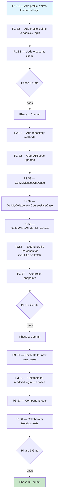

# Collaborator Isolation API — Execution Prompt

> **Workflow**: [`collaborator-isolation-api-workflow.md`](../../workflows/pending/collaborator-isolation-api-workflow.md)
> **Project**: `core-api`
> **Dependencies**: Docker (Testcontainers), MariaDB

---

## 0. Pre-Execution Checklist

- [ ] Read the linked workflow document — architecture, domain model, invariants
- [ ] Read `docs/directives/CLAUDE.md` and `docs/directives/AI-CODE-REF.md`
- [ ] Read existing files: `InternalAuthenticationUseCase.java`, `PasskeyAuthenticationUseCase.java`
- [ ] Read existing files: `UserContextHolder.java`, `UserContextLoader.java`
- [ ] Read existing files: `CollaboratorDataModel.java`, `CollaboratorRepository.java`
- [ ] Read existing files: `CourseEventDataModel.java`, `CourseEventRepository.java`
- [ ] Read existing files: `CourseDataModel.java` (availableCollaborators M:N)
- [ ] Read existing files: `MyProfileController.java`, `GetMyProfileUseCase.java`, `UpdateMyProfileUseCase.java`
- [ ] Read existing files: `MyEndpointsSecurityConfiguration.java`
- [ ] Read existing files: `JwtTokenProvider.java` (PROFILE_TYPE_CLAIM, PROFILE_ID_CLAIM constants)
- [ ] Verify Docker Desktop is running (for Testcontainers)
- [ ] Verify `mvn clean install -DskipTests` passes before starting

---

## 1. Execution Rules

### Universal Rules

1. **One step at a time** — complete each step fully before moving to the next.
2. **Verify after each step** — run the step's verification command. If it fails, fix before proceeding.
3. **Never skip steps** — the DAG (§2) defines the only valid execution order.
4. **Commit at phase boundaries** — each phase ends with a commit message. Commit only when the phase verification gate passes.
5. **Log execution** — after each step, append to the Execution Log (§6).
6. **On failure** — follow the Recovery Protocol (§5). Never brute-force past errors.

### Deterministic Constraints

- Do not introduce randomness, timestamps, or environment-dependent logic into the execution order.
- If a step's precondition is not met, STOP — do not guess or skip.
- Each step's verification must pass before its dependents run — no optimistic execution.

### Project-Specific Rules

- All REST DTOs must be OpenAPI-generated (from `my-endpoints.yaml`)
- Copyright header on every new file
- Conventional Commits — no Co-Authored-By or AI attribution
- UserContextHolder is already deployed — do NOT modify it
- UserContextLoader is already deployed — do NOT modify it
- profile_id always comes from JWT claims, NEVER from request parameters
- Only collaborators get profile claims — employees must NOT receive them
- Existing customer `/v1/my/*` endpoints must continue working unchanged

---

## 2. Execution DAG



---

## 3. Compensation Registry

| Step | Forward Action | Compensation (Undo) | Idempotent? |
|------|---------------|---------------------|:-----------:|
| P1.S1 | Modify InternalAuthenticationUseCase | Revert changes | Yes |
| P1.S2 | Modify PasskeyAuthenticationUseCase | Revert changes | Yes |
| P1.S3 | Modify MyEndpointsSecurityConfiguration | Revert changes | Yes |
| P2.S1 | Add repository methods | Remove methods | Yes |
| P2.S2 | Update my-endpoints.yaml | Revert additions | Yes |
| P2.S3-S5 | Create new use case files | Delete files | Yes |
| P2.S6 | Modify existing profile use cases | Revert changes | Yes |
| P2.S7 | Add controller endpoints | Remove endpoints | Yes |
| P3.S1-S4 | Create test files | Delete files | Yes |

---

## Phase 1 — Foundation (JWT Claims + Security Config)

### Step 1.1 — Add Profile Claims to Internal Login

| Attribute | Value |
|-----------|-------|
| **Preconditions** | Workflow read, codebase compiles |
| **Action** | Modify `InternalAuthenticationUseCase.login()` to resolve collaboratorId and add profile claims |
| **Postconditions** | Collaborator login JWTs contain `profile_type=COLLABORATOR` + `profile_id=collaboratorId` |
| **Verification** | `mvn compile -pl security` |
| **Retry Policy** | On failure: fix compilation error. Max 3 attempts. |
| **Compensation** | Revert changes |
| **Blocks** | P1.S2 |

**File**: `security/src/main/java/com/akademiaplus/internal/usecases/InternalAuthenticationUseCase.java`

Changes:
1. Add `CollaboratorRepository` as constructor dependency
2. After successful authentication, attempt to resolve collaborator:
   ```java
   collaboratorRepository.findByInternalAuthId(auth.getInternalAuthId())
       .ifPresent(collaborator -> {
           claims.put(JwtTokenProvider.PROFILE_TYPE_CLAIM, "COLLABORATOR");
           claims.put(JwtTokenProvider.PROFILE_ID_CLAIM, collaborator.getCollaboratorId());
       });
   ```
3. If no collaborator found → no profile claims added (employee behavior — unchanged)
4. The existing `user_id` claim remains — profile claims are additive

**Critical**: Do NOT add profile claims for employees. Only when `findByInternalAuthId` returns a collaborator.

---

### Step 1.2 — Add Profile Claims to Passkey Login

| Attribute | Value |
|-----------|-------|
| **Preconditions** | P1.S1 complete |
| **Action** | Modify `PasskeyAuthenticationUseCase` to add the same profile claims for collaborator passkey login |
| **Postconditions** | Passkey login JWTs also contain profile claims for collaborators |
| **Verification** | `mvn compile -pl application` |
| **Retry Policy** | On failure: fix compilation error. Max 3 attempts. |
| **Compensation** | Revert changes |
| **Blocks** | P1.S3 |

**File**: `application/src/main/java/com/akademiaplus/passkey/usecases/PasskeyAuthenticationUseCase.java`

Same pattern as P1.S1:
1. Add `CollaboratorRepository` dependency
2. After resolving `InternalAuthDataModel`, check for collaborator
3. Add profile claims if collaborator found

---

### Step 1.3 — Update Security Configuration

| Attribute | Value |
|-----------|-------|
| **Preconditions** | P1.S2 complete |
| **Action** | Update `MyEndpointsSecurityConfiguration` to allow collaborator access to /v1/my/** |
| **Postconditions** | Both CUSTOMER and internal users with COLLABORATOR profile can access /v1/my/** |
| **Verification** | `mvn compile -pl application` |
| **Retry Policy** | On failure: fix compilation error. Max 3 attempts. |
| **Compensation** | Revert changes |
| **Blocks** | Phase 1 Gate |

**File**: `application/src/main/java/com/akademiaplus/config/MyEndpointsSecurityConfiguration.java`

Read the current implementation first. The security config currently requires `hasRole("CUSTOMER")` for `/v1/my/**`. Update to `hasAnyRole("CUSTOMER", "<collaborator-role>")` or use `authenticated()` and rely on use-case-level profileType validation.

**Decision**: Read the `InternalAuthDataModel.role` field value for collaborators (check existing data or mock data to see what role string is stored). Use that role in the `hasAnyRole()` call.

---

### Phase 1 — Verification Gate

```bash
mvn compile -pl security,application
```

**Checkpoint**: Internal login and passkey login embed profile claims for collaborators. Security config allows collaborator access to /v1/my/**. Employees remain unaffected (no profile claims, no /v1/my/* access).

**Commit**: `feat(security): embed collaborator profile claims in internal login JWT`

---

## Phase 2 — Collaborator My Endpoints

### Step 2.1 — Add Repository Methods

| Attribute | Value |
|-----------|-------|
| **Preconditions** | Phase 1 complete |
| **Action** | Add `findByCollaboratorId` to CourseEventRepository. Add course query method for collaborator. |
| **Postconditions** | Repository methods compile |
| **Verification** | `mvn compile -pl course-management` |
| **Retry Policy** | On failure: fix compilation error. Max 3 attempts. |
| **Compensation** | Remove methods |
| **Blocks** | P2.S2 |

**File**: `course-management/src/main/java/com/akademiaplus/event/interfaceadapters/CourseEventRepository.java`

Add:
```java
List<CourseEventDataModel> findByCollaboratorId(Long collaboratorId);
```

For courses, a new repository method or JPQL query is needed. Check if `CourseRepository` exists in `course-management` module. The query needs to join through `course_available_collaborators`:

```java
@Query("SELECT c FROM CourseDataModel c JOIN c.availableCollaborators ac WHERE ac.collaboratorId = :collaboratorId")
List<CourseDataModel> findByAvailableCollaboratorId(@Param("collaboratorId") Long collaboratorId);
```

---

### Step 2.2 — OpenAPI Spec Updates

| Attribute | Value |
|-----------|-------|
| **Preconditions** | P2.S1 complete |
| **Action** | Add new DTO schemas to `my-endpoints.yaml` for collaborator endpoints |
| **Postconditions** | DTOs generated by openapi-generator |
| **Verification** | `mvn generate-sources -pl application` |
| **Retry Policy** | On failure: fix YAML syntax. Max 3 attempts. |
| **Compensation** | Revert additions |
| **Blocks** | P2.S3 |

**File**: `application/src/main/resources/openapi/my-endpoints.yaml`

Add schemas for:
- `MyClassDTO` — class (course event) summary: classId, eventDate, eventTitle, eventDescription, courseName, scheduleDay, startTime, endTime
- `MyClassStudentDTO` — student in a class: studentId, firstName, lastName, studentType (ADULT/MINOR)
- Update existing `MyProfileResponseDTO` to include `skills` field for collaborator profiles (or create separate fields)

Also add paths/operations for:
- `GET /v1/my/classes` → returns `List<MyClassDTO>`
- `GET /v1/my/classes/{classId}/students` → returns `List<MyClassStudentDTO>`
- The existing `GET /v1/my/courses` path may already exist (for students) — verify and either reuse or differentiate

---

### Step 2.3 — GetMyClassesUseCase

| Attribute | Value |
|-----------|-------|
| **Preconditions** | P2.S2 complete, DTOs generated |
| **Action** | Create use case for GET /v1/my/classes |
| **Postconditions** | Returns course events assigned to the authenticated collaborator |
| **Verification** | `mvn compile -pl application` |
| **Retry Policy** | On failure: fix compilation error. Max 3 attempts. |
| **Compensation** | Delete file |
| **Blocks** | P2.S4 |

**File**: `application/src/main/java/com/akademiaplus/usecases/my/GetMyClassesUseCase.java`

Implementation:
1. `profileType = userContextHolder.requireProfileType()` — assert equals `"COLLABORATOR"`
2. `profileId = userContextHolder.requireProfileId()`
3. Query `courseEventRepository.findByCollaboratorId(profileId)`
4. Map each `CourseEventDataModel` to `MyClassDTO`
5. Return list

**Constants**: Define `PROFILE_TYPE_COLLABORATOR = "COLLABORATOR"` — share with test. Consider placing in a shared constants class or in `JwtTokenProvider` alongside existing customer profile type constants.

---

### Step 2.4 — GetMyCollaboratorCoursesUseCase

| Attribute | Value |
|-----------|-------|
| **Preconditions** | P2.S3 complete |
| **Action** | Create use case for GET /v1/my/courses (collaborator variant) |
| **Postconditions** | Returns courses the collaborator is available for |
| **Verification** | `mvn compile -pl application` |
| **Retry Policy** | On failure: fix compilation error. Max 3 attempts. |
| **Compensation** | Delete file |
| **Blocks** | P2.S5 |

**File**: `application/src/main/java/com/akademiaplus/usecases/my/GetMyCollaboratorCoursesUseCase.java`

Implementation:
1. Validate `profileType == "COLLABORATOR"`
2. `profileId = userContextHolder.requireProfileId()`
3. Query courses via repository method from P2.S1
4. Map to existing `MyCourseDTO` (or appropriate DTO)
5. Return list

**Note**: The existing `GetMyCoursesUseCase` handles `ADULT_STUDENT` profile type. For the controller, either:
- Dispatch to the correct use case based on profileType in the controller
- Or have a single endpoint that delegates internally

Decision: Dispatch in controller based on profileType. The `/v1/my/courses` endpoint calls `GetMyCoursesUseCase` for students and `GetMyCollaboratorCoursesUseCase` for collaborators.

---

### Step 2.5 — GetMyClassStudentsUseCase

| Attribute | Value |
|-----------|-------|
| **Preconditions** | P2.S4 complete |
| **Action** | Create use case for GET /v1/my/classes/{classId}/students |
| **Postconditions** | Returns attendees of a class, with ownership verification |
| **Verification** | `mvn compile -pl application` |
| **Retry Policy** | On failure: fix compilation error. Max 3 attempts. |
| **Compensation** | Delete file |
| **Blocks** | P2.S6 |

**File**: `application/src/main/java/com/akademiaplus/usecases/my/GetMyClassStudentsUseCase.java`

Implementation:
1. Validate `profileType == "COLLABORATOR"`
2. `profileId = userContextHolder.requireProfileId()`
3. `tenantId = tenantContextHolder.requireTenantId()`
4. Load course event by composite key: `courseEventRepository.findById(new CourseEventCompositeId(tenantId, classId))`
5. **Ownership check**: Verify `courseEvent.getCollaboratorId().equals(profileId)` — if not, throw 404 (same pattern as `GetMyChildCoursesUseCase`)
6. Collect `courseEvent.getAdultAttendees()` + `courseEvent.getMinorAttendees()`
7. Map to `List<MyClassStudentDTO>` with student type indicator

**Critical invariant**: A collaborator MUST NOT see students from another collaborator's class. The ownership check on `collaboratorId` enforces this.

---

### Step 2.6 — Extend Profile Use Cases for COLLABORATOR

| Attribute | Value |
|-----------|-------|
| **Preconditions** | P2.S5 complete |
| **Action** | Add COLLABORATOR branch to GetMyProfileUseCase and UpdateMyProfileUseCase |
| **Postconditions** | /v1/my/profile works for collaborators |
| **Verification** | `mvn compile -pl application` |
| **Retry Policy** | On failure: fix compilation error. Max 3 attempts. |
| **Compensation** | Revert changes |
| **Blocks** | P2.S7 |

**Files**:
- `application/src/main/java/com/akademiaplus/usecases/my/GetMyProfileUseCase.java`
- `application/src/main/java/com/akademiaplus/usecases/my/UpdateMyProfileUseCase.java`

Changes:
1. Read the existing use cases first to understand the dispatch pattern
2. Add a `COLLABORATOR` case:
   - Resolve `CollaboratorDataModel` via `CollaboratorRepository` using composite key `(tenantId, profileId)`
   - Need a `findById` or use the default JPA `findById(CompositeId)` method
   - Map collaborator fields to `MyProfileResponseDTO` (include `skills` field)
3. Add `CollaboratorRepository` as a constructor dependency

**Note**: `CollaboratorRepository` is in `user-management` module. The `application` module already depends on `user-management`, so no new module dependency needed.

---

### Step 2.7 — Controller Endpoints

| Attribute | Value |
|-----------|-------|
| **Preconditions** | P2.S6 complete |
| **Action** | Add collaborator endpoints to MyProfileController |
| **Postconditions** | All 3 new endpoints wired in controller |
| **Verification** | `mvn compile -pl application` |
| **Retry Policy** | On failure: fix compilation error. Max 3 attempts. |
| **Compensation** | Remove endpoints |
| **Blocks** | Phase 2 Gate |

**File**: `application/src/main/java/com/akademiaplus/interfaceadapters/MyProfileController.java`

Add:
1. `GET /v1/my/classes` → delegates to `GetMyClassesUseCase`
2. `GET /v1/my/classes/{classId}/students` → delegates to `GetMyClassStudentsUseCase`
3. Modify existing `GET /v1/my/courses` → dispatch to collaborator or student use case based on `userContextHolder.requireProfileType()`

Inject new use cases via constructor.

---

### Phase 2 — Verification Gate

```bash
mvn clean compile -pl security,application,course-management,user-management
```

**Checkpoint**: All collaborator /v1/my/* endpoints wired. Profile use cases handle COLLABORATOR type. Security config allows collaborator access.

**Commit**: `feat(application): add collaborator self-service endpoints for classes, courses, and students`

---

## Phase 3 — Testing

### Step 3.1 — Unit Tests for New Use Cases

| Attribute | Value |
|-----------|-------|
| **Preconditions** | Phase 2 complete |
| **Action** | Unit tests for GetMyClassesUseCase, GetMyCollaboratorCoursesUseCase, GetMyClassStudentsUseCase |
| **Postconditions** | All unit tests pass |
| **Verification** | `mvn test -pl application -Dtest="GetMyClasses*,GetMyCollaboratorCourses*,GetMyClassStudents*"` |
| **Retry Policy** | On failure: fix test or code. Max 3 attempts. |
| **Compensation** | Delete test files |
| **Blocks** | P3.S2 |

Test files in `application/src/test/java/com/akademiaplus/usecases/my/`:
- `GetMyClassesUseCaseTest.java`
- `GetMyCollaboratorCoursesUseCaseTest.java`
- `GetMyClassStudentsUseCaseTest.java`

Each test class covers:
- Happy path: correct data returned for valid collaborator
- Wrong profileType: non-COLLABORATOR gets appropriate error
- Empty results: collaborator with no classes/courses/students returns empty list
- Ownership violation (GetMyClassStudentsUseCase): requesting students of another collaborator's class → 404
- Follow AI-CODE-REF.md §4.4 — Given-When-Then, @Nested, @DisplayName, zero `any()` matchers

---

### Step 3.2 — Unit Tests for Modified Login Use Cases

| Attribute | Value |
|-----------|-------|
| **Preconditions** | P3.S1 complete |
| **Action** | Update/add tests for InternalAuthenticationUseCase and PasskeyAuthenticationUseCase |
| **Postconditions** | All login unit tests pass, including new collaborator claim tests |
| **Verification** | `mvn test -pl security -Dtest="InternalAuthentication*" && mvn test -pl application -Dtest="PasskeyAuthentication*"` |
| **Retry Policy** | On failure: fix test or code. Max 3 attempts. |
| **Compensation** | Revert test changes |
| **Blocks** | P3.S3 |

Tests to add/update:
- **Collaborator login**: Given a collaborator with linked InternalAuth, when login succeeds, then JWT claims contain `profile_type=COLLABORATOR` and `profile_id=collaboratorId`
- **Employee login**: Given an employee (no collaborator record), when login succeeds, then JWT claims do NOT contain `profile_type` or `profile_id`
- **Existing tests**: Update mocked constructor args for new `CollaboratorRepository` dependency

---

### Step 3.3 — Component Tests

| Attribute | Value |
|-----------|-------|
| **Preconditions** | P3.S2 complete |
| **Action** | Component tests with Testcontainers for collaborator /v1/my/* endpoints |
| **Postconditions** | All component tests pass |
| **Verification** | `mvn test -pl application -Dtest="CollaboratorEndpointsComponentTest"` |
| **Retry Policy** | On failure: fix test or code. Max 3 attempts. |
| **Compensation** | Delete test files |
| **Blocks** | P3.S4 |

**File**: `application/src/test/java/com/akademiaplus/usecases/CollaboratorEndpointsComponentTest.java`

Test data setup:
- Create a tenant with sequences
- Create a collaborator with InternalAuth + PersonPII
- Create a course with the collaborator in `course_available_collaborators`
- Create a schedule for the course
- Create a course event assigned to the collaborator
- Create adult + minor student attendees for the event

Tests:
1. GET /v1/my/profile → 200 with collaborator profile (name, skills)
2. PUT /v1/my/profile → 200 with updated profile
3. GET /v1/my/classes → 200 with the collaborator's classes
4. GET /v1/my/courses → 200 with the collaborator's available courses
5. GET /v1/my/classes/{classId}/students → 200 with attendees

Use `SecurityMockMvcRequestPostProcessors.user()` and set UserContextHolder manually (same pattern as MyEndpointsComponentTest).

---

### Step 3.4 — Collaborator Isolation Tests

| Attribute | Value |
|-----------|-------|
| **Preconditions** | P3.S3 complete |
| **Action** | Tests verifying cross-collaborator data isolation |
| **Postconditions** | All isolation tests pass |
| **Verification** | `mvn test -pl application -Dtest="CollaboratorIsolationComponentTest"` |
| **Retry Policy** | On failure: fix isolation logic. Max 3 attempts. |
| **Compensation** | Delete test files |
| **Blocks** | Phase 3 Gate |

**File**: `application/src/test/java/com/akademiaplus/usecases/CollaboratorIsolationComponentTest.java`

Test data setup:
- Create tenant with two collaborators (A and B)
- Create two courses — course 1 available to collaborator A, course 2 available to collaborator B
- Create class (course event) 1 assigned to collaborator A with student X attending
- Create class (course event) 2 assigned to collaborator B with student Y attending

Tests:
1. Collaborator A → GET /my/classes → sees only class 1 (NOT class 2)
2. Collaborator B → GET /my/classes → sees only class 2 (NOT class 1)
3. Collaborator A → GET /my/courses → sees only course 1
4. Collaborator B → GET /my/courses → sees only course 2
5. Collaborator A → GET /my/classes/{class1Id}/students → sees student X
6. Collaborator A → GET /my/classes/{class2Id}/students → 404 (not their class)
7. Collaborator B → GET /my/classes/{class2Id}/students → sees student Y
8. Collaborator B → GET /my/classes/{class1Id}/students → 404 (not their class)

---

### Phase 3 — Verification Gate

```bash
mvn test -pl application -Dtest="GetMyClasses*,GetMyCollaboratorCourses*,GetMyClassStudents*,CollaboratorEndpointsComponentTest,CollaboratorIsolationComponentTest"
mvn test -pl security -Dtest="InternalAuthentication*"
mvn clean install -DskipTests
```

**Checkpoint**: All unit tests, component tests, and isolation tests pass. Full build green.

**Commit**: `test(application): add unit, component, and isolation tests for collaborator my/* endpoints`

---

## 5. Recovery Protocol

### Failure Categories

| Category | Symptoms | Response |
|----------|----------|----------|
| **Compilation error** | Build command fails | Fix in current step, re-verify. Do NOT proceed. |
| **Test failure** | Tests fail after change | Analyze failure, fix code or test, re-verify. |
| **Precondition not met** | Prior step output missing | Backtrack to last successful step per DAG (§2). |
| **JWT claim not propagated** | UserContextLoader reads null for collaborator | Check InternalAuthenticationUseCase — verify collaborator found and claims added. |
| **Repository method missing** | Query needed but doesn't exist | Add method to existing repository interface. |
| **Security config conflict** | 403 on collaborator endpoints | Check hasAnyRole includes collaborator's role. Verify role string matches InternalAuth.role. |
| **Circular dependency** | security module importing from user-management | Move CollaboratorRepository to a shared interface. Or use ApplicationContext to resolve at runtime. |
| **Existing customer tests break** | Customer /v1/my/* tests fail after security config change | Verify hasAnyRole includes CUSTOMER. Run existing test suite. |

### Backtracking Algorithm

1. Identify the failed step.
2. Check the Execution Log (§6) for the last successful step.
3. Is it fixable in the current step?
   - **Yes**: Fix, re-run verification, continue.
   - **No**: Backtrack to the dependency (consult DAG §2).
4. If same step fails 3 times → escalate to Saga Unwind.

### Circular Dependency Risk

The `security` module currently does NOT depend on `user-management`. Step P1.S1 adds `CollaboratorRepository` (from `user-management`) as a dependency of `InternalAuthenticationUseCase` (in `security`). This would create a circular dependency since `user-management` depends on `security`.

**Mitigation**: Do NOT import `CollaboratorRepository` directly in the `security` module. Instead:
- Option A: Move the profile claim enrichment to a post-login hook in the `application` module (which depends on both)
- Option B: Define a generic `ProfileResolver` interface in `security`, implement it in `application` or `user-management`
- Option C: Use `ApplicationContext.getBean()` to lazily resolve at runtime (breaks compile-time safety but avoids circular dep)

**Recommended**: Option A — create a `LoginProfileEnricher` in the `application` module that wraps the login call and adds profile claims. This follows the existing pattern where `application` orchestrates cross-module flows (like `OAuthAuthenticationUseCase` which also spans modules).

---

## 6. Execution Log

| Step | Status | Verification | Notes |
|------|:------:|:------------:|-------|
| P1.S1 | ⬜ | — | |
| P1.S2 | ⬜ | — | |
| P1.S3 | ⬜ | — | |
| Phase 1 Gate | ⬜ | — | |
| P2.S1 | ⬜ | — | |
| P2.S2 | ⬜ | — | |
| P2.S3 | ⬜ | — | |
| P2.S4 | ⬜ | — | |
| P2.S5 | ⬜ | — | |
| P2.S6 | ⬜ | — | |
| P2.S7 | ⬜ | — | |
| Phase 2 Gate | ⬜ | — | |
| P3.S1 | ⬜ | — | |
| P3.S2 | ⬜ | — | |
| P3.S3 | ⬜ | — | |
| P3.S4 | ⬜ | — | |
| Phase 3 Gate | ⬜ | — | |

---

## 7. Completion Checklist

| AC | Category | Description | Status | Verified By |
|----|----------|-------------|:------:|-------------|
| AC1 | Build | Full Maven reactor compiles | ⬜ | `mvn clean install -DskipTests` |
| AC2 | Core Flow | GET /v1/my/classes returns collaborator's classes | ⬜ | P3.S3 component test |
| AC3 | Core Flow | GET /v1/my/courses returns collaborator's courses | ⬜ | P3.S3 component test |
| AC4 | Core Flow | GET /v1/my/classes/{id}/students returns attendees | ⬜ | P3.S3 component test |
| AC5 | Core Flow | GET /v1/my/profile returns collaborator profile | ⬜ | P3.S3 component test |
| AC6 | Edge Case | Cross-collaborator class data not leaked | ⬜ | P3.S4 isolation test |
| AC7 | Edge Case | Collaborator cannot see students of another's class | ⬜ | P3.S4 isolation test |
| AC8 | Edge Case | Employee gets no profile claims | ⬜ | P3.S2 login unit test |
| AC9 | Security | Tampered JWT fails signature validation | ⬜ | Existing JWT validation |
| AC10 | Security | profile_id from JWT only — no override | ⬜ | By construction |
| AC11 | Build | Zero compilation errors | ⬜ | Phase gates |
| AC12 | Testing | Unit tests pass | ⬜ | P3.S1, P3.S2 |
| AC13 | Testing | Component tests pass | ⬜ | P3.S3 |
| AC14 | Testing | Isolation tests pass | ⬜ | P3.S4 |

---

## 8. Execution Report

### Step 8.1 — Generate Report

| Attribute | Value |
|-----------|-------|
| **Preconditions** | All phases complete (or abort decision made) |
| **Action** | Generate structured execution report per workflow §11 |
| **Postconditions** | Report written and returned to the user |
| **Verification** | Report contains all sections |

Generate report following the template in the workflow §11.
