# Domain Object Pattern — Execution Prompt

> **Workflow**: [`domain-object-workflow.md`](../../workflows/pending/domain-object-workflow.md)
> **Project**: `core-api`
> **Dependencies**: None — compile-only refactoring

---

## 0. Pre-Execution Checklist

- [ ] Read the linked workflow document — state machines (§4.2, §4.3), invariants (§4.4), structure (§5.3)
- [ ] Read `docs/directives/CLAUDE.md` — hard rules, architecture, test coverage
- [ ] Read `docs/directives/AI-CODE-REF.md` — coding standards, Given-When-Then, `@Nested`/`@DisplayName`
- [ ] Read `knowledge-base/patterns/backend.md` §Domain Object Pattern — conventions, return type contract, examples
- [ ] Verify `mvn clean install -DskipTests` passes
- [ ] Verify `mvn test -pl task-service` passes
- [ ] Verify `mvn test -pl course-management` passes
- [ ] Verify `mvn test -pl billing` passes

---

## 1. Execution Rules

### Universal Rules

1. **One step at a time** — complete each step fully before moving to the next.
2. **Verify after each step** — run the step's verification command. If it fails, fix before proceeding.
3. **Never skip steps** — the DAG (§2) defines the only valid execution order.
4. **Commit at phase boundaries** — each phase ends with a commit message. Commit only when the phase verification gate passes.
5. **Log execution** — after each step, append to the Execution Log (§6).
6. **On failure** — follow the Recovery Protocol (§5). Never brute-force past errors.

### Deterministic Constraints

- Do not introduce randomness, timestamps, or environment-dependent logic into the execution order.
- If a step's precondition is not met, STOP — do not guess or skip.
- If a step produces unexpected output, log it and consult §5 before continuing.
- Each step's verification must pass before its dependents run — no optimistic execution.

### Project-Specific Rules

- All string literals → `public static final` constants, shared between impl and tests
- Copyright header on ALL new files
- Javadoc on ALL public classes, methods, and constants
- Domain objects are `@Component` — injectable via constructor
- Domain objects have ZERO I/O — no repository, no HTTP, no file access
- All domain exceptions extend `RuntimeException`
- Tests use Given-When-Then, `shouldDoX_whenY()` naming, zero `any()` matchers
- Tests use `@Nested` + `@DisplayName` for grouping
- All business rule constants (error messages, transition maps) live in the domain object, not the use case
- When moving constants from use cases to domain objects, update existing use case tests to reference the new location

---

## 2. Execution DAG

```mermaid
graph TD
    P1S1["P1.S1 — DomainTask exceptions"] --> P1S2["P1.S2 — DomainTask class"]
    P1S2 --> P1S3["P1.S3 — Refactor CreateTaskUseCase"]
    P1S3 --> P1S4["P1.S4 — Refactor CompleteTaskUseCase"]
    P1S4 --> P1S5["P1.S5 — DomainTaskTest"]
    P1S5 --> P1S6["P1.S6 — Update existing use case tests"]
    P1S6 --> P1Gate{"Phase 1 Gate"}
    P1Gate -->|pass| P1Commit["feat(task): extract domain object"]

    P1Commit --> P2S1["P2.S1 — DomainCourse exceptions"]
    P2S1 --> P2S2["P2.S2 — DomainCourse class"]
    P2S2 --> P2S3["P2.S3 — Refactor CourseUpdateUseCase"]
    P2S3 --> P2S4["P2.S4 — Refactor CreateCourseUseCase"]
    P2S4 --> P2S5["P2.S5 — DomainCourseTest"]
    P2S5 --> P2S6["P2.S6 — Update existing use case tests"]
    P2S6 --> P2Gate{"Phase 2 Gate"}
    P2Gate -->|pass| P2Commit["feat(course): extract domain object"]

    P2Commit --> P3S1["P3.S1 — DomainBillingCycle exceptions"]
    P3S1 --> P3S2["P3.S2 — DomainBillingCycle class"]
    P3S2 --> P3S3["P3.S3 — DomainBillingCycleTest"]
    P3S3 --> P3Gate{"Phase 3 Gate"}
    P3Gate -->|pass| P3Commit["feat(billing): add billing cycle domain object"]

    P3Commit --> P4S1["P4.S1 — Full build verification"]

    style P1S1 fill:#e1f5fe
    style P4S1 fill:#c8e6c9
```



---

## 3. Compensation Registry

| Step | Forward Action | Compensation (Undo) | Idempotent? |
|------|---------------|---------------------|:-----------:|
| P1.S1 | Create exception classes | Delete `task/domain/exception/` | Yes |
| P1.S2 | Create DomainTask | Delete `task/domain/DomainTask.java` | Yes |
| P1.S3 | Refactor CreateTaskUseCase | `git checkout -- CreateTaskUseCase.java` | Yes |
| P1.S4 | Refactor CompleteTaskUseCase | `git checkout -- CompleteTaskUseCase.java` | Yes |
| P1.S5 | Create DomainTaskTest | Delete test file | Yes |
| P1.S6 | Update use case tests | `git checkout -- *UseCaseTest.java` | Yes |
| P2.S1 | Create exception classes | Delete `program/domain/exception/` | Yes |
| P2.S2 | Create DomainCourse | Delete `program/domain/DomainCourse.java` | Yes |
| P2.S3 | Refactor CourseUpdateUseCase | `git checkout -- CourseUpdateUseCase.java` | Yes |
| P2.S4 | Refactor CreateCourseUseCase | `git checkout -- CreateCourseUseCase.java` | Yes |
| P2.S5 | Create DomainCourseTest | Delete test file | Yes |
| P2.S6 | Update use case tests | `git checkout -- *UseCaseTest.java` | Yes |
| P3.S1 | Create exception classes | Delete `billingcycle/domain/exception/` | Yes |
| P3.S2 | Create DomainBillingCycle | Delete `billingcycle/domain/DomainBillingCycle.java` | Yes |
| P3.S3 | Create DomainBillingCycleTest | Delete test file | Yes |

---

## Phase 1 — DomainTask (task-service)

### Step 1.1 — Create Domain Exceptions

| Attribute | Value |
|-----------|-------|
| **Preconditions** | `task-service` compiles |
| **Action** | Create exception classes in `task/domain/exception/` |
| **Postconditions** | 3 exception classes exist, module compiles |
| **Verification** | `mvn compile -pl task-service -q` |
| **Retry Policy** | Fix compilation errors, re-verify |
| **Compensation** | Delete `task/domain/exception/` directory |
| **Blocks** | P1.S2 |

Create directory: `task-service/src/main/java/com/akademiaplus/task/domain/exception/`

**TaskTitleRequiredException.java**:
```java
package com.akademiaplus.task.domain.exception;

/**
 * Thrown when a task is created or updated with a blank or null title.
 */
public class TaskTitleRequiredException extends RuntimeException {

    public static final String ERROR_MESSAGE = "Task title is required";

    public TaskTitleRequiredException() {
        super(ERROR_MESSAGE);
    }
}
```

**TaskDueDateInPastException.java**:
```java
package com.akademiaplus.task.domain.exception;

import java.time.LocalDate;

/**
 * Thrown when a task due date is set to a date in the past.
 */
public class TaskDueDateInPastException extends RuntimeException {

    public static final String ERROR_MESSAGE = "Due date cannot be in the past";

    public TaskDueDateInPastException(LocalDate dueDate) {
        super(ERROR_MESSAGE + ": " + dueDate);
    }
}
```

**TaskAlreadyCompletedException.java**:
```java
package com.akademiaplus.task.domain.exception;

/**
 * Thrown when attempting to complete a task that is already in COMPLETED status.
 */
public class TaskAlreadyCompletedException extends RuntimeException {

    public static final String ERROR_MESSAGE = "Task is already completed";

    public TaskAlreadyCompletedException(Long taskId) {
        super(ERROR_MESSAGE + ": " + taskId);
    }
}
```

---

### Step 1.2 — Create DomainTask

| Attribute | Value |
|-----------|-------|
| **Preconditions** | P1.S1 done, exceptions compile |
| **Action** | Create DomainTask component bean |
| **Postconditions** | DomainTask compiles, has `.get()`, validation, and `.complete()` methods |
| **Verification** | `mvn compile -pl task-service -q` |
| **Retry Policy** | Fix compilation errors, re-verify |
| **Compensation** | Delete `DomainTask.java` |
| **Blocks** | P1.S3, P1.S4 |

Create: `task-service/src/main/java/com/akademiaplus/task/domain/DomainTask.java`

```java
package com.akademiaplus.task.domain;

import com.akademiaplus.task.TaskDataModel;
import com.akademiaplus.task.domain.exception.TaskAlreadyCompletedException;
import com.akademiaplus.task.domain.exception.TaskDueDateInPastException;
import com.akademiaplus.task.domain.exception.TaskTitleRequiredException;
import openapi.akademiaplus.domain.task.service.dto.CompleteTaskResponseDTO;
import org.springframework.stereotype.Component;

import java.time.LocalDate;
import java.time.LocalDateTime;
import java.time.ZoneOffset;

/**
 * Encapsulates business rules for the Task entity.
 *
 * <p>Validates task invariants (title, due date, state transitions) and
 * produces DTOs for state-changing operations. Has zero I/O — all data
 * is received via {@link #get(TaskDataModel)}.</p>
 *
 * @see TaskDataModel
 */
@Component
public class DomainTask {

    /** Completed status value. */
    public static final String COMPLETED_STATUS = "COMPLETED";

    private TaskDataModel dataModel;

    /**
     * Entry point — sets the data model for subsequent operations.
     *
     * @param task the task data model to operate on
     * @return this instance for fluent chaining
     */
    public DomainTask get(TaskDataModel task) {
        this.dataModel = task;
        return this;
    }

    /**
     * Validates that the task title is not null or blank.
     *
     * @return this instance for fluent chaining
     * @throws TaskTitleRequiredException if title is null or blank
     */
    public DomainTask validateTitle() {
        if (dataModel.getTitle() == null || dataModel.getTitle().isBlank()) {
            throw new TaskTitleRequiredException();
        }
        return this;
    }

    /**
     * Validates that the task due date is not in the past.
     *
     * @return this instance for fluent chaining
     * @throws TaskDueDateInPastException if due date is before today
     */
    public DomainTask validateDueDate() {
        if (dataModel.getDueDate().isBefore(LocalDate.now())) {
            throw new TaskDueDateInPastException(dataModel.getDueDate());
        }
        return this;
    }

    /**
     * Completes the task — validates it is not already completed,
     * then produces a response DTO with the completion timestamp.
     *
     * <p>Does NOT mutate the data model — the caller (use case) is responsible
     * for setting status and completedAt on the DataModel before persisting.</p>
     *
     * @return response DTO with taskId and completedAt
     * @throws TaskAlreadyCompletedException if task is already completed
     */
    public CompleteTaskResponseDTO complete() {
        if (COMPLETED_STATUS.equals(dataModel.getStatus())) {
            throw new TaskAlreadyCompletedException(dataModel.getTaskId());
        }

        LocalDateTime now = LocalDateTime.now();
        CompleteTaskResponseDTO response = new CompleteTaskResponseDTO();
        response.setTaskId(dataModel.getTaskId());
        response.setCompletedAt(now.atOffset(ZoneOffset.UTC));
        return response;
    }
}
```

---

### Step 1.3 — Refactor CreateTaskUseCase

| Attribute | Value |
|-----------|-------|
| **Preconditions** | P1.S2 done, DomainTask compiles |
| **Action** | Replace inline validation with DomainTask calls |
| **Postconditions** | CreateTaskUseCase compiles, delegates validation to DomainTask |
| **Verification** | `mvn compile -pl task-service -q` |
| **Retry Policy** | Fix compilation, re-verify |
| **Compensation** | `git checkout -- CreateTaskUseCase.java` |
| **Blocks** | P1.S5 |

Edit `CreateTaskUseCase.java`:

1. Add import for `DomainTask`
2. Add `DomainTask` constructor parameter
3. Replace the inline validation block (lines 47-52) with:

```java
@Transactional
public TaskDTO create(CreateTaskRequestDTO dto, Long createdByUserId) {
    TaskDataModel task = applicationContext.getBean(TaskDataModel.class);
    task.setTitle(dto.getTitle());
    task.setDueDate(dto.getDueDate());

    // Domain validates
    domainTask.get(task)
            .validateTitle()
            .validateDueDate();

    task.setDescription(dto.getDescription());
    task.setAssigneeId(dto.getAssigneeId());
    task.setAssigneeType(dto.getAssigneeType().getValue());
    task.setPriority(dto.getPriority().getValue());
    task.setStatus(TaskDataModel.DEFAULT_STATUS);
    task.setCreatedByUserId(createdByUserId);

    TaskDataModel saved = taskRepository.saveAndFlush(task);
    return TaskDtoMapper.toDto(saved);
}
```

4. Remove the old `ERROR_TITLE_REQUIRED` and `ERROR_DUE_DATE_IN_PAST` constants — they now live in the exception classes

**Important**: The exception types change from `IllegalArgumentException` to `TaskTitleRequiredException` / `TaskDueDateInPastException`. Check if `ControllerAdvice` handles these. If there is a catch-all `RuntimeException` handler or `IllegalArgumentException` handler that maps to 400, add explicit handlers for the new exception types that return the same HTTP status.

---

### Step 1.4 — Refactor CompleteTaskUseCase

| Attribute | Value |
|-----------|-------|
| **Preconditions** | P1.S2 done, DomainTask compiles |
| **Action** | Replace inline state check with DomainTask.complete() |
| **Postconditions** | CompleteTaskUseCase compiles, delegates to DomainTask |
| **Verification** | `mvn compile -pl task-service -q` |
| **Retry Policy** | Fix compilation, re-verify |
| **Compensation** | `git checkout -- CompleteTaskUseCase.java` |
| **Blocks** | P1.S5 |

Edit `CompleteTaskUseCase.java`:

1. Add import for `DomainTask`
2. Add `DomainTask` constructor parameter
3. Replace the status check and DTO construction (lines 52-64) with:

```java
@Transactional
public CompleteTaskResponseDTO complete(Long taskId) {
    Long tenantId = tenantContextHolder.requireTenantId();
    TaskDataModel task = taskRepository.findById(new TaskId(tenantId, taskId))
            .orElseThrow(() -> new EntityNotFoundException(
                    EntityType.TASK, String.valueOf(taskId)));

    // Domain validates + produces DTO
    CompleteTaskResponseDTO response = domainTask.get(task).complete();

    // Persist state change
    task.setStatus(DomainTask.COMPLETED_STATUS);
    task.setCompletedAt(LocalDateTime.now());
    taskRepository.saveAndFlush(task);

    return response;
}
```

4. Remove the old `COMPLETED_STATUS` and `ERROR_TASK_ALREADY_COMPLETED` constants — they now live in `DomainTask` and `TaskAlreadyCompletedException`

**Important**: The exception type changes from `IllegalStateException` to `TaskAlreadyCompletedException`. Same ControllerAdvice check as P1.S3.

---

### Step 1.5 — Create DomainTaskTest

| Attribute | Value |
|-----------|-------|
| **Preconditions** | P1.S2 done, DomainTask compiles |
| **Action** | Create unit tests for DomainTask |
| **Postconditions** | All DomainTask tests pass |
| **Verification** | `mvn test -pl task-service -Dtest=DomainTaskTest -q` |
| **Retry Policy** | Fix test failures, re-verify |
| **Compensation** | Delete test file |
| **Blocks** | P1.S6 |

Create: `task-service/src/test/java/com/akademiaplus/task/domain/DomainTaskTest.java`

Test class structure — `new DomainTask()`, no Spring context:

```java
@DisplayName("DomainTask")
class DomainTaskTest {

    private final DomainTask domainTask = new DomainTask();

    // Helper: build a valid TaskDataModel
    private TaskDataModel buildTask(String status, String title, LocalDate dueDate) { ... }

    @Nested @DisplayName("validateTitle")
    class ValidateTitle {
        @Test void shouldPass_whenTitleIsPresent() { ... }
        @Test void shouldThrowTaskTitleRequiredException_whenTitleIsNull() { ... }
        @Test void shouldThrowTaskTitleRequiredException_whenTitleIsBlank() { ... }
    }

    @Nested @DisplayName("validateDueDate")
    class ValidateDueDate {
        @Test void shouldPass_whenDueDateIsFuture() { ... }
        @Test void shouldPass_whenDueDateIsToday() { ... }
        @Test void shouldThrowTaskDueDateInPastException_whenDueDateIsPast() { ... }
    }

    @Nested @DisplayName("complete")
    class Complete {
        @Test void shouldReturnDTO_whenTaskIsPending() { ... }
        @Test void shouldReturnDTO_whenTaskIsInProgress() { ... }
        @Test void shouldThrowTaskAlreadyCompletedException_whenTaskIsCompleted() { ... }
    }

    @Nested @DisplayName("fluent chaining")
    class FluentChaining {
        @Test void shouldAllowChaining_whenAllValidationsPass() {
            // Given
            TaskDataModel task = buildTask("PENDING", "Valid Title", LocalDate.now().plusDays(1));
            // When / Then — no exception
            domainTask.get(task).validateTitle().validateDueDate();
        }
    }
}
```

Each test must:
- Use Given-When-Then comments
- Use `shouldDoX_whenY()` naming
- Assert exception type AND message constant (e.g., `hasMessageContaining(TaskTitleRequiredException.ERROR_MESSAGE)`)
- No `any()` matchers (no mocks needed — plain instantiation)

---

### Step 1.6 — Update Existing Use Case Tests

| Attribute | Value |
|-----------|-------|
| **Preconditions** | P1.S3, P1.S4 done — use cases refactored |
| **Action** | Update existing use case tests for new constructor signatures and exception types |
| **Postconditions** | All existing task-service tests pass |
| **Verification** | `mvn test -pl task-service -q` |
| **Retry Policy** | Fix test failures one at a time, re-verify |
| **Compensation** | `git checkout -- *UseCaseTest.java` |
| **Blocks** | Phase 1 Gate |

Changes needed:

**CreateTaskUseCaseTest.java**:
- Add `@Mock DomainTask domainTask` field
- Pass `domainTask` to `CreateTaskUseCase` constructor in `@BeforeEach`
- Stub `domainTask.get(...)` to return `domainTask` (mock returns self)
- Stub `domainTask.validateTitle()` and `domainTask.validateDueDate()` to return `domainTask`
- For validation error tests: stub `domainTask.get(...).validateTitle()` to throw `TaskTitleRequiredException`
- Update exception type assertions from `IllegalArgumentException` to `TaskTitleRequiredException` / `TaskDueDateInPastException`
- Update constant references from `CreateTaskUseCase.ERROR_TITLE_REQUIRED` to `TaskTitleRequiredException.ERROR_MESSAGE`

**CompleteTaskUseCaseTest.java**:
- Add `@Mock DomainTask domainTask` field
- Pass `domainTask` to `CompleteTaskUseCase` constructor in `@BeforeEach`
- For happy path: stub `domainTask.get(entity)` to return `domainTask`, stub `domainTask.complete()` to return a `CompleteTaskResponseDTO`
- For already-completed test: stub `domainTask.get(entity).complete()` to throw `TaskAlreadyCompletedException`
- Update exception type assertion from `IllegalStateException` to `TaskAlreadyCompletedException`
- Update constant reference from `CompleteTaskUseCase.COMPLETED_STATUS` to `DomainTask.COMPLETED_STATUS`

---

### Phase 1 — Verification Gate

```bash
mvn test -pl task-service -q
mvn compile -pl task-service -q
```

**Checkpoint**: `DomainTask` exists with 3 exceptions, 2 use cases refactored, all tests pass.

**Commit**: `feat(task): extract business rules into DomainTask domain object`

---

## Phase 2 — DomainCourse (course-management)

### Step 2.1 — Create Domain Exceptions

| Attribute | Value |
|-----------|-------|
| **Preconditions** | Phase 1 committed |
| **Action** | Create exception classes in `program/domain/exception/` |
| **Postconditions** | Exception classes compile |
| **Verification** | `mvn compile -pl course-management -q` |
| **Retry Policy** | Fix compilation, re-verify |
| **Compensation** | Delete `program/domain/exception/` directory |
| **Blocks** | P2.S2 |

Create directory: `course-management/src/main/java/com/akademiaplus/program/domain/exception/`

**ScheduleConflictException.java**:
```java
package com.akademiaplus.program.domain.exception;

/**
 * Thrown when a schedule is already assigned to another course.
 */
public class ScheduleConflictException extends RuntimeException {

    public static final String ERROR_MESSAGE = "Schedule(s) already assigned to another course";

    public ScheduleConflictException(String conflictingScheduleIds) {
        super(ERROR_MESSAGE + ": " + conflictingScheduleIds);
    }
}
```

> **Note**: The existing `ScheduleNotAvailableException` in `com.akademiaplus.exception` handles the _creation_ case (schedule already has a course). The new `ScheduleConflictException` handles the _update_ case (schedule assigned to a _different_ course). If after reading the code these are semantically the same, consolidate into one exception in `domain/exception/` and update all references.

---

### Step 2.2 — Create DomainCourse

| Attribute | Value |
|-----------|-------|
| **Preconditions** | P2.S1 done |
| **Action** | Create DomainCourse component bean |
| **Postconditions** | DomainCourse compiles |
| **Verification** | `mvn compile -pl course-management -q` |
| **Retry Policy** | Fix compilation, re-verify |
| **Compensation** | Delete `DomainCourse.java` |
| **Blocks** | P2.S3, P2.S4 |

Create: `course-management/src/main/java/com/akademiaplus/program/domain/DomainCourse.java`

The domain object should extract the **schedule conflict detection** logic from `CourseUpdateUseCase.reassignSchedules()` (lines 121-130). Specifically:

- **`validateScheduleConflict(List<ScheduleDataModel> foundSchedules, Long currentCourseId)`** — checks if any schedule in the list is assigned to a different course. Throws `ScheduleConflictException` if conflict found. Returns `this`.

The collaborator validation currently lives in `CourseValidator` and does I/O (repository calls). Since domain objects must have zero I/O, leave `CourseValidator.validateCollaboratorsExist()` as-is — it's a validation service, not domain logic. The domain object only handles rules that operate on already-loaded data.

```java
@Component
public class DomainCourse {

    private CourseDataModel dataModel;

    public DomainCourse get(CourseDataModel course) {
        this.dataModel = course;
        return this;
    }

    /**
     * Validates that no schedule in the list is assigned to another course.
     *
     * @param schedules   the schedules to check
     * @param courseId    the current course's ID (schedules assigned to this course are OK)
     * @return this instance for fluent chaining
     * @throws ScheduleConflictException if any schedule belongs to a different course
     */
    public DomainCourse validateScheduleConflict(List<ScheduleDataModel> schedules, Long courseId) {
        List<ScheduleDataModel> conflicting = schedules.stream()
                .filter(s -> s.getCourseId() != null && !s.getCourseId().equals(courseId))
                .toList();
        if (!conflicting.isEmpty()) {
            String conflictInfo = conflicting.stream()
                    .map(s -> String.valueOf(s.getScheduleId()))
                    .collect(Collectors.joining(", "));
            throw new ScheduleConflictException(conflictInfo);
        }
        return this;
    }
}
```

---

### Step 2.3 — Refactor CourseUpdateUseCase

| Attribute | Value |
|-----------|-------|
| **Preconditions** | P2.S2 done |
| **Action** | Extract schedule conflict logic to DomainCourse call |
| **Postconditions** | CourseUpdateUseCase compiles, uses DomainCourse |
| **Verification** | `mvn compile -pl course-management -q` |
| **Retry Policy** | Fix compilation, re-verify |
| **Compensation** | `git checkout -- CourseUpdateUseCase.java` |
| **Blocks** | P2.S5 |

Edit `CourseUpdateUseCase.java`:

1. Add `DomainCourse domainCourse` as constructor parameter (Lombok `@RequiredArgsConstructor` handles it)
2. In `reassignSchedules()`, replace the conflict detection block (lines 121-130) with:

```java
// Validate no schedule is assigned to another course
domainCourse.get(existing)
        .validateScheduleConflict(foundSchedules, courseId);
```

3. Remove the now-unused `ScheduleNotAvailableException` import if the conflict block was the only usage. Keep the import if `CourseValidator` or other code still throws it.

---

### Step 2.4 — Refactor CreateCourseUseCase

| Attribute | Value |
|-----------|-------|
| **Preconditions** | P2.S2 done |
| **Action** | Evaluate whether DomainCourse applies to creation |
| **Postconditions** | No regression |
| **Verification** | `mvn compile -pl course-management -q` |
| **Retry Policy** | N/A |
| **Compensation** | N/A |
| **Blocks** | P2.S5 |

`CreateCourseUseCase` currently delegates to `CourseValidator` for both collaborator and schedule validation. Both validators do I/O (repository lookups). Since `DomainCourse` has zero I/O, there is **no logic to extract** from this use case.

**Action**: No changes to `CreateCourseUseCase`. Mark this step as done.

---

### Step 2.5 — Create DomainCourseTest

| Attribute | Value |
|-----------|-------|
| **Preconditions** | P2.S2 done |
| **Action** | Create unit tests for DomainCourse |
| **Postconditions** | All DomainCourse tests pass |
| **Verification** | `mvn test -pl course-management -Dtest=DomainCourseTest -q` |
| **Retry Policy** | Fix test failures, re-verify |
| **Compensation** | Delete test file |
| **Blocks** | P2.S6 |

Create: `course-management/src/test/java/com/akademiaplus/program/domain/DomainCourseTest.java`

Tests:
```
@Nested validateScheduleConflict
  - shouldPass_whenNoScheduleHasCourseId()
  - shouldPass_whenSchedulesBelongToSameCourse()
  - shouldThrowScheduleConflictException_whenScheduleAssignedToDifferentCourse()
  - shouldIncludeConflictingIds_whenMultipleConflicts()
```

---

### Step 2.6 — Update Existing Use Case Tests

| Attribute | Value |
|-----------|-------|
| **Preconditions** | P2.S3 done |
| **Action** | Update CourseUpdateUseCaseTest for DomainCourse injection |
| **Postconditions** | All existing course-management tests pass |
| **Verification** | `mvn test -pl course-management -q` |
| **Retry Policy** | Fix test failures one at a time, re-verify |
| **Compensation** | `git checkout -- *UseCaseTest.java` |
| **Blocks** | Phase 2 Gate |

Changes to **CourseUpdateUseCaseTest.java**:
- Add `@Mock DomainCourse domainCourse` — pass to constructor or let Lombok inject
- Stub `domainCourse.get(...)` to return `domainCourse`
- Stub `domainCourse.validateScheduleConflict(...)` to return `domainCourse` (happy path)
- For conflict tests: stub to throw `ScheduleConflictException`
- Update exception type assertions if changed

---

### Phase 2 — Verification Gate

```bash
mvn test -pl course-management -q
mvn compile -pl course-management -q
```

**Checkpoint**: `DomainCourse` exists with schedule conflict validation, `CourseUpdateUseCase` refactored, all tests pass.

**Commit**: `feat(course): extract schedule conflict validation into DomainCourse`

---

## Phase 3 — DomainBillingCycle (billing)

### Step 3.1 — Create Domain Exceptions

| Attribute | Value |
|-----------|-------|
| **Preconditions** | Phase 2 committed |
| **Action** | Create exception classes in `billingcycle/domain/exception/` |
| **Postconditions** | Exception classes compile |
| **Verification** | `mvn compile -pl billing -q` |
| **Retry Policy** | Fix compilation, re-verify |
| **Compensation** | Delete `billingcycle/domain/exception/` directory |
| **Blocks** | P3.S2 |

Create directory: `billing/src/main/java/com/akademiaplus/billingcycle/domain/exception/`

> **Note**: Inspect the billing module's package structure first. The aggregate root package may be `billing/` not `billingcycle/`. Read the existing source tree under `billing/src/main/java/com/akademiaplus/` and place the domain package at the same level as `usecases/` for the billing cycle aggregate.

**InvalidBillingTransitionException.java**:
```java
package com.akademiaplus.billingcycle.domain.exception;

import com.akademiaplus.tenancy.BillingStatus;

/**
 * Thrown when a billing cycle transition violates the state machine.
 */
public class InvalidBillingTransitionException extends RuntimeException {

    public static final String ERROR_MESSAGE = "Invalid billing status transition";

    public InvalidBillingTransitionException(BillingStatus from, BillingStatus to) {
        super(ERROR_MESSAGE + ": " + from + " → " + to);
    }
}
```

---

### Step 3.2 — Create DomainBillingCycle

| Attribute | Value |
|-----------|-------|
| **Preconditions** | P3.S1 done |
| **Action** | Create DomainBillingCycle with state machine transitions |
| **Postconditions** | DomainBillingCycle compiles |
| **Verification** | `mvn compile -pl billing -q` |
| **Retry Policy** | Fix compilation, re-verify |
| **Compensation** | Delete `DomainBillingCycle.java` |
| **Blocks** | P3.S3 |

State machine from workflow §4.3 and `BillingStatus` enum:

```java
@Component
public class DomainBillingCycle {

    /** Valid transitions: from → allowed targets. */
    public static final Map<BillingStatus, Set<BillingStatus>> TRANSITIONS = Map.of(
            BillingStatus.PENDING,   Set.of(BillingStatus.BILLED, BillingStatus.CANCELLED),
            BillingStatus.BILLED,    Set.of(BillingStatus.PAID, BillingStatus.FAILED),
            BillingStatus.FAILED,    Set.of(BillingStatus.BILLED, BillingStatus.CANCELLED)
    );

    /** Terminal states — no further transitions allowed. */
    public static final Set<BillingStatus> TERMINAL_STATES = Set.of(
            BillingStatus.PAID, BillingStatus.CANCELLED
    );

    private TenantBillingCycleDataModel dataModel;

    public DomainBillingCycle get(TenantBillingCycleDataModel cycle) {
        this.dataModel = cycle;
        return this;
    }

    /**
     * Validates that the given transition is legal per the state machine.
     *
     * @param target the desired next status
     * @return this instance for fluent chaining
     * @throws InvalidBillingTransitionException if transition is not allowed
     */
    public DomainBillingCycle validateTransition(BillingStatus target) {
        BillingStatus current = dataModel.getBillingStatus();
        Set<BillingStatus> allowed = TRANSITIONS.getOrDefault(current, Set.of());
        if (!allowed.contains(target)) {
            throw new InvalidBillingTransitionException(current, target);
        }
        return this;
    }
}
```

---

### Step 3.3 — Create DomainBillingCycleTest

| Attribute | Value |
|-----------|-------|
| **Preconditions** | P3.S2 done |
| **Action** | Create unit tests for DomainBillingCycle |
| **Postconditions** | All DomainBillingCycle tests pass |
| **Verification** | `mvn test -pl billing -Dtest=DomainBillingCycleTest -q` |
| **Retry Policy** | Fix test failures, re-verify |
| **Compensation** | Delete test file |
| **Blocks** | Phase 3 Gate |

Tests:
```
@Nested validateTransition
  // Valid transitions
  - shouldAllowTransition_whenPendingToBilled()
  - shouldAllowTransition_whenPendingToCancelled()
  - shouldAllowTransition_whenBilledToPaid()
  - shouldAllowTransition_whenBilledToFailed()
  - shouldAllowTransition_whenFailedToBilled()
  - shouldAllowTransition_whenFailedToCancelled()

  // Invalid transitions
  - shouldThrowInvalidBillingTransitionException_whenPendingToPaid()
  - shouldThrowInvalidBillingTransitionException_whenPendingToFailed()
  - shouldThrowInvalidBillingTransitionException_whenBilledToCancelled() — not in allowed set
  - shouldThrowInvalidBillingTransitionException_whenBilledToPending()

  // Terminal states
  - shouldThrowInvalidBillingTransitionException_whenPaidToAnyState()
  - shouldThrowInvalidBillingTransitionException_whenCancelledToAnyState()
```

---

### Phase 3 — Verification Gate

```bash
mvn test -pl billing -q
mvn compile -pl billing -q
```

**Checkpoint**: `DomainBillingCycle` exists with state machine validation, all tests pass. No use cases refactored (billing cycle use cases not yet built).

**Commit**: `feat(billing): add DomainBillingCycle state machine validation`

---

## Phase 4 — Full Build Verification

### Step 4.1 — Full Build

| Attribute | Value |
|-----------|-------|
| **Preconditions** | All phases committed |
| **Action** | Full project build and test |
| **Postconditions** | All modules compile, all tests pass |
| **Verification** | See below |
| **Retry Policy** | Fix any failure, identify which module, re-verify |
| **Blocks** | Execution Report |

```bash
mvn clean install -DskipTests -q
mvn test -q
```

---

## 5. Recovery Protocol

### Failure Categories

| Category | Symptoms | Response |
|----------|----------|----------|
| **Compilation error** | `mvn compile` fails | Fix in current step, re-verify. Do NOT proceed. |
| **Test failure** | `mvn test` fails after refactoring | Analyze: is the test asserting old exception type? Fix test, not domain object. |
| **Precondition not met** | Prior step output missing | Backtrack to last successful step per DAG (§2). |
| **ControllerAdvice gap** | New exception type returns 500 instead of 400 | Add `@ExceptionHandler` for the new type in the module's ControllerAdvice. Map to same HTTP status as the old exception. |
| **Singleton state leak** | DomainObject retains state from prior call | Add test: sequential `.get()` calls with different data. Fix by ensuring `.get()` always reassigns `dataModel`. |
| **Unrecoverable** | Fundamental design flaw discovered | STOP, report finding, propose alternative. |

### Backtracking Algorithm

1. Identify the failed step (e.g., P1.S5).
2. Check the Execution Log (§6) for the last successful step.
3. Fix in current step if possible. If not, backtrack to dependency.
4. If backtracking crosses a phase boundary, re-verify prior phase gate.
5. If the same step fails 3 times → Saga Unwind.

### Saga Unwind

1. Read Compensation Registry (§3).
2. Execute compensations in reverse order within the current phase.
3. Re-verify previous phase gate.
4. Analyze root cause before re-attempting.

---

## 6. Execution Log

| Step | Status | Verification | Notes |
|------|:------:|:------------:|-------|
| P1.S1 | ⬜ | — | |
| P1.S2 | ⬜ | — | |
| P1.S3 | ⬜ | — | |
| P1.S4 | ⬜ | — | |
| P1.S5 | ⬜ | — | |
| P1.S6 | ⬜ | — | |
| Phase 1 Gate | ⬜ | — | |
| P2.S1 | ⬜ | — | |
| P2.S2 | ⬜ | — | |
| P2.S3 | ⬜ | — | |
| P2.S4 | ⬜ | — | |
| P2.S5 | ⬜ | — | |
| P2.S6 | ⬜ | — | |
| Phase 2 Gate | ⬜ | — | |
| P3.S1 | ⬜ | — | |
| P3.S2 | ⬜ | — | |
| P3.S3 | ⬜ | — | |
| Phase 3 Gate | ⬜ | — | |
| P4.S1 | ⬜ | — | |

---

## 7. Completion Checklist

| AC | Category | Description | Status | Verified By |
|----|----------|-------------|:------:|-------------|
| AC1 | Build | All modules compile | ⬜ | P4.S1 |
| AC2 | Core Flow | DomainTask.complete() returns DTO | ⬜ | P1.S5 |
| AC3 | Core Flow | DomainCourse detects schedule conflict | ⬜ | P2.S5 |
| AC4 | Core Flow | DomainBillingCycle rejects invalid transition | ⬜ | P3.S3 |
| AC5 | Edge Case | Completed task cannot be completed again | ⬜ | P1.S5 |
| AC6 | Edge Case | PAID billing cycle rejects transitions | ⬜ | P3.S3 |
| AC7 | Security | HTTP responses unchanged | ⬜ | P1.S6, P2.S6 |
| AC8 | Quality | Zero new compiler warnings | ⬜ | P4.S1 |
| AC9 | Quality | ArchUnit passes (if applicable) | ⬜ | P4.S1 |
| AC10 | Testing | Domain object tests pass, >=80% coverage | ⬜ | P1.S5, P2.S5, P3.S3 |
| AC11 | Testing | Zero regressions in existing tests | ⬜ | P4.S1 |

---

## 8. Execution Report

See workflow §11 for the full report specification. Generate the report as the final action after Phase 4 completes (or on abort).
