# ETL Service Module — Execution Prompt

> **Workflow**: [`etl-service-workflow.md`](../../workflows/pending/etl-service-workflow.md)
> **Project**: `core-api`
> **Dependencies**: MongoDB 8.0 (Docker), MariaDB (Docker), Anthropic API (claude-haiku-4-5)

---

## 0. Pre-Execution Checklist

> **Temporal parallel**: Worker startup validation — the executor MUST complete
> these checks before running any step. If any check fails, STOP and resolve.

- [ ] Read the linked workflow document — architecture, domain model, state machines, invariants
- [ ] Read `docs/directives/CLAUDE.md` and `docs/directives/AI-CODE-REF.md`
- [ ] Read `mock-data-service/pom.xml` for standalone module patterns (entry point, Spring Boot app class, Maven profile)
- [ ] Read reference files listed in Phase 1 Step 1
- [ ] Verify MongoDB is running (`docker compose up mongodb` or `mongosh --eval "db.runCommand({ping:1})"`)
- [ ] Verify Anthropic API key is set (`echo $ANTHROPIC_API_KEY` returns non-empty)
- [ ] Verify all referenced modules compile: `mvn compile -pl user-management,course-management,billing,pos-system,tenant-management -am`

---

## 1. Execution Rules

### Universal Rules

1. **One step at a time** — complete each step fully before moving to the next.
2. **Verify after each step** — run the step's verification command. If it fails, fix before proceeding.
3. **Never skip steps** — the DAG (S2) defines the only valid execution order.
4. **Commit at phase boundaries** — each phase ends with a commit message. Commit only when the phase verification gate passes.
5. **Log execution** — after each step, append to the Execution Log (S6).
6. **On failure** — follow the Recovery Protocol (S5). Never brute-force past errors.

### Deterministic Constraints

> **Temporal parallel**: Workflow code must be deterministic — same input
> produces same output. No side-channel reasoning.

- Do not introduce randomness, timestamps, or environment-dependent logic into the execution order.
- If a step's precondition is not met, STOP — do not guess or skip.
- If a step produces unexpected output, log it and consult S5 before continuing.
- Each step's verification must pass before its dependents run — no optimistic execution.

### Project-Specific Rules

- All REST DTOs must be OpenAPI-generated — define the OpenAPI spec first, then implement controllers against generated types.
- Follow existing module conventions — look at `mock-data-service` for standalone module patterns (entry point, Spring Boot app class, Maven profile).
- Follow existing coding standards — read `docs/directives/AI-CODE-REF.md` before writing any code.
- After each phase: `mvn compile -pl etl-service`.
- All PII fields MUST go through existing JPA `@Convert` converters — never plaintext in MariaDB.
- Tenant isolation mandatory — every MongoDB document includes `tenantId`, every MariaDB operation sets `TenantContextHolder`.
- Use existing entity infrastructure — JPA data models, repositories, `StringEncryptor`, composite keys — for the final MariaDB load step. Do NOT duplicate entity definitions.
- Anthropic API key MUST come from environment variable / Secrets Manager — never hardcode.

---

## 2. Execution DAG

> **Temporal parallel**: Workflow definition graph — all steps, dependencies,
> and valid execution paths. The executor follows this graph top-to-bottom.
> Nodes at the same level with no dependency edge can be executed in any order.

```mermaid
graph TD
    P1S1["P1.S1 — Module skeleton (pom.xml + parent)"]
    P1S2["P1.S2 — Application entry point"]
    P1S3["P1.S3 — MongoDB domain classes"]
    P1S4["P1.S4 — MongoDB repositories"]
    P1S5["P1.S5 — MongoDB configuration"]
    P1S6["P1.S6 — Document parsers"]
    P1S7["P1.S7 — Upload use case"]
    P1S8["P1.S8 — Controller (upload)"]
    P1S9["P1.S9 — Docker Compose"]
    P1S10["P1.S10 — Verify Phase 1"]
    P1Gate{"Phase 1 Gate"}
    P1Commit["Commit: feat(etl): add etl-service module"]

    P2S1["P2.S1 — Anthropic SDK dependency"]
    P2S2["P2.S2 — Entity field registry"]
    P2S3["P2.S3 — Schema context builder"]
    P2S4["P2.S4 — Document analysis client"]
    P2S5["P2.S5 — Analyze use case"]
    P2S6["P2.S6 — Controller (analyze)"]
    P2S7["P2.S7 — Verify Phase 2"]
    P2Gate{"Phase 2 Gate"}
    P2Commit["Commit: feat(etl): add Claude analysis"]

    P3S1["P3.S1 — Transform executor"]
    P3S2["P3.S2 — Confirm mappings use case"]
    P3S3["P3.S3 — Apply mapping use case"]
    P3S4["P3.S4 — Validate job use case"]
    P3S5["P3.S5 — Controller (mapping + validation)"]
    P3S6["P3.S6 — Verify Phase 3"]
    P3Gate{"Phase 3 Gate"}
    P3Commit["Commit: feat(etl): add mapping + validation"]

    P4S1["P4.S1 — Load into MariaDB use case"]
    P4S2["P4.S2 — Rollback use case"]
    P4S3["P4.S3 — Controller (load + rollback)"]
    P4S4["P4.S4 — Verify Phase 4"]
    P4Gate{"Phase 4 Gate"}
    P4Commit["Commit: feat(etl): add load + rollback"]

    P5S1["P5.S1 — Security configuration"]
    P5S2["P5.S2 — Controller advice"]
    P5S3["P5.S3 — OpenAPI spec"]
    P5S4["P5.S4 — Integration tests"]
    P5S5["P5.S5 — Final verification"]
    P5Gate{"Phase 5 Gate"}
    P5Commit["Commit: feat(etl): add security, OpenAPI, tests"]

    %% Phase 1 dependencies
    P1S1 --> P1S2
    P1S1 --> P1S3
    P1S1 --> P1S6
    P1S1 --> P1S9
    P1S2 --> P1S5
    P1S3 --> P1S4
    P1S5 --> P1S4
    P1S3 --> P1S7
    P1S4 --> P1S7
    P1S6 --> P1S7
    P1S7 --> P1S8
    P1S8 --> P1S10
    P1S9 --> P1S10
    P1S10 --> P1Gate
    P1Gate -->|pass| P1Commit

    %% Phase 2 dependencies
    P1Commit --> P2S1
    P1Commit --> P2S2
    P2S1 --> P2S4
    P2S2 --> P2S3
    P2S3 --> P2S4
    P2S4 --> P2S5
    P2S5 --> P2S6
    P2S6 --> P2S7
    P2S7 --> P2Gate
    P2Gate -->|pass| P2Commit

    %% Phase 3 dependencies
    P2Commit --> P3S1
    P3S1 --> P3S3
    P3S3 --> P3S2
    P3S3 --> P3S4
    P3S2 --> P3S5
    P3S4 --> P3S5
    P3S5 --> P3S6
    P3S6 --> P3Gate
    P3Gate -->|pass| P3Commit

    %% Phase 4 dependencies
    P3Commit --> P4S1
    P4S1 --> P4S2
    P4S1 --> P4S3
    P4S2 --> P4S3
    P4S3 --> P4S4
    P4S4 --> P4Gate
    P4Gate -->|pass| P4Commit

    %% Phase 5 dependencies
    P4Commit --> P5S1
    P4Commit --> P5S2
    P5S1 --> P5S3
    P5S2 --> P5S3
    P5S3 --> P5S4
    P5S4 --> P5S5
    P5S5 --> P5Gate
    P5Gate -->|pass| P5Commit

    %% Styling
    style P1S1 fill:#e1f5fe
    style P1Commit fill:#c8e6c9
    style P2Commit fill:#c8e6c9
    style P3Commit fill:#c8e6c9
    style P4Commit fill:#c8e6c9
    style P5Commit fill:#c8e6c9
    style P1Gate fill:#fff9c4
    style P2Gate fill:#fff9c4
    style P3Gate fill:#fff9c4
    style P4Gate fill:#fff9c4
    style P5Gate fill:#fff9c4
```



> **Edge types**:
> - `-->` dependency (must complete before)
> - `-.->` compensation (undo edge — used during rollback)
> - `==>` signal point (may require user input or external action)

**Key parallel opportunities within phases**:

- **Phase 1**: P1.S3 (domain classes) and P1.S6 (parsers) have no dependency on each other but both need P1.S1 (pom.xml). P1.S9 (docker-compose) only needs P1.S1 and can run in parallel with P1.S2-P1.S8.
- **Phase 2**: P2.S2 (registry) can start in parallel with P2.S1 (SDK dep) since P2.S2 has no SDK dependency. P2.S3 and P2.S4 are sequential (builder needs registry, client needs builder + SDK).
- **Phase 5**: P5.S1 (security) and P5.S2 (controller advice) can run in parallel since they are independent configurations.

---

## 3. Compensation Registry

> **Temporal parallel**: Saga pattern — each step that creates or modifies state
> registers its undo action. On failure, the executor unwinds the compensation
> stack in reverse order (last registered -> first registered).

| Step | Forward Action | Compensation (Undo) | Idempotent? |
|------|---------------|---------------------|:-----------:|
| P1.S1 | Create `etl-service/pom.xml`, add module to parent pom, create Maven profile | Delete `etl-service/` directory, revert parent `pom.xml` (remove module + profile) | Yes |
| P1.S2 | Create `EtlApp.java` + `application.properties` | Delete `EtlApp.java` + `application.properties` | Yes |
| P1.S3 | Create domain classes in `domain/` | Delete all files in `etl-service/.../domain/` | Yes |
| P1.S4 | Create repository interfaces in `interfaceadapters/` | Delete repository files | Yes |
| P1.S5 | Create `MongoConfiguration.java` | Delete `MongoConfiguration.java` | Yes |
| P1.S6 | Create `ExcelParser.java` + `WordParser.java` | Delete parser files | Yes |
| P1.S7 | Create `UploadDocumentUseCase.java` | Delete `UploadDocumentUseCase.java` | Yes |
| P1.S8 | Create `MigrationController.java` | Delete `MigrationController.java` | Yes |
| P1.S9 | Add MongoDB + etl-service services to `docker-compose.dev.yml` | Revert `docker-compose.dev.yml` changes (remove MongoDB + etl-service services) | Yes |
| P2.S1 | Add Anthropic SDK dependency to `etl-service/pom.xml` + parent `dependencyManagement` | Revert `pom.xml` dependency addition, revert parent `dependencyManagement` | Yes |
| P2.S2 | Create `EntityFieldRegistry.java` | Delete `EntityFieldRegistry.java` | Yes |
| P2.S3 | Create `SchemaContextBuilder.java` | Delete `SchemaContextBuilder.java` | Yes |
| P2.S4 | Create `DocumentAnalysisClient.java` | Delete `DocumentAnalysisClient.java` | Yes |
| P2.S5 | Create `AnalyzeStructureUseCase.java` | Delete `AnalyzeStructureUseCase.java` | Yes |
| P2.S6 | Add analyze + entity-types endpoints to controller | Revert controller to Phase 1 state | No |
| P3.S1 | Create `TransformExecutor.java` | Delete `TransformExecutor.java` | Yes |
| P3.S2 | Create `ConfirmMappingsUseCase.java` | Delete `ConfirmMappingsUseCase.java` | Yes |
| P3.S3 | Create `ApplyMappingUseCase.java` | Delete `ApplyMappingUseCase.java` | Yes |
| P3.S4 | Create `ValidateJobUseCase.java` | Delete `ValidateJobUseCase.java` | Yes |
| P3.S5 | Add mappings + validate + rows endpoints to controller | Revert controller to Phase 2 state | No |
| P4.S1 | Create `LoadIntoMariaDbUseCase.java` | Delete `LoadIntoMariaDbUseCase.java` | Yes |
| P4.S2 | Create `RollbackJobUseCase.java` | Delete `RollbackJobUseCase.java` | Yes |
| P4.S3 | Add load + rollback endpoints to controller | Revert controller to Phase 3 state | No |
| P5.S1 | Create `EtlSecurityConfiguration.java` | Delete `EtlSecurityConfiguration.java` | Yes |
| P5.S2 | Create `EtlControllerAdvice.java` | Delete `EtlControllerAdvice.java` | Yes |
| P5.S3 | Create `etl-service-module.yaml` OpenAPI spec + generator plugin in pom | Delete OpenAPI spec file, revert pom.xml generator plugin | Yes |
| P5.S4 | Create integration test classes | Delete test files | Yes |

> **Usage**: When S5 Recovery Protocol triggers a phase rollback, execute
> compensations in reverse order for all completed steps in that phase.

---

## Phase 1 — Foundation (Module + MongoDB + Upload)

### Step 1.1 — Create module skeleton

| Attribute | Value |
|-----------|-------|
| **Preconditions** | Parent `pom.xml` exists and compiles. `mock-data-service/pom.xml` exists for reference. |
| **Action** | Create `etl-service/pom.xml`, add module to parent pom, create `etl-service` Maven profile. |
| **Postconditions** | `etl-service/pom.xml` exists with all dependencies. Parent pom lists `etl-service` in `<modules>`. Profile `etl-service` exists. `mvn validate -pl etl-service` passes. |
| **Verification** | `mvn validate -pl etl-service` |
| **Retry Policy** | On failure: max 3 attempts. Check dependency coordinates, parent pom syntax, profile structure. |
| **Heartbeat** | N/A — single pom file + parent edit. |
| **Compensation** | Delete `etl-service/` directory, revert parent `pom.xml` (remove `<module>etl-service</module>` + `etl-service` profile). |
| **Blocks** | P1.S2, P1.S3, P1.S6, P1.S9 |

1. Read `mock-data-service/pom.xml` for reference module structure.
2. Create `etl-service/pom.xml` with these dependencies:
   - `spring-boot-starter-data-mongodb`
   - `spring-boot-starter-web`
   - `spring-boot-starter-security`
   - `spring-boot-starter-actuator`
   - `org.apache.poi:poi-ooxml`
   - Internal modules: `security`, `utilities`, `infra-common`, `multi-tenant-data`, `user-management`, `course-management`, `billing`, `pos-system`, `tenant-management`
   - Test: `spring-boot-starter-test`, `testcontainers` (mongodb + mariadb)
   - `org.projectlombok:lombok` (compile scope)
3. Add `etl-service` to parent `pom.xml` modules list (NOT inside any profile initially — add to default `<modules>`).
4. Create new Maven profile `etl-service` in parent pom.xml (see workflow S8):

```xml
<profile>
    <id>etl-service</id>
    <modules>
        <module>etl-service</module>
        <module>multi-tenant-data</module>
        <module>utilities</module>
        <module>security</module>
        <module>infra-common</module>
        <module>user-management</module>
        <module>course-management</module>
        <module>billing</module>
        <module>pos-system</module>
        <module>tenant-management</module>
    </modules>
</profile>
```

---

### Step 1.2 — Application entry point

| Attribute | Value |
|-----------|-------|
| **Preconditions** | P1.S1 complete — `etl-service/pom.xml` exists and `mvn validate -pl etl-service` passes. |
| **Action** | Create `EtlApp.java` Spring Boot entry point and `application.properties`. |
| **Postconditions** | `EtlApp.java` and `application.properties` exist. Package structure `com.akademiaplus` is correct. |
| **Verification** | `mvn compile -pl etl-service` (may have compile errors from missing classes — that is expected; verify no syntax errors in these two files) |
| **Retry Policy** | On failure: max 2 attempts. Check package name, annotations, properties syntax. |
| **Heartbeat** | N/A — two files. |
| **Compensation** | Delete `EtlApp.java` + `application.properties`. |
| **Blocks** | P1.S5 |

Create `etl-service/src/main/java/com/akademiaplus/EtlApp.java`:

```java
@SpringBootApplication(scanBasePackages = "com.akademiaplus")
public class EtlApp {
    public static void main(String[] args) {
        SpringApplication.run(EtlApp.class, args);
    }
}
```

Create `etl-service/src/main/resources/application.properties`:

```properties
server.port=8280
spring.application.name=etl-service
spring.data.mongodb.uri=${MONGODB_URI:mongodb://localhost:27017/etl_staging}
spring.data.mongodb.database=etl_staging
anthropic.api-key=${ANTHROPIC_API_KEY:}
anthropic.model=${ANTHROPIC_MODEL:claude-haiku-4-5}
etl.upload.max-file-size=10MB
spring.servlet.multipart.max-file-size=10MB
spring.servlet.multipart.max-request-size=10MB
```

---

### Step 1.3 — MongoDB domain classes

| Attribute | Value |
|-----------|-------|
| **Preconditions** | P1.S1 complete — `etl-service/pom.xml` exists with `spring-boot-starter-data-mongodb` dependency. |
| **Action** | Create all MongoDB domain classes: documents, enums, value objects. |
| **Postconditions** | All 8 domain files exist in `domain/` package. All enums and document classes compile. |
| **Verification** | `mvn compile -pl etl-service` (domain classes only — expect errors from missing repos/config) |
| **Retry Policy** | On failure: max 2 attempts. Check MongoDB annotations, field types, enum values. |
| **Heartbeat** | After creating 4 files, verify they have no syntax errors before continuing with the remaining 4. |
| **Compensation** | Delete all files in `etl-service/src/main/java/com/akademiaplus/domain/`. |
| **Blocks** | P1.S4, P1.S7 |

Create in `etl-service/src/main/java/com/akademiaplus/domain/`:

- **`MigrationJob.java`** — `@Document("migration_jobs")`, fields per workflow S4:
  - `id` (String), `tenantId` (Long), `entityType` (MigrationEntityType), `sourceFileName` (String), `sourceFileSize` (Long)
  - `status` (MigrationStatus), `totalRows` (int), `validRows` (int), `errorRows` (int), `loadedRows` (int)
  - `documentAnalysis` (embedded), `confirmedMappings` (List<ColumnMapping>)
  - `createdBy` (String), `createdAt` (Instant), `updatedAt` (Instant)

- **`MigrationRow.java`** — `@Document("migration_rows")`, fields per workflow S4:
  - `id` (String), `jobId` (String), `sheetName` (String), `rowNumber` (int)
  - `status` (RowStatus), `rawData` (Map<String, String>), `mappedData` (Map<String, String>)
  - `validationErrors` (List<ValidationError>), `targetEntityId` (Long), `loadedAt` (Instant)

- **`MigrationStatus.java`** — enum: `UPLOADED, PARSED, ANALYZING, ANALYZED, MAPPING, VALIDATED, LOADING, COMPLETED, FAILED`

- **`RowStatus.java`** — enum: `RAW, MAPPED, VALID, INVALID, LOADED, LOAD_FAILED`

- **`MigrationEntityType.java`** — enum: `EMPLOYEE, COLLABORATOR, ADULT_STUDENT, TUTOR, MINOR_STUDENT, COURSE, SCHEDULE, MEMBERSHIP, ENROLLMENT, STORE_PRODUCT`

- **`ColumnMapping.java`** — record or class: `source` (String), `target` (String), `transform` (TransformType)

- **`SheetAnalysis.java`** — Claude analysis result per sheet:
  - `sheetName`, `detectedEntityType`, `confidence`, `columnMappings` (List<ColumnMapping>), `warnings` (List<String>), `unmappedSourceColumns` (List<String>), `missingRequiredFields` (List<String>)

- **`TransformType.java`** — enum: `NONE, SPLIT_NAME, NORMALIZE_PHONE, DATE_FROM_AGE, UPPERCASE, LOWERCASE, TRIM`

- **`ValidationError.java`** — value object: `field` (String), `message` (String), `severity` (String)

---

### Step 1.4 — MongoDB repositories

| Attribute | Value |
|-----------|-------|
| **Preconditions** | P1.S3 complete (domain classes exist). P1.S5 complete (MongoConfiguration exists). |
| **Action** | Create Spring Data MongoDB repository interfaces. |
| **Postconditions** | Both repository interfaces exist and compile. Custom query method signatures are valid. |
| **Verification** | `mvn compile -pl etl-service` |
| **Retry Policy** | On failure: max 2 attempts. Check query method naming conventions, return types. |
| **Heartbeat** | N/A — two files. |
| **Compensation** | Delete repository files. |
| **Blocks** | P1.S7 |

Create in `etl-service/src/main/java/com/akademiaplus/interfaceadapters/`:

- **`MigrationJobRepository.java`** — extends `MongoRepository<MigrationJob, String>`
  - Custom queries: `findByTenantIdAndStatus(Long tenantId, MigrationStatus status)`, `findByTenantId(Long tenantId, Pageable pageable)` returning `Page<MigrationJob>`

- **`MigrationRowRepository.java`** — extends `MongoRepository<MigrationRow, String>`
  - Custom queries: `findByJobId(String jobId, Pageable pageable)` returning `Page<MigrationRow>`, `findByJobIdAndStatus(String jobId, RowStatus status)`, `countByJobIdAndStatus(String jobId, RowStatus status)`

---

### Step 1.5 — MongoDB configuration

| Attribute | Value |
|-----------|-------|
| **Preconditions** | P1.S2 complete (application.properties with MongoDB URI exists). |
| **Action** | Create MongoConfiguration with index definitions. |
| **Postconditions** | `MongoConfiguration.java` exists. `@EnableMongoRepositories` is configured. Index creation logic compiles. |
| **Verification** | `mvn compile -pl etl-service` |
| **Retry Policy** | On failure: max 2 attempts. Check `@EnableMongoRepositories` base packages, index API usage. |
| **Heartbeat** | N/A — single file. |
| **Compensation** | Delete `MongoConfiguration.java`. |
| **Blocks** | P1.S4 |

Create `etl-service/src/main/java/com/akademiaplus/config/MongoConfiguration.java`:

- `@Configuration` with `@EnableMongoRepositories(basePackages = "com.akademiaplus.interfaceadapters")`
- Create indexes on startup via `MongoTemplate`:
  - `migration_jobs.tenantId` (ascending)
  - `migration_rows.jobId` (ascending)
  - `migration_rows.jobId+status` (compound index)

---

### Step 1.6 — Document parsers

| Attribute | Value |
|-----------|-------|
| **Preconditions** | P1.S1 complete — `poi-ooxml` dependency available in pom.xml. |
| **Action** | Create ExcelParser and WordParser utility classes. |
| **Postconditions** | Both parser files exist and compile. Apache POI imports resolve correctly. |
| **Verification** | `mvn compile -pl etl-service` |
| **Retry Policy** | On failure: max 2 attempts. Check POI import paths, method signatures. |
| **Heartbeat** | After creating ExcelParser, verify it compiles before starting WordParser. |
| **Compensation** | Delete parser files in `util/`. |
| **Blocks** | P1.S7 |

Create in `etl-service/src/main/java/com/akademiaplus/util/`:

**`ExcelParser.java`**:
- Input: `InputStream` + file name
- Output: `List<ParsedSheet>` where each sheet has: name, headers (`List<String>`), rows (`List<Map<String, String>>`)
- Use Apache POI `XSSFWorkbook` for .xlsx
- Handle: merged cells, empty rows, numeric/date cell types
- Limit: read all rows (validation happens later)

**`WordParser.java`**:
- Input: `InputStream` + file name
- Output: `List<ParsedSheet>` (one per table found in .docx)
- Use Apache POI `XWPFDocument` + `XWPFTable`
- First row of each table treated as headers

Create a `ParsedSheet` record/class in the same package with fields: `name` (String), `headers` (List<String>), `rows` (List<Map<String, String>>).

---

### Step 1.7 — Upload use case

| Attribute | Value |
|-----------|-------|
| **Preconditions** | P1.S3 (domain), P1.S4 (repositories), P1.S6 (parsers) all complete. |
| **Action** | Create UploadDocumentUseCase — accepts file, parses, stores job + rows in MongoDB. |
| **Postconditions** | `UploadDocumentUseCase.java` exists. Depends on repositories and parsers. Compiles successfully. |
| **Verification** | `mvn compile -pl etl-service` |
| **Retry Policy** | On failure: max 2 attempts. Check dependency injection, method signatures, status transitions. |
| **Heartbeat** | N/A — single file. |
| **Compensation** | Delete `UploadDocumentUseCase.java`. |
| **Blocks** | P1.S8 |

Create `etl-service/src/main/java/com/akademiaplus/usecases/UploadDocumentUseCase.java`:

1. Accept `MultipartFile` + optional `MigrationEntityType` hint
2. Validate file extension (.xlsx, .docx only) — reject others with descriptive error
3. Enforce duplicate file name per tenant check (invariant I5)
4. Parse file using ExcelParser or WordParser (based on extension)
5. Create `MigrationJob` document in MongoDB with status `PARSED`
6. Create `MigrationRow` documents for each row with status `RAW`
7. Return the created MigrationJob

---

### Step 1.8 — Controller (upload only for now)

| Attribute | Value |
|-----------|-------|
| **Preconditions** | P1.S7 complete — UploadDocumentUseCase exists and compiles. |
| **Action** | Create MigrationController with upload, list, and get endpoints. |
| **Postconditions** | Controller exists with 3 endpoints. Compiles. Endpoints are correctly annotated. |
| **Verification** | `mvn compile -pl etl-service` |
| **Retry Policy** | On failure: max 2 attempts. Check Spring MVC annotations, request/response types. |
| **Heartbeat** | N/A — single file. |
| **Compensation** | Delete `MigrationController.java`. |
| **Blocks** | P1.S10 |

Create `etl-service/src/main/java/com/akademiaplus/interfaceadapters/MigrationController.java`:

- `POST /v1/etl/migrations/upload` — multipart file upload, returns `201 Created` with MigrationJob
- `GET /v1/etl/migrations` — list jobs for tenant (paginated), returns `200`
- `GET /v1/etl/migrations/{jobId}` — get job details, returns `200`

---

### Step 1.9 — Docker Compose

| Attribute | Value |
|-----------|-------|
| **Preconditions** | P1.S1 complete. `docker-compose.dev.yml` exists in project root. |
| **Action** | Add MongoDB and etl-service services to docker-compose.dev.yml. |
| **Postconditions** | `docker-compose.dev.yml` contains `mongodb` service on port 27017 and `etl-service` service on port 8280. |
| **Verification** | `docker compose -f docker-compose.dev.yml config` (validates YAML syntax) |
| **Retry Policy** | On failure: max 2 attempts. Check YAML indentation, service names, port mappings. |
| **Heartbeat** | N/A — single file edit. |
| **Compensation** | Revert `docker-compose.dev.yml` changes (remove mongodb + etl-service services, remove `mongodb_data` volume). |
| **Blocks** | P1.S10 |

Add MongoDB service to `docker-compose.dev.yml` (see workflow S8):

```yaml
mongodb:
  image: mongo:8.0
  ports:
    - "27017:27017"
  environment:
    MONGO_INITDB_DATABASE: etl_staging
  volumes:
    - mongodb_data:/data/db
```

Add etl-service service entry:

```yaml
etl-service:
  build:
    context: .
    dockerfile: etl-service/Dockerfile
  ports:
    - "8280:8280"
  environment:
    MONGODB_URI: mongodb://mongodb:27017/etl_staging
  depends_on:
    - mongodb
    - mariadb
```

Add `mongodb_data` to the `volumes:` section at the bottom of the file.

---

### Step 1.10 — Verify Phase 1

| Attribute | Value |
|-----------|-------|
| **Preconditions** | P1.S1-P1.S9 all complete. MongoDB running. |
| **Action** | Full Phase 1 verification — compile, start, test upload endpoint. |
| **Postconditions** | Module compiles. Application starts on port 8280. Upload endpoint accepts a file and returns a MigrationJob. |
| **Verification** | See verification commands below. |
| **Retry Policy** | On failure: backtrack to the failing step per DAG. Max 3 attempts at full gate verification. |
| **Heartbeat** | After successful compile, verify startup. After successful startup, verify upload. |
| **Compensation** | N/A — verification step, no state created. |
| **Blocks** | Phase 1 Gate |

```bash
mvn compile -pl etl-service
# Start MongoDB via Docker, then:
mvn spring-boot:run -pl etl-service -Dspring-boot.run.profiles=default
# Test upload:
curl -X POST http://localhost:8280/v1/etl/migrations/upload \
  -F "file=@test-data.xlsx" \
  -F "entityType=ADULT_STUDENT"
```

---

### Phase 1 — Verification Gate

> **Temporal parallel**: Activity completion callback — the phase only
> "completes" when all postconditions across all steps are met.

```bash
mvn compile -pl etl-service
docker compose -f docker-compose.dev.yml config
# Manual: Application starts and accepts file upload
```

**Checkpoint**: `etl-service` module exists with pom.xml, entry point, MongoDB domain (8 classes), repositories (2), MongoConfiguration, parsers (2 + ParsedSheet), UploadDocumentUseCase, MigrationController (3 endpoints), and Docker Compose services. Module compiles. Upload endpoint works.

**Commit**: `feat(etl): add etl-service module with MongoDB staging and Excel/Word upload`

---

## Phase 2 — Claude Analysis Integration

### Step 2.1 — Anthropic SDK dependency

| Attribute | Value |
|-----------|-------|
| **Preconditions** | Phase 1 complete and committed. `etl-service/pom.xml` exists. Parent `pom.xml` has `<dependencyManagement>`. |
| **Action** | Add Anthropic Java SDK dependency to etl-service pom and parent dependencyManagement. |
| **Postconditions** | `anthropic-java` dependency resolves. `mvn dependency:resolve -pl etl-service` succeeds for the new artifact. |
| **Verification** | `mvn compile -pl etl-service` |
| **Retry Policy** | On failure: max 2 attempts. Check Maven Central for correct groupId/artifactId/version. Pin version in parent `<dependencyManagement>`. |
| **Heartbeat** | N/A — pom edits only. |
| **Compensation** | Revert `etl-service/pom.xml` dependency addition, revert parent `<dependencyManagement>` entry. |
| **Blocks** | P2.S4 |

Add to `etl-service/pom.xml`:

```xml
<dependency>
    <groupId>com.anthropic</groupId>
    <artifactId>anthropic-java</artifactId>
</dependency>
```

Add version property and managed dependency to parent `pom.xml` `<dependencyManagement>`:

```xml
<dependency>
    <groupId>com.anthropic</groupId>
    <artifactId>anthropic-java</artifactId>
    <version>${anthropic-java.version}</version>
</dependency>
```

---

### Step 2.2 — Entity field registry

| Attribute | Value |
|-----------|-------|
| **Preconditions** | Phase 1 complete. Domain enums (`MigrationEntityType`) exist. Existing JPA entities in referenced modules are accessible. |
| **Action** | Create static registry mapping each MigrationEntityType to its target field definitions. |
| **Postconditions** | `EntityFieldRegistry.java` exists. All 10 entity types have field definitions. Compiles. |
| **Verification** | `mvn compile -pl etl-service` |
| **Retry Policy** | On failure: max 2 attempts. Verify field names match existing JPA `@Column` annotations. Check entity field types against actual data model. |
| **Heartbeat** | After registering 5 entity types, verify compilation before continuing. |
| **Compensation** | Delete `EntityFieldRegistry.java`. |
| **Blocks** | P2.S3 |

Create `etl-service/src/main/java/com/akademiaplus/util/EntityFieldRegistry.java`:

- Static registry of target fields per `MigrationEntityType`
- For each field: name, type (String/Long/LocalDate/etc.), required flag, description
- Example: `ADULT_STUDENT` -> `[firstName(String, required), lastName(String, required), email(String, required), phone(String, optional), birthdate(LocalDate, optional), entryDate(LocalDate, required)]`
- Source of truth: read from existing JPA `@Column` annotations or hardcode from data model knowledge
- Cover all 10 entity types from workflow S3.1

---

### Step 2.3 — Schema context builder

| Attribute | Value |
|-----------|-------|
| **Preconditions** | P2.S2 complete — EntityFieldRegistry exists and compiles. |
| **Action** | Create SchemaContextBuilder that formats field definitions for Claude prompt context. |
| **Postconditions** | `SchemaContextBuilder.java` exists. Produces human-readable schema text. Compiles. |
| **Verification** | `mvn compile -pl etl-service` |
| **Retry Policy** | On failure: max 2 attempts. Check method signatures and EntityFieldRegistry usage. |
| **Heartbeat** | N/A — single file. |
| **Compensation** | Delete `SchemaContextBuilder.java`. |
| **Blocks** | P2.S4 |

Create `etl-service/src/main/java/com/akademiaplus/util/SchemaContextBuilder.java`:

- Builds human-readable schema description for Claude prompt
- Input: `MigrationEntityType` (or null for auto-detect)
- Output: formatted string with field definitions
- Keep concise — field name, type, required/optional, one-line description
- When `entityType` is null, include all entity schemas so Claude can auto-detect

---

### Step 2.4 — Document analysis client

| Attribute | Value |
|-----------|-------|
| **Preconditions** | P2.S1 (SDK dependency), P2.S3 (SchemaContextBuilder) both complete. |
| **Action** | Create DocumentAnalysisClient that calls Claude API with parsed sheet data and returns analysis. |
| **Postconditions** | `DocumentAnalysisClient.java` exists. Uses Anthropic SDK. Builds prompt per workflow S3.4. Parses structured JSON response. Compiles. |
| **Verification** | `mvn compile -pl etl-service` |
| **Retry Policy** | On failure: max 2 attempts. Check SDK import paths, API call structure, JSON parsing. |
| **Heartbeat** | N/A — single file. |
| **Compensation** | Delete `DocumentAnalysisClient.java`. |
| **Blocks** | P2.S5 |

Create `etl-service/src/main/java/com/akademiaplus/util/DocumentAnalysisClient.java`:

- `@Component` with `@Value("${anthropic.api-key}")` and `@Value("${anthropic.model}")`
- Method: `analyzeDocument(String fileName, List<ParsedSheet> sheets, MigrationEntityType hint)` -> `List<SheetAnalysis>`
- Build prompt with: system message (role), schema context, sheet headers + first 15 sample rows
- Prompt structure per workflow S3.4:

```
System: You are a data migration analyst for an educational platform.
Given the document structure below, identify what entity type each sheet/table
represents and suggest column mappings to our schema.

Our entity schemas:
{entityFieldDefinitions}

User: Analyze this document:
File: {fileName}
Sheets:
- Sheet "{sheetName}": headers={headers}, sample rows={first15Rows}

Return a JSON object with the structure: {responseSchema}
```

- Request structured JSON response
- Parse response into `SheetAnalysis` objects
- Handle API errors gracefully — return empty analysis with error message
- **Cost control**: Headers + 15 sample rows only, `claude-haiku-4-5` for simple sheets, one call per upload, analysis cached in MigrationJob document

---

### Step 2.5 — Analyze use case

| Attribute | Value |
|-----------|-------|
| **Preconditions** | P2.S4 complete — DocumentAnalysisClient exists and compiles. MigrationJobRepository and MigrationRowRepository available. |
| **Action** | Create AnalyzeStructureUseCase that orchestrates Claude analysis for a migration job. |
| **Postconditions** | `AnalyzeStructureUseCase.java` exists. Loads job, calls client, stores analysis, updates status. Compiles. |
| **Verification** | `mvn compile -pl etl-service` |
| **Retry Policy** | On failure: max 2 attempts. Check repository method calls, status transition logic. |
| **Heartbeat** | N/A — single file. |
| **Compensation** | Delete `AnalyzeStructureUseCase.java`. |
| **Blocks** | P2.S6 |

Create `etl-service/src/main/java/com/akademiaplus/usecases/AnalyzeStructureUseCase.java`:

1. Load MigrationJob by ID — verify status is `PARSED` (state machine invariant I6)
2. Update status to `ANALYZING`
3. Reconstruct sheet structure from MigrationRow documents (headers from first row, sample from first 15)
4. Call `DocumentAnalysisClient.analyzeDocument()`
5. Store analysis result in `MigrationJob.documentAnalysis`
6. Update job status to `ANALYZED`
7. Return updated job
8. On Claude API error: revert status to `PARSED`, store error message — allow retry (per state machine: ANALYZING -> PARSED on error)

---

### Step 2.6 — Controller endpoints

| Attribute | Value |
|-----------|-------|
| **Preconditions** | P2.S5 complete — AnalyzeStructureUseCase exists and compiles. EntityFieldRegistry available. |
| **Action** | Add analyze and entity-types endpoints to MigrationController. |
| **Postconditions** | Controller has 5 endpoints total (3 from P1 + 2 new). Compiles. |
| **Verification** | `mvn compile -pl etl-service` |
| **Retry Policy** | On failure: max 2 attempts. Check endpoint annotations, request/response types, use case injection. |
| **Heartbeat** | N/A — adding to existing file. |
| **Compensation** | Revert MigrationController to Phase 1 state (remove analyze + entity-types methods and use case injection). |
| **Blocks** | P2.S7 |

Add to `MigrationController.java`:

- `POST /v1/etl/migrations/{jobId}/analyze` — trigger analysis, returns `200` with updated MigrationJob
- `GET /v1/etl/migrations/entity-types` — list supported entity types with their field definitions from EntityFieldRegistry

---

### Step 2.7 — Verify Phase 2

| Attribute | Value |
|-----------|-------|
| **Preconditions** | P2.S1-P2.S6 all complete. Anthropic API key set in environment. |
| **Action** | Full Phase 2 verification — compile, test analyze endpoint. |
| **Postconditions** | Module compiles. Analyze endpoint triggers Claude API and returns analysis with entity detection and column mappings. |
| **Verification** | See verification commands below. |
| **Retry Policy** | On failure: backtrack to the failing step per DAG. Max 3 attempts at full gate verification. |
| **Heartbeat** | After successful compile, verify analysis endpoint. |
| **Compensation** | N/A — verification step, no state created. |
| **Blocks** | Phase 2 Gate |

```bash
mvn compile -pl etl-service
# With API key set:
ANTHROPIC_API_KEY=sk-... mvn spring-boot:run -pl etl-service
# Upload a test file first, then analyze:
curl -X POST http://localhost:8280/v1/etl/migrations/{jobId}/analyze
# Verify entity-types endpoint:
curl http://localhost:8280/v1/etl/migrations/entity-types
```

---

### Phase 2 — Verification Gate

> **Temporal parallel**: Activity completion callback — the phase only
> "completes" when all postconditions across all steps are met.

```bash
mvn compile -pl etl-service
# Manual: Analyze endpoint returns structured analysis with entity type + mappings
```

**Checkpoint**: Anthropic SDK integrated. EntityFieldRegistry covers all 10 entity types. SchemaContextBuilder formats prompts. DocumentAnalysisClient calls Claude API. AnalyzeStructureUseCase orchestrates the flow. Controller has 5 endpoints. Analysis endpoint works end-to-end.

**Commit**: `feat(etl): add Claude API integration for document structure analysis`

---

## Phase 3 — Mapping + Validation

### Step 3.1 — Transform executor

| Attribute | Value |
|-----------|-------|
| **Preconditions** | Phase 2 complete and committed. Domain enum `TransformType` exists. |
| **Action** | Create TransformExecutor with all transform implementations. |
| **Postconditions** | `TransformExecutor.java` exists. All 7 transform types implemented. Compiles. |
| **Verification** | `mvn compile -pl etl-service` |
| **Retry Policy** | On failure: max 2 attempts. Check transform logic, return types (single field may produce multiple via Map). |
| **Heartbeat** | After implementing 4 transforms, verify compilation before continuing. |
| **Compensation** | Delete `TransformExecutor.java`. |
| **Blocks** | P3.S3 |

Create `etl-service/src/main/java/com/akademiaplus/util/TransformExecutor.java`:

- Method: `apply(String value, TransformType transform)` -> `Map<String, String>` (single field may produce multiple)
- Transforms:
  - `NONE` — pass-through: `{targetField: value}`
  - `SPLIT_NAME` — "Juan Perez" -> `{firstName: "Juan", lastName: "Perez"}`; handle single-word names (firstName=value, lastName="")
  - `NORMALIZE_PHONE` — strip spaces/dashes, add country code if missing; pass through unchanged on non-numeric with warning
  - `DATE_FROM_AGE` — calculate approximate birthdate from age integer; fail on non-integer
  - `UPPERCASE`, `LOWERCASE`, `TRIM` — string transforms

---

### Step 3.2 — Confirm mappings use case

| Attribute | Value |
|-----------|-------|
| **Preconditions** | P3.S3 complete — ApplyMappingUseCase exists. MigrationJobRepository available. |
| **Action** | Create ConfirmMappingsUseCase that accepts user-confirmed mappings and triggers batch application. |
| **Postconditions** | `ConfirmMappingsUseCase.java` exists. Validates required fields covered (invariant I4). Updates job. Compiles. |
| **Verification** | `mvn compile -pl etl-service` |
| **Retry Policy** | On failure: max 2 attempts. Check mapping validation logic, status transitions. |
| **Heartbeat** | N/A — single file. |
| **Compensation** | Delete `ConfirmMappingsUseCase.java`. |
| **Blocks** | P3.S5 |

Create `etl-service/src/main/java/com/akademiaplus/usecases/ConfirmMappingsUseCase.java`:

1. Accept jobId + user-confirmed `List<ColumnMapping>`
2. Validate that confirmed mappings cover all required target fields for the entity type (invariant I4)
3. Update `MigrationJob.confirmedMappings`
4. Update status to `MAPPING`
5. Trigger `ApplyMappingUseCase` to batch-process all rows

---

### Step 3.3 — Apply mapping use case

| Attribute | Value |
|-----------|-------|
| **Preconditions** | P3.S1 complete — TransformExecutor exists and compiles. MigrationRowRepository available. |
| **Action** | Create ApplyMappingUseCase that applies confirmed column mappings + transforms to all RAW rows. |
| **Postconditions** | `ApplyMappingUseCase.java` exists. Processes rows in batches. Applies transforms via TransformExecutor. Compiles. |
| **Verification** | `mvn compile -pl etl-service` |
| **Retry Policy** | On failure: max 2 attempts. Check batch processing logic, transform application, row status updates. |
| **Heartbeat** | N/A — single file. |
| **Compensation** | Delete `ApplyMappingUseCase.java`. |
| **Blocks** | P3.S2, P3.S4 |

Create `etl-service/src/main/java/com/akademiaplus/usecases/ApplyMappingUseCase.java`:

1. Load all `MigrationRow` docs for jobId with status `RAW`
2. For each row, apply confirmed column mappings + transforms via TransformExecutor
3. Store result in `mappedData` field
4. Update row status to `MAPPED`
5. Process in batches (100 rows per batch) to manage memory
6. Update job stats after batch completion

---

### Step 3.4 — Validate job use case

| Attribute | Value |
|-----------|-------|
| **Preconditions** | P3.S3 complete — ApplyMappingUseCase exists. EntityFieldRegistry available. MigrationRowRepository and MigrationJobRepository available. |
| **Action** | Create ValidateJobUseCase that validates all MAPPED rows against entity schema constraints. |
| **Postconditions** | `ValidateJobUseCase.java` exists. Validates all field types, required fields, format checks. Compiles. |
| **Verification** | `mvn compile -pl etl-service` |
| **Retry Policy** | On failure: max 2 attempts. Check validation rules, row status updates, job stats. |
| **Heartbeat** | After implementing required-field + type checks, verify compilation before adding format validations. |
| **Compensation** | Delete `ValidateJobUseCase.java`. |
| **Blocks** | P3.S5 |

Create `etl-service/src/main/java/com/akademiaplus/usecases/ValidateJobUseCase.java`:

1. Load all `MAPPED` rows for jobId
2. For each row, validate against entity schema (from EntityFieldRegistry):
   - Required fields present and non-empty
   - Type checks (dates parseable, numbers valid)
   - Email format validation
   - Phone format validation
   - FK existence checks (e.g., tutorId exists for MINOR_STUDENT)
3. Update row status to `VALID` or `INVALID` with `validationErrors` list
4. Update job stats (`validRows`, `errorRows`)
5. Update job status to `VALIDATED`
6. Enforce invariant I7: row counts must sum correctly

---

### Step 3.5 — Controller endpoints

| Attribute | Value |
|-----------|-------|
| **Preconditions** | P3.S2 (ConfirmMappingsUseCase) and P3.S4 (ValidateJobUseCase) both complete. |
| **Action** | Add mappings, validate, and rows endpoints to MigrationController. |
| **Postconditions** | Controller has 8 endpoints total. Compiles. |
| **Verification** | `mvn compile -pl etl-service` |
| **Retry Policy** | On failure: max 2 attempts. Check endpoint annotations, request body types, use case injection. |
| **Heartbeat** | N/A — adding to existing file. |
| **Compensation** | Revert MigrationController to Phase 2 state (remove mappings + validate + rows methods). |
| **Blocks** | P3.S6 |

Add to `MigrationController.java`:

- `PUT /v1/etl/migrations/{jobId}/mappings` — confirm mappings, returns `200` with updated MigrationJob
- `POST /v1/etl/migrations/{jobId}/validate` — validate all rows, returns `200` with ValidationResult
- `GET /v1/etl/migrations/{jobId}/rows` — paginated row listing with status filter (`?status=&page=&size=`), returns `200` with `Page<MigrationRow>`

---

### Step 3.6 — Verify Phase 3

| Attribute | Value |
|-----------|-------|
| **Preconditions** | P3.S1-P3.S5 all complete. |
| **Action** | Full Phase 3 verification — compile, test full flow through validation. |
| **Postconditions** | Module compiles. Full flow works: upload -> analyze -> confirm mappings -> validate. Rows transition through RAW -> MAPPED -> VALID/INVALID. |
| **Verification** | See verification commands below. |
| **Retry Policy** | On failure: backtrack to the failing step per DAG. Max 3 attempts at full gate verification. |
| **Heartbeat** | After successful compile, verify mapping flow. After mapping, verify validation flow. |
| **Compensation** | N/A — verification step, no state created. |
| **Blocks** | Phase 3 Gate |

```bash
mvn compile -pl etl-service
# Full flow: upload -> analyze -> confirm mappings -> validate
# Verify rows transition: RAW -> MAPPED -> VALID/INVALID
# Check job stats update correctly
```

---

### Phase 3 — Verification Gate

> **Temporal parallel**: Activity completion callback — the phase only
> "completes" when all postconditions across all steps are met.

```bash
mvn compile -pl etl-service
```

**Checkpoint**: TransformExecutor handles all 7 transform types. ConfirmMappingsUseCase validates required field coverage. ApplyMappingUseCase batch-processes rows (100/batch). ValidateJobUseCase checks types, formats, FKs. Controller has 8 endpoints. Full flow works through validation.

**Commit**: `feat(etl): add column mapping, transforms, and row validation`

---

## Phase 4 — Load + Rollback

### Step 4.1 — Load into MariaDB use case

| Attribute | Value |
|-----------|-------|
| **Preconditions** | Phase 3 complete and committed. Existing JPA entities and repositories for all target entity types compile. `TenantContextHolder` and `StringEncryptor` available from internal modules. |
| **Action** | Create LoadIntoMariaDbUseCase — loads VALID rows into MariaDB via JPA with encryption and tenant scoping. |
| **Postconditions** | `LoadIntoMariaDbUseCase.java` exists. Uses existing JPA entities (no duplication). Handles PII via @Convert. Loads in FK-safe order. Batch transactions. Compiles. |
| **Verification** | `mvn compile -pl etl-service` |
| **Retry Policy** | On failure: max 3 attempts. Check JPA entity imports, repository injection, transaction boundaries, TenantContextHolder usage. |
| **Heartbeat** | After implementing entity builder for 3 entity types, verify compilation before continuing with remaining types. |
| **Compensation** | Delete `LoadIntoMariaDbUseCase.java`. |
| **Blocks** | P4.S2, P4.S3 |

Create `etl-service/src/main/java/com/akademiaplus/usecases/LoadIntoMariaDbUseCase.java`:

1. Load all `VALID` rows for jobId — verify job status is `VALIDATED` (invariant I6)
2. Verify `validRows > 0` before proceeding (invariant I1)
3. Set `TenantContextHolder` with job's tenantId
4. Update job status to `LOADING`
5. For each entity type, load in FK-safe order (same as MockDataExecutionPlan):
   - PersonPII first (for people entities — EMPLOYEE, COLLABORATOR, ADULT_STUDENT, TUTOR, MINOR_STUDENT)
   - Then the entity itself
   - Handle encryption via existing `StringEncryptor` converters (automatic via JPA @Convert)
6. For each row:
   - Verify row status is `VALID` (invariant I2)
   - Build JPA data model from `mappedData`
   - Save via existing repository
   - Update row with `targetEntityId` and status `LOADED`
   - On failure: mark row `LOAD_FAILED` with error, continue with next row
7. Update job status to `COMPLETED` (or `FAILED` if all rows failed)
8. Update `loadedRows` count
9. Enforce invariant I7: row counts sum correctly
10. Enforce invariant I8: all PII encrypted via JPA converters — never raw SQL

**Critical**: Use `@Transactional` per batch (not per entire job) to allow partial loads.

---

### Step 4.2 — Rollback use case

| Attribute | Value |
|-----------|-------|
| **Preconditions** | P4.S1 complete — LoadIntoMariaDbUseCase exists and compiles. |
| **Action** | Create RollbackJobUseCase — reverses loaded entities from MariaDB, resets row statuses. |
| **Postconditions** | `RollbackJobUseCase.java` exists. Handles soft-delete and hard-delete. Resets job + row statuses. Compiles. |
| **Verification** | `mvn compile -pl etl-service` |
| **Retry Policy** | On failure: max 2 attempts. Check entity delete logic, status revert transitions. |
| **Heartbeat** | N/A — single file. |
| **Compensation** | Delete `RollbackJobUseCase.java`. |
| **Blocks** | P4.S3 |

Create `etl-service/src/main/java/com/akademiaplus/usecases/RollbackJobUseCase.java`:

1. Load MigrationJob by ID — verify status is `COMPLETED` (invariant I3)
2. Load all `LOADED` rows for jobId
3. For each row, delete the entity from MariaDB using `targetEntityId`:
   - Use soft-delete if entity extends `SoftDeletable`
   - Use hard-delete for entities without soft-delete
   - Handle already-deleted entities gracefully (skip, mark VALID)
4. Reset row status back to `VALID`
5. Clear `targetEntityId` and `loadedAt`
6. Update job status back to `VALIDATED` (per state machine: COMPLETED -> VALIDATED)
7. Reset `loadedRows` count to 0

---

### Step 4.3 — Controller endpoints

| Attribute | Value |
|-----------|-------|
| **Preconditions** | P4.S1 (LoadIntoMariaDbUseCase) and P4.S2 (RollbackJobUseCase) both complete. |
| **Action** | Add load and rollback endpoints to MigrationController. |
| **Postconditions** | Controller has 10 endpoints total (all from workflow S3.2). Compiles. |
| **Verification** | `mvn compile -pl etl-service` |
| **Retry Policy** | On failure: max 2 attempts. Check endpoint annotations, HTTP methods, status codes. |
| **Heartbeat** | N/A — adding to existing file. |
| **Compensation** | Revert MigrationController to Phase 3 state (remove load + rollback methods). |
| **Blocks** | P4.S4 |

Add to `MigrationController.java`:

- `POST /v1/etl/migrations/{jobId}/load` — execute load, returns `202 Accepted` (async)
- `DELETE /v1/etl/migrations/{jobId}/rollback` — undo loaded rows, returns `200` with RollbackResult

---

### Step 4.4 — Verify Phase 4

| Attribute | Value |
|-----------|-------|
| **Preconditions** | P4.S1-P4.S3 all complete. MongoDB and MariaDB running. |
| **Action** | Full Phase 4 verification — compile, test full flow through load and rollback. |
| **Postconditions** | Module compiles. Full flow works: upload -> analyze -> confirm -> validate -> load. Entities appear in MariaDB encrypted. Rollback removes entities and resets statuses. |
| **Verification** | See verification commands below. |
| **Retry Policy** | On failure: backtrack to the failing step per DAG. Max 3 attempts at full gate verification. |
| **Heartbeat** | After successful compile, verify load. After load, verify entities in MariaDB. After that, verify rollback. |
| **Compensation** | N/A — verification step, no state created. |
| **Blocks** | Phase 4 Gate |

```bash
mvn compile -pl etl-service
# Full flow: upload -> analyze -> confirm -> validate -> load
# Verify entities appear in MariaDB:
# SELECT * FROM adult_students WHERE tenant_id = ?;
# Verify PII is encrypted (not plaintext):
# SELECT first_name, email FROM person_pii WHERE tenant_id = ?;
# Test rollback:
curl -X DELETE http://localhost:8280/v1/etl/migrations/{jobId}/rollback
# Verify entities removed and rows reset to VALID
```

---

### Phase 4 — Verification Gate

> **Temporal parallel**: Activity completion callback — the phase only
> "completes" when all postconditions across all steps are met.

```bash
mvn compile -pl etl-service
```

**Checkpoint**: LoadIntoMariaDbUseCase loads VALID rows into MariaDB with JPA encryption and tenant scoping, in FK-safe order, using batch transactions. RollbackJobUseCase soft/hard-deletes loaded entities and resets statuses. Controller has all 10 endpoints. Full ETL pipeline works end-to-end.

**Commit**: `feat(etl): add MariaDB load and rollback capabilities`

---

## Phase 5 — Polish + Testing

### Step 5.1 — Security configuration

| Attribute | Value |
|-----------|-------|
| **Preconditions** | Phase 4 complete and committed. Existing security infrastructure from `security` module is available. |
| **Action** | Create EtlSecurityConfiguration extending existing security infrastructure. |
| **Postconditions** | `EtlSecurityConfiguration.java` exists. All `/v1/etl/**` endpoints require authentication. Admin/owner roles enforced. Compiles. |
| **Verification** | `mvn compile -pl etl-service` |
| **Retry Policy** | On failure: max 2 attempts. Check SecurityFilterChain configuration, existing security patterns. |
| **Heartbeat** | N/A — single file. |
| **Compensation** | Delete `EtlSecurityConfiguration.java`. |
| **Blocks** | P5.S3 |

Create `etl-service/src/main/java/com/akademiaplus/config/EtlSecurityConfiguration.java`:

- Extend existing security infrastructure from `security` module
- All `/v1/etl/**` endpoints require authentication via JWT
- Restrict to admin/owner roles only
- Follow existing SecurityFilterChain patterns from other modules

---

### Step 5.2 — Controller advice

| Attribute | Value |
|-----------|-------|
| **Preconditions** | Phase 4 complete. Existing `BaseControllerAdvice` pattern from other modules is accessible. |
| **Action** | Create EtlControllerAdvice for ETL-specific exception handling. |
| **Postconditions** | `EtlControllerAdvice.java` exists. Handles all ETL exception types. Follows existing advice patterns. Compiles. |
| **Verification** | `mvn compile -pl etl-service` |
| **Retry Policy** | On failure: max 2 attempts. Check exception handler signatures, response types. |
| **Heartbeat** | N/A — single file. |
| **Compensation** | Delete `EtlControllerAdvice.java`. |
| **Blocks** | P5.S3 |

Create `etl-service/src/main/java/com/akademiaplus/config/EtlControllerAdvice.java`:

- Handle: `FileUploadException`, `AnalysisException`, `ValidationException`, `LoadException`
- Follow existing `BaseControllerAdvice` pattern from other modules
- Return structured error responses with status codes matching workflow S9.5 error table

---

### Step 5.3 — OpenAPI spec

| Attribute | Value |
|-----------|-------|
| **Preconditions** | P5.S1 and P5.S2 complete. All 10 endpoints defined. All request/response shapes known. |
| **Action** | Create OpenAPI YAML spec and configure openapi-generator-maven-plugin. |
| **Postconditions** | `etl-service-module.yaml` exists in `src/main/resources/openapi/`. All endpoints from workflow S3.2 are defined. Plugin generates DTOs on compile. Compiles. |
| **Verification** | `mvn compile -pl etl-service` (verify generated DTOs exist in `target/generated-sources/`) |
| **Retry Policy** | On failure: max 3 attempts. Check YAML syntax, schema definitions, plugin configuration. |
| **Heartbeat** | After writing endpoints section, validate YAML syntax before writing schemas. After schemas, verify plugin generates code. |
| **Compensation** | Delete `etl-service-module.yaml`, revert `pom.xml` generator plugin changes. |
| **Blocks** | P5.S4 |

Create `etl-service/src/main/resources/openapi/etl-service-module.yaml`:

- Define all 10 endpoints from workflow S3.2:
  - `POST /v1/etl/migrations/upload`
  - `POST /v1/etl/migrations/{jobId}/analyze`
  - `PUT /v1/etl/migrations/{jobId}/mappings`
  - `POST /v1/etl/migrations/{jobId}/validate`
  - `POST /v1/etl/migrations/{jobId}/load`
  - `DELETE /v1/etl/migrations/{jobId}/rollback`
  - `GET /v1/etl/migrations`
  - `GET /v1/etl/migrations/{jobId}`
  - `GET /v1/etl/migrations/{jobId}/rows`
  - `GET /v1/etl/migrations/entity-types`
- Define request/response DTOs as schemas
- Configure `openapi-generator-maven-plugin` in `etl-service/pom.xml`

---

### Step 5.4 — Integration tests

| Attribute | Value |
|-----------|-------|
| **Preconditions** | P5.S3 complete — OpenAPI spec exists and generates DTOs. TestContainers dependencies available from P1.S1. |
| **Action** | Create integration tests using TestContainers for MongoDB + MariaDB. |
| **Postconditions** | Integration test classes exist in `src/test/`. Tests cover full flow + edge cases. Tests compile (run verification in P5.S5). |
| **Verification** | `mvn test-compile -pl etl-service` |
| **Retry Policy** | On failure: max 3 attempts. Check TestContainers config, mock setup for Claude API, test data preparation. |
| **Heartbeat** | After writing test setup + first test case, verify test compilation. After 3 test cases, verify again. |
| **Compensation** | Delete test files. |
| **Blocks** | P5.S5 |

Create integration tests in `etl-service/src/test/java/com/akademiaplus/`:

- Use TestContainers for MongoDB + MariaDB
- **Full flow test**: upload -> analyze (mock Claude API) -> map -> validate -> load -> verify in MariaDB -> rollback
- **Edge case tests**:
  - Empty file upload -> 400
  - Unsupported format (.csv) -> 400
  - Large file (>10MB) -> 400
  - Invalid mappings (missing required fields) -> validation errors
  - Corrupt file -> FAILED status
  - Partial load (some rows fail) -> COMPLETED with errorRows > 0
- Mock Claude API responses using WireMock or similar
- Verify PII encryption in MariaDB (values are not plaintext)
- Verify tenant isolation (tenant A cannot see tenant B's jobs)

---

### Step 5.5 — Final verification

| Attribute | Value |
|-----------|-------|
| **Preconditions** | P5.S1-P5.S4 all complete. |
| **Action** | Full module verification — clean build with all tests. |
| **Postconditions** | `mvn clean verify -pl etl-service` passes. All unit and integration tests green. Checkstyle clean. |
| **Verification** | See verification commands below. |
| **Retry Policy** | On failure: backtrack to the failing step per DAG. Max 3 attempts at full gate verification. |
| **Heartbeat** | After compile passes, monitor test execution. After unit tests, check integration tests. |
| **Compensation** | N/A — verification step, no state created. |
| **Blocks** | Phase 5 Gate |

```bash
mvn clean verify -pl etl-service
```

---

### Phase 5 — Verification Gate

> **Temporal parallel**: Activity completion callback — the phase only
> "completes" when all postconditions across all steps are met.

```bash
mvn clean verify -pl etl-service
mvn checkstyle:check -pl etl-service
```

**Checkpoint**: EtlSecurityConfiguration enforces JWT + admin/owner roles on all endpoints. EtlControllerAdvice handles all ETL exceptions. OpenAPI spec defines all 10 endpoints with generated DTOs. Integration tests cover full flow + edge cases with TestContainers. All tests pass. Checkstyle clean.

**Commit**: `feat(etl): add security, error handling, OpenAPI spec, and integration tests`

---

## 5. Recovery Protocol

> **Temporal parallel**: Workflow retry policy + saga compensation.
> When a step fails, the executor follows this protocol — no improvising.

### Failure Categories

| Category | Symptoms | Response |
|----------|----------|----------|
| **Compilation error** | `mvn compile` fails | Fix in current step, re-verify. Do NOT proceed. |
| **Test failure** | Tests fail after change | Analyze failure, fix code or test, re-verify. |
| **Precondition not met** | Prior step output missing | Backtrack to last successful step per DAG (S2). |
| **External dependency** | API/DB/service unreachable | Log, STOP, report to user. Do not retry indefinitely. |
| **Invariant violation** | Domain rule from workflow S4 broken | Backtrack, analyze root cause, fix approach. |
| **Unrecoverable** | Fundamental design flaw discovered | STOP, report finding, propose alternative. |
| **MongoDB connection failure** | `MongoSocketOpenException`, connection refused on 27017 | Verify `docker compose up mongodb` is running. Check port 27017 not occupied. Check `spring.data.mongodb.uri` in application.properties. |
| **Anthropic SDK incompatibility** | Class not found, method signature mismatch, NoSuchMethodError | Check SDK version in parent `dependencyManagement`. Pin exact version. Verify API compatibility with `claude-haiku-4-5`. |
| **JPA entity mismatch** | Field not found, column mapping error, type mismatch on load | Verify existing entity fields match EntityFieldRegistry definitions. Read actual `@Column` annotations in target entity classes. Update registry if fields have changed. |

### Backtracking Algorithm

1. Identify the failed step (e.g., P2.S3).
2. Check the Execution Log (S6) for the last successful step.
3. Analyze the failure — is it fixable in the current step?
   - **Yes**: Fix, re-run verification, continue.
   - **No**: Backtrack to the dependency (consult DAG S2).
4. If backtracking crosses a phase boundary:
   - Check if the prior phase commit is intact.
   - Re-verify the prior phase's gate.
   - Resume from the first step of the new phase.
5. If the same step fails 3 times after fix attempts -> escalate to **Saga Unwind**.

### Saga Unwind (Phase Rollback)

> Only when backtracking within a phase is insufficient.

1. Read the Compensation Registry (S3).
2. Identify all steps completed in the current phase.
3. Execute compensations in **reverse order** (last -> first).
4. After unwind, re-verify the previous phase's gate.
5. Analyze root cause before re-attempting the phase.
6. If root cause requires architecture change -> STOP, report to user.

---

## 6. Execution Log

> **Temporal parallel**: Event History — append-only log for replay and
> session resume. Each entry records what happened and the system state.
> On context window boundary (Continue-As-New), this log is the state snapshot.

| Step | Status | Verification | Notes |
|------|:------:|:------------:|-------|
| P1.S1 — Module skeleton | ⬜ | — | |
| P1.S2 — Application entry point | ⬜ | — | |
| P1.S3 — MongoDB domain classes | ⬜ | — | |
| P1.S4 — MongoDB repositories | ⬜ | — | |
| P1.S5 — MongoDB configuration | ⬜ | — | |
| P1.S6 — Document parsers | ⬜ | — | |
| P1.S7 — Upload use case | ⬜ | — | |
| P1.S8 — Controller (upload) | ⬜ | — | |
| P1.S9 — Docker Compose | ⬜ | — | |
| P1.S10 — Verify Phase 1 | ⬜ | — | |
| Phase 1 Gate | ⬜ | — | |
| P2.S1 — Anthropic SDK dependency | ⬜ | — | |
| P2.S2 — Entity field registry | ⬜ | — | |
| P2.S3 — Schema context builder | ⬜ | — | |
| P2.S4 — Document analysis client | ⬜ | — | |
| P2.S5 — Analyze use case | ⬜ | — | |
| P2.S6 — Controller (analyze) | ⬜ | — | |
| P2.S7 — Verify Phase 2 | ⬜ | — | |
| Phase 2 Gate | ⬜ | — | |
| P3.S1 — Transform executor | ⬜ | — | |
| P3.S2 — Confirm mappings use case | ⬜ | — | |
| P3.S3 — Apply mapping use case | ⬜ | — | |
| P3.S4 — Validate job use case | ⬜ | — | |
| P3.S5 — Controller (mapping + validation) | ⬜ | — | |
| P3.S6 — Verify Phase 3 | ⬜ | — | |
| Phase 3 Gate | ⬜ | — | |
| P4.S1 — Load into MariaDB use case | ⬜ | — | |
| P4.S2 — Rollback use case | ⬜ | — | |
| P4.S3 — Controller (load + rollback) | ⬜ | — | |
| P4.S4 — Verify Phase 4 | ⬜ | — | |
| Phase 4 Gate | ⬜ | — | |
| P5.S1 — Security configuration | ⬜ | — | |
| P5.S2 — Controller advice | ⬜ | — | |
| P5.S3 — OpenAPI spec | ⬜ | — | |
| P5.S4 — Integration tests | ⬜ | — | |
| P5.S5 — Final verification | ⬜ | — | |
| Phase 5 Gate | ⬜ | — | |

> **Status symbols**: ⬜ pending, ✅ done, ❌ failed, 🔄 retrying, ⏭️ skipped (with reason)
>
> **Instructions**: Update this table as you execute. On session resume,
> read this log to determine where to continue. The last ✅ entry is
> the safe resume point.

---

## 7. Completion Checklist

> **Temporal parallel**: Workflow completion callback — maps 1:1 to
> workflow S10 Acceptance Criteria. Every AC must pass for the workflow
> to be considered complete.

| AC | Category | Description | Status | Verified By |
|----|----------|-------------|:------:|-------------|
| AC1 | Build | `mvn compile -pl etl-service -am` succeeds with zero errors | ⬜ | P1.S10: `mvn compile -pl etl-service` |
| AC2 | Build | `docker compose up mongodb` — MongoDB accessible on 27017, `etl_staging` DB created | ⬜ | P1.S9: `docker compose -f docker-compose.dev.yml config` + P1.S10 manual startup |
| AC3 | Build | `mvn spring-boot:run -pl etl-service` starts on port 8280, connects to MongoDB | ⬜ | P1.S10: manual startup verification |
| AC4 | Core Flow | Upload .xlsx -> raw rows in MongoDB (RAW), job PARSED | ⬜ | P1.S10: `curl -X POST .../upload -F "file=@test.xlsx"` |
| AC5 | Core Flow | Analyze -> Claude returns entity detection + mappings, job ANALYZED | ⬜ | P2.S7: `curl -X POST .../analyze` |
| AC6 | Core Flow | Confirm mappings -> RAW rows transform to MAPPED, validate to VALID/INVALID, job VALIDATED | ⬜ | P3.S6: full flow test (mappings + validate) |
| AC7 | Core Flow | Load -> valid rows inserted via JPA with encryption + tenant scoping, rows LOADED | ⬜ | P4.S4: `curl -X POST .../load` + MariaDB SELECT verification |
| AC8 | Edge Case | 100 valid + 10 invalid rows -> load 100, keep 10 INVALID, job COMPLETED with `loadedRows=100, errorRows=10` | ⬜ | P5.S4: integration test — partial load scenario |
| AC9 | Edge Case | Rollback -> entities soft-deleted from MariaDB, rows reset to VALID, job to VALIDATED | ⬜ | P4.S4: `curl -X DELETE .../rollback` + MariaDB verification |
| AC10 | Edge Case | .docx with embedded tables -> tables extracted as sheets, Claude maps correctly | ⬜ | P5.S4: integration test — Word document upload |
| AC11 | Edge Case | Corrupt/empty file -> 400 Bad Request with descriptive error | ⬜ | P5.S4: integration test — error handling scenarios |
| AC12 | Security | Unauthenticated request to `/v1/etl/**` -> 401 Unauthorized | ⬜ | P5.S4: integration test — security test + P5.S1 config |
| AC13 | Security | Loaded PII fields encrypted via JPA @Convert, hash columns populated | ⬜ | P4.S4: MariaDB SELECT verification (values not plaintext) + P5.S4 test |
| AC14 | Security | Tenant A admin lists jobs -> only tenant A jobs returned | ⬜ | P5.S4: integration test — tenant isolation |
| AC15 | Quality | `mvn checkstyle:check -pl etl-service` -> zero violations | ⬜ | P5.S5: `mvn checkstyle:check -pl etl-service` |
| AC16 | Quality | SonarCloud: zero new bugs/vulnerabilities/hotspots, coverage >=80% on new code | ⬜ | CI pipeline SonarCloud scan |
| AC17 | Quality | `mvn org.owasp:dependency-check-maven:check -pl etl-service` -> zero HIGH/CRITICAL CVEs | ⬜ | `mvn org.owasp:dependency-check-maven:check -pl etl-service` |
| AC18 | Quality | `gitleaks detect` -> zero secrets detected | ⬜ | `gitleaks detect` on committed files |
| AC19 | Quality | ArchUnit tests pass — no layer violations, no circular deps | ⬜ | P5.S4: ArchUnit test cases in integration tests |
| AC20 | Testing | `mvn test -pl etl-service` -> all unit tests pass, >=80% line coverage on use case + utility layers | ⬜ | P5.S5: `mvn clean verify -pl etl-service` |
| AC21 | Testing | `mvn failsafe:integration-test -pl etl-service` -> full-flow integration tests pass with TestContainers | ⬜ | P5.S5: `mvn clean verify -pl etl-service` |
| AC22 | Testing | OpenAPI contract validation -> all responses match declared schemas, status codes, content types | ⬜ | P5.S4: contract validation test against live endpoints |
| AC23 | Testing | Newman E2E suite against `/v1/etl/**` -> all requests pass | ⬜ | Newman run against Docker Compose environment |

---

## Critical Reminders

- **Never bypass encryption**: All PII fields MUST go through existing JPA `@Convert` converters. The load step must use JPA entities, not raw SQL.
- **Tenant isolation**: Every MongoDB document must include `tenantId`. Every MariaDB operation must set `TenantContextHolder`.
- **API key security**: Anthropic API key must come from environment variable / Secrets Manager — never hardcode.
- **File size limits**: Enforce 10 MB default. Stream-parse large files where possible.
- **Cleanup**: Add TTL or scheduled cleanup for old migration jobs (e.g., 30 days after completion).
- **State machine compliance**: All status transitions must follow the state machines defined in workflow S4.2 and S4.3 — no skipping states (invariant I6).
