# Go & Web Missing API Endpoints — Execution Prompt

> **Workflow**: [`go-web-missing-api-workflow.md`](../../workflows/pending/go-web-missing-api-workflow.md)
> **Project**: `platform-core-api`
> **Dependencies**: MariaDB dev instance running, core-api compiles cleanly

---

## 0. Pre-Execution Checklist

> **Temporal parallel**: Worker startup validation — the executor MUST complete
> these checks before running any step. If any check fails, STOP and resolve.

- [ ] Read the linked workflow document — architecture, domain model, state machines, invariants
- [ ] Read project `CLAUDE.md` at `/Volumes/elatusdev/ElatusDev/platform/core-api/CLAUDE.md`
- [ ] Read `docs/directives/CLAUDE.md` for hard rules and coding standards
- [ ] Read `docs/directives/AI-CODE-REF.md` for test patterns and review rules
- [ ] Verify `mvn clean install -DskipTests` passes from the core-api root
- [ ] Verify MariaDB dev container is reachable (for component tests)
- [ ] Read reference files:
  - `multi-tenant-data/.../NotificationDataModel.java` (entity pattern)
  - `multi-tenant-data/.../TenantDataModel.java` (tenant entity pattern)
  - `multi-tenant-data/.../StoreProductDataModel.java` (product entity pattern)
  - `pos-system/.../StoreProductController.java` (controller pattern)
  - `notification-system/.../NotificationController.java` (controller pattern)
  - `tenant-management/.../TenantController.java` (controller pattern)
  - `pos-system/src/main/resources/openapi/store-product.yaml` (OpenAPI pattern)
  - `notification-system/src/main/resources/openapi/notification-system-module.yaml` (aggregated YAML pattern)
  - Existing use case files in each module for naming and structure patterns
- [ ] Verify `EntityIdAssigner` in infra-common scans entity packages (check for package patterns)

---

## 1. Execution Rules

### Universal Rules

1. **One step at a time** — complete each step fully before moving to the next.
2. **Verify after each step** — run the step's verification command. If it fails, fix before proceeding.
3. **Never skip steps** — the DAG (SS2) defines the only valid execution order.
4. **Commit at phase boundaries** — each phase ends with a commit message. Commit only when the phase verification gate passes.
5. **Log execution** — after each step, append to the Execution Log (SS6).
6. **On failure** — follow the Recovery Protocol (SS5). Never brute-force past errors.

### Deterministic Constraints

- Do not introduce randomness, timestamps, or environment-dependent logic into the execution order.
- If a step's precondition is not met, STOP — do not guess or skip.
- If a step produces unexpected output, log it and consult SS5 before continuing.
- Each step's verification must pass before its dependents run — no optimistic execution.

### Project-Specific Rules

- **OpenAPI-first**: Write YAML specs and run codegen BEFORE writing controllers. Controllers implement the generated API interfaces.
- **Copyright header**: Every new `.java` file MUST start with the ElatusDev copyright header (2026).
- **Constants**: ALL string literals (error messages, default values like `#1976D2`) as `public static final` in the relevant class.
- **IDs always Long**: Never `Integer` for entity IDs.
- **Javadoc**: Required on all public classes, methods, and constants.
- **Methods < 20 lines**: Extract helper methods if needed.
- **No `any()` matchers**: Stub with exact parameters the implementation passes.
- **Given-When-Then**: All tests use this structure, never Arrange-Act-Assert.
- **Test naming**: `shouldDoX_whenY()` with `@Nested` classes and `@DisplayName`.
- **No AI attribution**: NEVER include `Co-Authored-By`, `Generated with`, or any AI-tool text in commit messages.
- **Soft delete**: Use `@SQLDelete` and `@SQLRestriction("deleted_at IS NULL")` on all new TenantScoped entities.
- **Commit convention**: `type(scope): subject` in imperative mood, <= 72 chars.

---

## 2. Execution DAG

```mermaid
graph TD
    P1S1["P1.S1 — OpenAPI: news-feed.yaml"] --> P1S2["P1.S2 — OpenAPI: tenant-branding.yaml"]
    P1S2 --> P1S3["P1.S3 — OpenAPI: store-catalog.yaml"]
    P1S3 --> P1S4["P1.S4 — Update module YAML aggregators"]
    P1S4 --> P1S5["P1.S5 — Run codegen (mvn generate-sources)"]
    P1S5 --> P1Gate{"Phase 1 Gate: codegen produces DTOs"}
    P1Gate -->|pass| P1Commit["Phase 1 Commit"]

    P1Commit --> P2S1["P2.S1 — NewsFeedItemDataModel + NewsFeedStatus"]
    P2S1 --> P2S2["P2.S2 — TenantBrandingDataModel"]
    P2S2 --> P2S3["P2.S3 — Update StoreProductDataModel (add imageUrl, category)"]
    P2S3 --> P2S4["P2.S4 — DDL scripts (db_init_dev, db_init_qa, test schemas)"]
    P2S4 --> P2S5["P2.S5 — Register NewsFeedItemDataModel in EntityIdAssigner"]
    P2S5 --> P2Gate{"Phase 2 Gate: mvn compile passes"}
    P2Gate -->|pass| P2Commit["Phase 2 Commit"]

    P2Commit --> P3S1["P3.S1 — NewsFeedItemRepository"]
    P3S1 --> P3S2["P3.S2 — TenantBrandingRepository"]
    P3S2 --> P3S3["P3.S3 — Update StoreProductRepository (catalog queries)"]
    P3S3 --> P3Gate{"Phase 3 Gate: mvn compile passes"}
    P3Gate -->|pass| P3Commit["Phase 3 Commit"]

    P3Commit --> P4S1["P4.S1 — News Feed use cases (5)"]
    P4S1 --> P4S2["P4.S2 — Branding use cases (2)"]
    P4S2 --> P4S3["P4.S3 — Catalog use cases (2)"]
    P4S3 --> P4Gate{"Phase 4 Gate: mvn compile passes"}
    P4Gate -->|pass| P4Commit["Phase 4 Commit"]

    P4Commit --> P5S1["P5.S1 — NewsFeedItemController"]
    P5S1 --> P5S2["P5.S2 — TenantBrandingController"]
    P5S2 --> P5S3["P5.S3 — StoreCatalogController"]
    P5S3 --> P5S4["P5.S4 — ModelMapper configs + Security config updates"]
    P5S4 --> P5Gate{"Phase 5 Gate: mvn clean install -DskipTests passes"}
    P5Gate -->|pass| P5Commit["Phase 5 Commit"]

    P5Commit --> P6S1["P6.S1 — Unit Tests: News Feed use cases + controller"]
    P6S1 --> P6S2["P6.S2 — Unit Tests: Branding use cases + controller"]
    P6S2 --> P6S3["P6.S3 — Unit Tests: Catalog use cases + controller"]
    P6S3 --> P6Gate{"Phase 6 Gate: mvn test passes for 3 modules"}
    P6Gate -->|pass| P6Commit["Phase 6 Commit"]

    P6Commit --> P7S1["P7.S1 — Component Tests: News Feed"]
    P7S1 --> P7S2["P7.S2 — Component Tests: Branding"]
    P7S2 --> P7S3["P7.S3 — Component Tests: Catalog"]
    P7S3 --> P7Gate{"Phase 7 Gate: mvn verify passes for 3 modules"}
    P7Gate -->|pass| P7Commit["Phase 7 Commit"]

    P7Commit --> P8S1["P8.S1 — E2E: Postman requests for News Feed"]
    P8S1 --> P8S2["P8.S2 — E2E: Postman requests for Branding"]
    P8S2 --> P8S3["P8.S3 — E2E: Postman requests for Catalog"]
    P8S3 --> P8Gate{"Phase 8 Gate: newman run passes"}
    P8Gate -->|pass| P8Commit["Phase 8 Commit"]

    style P1S1 fill:#e1f5fe
    style P8Commit fill:#c8e6c9
```



---

## 3. Compensation Registry

| Step | Forward Action | Compensation (Undo) | Idempotent? |
|------|---------------|---------------------|:-----------:|
| P1.S1 | Create `news-feed.yaml` | Delete `notification-system/src/main/resources/openapi/news-feed.yaml` | Yes |
| P1.S2 | Create `tenant-branding.yaml` | Delete `tenant-management/src/main/resources/openapi/tenant-branding.yaml` | Yes |
| P1.S3 | Create `store-catalog.yaml` | Delete `pos-system/src/main/resources/openapi/store-catalog.yaml` | Yes |
| P1.S4 | Update module YAML aggregators | Revert changes in 3 module YAML files | Yes |
| P2.S1 | Create `NewsFeedItemDataModel.java` + `NewsFeedStatus.java` | Delete both files from multi-tenant-data | Yes |
| P2.S2 | Create `TenantBrandingDataModel.java` | Delete file from multi-tenant-data | Yes |
| P2.S3 | Add fields to `StoreProductDataModel.java` | Remove added fields | Yes |
| P2.S4 | Add DDL to schema scripts | Remove added DDL lines | Yes |
| P2.S5 | Register entity in EntityIdAssigner | Remove registration | Yes |
| P3.S1 | Create `NewsFeedItemRepository.java` | Delete file | Yes |
| P3.S2 | Create `TenantBrandingRepository.java` | Delete file | Yes |
| P3.S3 | Add query methods to `StoreProductRepository.java` | Remove added methods | Yes |
| P4.S1-S3 | Create use case classes | Delete created files | Yes |
| P5.S1-S3 | Create controller classes | Delete created files | Yes |
| P5.S4 | Update ModelMapper + Security configs | Revert changes | Yes |
| P6.S1-S3 | Create unit test classes | Delete test files | Yes |
| P7.S1-S3 | Create component test classes | Delete test files | Yes |
| P8.S1-S3 | Add Postman requests | Remove added requests from collection JSON | Yes |

---

## Phase 1 — OpenAPI Specifications

### Step 1.1 — Create news-feed.yaml

| Attribute | Value |
|-----------|-------|
| **Preconditions** | Pre-execution checklist complete. Reference: `pos-system/src/main/resources/openapi/store-product.yaml` for YAML pattern |
| **Action** | Create `notification-system/src/main/resources/openapi/news-feed.yaml` with all news feed endpoints and schemas |
| **Postconditions** | File exists, valid OpenAPI 3.0 YAML |
| **Verification** | File exists and is well-formed YAML (no syntax errors) |
| **Retry Policy** | Fix YAML syntax, re-validate |
| **Compensation** | Delete the file |
| **Blocks** | P1.S4 |

Create file at `notification-system/src/main/resources/openapi/news-feed.yaml`:

**Paths**:
- `POST /news-feed` — operationId: `createNewsFeedItem`
- `GET /news-feed` — operationId: `getNewsFeedItems`, parameters: `courseId` (optional, int64), `page` (int, default 0), `size` (int, default 20)
- `GET /news-feed/{newsFeedItemId}` — operationId: `getNewsFeedItemById`, parameter: `newsFeedItemId` (required, int64)
- `PUT /news-feed/{newsFeedItemId}` — operationId: `updateNewsFeedItem`
- `DELETE /news-feed/{newsFeedItemId}` — operationId: `deleteNewsFeedItem`

**Schemas**:
- `BaseNewsFeedItem`: title (string, max 200, required), body (string, required), authorId (int64, required), courseId (int64, optional), imageUrl (string, max 500, optional), status (string, enum: DRAFT/PUBLISHED/ARCHIVED, default DRAFT)
- `NewsFeedItemCreationRequest`: allOf BaseNewsFeedItem
- `NewsFeedItemCreationResponse`: newsFeedItemId (int64, required)
- `GetNewsFeedItemResponse`: allOf BaseNewsFeedItem + newsFeedItemId (int64), publishedAt (date-time, nullable), createdAt (date-time), updatedAt (date-time)
- `ErrorResponse`: type object (match existing pattern)

**Response codes**: POST 201/400/500, GET list 200/500, GET by ID 200/404/500, PUT 200/400/404/500, DELETE 204/404/409/500.

---

### Step 1.2 — Create tenant-branding.yaml

| Attribute | Value |
|-----------|-------|
| **Preconditions** | P1.S1 complete |
| **Action** | Create `tenant-management/src/main/resources/openapi/tenant-branding.yaml` |
| **Postconditions** | File exists, valid OpenAPI 3.0 YAML |
| **Verification** | File exists and is well-formed YAML |
| **Retry Policy** | Fix YAML syntax, re-validate |
| **Compensation** | Delete the file |
| **Blocks** | P1.S4 |

**Paths**:
- `GET /tenant/branding` — operationId: `getTenantBranding`
- `PUT /tenant/branding` — operationId: `updateTenantBranding`

**Schemas**:
- `TenantBrandingUpdateRequest`: schoolName (string, max 200, required), logoUrl (string, max 500, optional), primaryColor (string, max 7, required, pattern: `^#[0-9A-Fa-f]{6}$`), secondaryColor (string, max 7, required, pattern: `^#[0-9A-Fa-f]{6}$`), fontFamily (string, max 100, optional)
- `GetTenantBrandingResponse`: schoolName, logoUrl, primaryColor, secondaryColor, fontFamily, updatedAt (date-time)
- `ErrorResponse`: type object

**Response codes**: GET 200/500, PUT 200/400/500.

---

### Step 1.3 — Create store-catalog.yaml

| Attribute | Value |
|-----------|-------|
| **Preconditions** | P1.S2 complete |
| **Action** | Create `pos-system/src/main/resources/openapi/store-catalog.yaml` |
| **Postconditions** | File exists, valid OpenAPI 3.0 YAML |
| **Verification** | File exists and is well-formed YAML |
| **Retry Policy** | Fix YAML syntax, re-validate |
| **Compensation** | Delete the file |
| **Blocks** | P1.S4 |

**Paths**:
- `GET /store/catalog` — operationId: `getStoreCatalog`, parameters: `category` (optional, string), `page` (int, default 0), `size` (int, default 20)
- `GET /store/catalog/{storeProductId}` — operationId: `getCatalogItemById`, parameter: `storeProductId` (required, int64)

**Schemas**:
- `GetCatalogItemResponse`: storeProductId (int64), name (string), description (string, nullable), price (double), imageUrl (string, nullable), category (string, nullable), inStock (boolean)
- `ErrorResponse`: type object

**Response codes**: GET list 200/500, GET by ID 200/404/500. Read-only — no POST/PUT/DELETE.

---

### Step 1.4 — Update Module YAML Aggregators

| Attribute | Value |
|-----------|-------|
| **Preconditions** | P1.S1, P1.S2, P1.S3 complete |
| **Action** | Update three module aggregator YAMLs to include new paths |
| **Postconditions** | Module YAMLs reference the new sub-YAMLs |
| **Verification** | YAML is well-formed |
| **Retry Policy** | Fix syntax errors |
| **Compensation** | Revert the three files to pre-edit state |
| **Blocks** | P1.S5 |

Files to update:

1. **`notification-system/src/main/resources/openapi/notification-system-module.yaml`**: Add under `paths:`:
   ```yaml
   # ===== NEWS FEED ENDPOINTS =====
   '/news-feed':
     $ref: './news-feed.yaml#/paths/~1news-feed'
   '/news-feed/{newsFeedItemId}':
     $ref: './news-feed.yaml#/paths/~1news-feed~1{newsFeedItemId}'
   ```

2. **`tenant-management/src/main/resources/openapi/tenant-management-module.yaml`**: Add under `paths:`:
   ```yaml
   # ===== TENANT BRANDING ENDPOINTS =====
   '/tenant/branding':
     $ref: './tenant-branding.yaml#/paths/~1tenant~1branding'
   ```

3. **`pos-system/src/main/resources/openapi/pos-system-module.yaml`**: Add under `paths:` and `components/schemas:`:
   ```yaml
   # paths
   '/store/catalog':
     $ref: './store-catalog.yaml#/paths/~1store~1catalog'
   '/store/catalog/{storeProductId}':
     $ref: './store-catalog.yaml#/paths/~1store~1catalog~1{storeProductId}'

   # components/schemas
   GetCatalogItemResponse:
     $ref: './store-catalog.yaml#/components/schemas/GetCatalogItemResponse'
   ```

---

### Step 1.5 — Run OpenAPI Codegen

| Attribute | Value |
|-----------|-------|
| **Preconditions** | P1.S4 complete |
| **Action** | Run Maven to generate DTOs from the new OpenAPI specs |
| **Postconditions** | Generated DTO classes exist in `target/generated-sources/openapi` for each module |
| **Verification** | `mvn generate-sources -pl notification-system,tenant-management,pos-system` completes without errors |
| **Retry Policy** | Fix YAML spec errors revealed by codegen, re-run |
| **Compensation** | Clean: `mvn clean -pl notification-system,tenant-management,pos-system` |
| **Blocks** | Phase 1 Gate |

Verify generated classes exist:
- `openapi.akademiaplus.domain.notification.dto.NewsFeedItemCreationRequestDTO`
- `openapi.akademiaplus.domain.notification.dto.GetNewsFeedItemResponseDTO`
- `openapi.akademiaplus.domain.tenant.dto.TenantBrandingUpdateRequestDTO`
- `openapi.akademiaplus.domain.tenant.dto.GetTenantBrandingResponseDTO`
- `openapi.akademiaplus.domain.pos.dto.GetCatalogItemResponseDTO`

> **Note**: Exact package names depend on the existing codegen plugin configuration in each module's `pom.xml`. Read the `<configuration>` section of `openapi-generator-maven-plugin` to determine the actual package. Adjust class names if the plugin appends a different suffix.

---

### Phase 1 — Verification Gate

```bash
mvn generate-sources -pl notification-system,tenant-management,pos-system
# Verify target/generated-sources/openapi directories contain expected DTO classes
ls notification-system/target/generated-sources/openapi/
ls tenant-management/target/generated-sources/openapi/
ls pos-system/target/generated-sources/openapi/
```

**Checkpoint**: Three new OpenAPI YAML files created. Module aggregators updated. Codegen produces DTO classes for all three features.

**Commit**: `feat(api): add OpenAPI specs for news-feed, tenant-branding, and store-catalog endpoints`

---

## Phase 2 — Domain Entities & Schema

### Step 2.1 — Create NewsFeedItemDataModel and NewsFeedStatus

| Attribute | Value |
|-----------|-------|
| **Preconditions** | Phase 1 complete. Reference: `NotificationDataModel.java` for entity pattern |
| **Action** | Create `NewsFeedStatus.java` enum and `NewsFeedItemDataModel.java` entity in multi-tenant-data |
| **Postconditions** | Files exist with correct annotations, composite key, TenantScoped inheritance |
| **Verification** | `mvn compile -pl multi-tenant-data` passes |
| **Retry Policy** | Fix compilation errors, re-compile |
| **Compensation** | Delete both files |
| **Blocks** | P2.S4, P2.S5 |

Create `multi-tenant-data/src/main/java/com/akademiaplus/newsfeed/NewsFeedStatus.java`:

```java
/*
 * Copyright (c) 2026 ElatusDev
 * All rights reserved.
 *
 * This code is proprietary and confidential.
 * Unauthorized copying, distribution, or modification is strictly prohibited.
 */
package com.akademiaplus.newsfeed;

/**
 * Enumeration of news feed item lifecycle states.
 * Controls visibility and editability of news items in the platform.
 */
public enum NewsFeedStatus {
    /** Item is being drafted and not visible to students. */
    DRAFT,
    /** Item is published and visible in the news feed. */
    PUBLISHED,
    /** Item is archived and no longer visible in the feed. */
    ARCHIVED
}
```

Create `multi-tenant-data/src/main/java/com/akademiaplus/newsfeed/NewsFeedItemDataModel.java`:

Follow the exact pattern from `NotificationDataModel.java`:
- Extends `TenantScoped`
- `@Entity`, `@Table(name = "news_feed_items")`
- `@SQLDelete(sql = "UPDATE news_feed_items SET deleted_at = CURRENT_TIMESTAMP WHERE news_feed_item_id = ? AND tenant_id = ?")`
- `@IdClass(NewsFeedItemDataModel.NewsFeedItemCompositeId.class)`
- Fields: `newsFeedItemId` (Long, @Id), `title` (String, max 200, NOT NULL), `body` (String, TEXT, NOT NULL), `authorId` (Long, NOT NULL), `courseId` (Long, nullable), `imageUrl` (String, max 500, nullable), `status` (NewsFeedStatus, @Enumerated STRING, max 20, NOT NULL), `publishedAt` (LocalDateTime, nullable)
- Inner class `NewsFeedItemCompositeId` with `tenantId` (Long) and `newsFeedItemId` (Long)
- Lombok: `@Getter`, `@Setter`, `@AllArgsConstructor`, `@NoArgsConstructor`
- Spring: `@Component`, `@Scope("prototype")`
- Full Javadoc on class and all fields

---

### Step 2.2 — Create TenantBrandingDataModel

| Attribute | Value |
|-----------|-------|
| **Preconditions** | P2.S1 complete. Reference: `TenantDataModel.java` for non-TenantScoped pattern |
| **Action** | Create `TenantBrandingDataModel.java` in multi-tenant-data tenancy package |
| **Postconditions** | File exists, extends Auditable (NOT TenantScoped), tenantId is sole PK |
| **Verification** | `mvn compile -pl multi-tenant-data` passes |
| **Retry Policy** | Fix compilation errors |
| **Compensation** | Delete the file |
| **Blocks** | P2.S4 |

Create `multi-tenant-data/src/main/java/com/akademiaplus/tenancy/TenantBrandingDataModel.java`:

- Extends `com.akademiaplus.infra.persistence.model.Auditable` (NOT TenantScoped, NOT SoftDeletable — branding rows are not soft-deleted, they are upserted)
- `@Entity`, `@Table(name = "tenant_branding")`
- NO `@SQLDelete` — branding is never deleted, only updated
- `@Id` on `tenantId` (Long) — simple PK, NOT composite
- Fields: `tenantId` (Long, @Id, column "tenant_id"), `schoolName` (String, max 200, NOT NULL), `logoUrl` (String, max 500, nullable), `primaryColor` (String, max 7, NOT NULL), `secondaryColor` (String, max 7, NOT NULL), `fontFamily` (String, max 100, nullable)
- Constants for defaults:
  ```java
  public static final String DEFAULT_PRIMARY_COLOR = "#1976D2";
  public static final String DEFAULT_SECONDARY_COLOR = "#FF9800";
  ```
- Lombok: `@Getter`, `@Setter`, `@AllArgsConstructor`, `@NoArgsConstructor`
- Spring: `@Component`, `@Scope("prototype")`
- Full Javadoc

---

### Step 2.3 — Update StoreProductDataModel

| Attribute | Value |
|-----------|-------|
| **Preconditions** | P2.S2 complete |
| **Action** | Add `imageUrl` and `category` fields to existing `StoreProductDataModel` |
| **Postconditions** | Entity has new nullable fields; existing code unaffected (fields are nullable) |
| **Verification** | `mvn compile -pl multi-tenant-data` passes |
| **Retry Policy** | Fix compilation errors |
| **Compensation** | Remove the two added fields |
| **Blocks** | P2.S4 |

Add to `multi-tenant-data/src/main/java/com/akademiaplus/billing/store/StoreProductDataModel.java`:

```java
/**
 * URL of the product image for display in the catalog.
 * Optional — products without images display a placeholder in the UI.
 */
@Column(name = "image_url", length = 500)
private String imageUrl;

/**
 * Product category for catalog filtering and organization.
 * Free-form text — categories are not managed as a separate entity.
 */
@Column(name = "category", length = 100)
private String category;
```

Place these fields after the `description` field (before `price`).

---

### Step 2.4 — Update DDL Schema Scripts

| Attribute | Value |
|-----------|-------|
| **Preconditions** | P2.S1, P2.S2, P2.S3 complete |
| **Action** | Add DDL for new tables and ALTER TABLE to all schema scripts |
| **Postconditions** | Schema scripts contain news_feed_items, tenant_branding tables, and store_products alterations |
| **Verification** | SQL is syntactically valid |
| **Retry Policy** | Fix SQL syntax |
| **Compensation** | Remove added DDL lines |
| **Blocks** | P2.S5 |

Update the following files by appending the new DDL:

1. **`db_init_dev/00-schema.sql`** — Add after the POS SYSTEM section:

   ```sql
   --      NEWS FEED MODULE       --

   CREATE TABLE news_feed_items (
       tenant_id BIGINT NOT NULL,
       news_feed_item_id BIGINT NOT NULL,
       title VARCHAR(200) NOT NULL,
       body TEXT NOT NULL,
       author_id BIGINT NOT NULL,
       course_id BIGINT NULL,
       image_url VARCHAR(500) NULL,
       status VARCHAR(20) NOT NULL DEFAULT 'DRAFT',
       published_at TIMESTAMP NULL,
       created_at TIMESTAMP DEFAULT CURRENT_TIMESTAMP,
       updated_at TIMESTAMP DEFAULT CURRENT_TIMESTAMP ON UPDATE CURRENT_TIMESTAMP,
       deleted_at TIMESTAMP NULL,
       PRIMARY KEY (tenant_id, news_feed_item_id),
       FOREIGN KEY (tenant_id) REFERENCES tenants(tenant_id),
       INDEX idx_newsfeed_tenant_status (tenant_id, status, deleted_at),
       INDEX idx_newsfeed_tenant_course (tenant_id, course_id, deleted_at),
       INDEX idx_newsfeed_tenant_published (tenant_id, published_at DESC, deleted_at),
       INDEX idx_newsfeed_tenant_author (tenant_id, author_id, deleted_at)
   );

   --      TENANT BRANDING       --

   CREATE TABLE tenant_branding (
       tenant_id BIGINT NOT NULL,
       school_name VARCHAR(200) NOT NULL,
       logo_url VARCHAR(500) NULL,
       primary_color VARCHAR(7) NOT NULL DEFAULT '#1976D2',
       secondary_color VARCHAR(7) NOT NULL DEFAULT '#FF9800',
       font_family VARCHAR(100) NULL,
       created_at TIMESTAMP DEFAULT CURRENT_TIMESTAMP,
       updated_at TIMESTAMP DEFAULT CURRENT_TIMESTAMP ON UPDATE CURRENT_TIMESTAMP,
       PRIMARY KEY (tenant_id),
       FOREIGN KEY (tenant_id) REFERENCES tenants(tenant_id)
   );
   ```

   And add the ALTER TABLE for store_products (after the store_products CREATE TABLE):
   ```sql
   ALTER TABLE store_products
       ADD COLUMN image_url VARCHAR(500) NULL AFTER description,
       ADD COLUMN category VARCHAR(100) NULL AFTER image_url;

   CREATE INDEX idx_store_product_category ON store_products (tenant_id, category, deleted_at);
   ```

   > **Important**: Since `db_init_dev/00-schema.sql` is a full init script (not incremental), the cleaner approach is to add `image_url` and `category` columns directly to the existing `CREATE TABLE store_products` statement instead of using ALTER TABLE. Modify the CREATE TABLE inline. Use ALTER TABLE only in `db_init_qa/00-schema.sql` if QA has existing data.

2. **`db_init_qa/00-schema.sql`** — Same additions (check if QA uses the same full-init pattern; if so, modify inline like dev).

3. **Test schema files** — Update all relevant `00-schema-dev.sql` files:
   - `notification-system/src/test/resources/00-schema-dev.sql` — add `news_feed_items` table
   - `tenant-management/src/test/resources/00-schema-dev.sql` — add `tenant_branding` table
   - `pos-system/src/test/resources/00-schema-dev.sql` — add `image_url` and `category` to `store_products`

---

### Step 2.5 — Register NewsFeedItemDataModel in EntityIdAssigner

| Attribute | Value |
|-----------|-------|
| **Preconditions** | P2.S1 complete. Read `infra-common/.../EntityIdAssigner.java` to understand registration mechanism |
| **Action** | Register `NewsFeedItemDataModel` so EntityIdAssigner generates per-tenant sequential IDs |
| **Postconditions** | EntityIdAssigner recognizes the new entity |
| **Verification** | `mvn compile -pl infra-common` passes (or whichever module owns EntityIdAssigner) |
| **Retry Policy** | Fix registration, re-compile |
| **Compensation** | Remove registration |
| **Blocks** | Phase 2 Gate |

Read `EntityIdAssigner.java` to determine how entities are registered. The mechanism may be:
- Annotation scanning (e.g., `@Entity` classes in specific packages)
- Explicit map in EntityIdAssigner
- Convention-based on entity name

If it is explicit registration, add an entry for `"NewsFeedItemDataModel"` (or whatever the entity name convention is). Ensure the `tenant_sequences` table seed data includes a row for the new entity.

> **TenantBrandingDataModel does NOT need registration** — its PK is `tenantId` (the tenant's own ID), not a per-tenant sequence.

---

### Phase 2 — Verification Gate

```bash
mvn compile -pl multi-tenant-data,infra-common
# Verify no compilation errors
```

**Checkpoint**: Three entity classes exist in multi-tenant-data. DDL scripts updated. EntityIdAssigner configured for news feed.

**Commit**: `feat(data): add NewsFeedItem and TenantBranding entities, extend StoreProduct with catalog fields`

---

## Phase 3 — Repositories

### Step 3.1 — Create NewsFeedItemRepository

| Attribute | Value |
|-----------|-------|
| **Preconditions** | Phase 2 complete. Reference: `NotificationRepository.java` for pattern |
| **Action** | Create JPA repository for NewsFeedItemDataModel |
| **Postconditions** | Repository interface compiles |
| **Verification** | `mvn compile -pl notification-system` passes |
| **Retry Policy** | Fix compilation errors |
| **Compensation** | Delete file |
| **Blocks** | P4.S1 |

Create `notification-system/src/main/java/com/akademiaplus/newsfeed/interfaceadapters/NewsFeedItemRepository.java`:

```java
@Repository
public interface NewsFeedItemRepository extends JpaRepository<NewsFeedItemDataModel, NewsFeedItemDataModel.NewsFeedItemCompositeId> {

    /**
     * Finds all published news feed items for the current tenant, optionally filtered by course.
     */
    @Query("SELECT n FROM NewsFeedItemDataModel n WHERE n.status = 'PUBLISHED' " +
           "AND (:courseId IS NULL OR n.courseId = :courseId) " +
           "ORDER BY n.publishedAt DESC")
    Page<NewsFeedItemDataModel> findPublished(@Param("courseId") Long courseId, Pageable pageable);

    /**
     * Finds a news feed item by tenant and item ID.
     */
    Optional<NewsFeedItemDataModel> findByTenantIdAndNewsFeedItemId(Long tenantId, Long newsFeedItemId);
}
```

---

### Step 3.2 — Create TenantBrandingRepository

| Attribute | Value |
|-----------|-------|
| **Preconditions** | P3.S1 complete. Reference: `TenantRepository.java` for pattern |
| **Action** | Create JPA repository for TenantBrandingDataModel |
| **Postconditions** | Repository interface compiles |
| **Verification** | `mvn compile -pl tenant-management` passes |
| **Retry Policy** | Fix compilation errors |
| **Compensation** | Delete file |
| **Blocks** | P4.S2 |

Create `tenant-management/src/main/java/com/akademiaplus/branding/interfaceadapters/TenantBrandingRepository.java`:

```java
@Repository
public interface TenantBrandingRepository extends JpaRepository<TenantBrandingDataModel, Long> {

    /**
     * Finds branding configuration for the given tenant.
     */
    Optional<TenantBrandingDataModel> findByTenantId(Long tenantId);
}
```

> Note: Since `tenantId` is the `@Id`, `findById(tenantId)` would also work via the inherited JpaRepository method.

---

### Step 3.3 — Update StoreProductRepository with Catalog Queries

| Attribute | Value |
|-----------|-------|
| **Preconditions** | P3.S2 complete |
| **Action** | Add catalog-specific query methods to existing `StoreProductRepository` |
| **Postconditions** | Repository compiles with new methods |
| **Verification** | `mvn compile -pl pos-system` passes |
| **Retry Policy** | Fix compilation errors |
| **Compensation** | Remove added methods |
| **Blocks** | P4.S3 |

Add to `pos-system/src/main/java/com/akademiaplus/store/interfaceadapters/StoreProductRepository.java`:

```java
/**
 * Finds active products for catalog display, optionally filtered by category.
 * Active means not soft-deleted (handled by @SQLRestriction).
 */
@Query("SELECT p FROM StoreProductDataModel p " +
       "WHERE (:category IS NULL OR p.category = :category) " +
       "ORDER BY p.name ASC")
Page<StoreProductDataModel> findCatalogProducts(@Param("category") String category, Pageable pageable);

/**
 * Finds a single active product by tenant and product ID for catalog display.
 */
Optional<StoreProductDataModel> findByTenantIdAndStoreProductId(Long tenantId, Long storeProductId);
```

---

### Phase 3 — Verification Gate

```bash
mvn compile -pl notification-system,tenant-management,pos-system
```

**Checkpoint**: Three repository interfaces created/updated. All compile.

**Commit**: `feat(data): add repositories for news-feed, tenant-branding, and catalog queries`

---

## Phase 4 — Use Cases

### Step 4.1 — News Feed Use Cases (5 classes)

| Attribute | Value |
|-----------|-------|
| **Preconditions** | Phase 3 complete. Reference: existing use cases in notification-system (e.g., `NotificationCreationUseCase.java`) |
| **Action** | Create 5 use case classes in `notification-system/src/main/java/com/akademiaplus/newsfeed/usecases/` |
| **Postconditions** | All 5 classes compile |
| **Verification** | `mvn compile -pl notification-system` passes |
| **Retry Policy** | Fix compilation errors, max 3 attempts |
| **Heartbeat** | After creating 3 classes, verify compilation |
| **Compensation** | Delete all 5 files |
| **Blocks** | P5.S1 |

Create these files:

1. **`NewsFeedItemCreationUseCase.java`**
   - `@Service`, `@Transactional`
   - Injects `NewsFeedItemRepository`, `ModelMapper`
   - Method: `create(NewsFeedItemCreationRequestDTO request)` returns `NewsFeedItemCreationResponseDTO`
   - Maps DTO to entity, sets status to DRAFT if not provided
   - If status is PUBLISHED, set `publishedAt = LocalDateTime.now()`
   - Constants: `ERROR_TITLE_REQUIRED`, `ERROR_BODY_REQUIRED`, `ERROR_AUTHOR_REQUIRED`

2. **`GetNewsFeedItemByIdUseCase.java`**
   - `@Service`, `@Transactional(readOnly = true)`
   - Method: `getById(Long newsFeedItemId)` returns `GetNewsFeedItemResponseDTO`
   - Gets tenantId from `TenantContextHolder`
   - Throws entity-not-found exception if not found
   - Constant: `ERROR_NEWS_FEED_ITEM_NOT_FOUND`

3. **`GetAllNewsFeedItemsUseCase.java`**
   - `@Service`, `@Transactional(readOnly = true)`
   - Method: `getAll(Long courseId, Pageable pageable)` returns `Page<GetNewsFeedItemResponseDTO>`
   - Calls `repository.findPublished(courseId, pageable)` for public endpoint
   - Maps each entity to DTO

4. **`UpdateNewsFeedItemUseCase.java`**
   - `@Service`, `@Transactional`
   - Method: `update(Long newsFeedItemId, NewsFeedItemCreationRequestDTO request)` returns `NewsFeedItemCreationResponseDTO`
   - Finds existing entity, validates status transition per workflow SS4.2:
     - DRAFT -> PUBLISHED: allowed, set publishedAt
     - PUBLISHED -> ARCHIVED: allowed
     - DRAFT -> ARCHIVED: allowed
     - ARCHIVED -> DRAFT: allowed, clear publishedAt
     - PUBLISHED -> DRAFT: NOT allowed, throw invalid transition exception
   - Constants: `ERROR_INVALID_STATUS_TRANSITION`

5. **`DeleteNewsFeedItemUseCase.java`**
   - `@Service`, `@Transactional`
   - Method: `delete(Long newsFeedItemId)`
   - Finds entity, calls repository.delete() (triggers @SQLDelete soft delete)
   - Throws not-found if entity doesn't exist

---

### Step 4.2 — Branding Use Cases (2 classes)

| Attribute | Value |
|-----------|-------|
| **Preconditions** | P4.S1 complete. Reference: existing use cases in tenant-management |
| **Action** | Create 2 use case classes in `tenant-management/src/main/java/com/akademiaplus/branding/usecases/` |
| **Postconditions** | Both classes compile |
| **Verification** | `mvn compile -pl tenant-management` passes |
| **Retry Policy** | Fix compilation errors |
| **Compensation** | Delete both files |
| **Blocks** | P5.S2 |

1. **`GetTenantBrandingUseCase.java`**
   - `@Service`, `@Transactional(readOnly = true)`
   - Injects `TenantBrandingRepository`, `TenantRepository`, `ModelMapper`
   - Method: `getBranding()` returns `GetTenantBrandingResponseDTO`
   - Gets tenantId from `TenantContextHolder`
   - If branding row exists: map to DTO
   - If no row: fetch `TenantDataModel` by tenantId, build default DTO:
     - schoolName = tenant.organizationName
     - primaryColor = `TenantBrandingDataModel.DEFAULT_PRIMARY_COLOR`
     - secondaryColor = `TenantBrandingDataModel.DEFAULT_SECONDARY_COLOR`
     - logoUrl = null, fontFamily = null
     - updatedAt = tenant.updatedAt (or now())
   - Constants: `ERROR_TENANT_NOT_FOUND`

2. **`TenantBrandingUpdateUseCase.java`**
   - `@Service`, `@Transactional`
   - Injects `TenantBrandingRepository`, `ModelMapper`
   - Method: `updateBranding(TenantBrandingUpdateRequestDTO request)` returns `GetTenantBrandingResponseDTO`
   - Upsert logic:
     - Try `findByTenantId(tenantId)` from `TenantContextHolder`
     - If exists: update fields from request
     - If not exists: create new entity with tenantId from context, map fields from request
     - Save and return mapped DTO
   - Validate hex color patterns (if not already validated by OpenAPI)
   - Constants: `ERROR_INVALID_COLOR_FORMAT`

---

### Step 4.3 — Catalog Use Cases (2 classes)

| Attribute | Value |
|-----------|-------|
| **Preconditions** | P4.S2 complete |
| **Action** | Create 2 use case classes in `pos-system/src/main/java/com/akademiaplus/store/usecases/` |
| **Postconditions** | Both classes compile |
| **Verification** | `mvn compile -pl pos-system` passes |
| **Retry Policy** | Fix compilation errors |
| **Compensation** | Delete both files |
| **Blocks** | P5.S3 |

1. **`GetStoreCatalogUseCase.java`**
   - `@Service`, `@Transactional(readOnly = true)`
   - Injects `StoreProductRepository`
   - Method: `getCatalog(String category, Pageable pageable)` returns `Page<GetCatalogItemResponseDTO>`
   - Calls `repository.findCatalogProducts(category, pageable)`
   - Maps each entity to catalog DTO:
     - `storeProductId`, `name`, `description`, `price`, `imageUrl`, `category`
     - `inStock = entity.getStockQuantity() > 0`
   - **Never expose**: stockQuantity (exact count), costPrice, supplier — these fields don't exist yet but the DTO MUST NOT include them if they are added later

2. **`GetCatalogItemByIdUseCase.java`**
   - `@Service`, `@Transactional(readOnly = true)`
   - Method: `getById(Long storeProductId)` returns `GetCatalogItemResponseDTO`
   - Gets tenantId from `TenantContextHolder`
   - Calls `repository.findByTenantIdAndStoreProductId(tenantId, storeProductId)`
   - Maps to catalog DTO with inStock derivation
   - Throws entity-not-found if not found
   - Constant: `ERROR_CATALOG_ITEM_NOT_FOUND`

---

### Phase 4 — Verification Gate

```bash
mvn compile -pl notification-system,tenant-management,pos-system
```

**Checkpoint**: 9 use case classes created across 3 modules. All compile.

**Commit**: `feat(domain): add use cases for news-feed CRUD, tenant-branding upsert, and store-catalog read`

---

## Phase 5 — Controllers & Configuration

### Step 5.1 — NewsFeedItemController

| Attribute | Value |
|-----------|-------|
| **Preconditions** | Phase 4 complete. Reference: `NotificationController.java` for controller pattern |
| **Action** | Create controller implementing the generated OpenAPI interface |
| **Postconditions** | Controller compiles and implements all 5 endpoints |
| **Verification** | `mvn compile -pl notification-system` passes |
| **Retry Policy** | Fix compilation errors |
| **Compensation** | Delete file |
| **Blocks** | P5.S4 |

Create `notification-system/src/main/java/com/akademiaplus/newsfeed/interfaceadapters/NewsFeedItemController.java`:

- `@RestController`, `@RequestMapping("/v1")`
- Implements the generated API interface (e.g., `NewsFeedApi`)
- Injects all 5 use cases
- Methods:
  - `createNewsFeedItem(@Valid request)` -> delegates to creation use case, returns `ResponseEntity.status(201).body(response)`
  - `getNewsFeedItems(courseId, page, size)` -> delegates to getAll use case, returns 200
  - `getNewsFeedItemById(newsFeedItemId)` -> delegates to getById use case, returns 200
  - `updateNewsFeedItem(newsFeedItemId, @Valid request)` -> delegates to update use case, returns 200
  - `deleteNewsFeedItem(newsFeedItemId)` -> delegates to delete use case, returns `ResponseEntity.noContent().build()`

---

### Step 5.2 — TenantBrandingController

| Attribute | Value |
|-----------|-------|
| **Preconditions** | P5.S1 complete. Reference: `TenantController.java` |
| **Action** | Create controller for branding endpoints |
| **Postconditions** | Controller compiles with GET and PUT endpoints |
| **Verification** | `mvn compile -pl tenant-management` passes |
| **Retry Policy** | Fix compilation errors |
| **Compensation** | Delete file |
| **Blocks** | P5.S4 |

Create `tenant-management/src/main/java/com/akademiaplus/branding/interfaceadapters/TenantBrandingController.java`:

- `@RestController`, `@RequestMapping("/v1")`
- Implements generated API interface
- Injects `GetTenantBrandingUseCase`, `TenantBrandingUpdateUseCase`
- Methods:
  - `getTenantBranding()` -> delegates to get use case, returns 200
  - `updateTenantBranding(@Valid request)` -> delegates to update use case, returns 200

---

### Step 5.3 — StoreCatalogController

| Attribute | Value |
|-----------|-------|
| **Preconditions** | P5.S2 complete. Reference: `StoreProductController.java` |
| **Action** | Create controller for catalog endpoints |
| **Postconditions** | Controller compiles with GET endpoints |
| **Verification** | `mvn compile -pl pos-system` passes |
| **Retry Policy** | Fix compilation errors |
| **Compensation** | Delete file |
| **Blocks** | P5.S4 |

Create `pos-system/src/main/java/com/akademiaplus/store/interfaceadapters/StoreCatalogController.java`:

- `@RestController`, `@RequestMapping("/v1")`
- Implements generated API interface
- Injects `GetStoreCatalogUseCase`, `GetCatalogItemByIdUseCase`
- Methods:
  - `getStoreCatalog(category, page, size)` -> delegates to get catalog use case, returns 200
  - `getCatalogItemById(storeProductId)` -> delegates to getById use case, returns 200

---

### Step 5.4 — ModelMapper Configs & Security Updates

| Attribute | Value |
|-----------|-------|
| **Preconditions** | P5.S1, P5.S2, P5.S3 complete |
| **Action** | Add/update ModelMapper configurations and security configurations for new endpoints |
| **Postconditions** | Mapping and security configured for all new endpoints |
| **Verification** | `mvn clean install -DskipTests` passes for entire project |
| **Retry Policy** | Fix compilation/config errors, max 3 attempts |
| **Compensation** | Revert config changes |
| **Blocks** | Phase 5 Gate |

**ModelMapper configurations**:

1. Create or update `NewsFeedModelMapperConfiguration.java` in `notification-system/src/main/java/com/akademiaplus/config/`:
   - TypeMap: `NewsFeedItemDataModel` -> `GetNewsFeedItemResponseDTO`
   - TypeMap: `NewsFeedItemCreationRequestDTO` -> `NewsFeedItemDataModel`

2. Create or update `BrandingModelMapperConfiguration.java` in `tenant-management/src/main/java/com/akademiaplus/config/`:
   - TypeMap: `TenantBrandingDataModel` -> `GetTenantBrandingResponseDTO`
   - TypeMap: `TenantBrandingUpdateRequestDTO` -> `TenantBrandingDataModel`

3. Update `PosModelMapperConfiguration.java` in `pos-system/src/main/java/com/akademiaplus/config/`:
   - Add TypeMap: `StoreProductDataModel` -> `GetCatalogItemResponseDTO` with custom mapping for `inStock` field:
     ```java
     typeMap.addMappings(mapper -> mapper.using(ctx ->
         ((Integer) ctx.getSource()) > 0
     ).map(StoreProductDataModel::getStockQuantity, GetCatalogItemResponseDTO::setInStock));
     ```

**Security configurations**:

Check each module's `SecurityConfiguration` class (e.g., `PosModuleSecurityConfiguration.java`):
- Ensure new paths are included in the authenticated path patterns
- News feed: `/v1/news-feed/**` — GET open to any authenticated role, POST/PUT/DELETE restricted to ADMIN/PRINCIPAL
- Branding: `/v1/tenant/branding` — GET open to any authenticated role, PUT restricted to ADMIN
- Catalog: `/v1/store/catalog/**` — GET open to any authenticated role

**Controller Advice**:

Update existing controller advices to handle exceptions from new use cases, or verify they already catch the relevant exception types (e.g., `EntityNotFoundException`, `IllegalArgumentException` for invalid status transitions).

---

### Phase 5 — Verification Gate

```bash
mvn clean install -DskipTests
```

**Checkpoint**: All controllers, configs, and security rules in place. Full project compiles.

**Commit**: `feat(api): add controllers for news-feed, tenant-branding, and store-catalog with security and mapping config`

---

## Phase 6 — Unit Tests

### Step 6.1 — News Feed Unit Tests

| Attribute | Value |
|-----------|-------|
| **Preconditions** | Phase 5 complete. Reference: existing test files in notification-system |
| **Action** | Create unit tests for all 5 news feed use cases + controller |
| **Postconditions** | All tests pass, >= 80% coverage on new code |
| **Verification** | `mvn test -pl notification-system` passes |
| **Retry Policy** | Fix failing tests, re-run, max 3 attempts |
| **Heartbeat** | After 3 test classes, verify `mvn test` |
| **Compensation** | Delete test files |
| **Blocks** | Phase 6 Gate |

Create test files in `notification-system/src/test/java/com/akademiaplus/newsfeed/`:

1. **`NewsFeedItemCreationUseCaseTest.java`**
   - `@Nested @DisplayName("create")`
     - `shouldCreateNewsFeedItem_whenValidRequest()`
     - `shouldSetPublishedAt_whenStatusIsPublished()`
     - `shouldSetStatusToDraft_whenNoStatusProvided()`
     - `shouldThrowException_whenTitleIsNull()`
     - `shouldThrowException_whenBodyIsEmpty()`
     - `shouldThrowException_whenAuthorIdIsNull()`
   - Mock: `NewsFeedItemRepository`, `ModelMapper`
   - Verify: exact mock parameters, `times(1)`, `InOrder`, `verifyNoMoreInteractions`

2. **`GetNewsFeedItemByIdUseCaseTest.java`**
   - `shouldReturnItem_whenItemExists()`
   - `shouldThrowEntityNotFound_whenItemDoesNotExist()`

3. **`GetAllNewsFeedItemsUseCaseTest.java`**
   - `shouldReturnPublishedItems_whenItemsExist()`
   - `shouldReturnEmptyPage_whenNoItemsExist()`
   - `shouldFilterByCourseId_whenCourseIdProvided()`

4. **`UpdateNewsFeedItemUseCaseTest.java`**
   - `shouldUpdateItem_whenValidRequest()`
   - `shouldSetPublishedAt_whenTransitioningToPublished()`
   - `shouldClearPublishedAt_whenTransitioningFromArchivedToDraft()`
   - `shouldThrowException_whenTransitionFromPublishedToDraft()`
   - `shouldThrowEntityNotFound_whenItemDoesNotExist()`

5. **`DeleteNewsFeedItemUseCaseTest.java`**
   - `shouldDeleteItem_whenItemExists()`
   - `shouldThrowEntityNotFound_whenItemDoesNotExist()`

6. **`NewsFeedItemControllerTest.java`** (standalone MockMvc)
   - Test each endpoint: correct status code, response body, delegation to use case
   - Test validation failures (400)

---

### Step 6.2 — Branding Unit Tests

| Attribute | Value |
|-----------|-------|
| **Preconditions** | P6.S1 complete |
| **Action** | Create unit tests for branding use cases + controller |
| **Postconditions** | All tests pass |
| **Verification** | `mvn test -pl tenant-management` passes |
| **Retry Policy** | Fix failing tests, max 3 attempts |
| **Compensation** | Delete test files |
| **Blocks** | Phase 6 Gate |

Create test files in `tenant-management/src/test/java/com/akademiaplus/branding/`:

1. **`GetTenantBrandingUseCaseTest.java`**
   - `shouldReturnBranding_whenBrandingExists()`
   - `shouldReturnDefaults_whenNoBrandingRow()`
   - `shouldUseOrganizationName_whenReturningDefaults()`
   - `shouldThrowException_whenTenantNotFound()`

2. **`TenantBrandingUpdateUseCaseTest.java`**
   - `shouldUpdateBranding_whenBrandingExists()`
   - `shouldCreateBranding_whenNoBrandingRow()` (upsert insert path)
   - `shouldThrowException_whenInvalidColorFormat()`

3. **`TenantBrandingControllerTest.java`**
   - GET returns 200 with branding
   - PUT returns 200 with updated branding
   - PUT with invalid color returns 400

---

### Step 6.3 — Catalog Unit Tests

| Attribute | Value |
|-----------|-------|
| **Preconditions** | P6.S2 complete |
| **Action** | Create unit tests for catalog use cases + controller |
| **Postconditions** | All tests pass |
| **Verification** | `mvn test -pl pos-system` passes |
| **Retry Policy** | Fix failing tests, max 3 attempts |
| **Compensation** | Delete test files |
| **Blocks** | Phase 6 Gate |

Create test files in `pos-system/src/test/java/com/akademiaplus/store/`:

1. **`GetStoreCatalogUseCaseTest.java`**
   - `shouldReturnCatalogPage_whenProductsExist()`
   - `shouldReturnEmptyPage_whenNoProducts()`
   - `shouldFilterByCategory_whenCategoryProvided()`
   - `shouldSetInStockTrue_whenStockQuantityPositive()`
   - `shouldSetInStockFalse_whenStockQuantityZero()`

2. **`GetCatalogItemByIdUseCaseTest.java`**
   - `shouldReturnItem_whenProductExists()`
   - `shouldThrowEntityNotFound_whenProductDoesNotExist()`
   - `shouldSetInStockCorrectly_whenMapping()`

3. **`StoreCatalogControllerTest.java`**
   - GET /v1/store/catalog returns 200
   - GET /v1/store/catalog/{id} returns 200
   - GET /v1/store/catalog/{id} returns 404 when not found

---

### Phase 6 — Verification Gate

```bash
mvn test -pl notification-system,tenant-management,pos-system
```

**Checkpoint**: All unit tests pass across 3 modules. >= 80% line coverage on new code.

**Commit**: `test(unit): add unit tests for news-feed, tenant-branding, and store-catalog use cases and controllers`

---

## Phase 7 — Component Tests

### Step 7.1 — News Feed Component Tests

| Attribute | Value |
|-----------|-------|
| **Preconditions** | Phase 6 complete. MariaDB Testcontainer available. Reference: existing component test files |
| **Action** | Create component test for news feed endpoints with full Spring context + real DB |
| **Postconditions** | Component test passes |
| **Verification** | `mvn verify -pl notification-system` passes |
| **Retry Policy** | Fix test failures, max 3 attempts |
| **Compensation** | Delete test file |
| **Blocks** | Phase 7 Gate |

Create `notification-system/src/test/java/com/akademiaplus/newsfeed/NewsFeedItemComponentTest.java`:

- `@SpringBootTest` + Testcontainers MariaDB
- Test all CRUD operations end-to-end:
  - Create news feed item -> 201
  - Get by ID -> 200
  - Get all (published) -> 200
  - Update (including status transitions) -> 200
  - Delete -> 204
  - Get after delete -> 404
  - Create duplicate (if applicable) -> 409
  - Invalid status transition -> 400
- Verify tenant isolation: create items for tenant A and tenant B, ensure each only sees their own

---

### Step 7.2 — Branding Component Tests

| Attribute | Value |
|-----------|-------|
| **Preconditions** | P7.S1 complete |
| **Action** | Create component test for branding endpoints |
| **Postconditions** | Component test passes |
| **Verification** | `mvn verify -pl tenant-management` passes |
| **Retry Policy** | Fix test failures, max 3 attempts |
| **Compensation** | Delete test file |
| **Blocks** | Phase 7 Gate |

Create `tenant-management/src/test/java/com/akademiaplus/branding/TenantBrandingComponentTest.java`:

- GET with no branding row -> 200 with defaults
- PUT to create branding -> 200
- GET after PUT -> 200 with saved values
- PUT to update existing -> 200
- PUT with invalid color -> 400
- Verify tenant isolation: tenant A's branding is not visible to tenant B

---

### Step 7.3 — Catalog Component Tests

| Attribute | Value |
|-----------|-------|
| **Preconditions** | P7.S2 complete |
| **Action** | Create component test for catalog endpoints |
| **Postconditions** | Component test passes |
| **Verification** | `mvn verify -pl pos-system` passes |
| **Retry Policy** | Fix test failures, max 3 attempts |
| **Compensation** | Delete test file |
| **Blocks** | Phase 7 Gate |

Create `pos-system/src/test/java/com/akademiaplus/store/StoreCatalogComponentTest.java`:

- Seed store products (some active, some soft-deleted)
- GET /v1/store/catalog -> 200, only active products
- GET /v1/store/catalog?category=books -> 200, filtered
- GET /v1/store/catalog/{id} -> 200, verify inStock boolean
- GET /v1/store/catalog/{deletedId} -> 404
- Verify response DOES NOT contain stockQuantity field (only inStock)
- Verify tenant isolation

---

### Phase 7 — Verification Gate

```bash
mvn verify -pl notification-system,tenant-management,pos-system
```

**Checkpoint**: All component tests pass with real DB. Tenant isolation verified.

**Commit**: `test(component): add component tests for news-feed, tenant-branding, and store-catalog endpoints`

---

## Phase 8 — E2E Tests (Postman/Newman)

### Step 8.1 — E2E: News Feed Postman Requests

| Attribute | Value |
|-----------|-------|
| **Preconditions** | Phase 7 complete. Running system with seeded data. Reference: `core-api-e2e/docs/workflows/completed/E2E-TEST-WORKFLOW.md` |
| **Action** | Add Postman requests for news feed to the E2E collection |
| **Postconditions** | Requests added with assertions |
| **Verification** | `newman run` for news feed folder passes |
| **Retry Policy** | Fix request configuration, max 3 attempts |
| **Compensation** | Remove added requests from collection JSON |
| **Blocks** | Phase 8 Gate |

Add to `core-api-e2e/Postman Collections/core-api-e2e.json`:

Create a "News Feed" folder with the 9 mandatory scenarios:
1. **Create** — POST /v1/news-feed, assert 201, assert newsFeedItemId > 0
2. **Create duplicate** — POST with same data, assert 201 (news items don't have unique constraints beyond PK, so this returns 201 — adjust to match actual behavior)
3. **GetById** — GET /v1/news-feed/{id}, assert 200, assert all DTO fields present
4. **GetById 404** — GET /v1/news-feed/999999, assert 404
5. **GetAll** — GET /v1/news-feed, assert 200, assert array response
6. **Update** — PUT /v1/news-feed/{id}, assert 200
7. **Delete** — DELETE /v1/news-feed/{id}, assert 204
8. **Delete 404** — DELETE /v1/news-feed/{id} again, assert 404
9. **GetById post-delete** — GET /v1/news-feed/{id}, assert 404

Each request asserts: status code, Content-Type application/json, response time < 200ms.

---

### Step 8.2 — E2E: Branding Postman Requests

| Attribute | Value |
|-----------|-------|
| **Preconditions** | P8.S1 complete |
| **Action** | Add Postman requests for branding |
| **Postconditions** | Requests added with assertions |
| **Verification** | `newman run` for branding folder passes |
| **Retry Policy** | Fix request configuration |
| **Compensation** | Remove added requests |
| **Blocks** | Phase 8 Gate |

Add "Tenant Branding" folder:
1. **GET defaults** — GET /v1/tenant/branding (no branding row), assert 200, assert default colors
2. **PUT create** — PUT /v1/tenant/branding, assert 200, assert saved values
3. **GET after create** — GET /v1/tenant/branding, assert 200, assert saved values match PUT
4. **PUT update** — PUT /v1/tenant/branding with new colors, assert 200
5. **PUT invalid color** — PUT with primaryColor='NOTAHEX', assert 400

---

### Step 8.3 — E2E: Catalog Postman Requests

| Attribute | Value |
|-----------|-------|
| **Preconditions** | P8.S2 complete |
| **Action** | Add Postman requests for catalog |
| **Postconditions** | Requests added with assertions |
| **Verification** | `newman run` for catalog folder passes |
| **Retry Policy** | Fix request configuration |
| **Compensation** | Remove added requests |
| **Blocks** | Phase 8 Gate |

Add "Store Catalog" folder:
1. **GetAll** — GET /v1/store/catalog, assert 200, assert array of catalog items
2. **GetAll with category** — GET /v1/store/catalog?category=books, assert 200
3. **GetById** — GET /v1/store/catalog/{id}, assert 200, assert inStock field is boolean
4. **GetById 404** — GET /v1/store/catalog/999999, assert 404
5. **Verify no admin fields** — GET /v1/store/catalog/{id}, assert response does NOT contain `stockQuantity` as a numeric field (only `inStock` boolean)

---

### Phase 8 — Verification Gate

```bash
cd /Volumes/elatusdev/ElatusDev/platform/core-api-e2e
newman run "Postman Collections/core-api-e2e.json" --folder "News Feed" --folder "Tenant Branding" --folder "Store Catalog"
```

**Checkpoint**: All E2E tests pass. API contract verified against live endpoints.

**Commit**: `test(e2e): add Postman requests for news-feed, tenant-branding, and store-catalog endpoints`

---

## 5. Recovery Protocol

### Failure Categories

| Category | Symptoms | Response |
|----------|----------|----------|
| **Compilation error** | `mvn compile` fails | Fix in current step, re-verify. Do NOT proceed. |
| **Test failure** | Tests fail after change | Analyze failure, fix code or test, re-verify. |
| **Precondition not met** | Prior step output missing | Backtrack to last successful step per DAG (SS2). |
| **OpenAPI codegen failure** | Plugin fails to generate DTOs | Check YAML syntax, pom.xml plugin config. Compare with working module's config. |
| **Entity ID generation failure** | EntityIdAssigner doesn't assign IDs to new entity | Check EntityIdAssigner registration, tenant_sequences seed data. |
| **Database schema mismatch** | Component tests fail with table/column not found | Update test schema files (00-schema-dev.sql), verify Testcontainers init. |
| **Tenant isolation leak** | Component test shows cross-tenant data | Check @SQLRestriction, Hibernate tenantFilter, TenantContextHolder setup in test. |
| **External dependency** | MariaDB/Testcontainers unavailable | Log, STOP, report to user. Do not retry indefinitely. |
| **Unrecoverable** | Fundamental design flaw discovered | STOP, report finding, propose alternative. |

### Backtracking Algorithm

1. Identify the failed step (e.g., P4.S2).
2. Check the Execution Log (SS6) for the last successful step.
3. Analyze the failure — is it fixable in the current step?
   - **Yes**: Fix, re-run verification, continue.
   - **No**: Backtrack to the dependency (consult DAG SS2).
4. If backtracking crosses a phase boundary:
   - Check if the prior phase commit is intact.
   - Re-verify the prior phase's gate.
   - Resume from the first step of the new phase.
5. If the same step fails 3 times after fix attempts -> escalate to **Saga Unwind**.

### Saga Unwind (Phase Rollback)

1. Read the Compensation Registry (SS3).
2. Identify all steps completed in the current phase.
3. Execute compensations in **reverse order** (last -> first).
4. After unwind, re-verify the previous phase's gate.
5. Analyze root cause before re-attempting the phase.
6. If root cause requires architecture change -> STOP, report to user.

---

## 6. Execution Log

| Step | Status | Verification | Notes |
|------|:------:|:------------:|-------|
| P1.S1 — news-feed.yaml | -- | -- | |
| P1.S2 — tenant-branding.yaml | -- | -- | |
| P1.S3 — store-catalog.yaml | -- | -- | |
| P1.S4 — Update module YAMLs | -- | -- | |
| P1.S5 — Run codegen | -- | -- | |
| Phase 1 Gate | -- | -- | |
| P2.S1 — NewsFeedItem entity + enum | -- | -- | |
| P2.S2 — TenantBranding entity | -- | -- | |
| P2.S3 — Update StoreProduct entity | -- | -- | |
| P2.S4 — DDL scripts | -- | -- | |
| P2.S5 — EntityIdAssigner registration | -- | -- | |
| Phase 2 Gate | -- | -- | |
| P3.S1 — NewsFeedItemRepository | -- | -- | |
| P3.S2 — TenantBrandingRepository | -- | -- | |
| P3.S3 — Update StoreProductRepository | -- | -- | |
| Phase 3 Gate | -- | -- | |
| P4.S1 — News Feed use cases (5) | -- | -- | |
| P4.S2 — Branding use cases (2) | -- | -- | |
| P4.S3 — Catalog use cases (2) | -- | -- | |
| Phase 4 Gate | -- | -- | |
| P5.S1 — NewsFeedItemController | -- | -- | |
| P5.S2 — TenantBrandingController | -- | -- | |
| P5.S3 — StoreCatalogController | -- | -- | |
| P5.S4 — ModelMapper + Security configs | -- | -- | |
| Phase 5 Gate | -- | -- | |
| P6.S1 — Unit Tests: News Feed | -- | -- | |
| P6.S2 — Unit Tests: Branding | -- | -- | |
| P6.S3 — Unit Tests: Catalog | -- | -- | |
| Phase 6 Gate | -- | -- | |
| P7.S1 — Component Tests: News Feed | -- | -- | |
| P7.S2 — Component Tests: Branding | -- | -- | |
| P7.S3 — Component Tests: Catalog | -- | -- | |
| Phase 7 Gate | -- | -- | |
| P8.S1 — E2E: News Feed | -- | -- | |
| P8.S2 — E2E: Branding | -- | -- | |
| P8.S3 — E2E: Catalog | -- | -- | |
| Phase 8 Gate | -- | -- | |

---

## 7. Completion Checklist

| AC | Category | Description | Status | Verified By |
|----|----------|-------------|:------:|-------------|
| AC1 | Build | OpenAPI codegen produces DTOs | -- | Phase 1 Gate |
| AC2 | Build | DDL scripts create tables correctly | -- | Phase 7 (component tests hit DB) |
| AC3 | Core Flow | POST /v1/news-feed creates item | -- | P6.S1 + P7.S1 + P8.S1 |
| AC4 | Core Flow | GET /v1/news-feed returns published items | -- | P6.S1 + P7.S1 + P8.S1 |
| AC5 | Core Flow | GET /v1/tenant/branding returns defaults | -- | P6.S2 + P7.S2 + P8.S2 |
| AC6 | Core Flow | PUT /v1/tenant/branding upserts | -- | P6.S2 + P7.S2 + P8.S2 |
| AC7 | Core Flow | GET /v1/store/catalog returns public fields only | -- | P6.S3 + P7.S3 + P8.S3 |
| AC8 | Core Flow | Catalog excludes soft-deleted products | -- | P7.S3 |
| AC9 | Edge Case | Invalid status transition returns 400 | -- | P6.S1 + P7.S1 |
| AC10 | Edge Case | Empty feed returns empty page | -- | P6.S1 + P7.S1 |
| AC11 | Edge Case | Invalid hex color returns 400 | -- | P6.S2 + P7.S2 + P8.S2 |
| AC12 | Security | No JWT returns 401 | -- | P7 + P8 |
| AC13 | Security | Non-admin POST/PUT returns 403 | -- | P7 |
| AC14 | Security | Tenant isolation enforced | -- | P7.S1 + P7.S2 + P7.S3 |
| AC15 | Quality | Zero lint violations | -- | Final verification |
| AC16 | Quality | SonarQube clean | -- | CI pipeline |
| AC17 | Quality | Zero secrets | -- | `gitleaks detect` |
| AC18 | Quality | No architecture violations | -- | ArchUnit tests |
| AC19 | Testing | Unit tests pass >= 80% coverage | -- | Phase 6 Gate |
| AC20 | Testing | Component tests pass | -- | Phase 7 Gate |
| AC21 | Testing | API contract matches specs | -- | Phase 8 Gate |
| AC22 | Testing | E2E tests pass | -- | Phase 8 Gate |

---

## 8. Execution Report

> After all phases complete (or on abort), generate this report as the final action.

### Step 8.1 — Generate Report

| Attribute | Value |
|-----------|-------|
| **Preconditions** | All phases complete (or abort decision made) |
| **Action** | Generate a structured execution report |
| **Postconditions** | Report written and returned to the user |
| **Verification** | Report contains all sections from workflow SS11 |

**Report format** (fill every section):

```markdown
# Execution Report — Go & Web Missing API Endpoints

---

## Part 1 — Narrative (for the user)

### What Was Done
{3-5 sentence summary}

### Before / After
| Aspect | Before | After |
|--------|--------|-------|
| API endpoints | 100+ | 109+ |
| News feed support | None | Full CRUD with status lifecycle |
| Tenant branding | None | GET with defaults + PUT upsert |
| Public store catalog | None | Read-only with public DTO |
| New tables | 0 | 2 (news_feed_items, tenant_branding) |
| Altered tables | 0 | 1 (store_products + image_url, category) |

### Work Completed — Feature Map
{Mermaid diagram showing all deliverables}

### What This Enables
{1-2 sentences}

### What's Still Missing
{Bullet list}

---

## Part 2 — Technical Detail (for the retrospective)

### Result
{COMPLETED / PARTIAL / ABORTED}

### Metrics
| Metric | Value |
|--------|-------|
| Total steps | 26 |
| Passed (first-pass) | {N} |
| Failed + recovered | {N} |
| Skipped (with reason) | {N} |
| Phases completed | {X / 8} |

### Files Created
{Table}

### Files Modified
{Table}

### Dependencies Added
None

### Deviations from Prompt
{Table}

### Verification Results
{Terminal output}

### Known Issues
{List}

### Acceptance Criteria
| AC | Result | Notes |
|----|:------:|-------|
| AC1-AC22 | {pass/fail} | {observations} |
```
