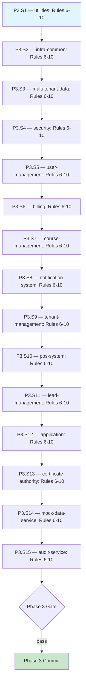

# Test Assertion Compliance: Coverage Rules 6-10 — Execution Prompt

> **Workflow**: [`test-compliance-workflow.md`](../../../workflows/pending/test-compliance-workflow.md)
> **Project**: `core-api`
> **Dependencies**: Docker (TestContainers for component test verification)
> **Series**: Prompt 2 of 3 — enforce input/exception coverage rules (Rules 6-10) across 15 modules
> **Requires**: Prompt 1 (test-compliance-structural) completed — Rules 1-5 enforced and committed

---

## 0. Pre-Execution Checklist

> **Temporal parallel**: Worker startup validation — the executor MUST complete
> these checks before running any step. If any check fails, STOP and resolve.

- [ ] Read the linked workflow document — audit scope, decision tree, constraints, risk matrix
- [ ] Read `core-api/docs/directives/CLAUDE.md` — hard rules, architecture, test coverage requirements
- [ ] Read `core-api/docs/directives/AI-CODE-REF.md` — section 4.4 (10 unit rules, especially Rules 6-10), section 4.12 (checklist)
- [ ] Verify Prompt 1 completed: Rules 1-5 commit exists (`test(core-api): enforce unit test structural assertion rules 1-5`)
- [ ] Verify all existing unit tests pass: `mvn test` (at project root)
- [ ] Verify Docker is running (required for TestContainers in verification)

---

## 1. Execution Rules

### Universal Rules

1. **One step at a time** — complete each step fully before moving to the next.
2. **Verify after each step** — run the step's verification command. If it fails, fix before proceeding.
3. **Never skip steps** — the DAG (section 2) defines the only valid execution order.
4. **Commit at phase boundaries** — each phase ends with a commit message. Commit only when the phase verification gate passes.
5. **Log execution** — after each step, append to the Execution Log (section 6).
6. **On failure** — follow the Recovery Protocol (section 5). Never brute-force past errors.

### Deterministic Constraints

- Do not modify production code — only `*Test.java` files.
- **ONE exception**: If an implementation class uses inline string literals for exception messages, extracting them to `public static final` constants is allowed (Rule 6 requirement).
- If a newly added assertion causes a test to fail, do NOT remove the assertion. Instead, read the implementation to understand the correct behavior and fix the test logic.
- Each module's tests must pass before moving to the next module.

### Project-Specific Rules

- All `.hasMessage()` assertions MUST reference `public static final` constants from the implementation class — never inline string literals
- All `verify()` calls MUST include explicit `times(1)` — no implicit defaults
- All new test methods MUST use Given-When-Then comments and `shouldDoX_whenY()` naming
- All new test methods MUST have `@DisplayName` annotation
- All new `@Nested` classes MUST have `@DisplayName` annotation
- ZERO `any()` matchers — use exact values or `ArgumentCaptor`
- Copyright header (2026 ElatusDev) on any new test files created
- New test methods added in this prompt MUST also comply with Rules 1-5 (enforced in Prompt 1)

---

## 2. Execution DAG



---

## 3. Compensation Registry

| Step | Forward Action | Compensation (Undo) | Idempotent? |
|------|---------------|---------------------|:-----------:|
| P3.S1-S15 | Add/modify assertions and test methods in unit test files | `git checkout -- {module}/src/test/` | Yes |

> **Usage**: When section 5 Recovery Protocol triggers a phase rollback, execute
> compensations in reverse order for all completed steps in that phase.

---

## Phase 3 — Unit Test Compliance: Rules 6-10 (Input/Exception Coverage)

> Execute for each module in the same dependency order as Prompt 1 Phase 2.
> Each step below is a template — repeat for all 15 modules.

### Step 3.{N} — {Module Name}: Rules 6-10

| Attribute | Value |
|-----------|-------|
| **Preconditions** | Prompt 1 committed (Rules 1-5); previous module's tests pass (or first module) |
| **Action** | Audit and fix all unit test files in this module against Rules 6-10 |
| **Postconditions** | All unit tests in this module comply with Rules 6-10 and pass |
| **Verification** | `mvn test -pl {module}` |
| **Retry Policy** | On failure: read failing test, read implementation, fix assertion or test logic, re-verify. Max 3 attempts per test file |
| **Heartbeat** | After every 3 test files modified, run `mvn test -pl {module}` |
| **Compensation** | `git checkout -- {module}/src/test/` |
| **Blocks** | Next module in sequence |

For each unit test file (`*Test.java`, excluding `*ComponentTest.java`) in the module:

**Rule 6 — Exception type AND message**: Find every `assertThatThrownBy` or `assertThrows` call.
- If it asserts `.isInstanceOf()` but NOT `.hasMessage()`: add `.hasMessage(ClassName.CONSTANT_NAME)`.
- The message constant MUST be the `public static final` from the implementation class — import it.
- If the implementation uses inline string literals for exception messages, extract them to `public static final` constants in the implementation class first. (This is the ONE exception to the "no production code changes" rule — extracting constants is allowed.)

**Rule 7 — Every invalid input state tested**: For each method under test:
- Read the implementation to identify all parameters and their types.
- Check the table from AI-CODE-REF.md section 4.4 Rule 7:
  - Object/Record: null
  - String: null, empty `""`, blank `"   "`, invalid format
  - Number: null, 0, negative, boundary
  - Collection: null, empty
  - Enum: null, each value that triggers a different path
- For each invalid state not covered by an existing test: add a new test method.
- Group all input validation tests in a `@Nested @DisplayName("Input validation")` class.

**Rule 8 — Every throwing line tested**: For each implementation method:
- Read the implementation line by line.
- Find every `if`/`throw`, `switch` branch that throws, guard clause, or early return.
- For each throwing line without a corresponding test: add a new test method.
- Name the test after the specific condition: `shouldThrowXException_whenYCondition()`.

**Rule 9 — Cutoff verification**: For every exception test:
- After the `assertThatThrownBy` block, verify that mocks for steps AFTER the throwing line were NOT called.
- Use `verifyNoInteractions(downstreamMock)` for mocks that should not have been reached.
- Use `verify(upstreamMock, times(1)).method()` for mocks that SHOULD have been called before the throw.

**Rule 10 — Collaborator exception propagation**: For each collaborator (mock) in the test class:
- Determine if the collaborator can throw exceptions (check the interface/class it mocks).
- If no test stubs the collaborator to throw: add a propagation test.
- Pattern:
  ```java
  @Test
  @DisplayName("Should propagate {ExceptionType} when {collaborator} fails")
  void shouldPropagate{ExceptionType}_when{Collaborator}Fails() {
      // Given — stub all prior collaborators normally, stub failing one to throw
      when(collaborator.method(args)).thenThrow(new SomeException(MESSAGE));

      // When / Then
      assertThatThrownBy(() -> useCase.execute(input))
          .isInstanceOf(SomeException.class)
          .hasMessage(MESSAGE);

      // Verify interactions up to and including the failing call
      InOrder inOrder = inOrder(mock1, mock2, collaborator);
      inOrder.verify(mock1, times(1)).priorMethod(args);
      inOrder.verify(collaborator, times(1)).method(args);
      inOrder.verifyNoMoreInteractions();
  }
  ```

**After fixing all files in the module**, run:

```bash
mvn test -pl {module}
```

---

### Phase 3 — Verification Gate

```bash
# Run all unit tests across the entire project
mvn test
```

**Checkpoint**: All unit test files across all 15 modules comply with Rules 1-10. All tests pass. New test methods added for missing coverage (Rules 7, 8, 10).

**Commit**: `test(core-api): enforce unit test coverage assertion rules 6-10`

---

## 5. Recovery Protocol

### Failure Categories

| Category | Symptoms | Response |
|----------|----------|----------|
| **Test compilation error** | `mvn test` fails with compilation error in test file | Fix syntax in the test file (likely missing import for `times`, `InOrder`, or `verifyNoMoreInteractions`). Re-verify |
| **Assertion failure — hidden interaction** | `verifyNoMoreInteractions` fails because a mock was called unexpectedly | Read implementation to understand the call. Either (a) add a `verify()` for the legitimate call, or (b) fix the test setup if the call is a test artifact |
| **Assertion failure — wrong times** | `times(1)` fails because mock was called 0 or N times | Read implementation. If 0: the test setup is wrong (mock not being used on this path). If N>1: either the impl calls it multiple times (adjust `times(N)`) or there is a loop/retry |
| **Assertion failure — message mismatch** | `.hasMessage()` fails because the constant value doesn't match | Verify the constant is imported from the correct implementation class. Check if the impl uses `String.format()` — may need `hasMessageContaining()` instead |
| **Context window exhaustion** | Session approaches limit | Commit current phase, update execution log, stop. Next session resumes from log |

### Backtracking Algorithm

1. Identify the failed step (e.g., P3.S5 — user-management Rules 6-10).
2. Check the Execution Log (section 6) for the last successful step.
3. Analyze the failure — is it fixable in the current step?
   - **Yes**: Fix, re-run `mvn test -pl {module}`, continue.
   - **No**: Backtrack to the dependency (consult DAG section 2).
4. If backtracking crosses a phase boundary:
   - Check if the prior phase commit is intact.
   - Re-verify the prior phase's gate.
   - Resume from the first step of the new phase.
5. If the same step fails 3 times after fix attempts: escalate to Saga Unwind.

### Saga Unwind (Phase Rollback)

1. Read the Compensation Registry (section 3).
2. Identify all steps completed in the current phase.
3. Execute compensations in reverse order (last module first).
4. After unwind, re-verify the previous phase's gate.
5. Analyze root cause before re-attempting the phase.
6. If root cause requires production code changes: STOP, report to user.

---

## 6. Execution Log

| Step | Status | Verification | Notes |
|------|:------:|:------------:|-------|
| P3.S1 — utilities | ⬜ | — | |
| P3.S2 — infra-common | ⬜ | — | |
| P3.S3 — multi-tenant-data | ⬜ | — | |
| P3.S4 — security | ⬜ | — | |
| P3.S5 — user-management | ⬜ | — | |
| P3.S6 — billing | ⬜ | — | |
| P3.S7 — course-management | ⬜ | — | |
| P3.S8 — notification-system | ⬜ | — | |
| P3.S9 — tenant-management | ⬜ | — | |
| P3.S10 — pos-system | ⬜ | — | |
| P3.S11 — lead-management | ⬜ | — | |
| P3.S12 — application | ⬜ | — | |
| P3.S13 — certificate-authority | ⬜ | — | |
| P3.S14 — mock-data-service | ⬜ | — | |
| P3.S15 — audit-service | ⬜ | — | |
| Phase 3 Gate | ⬜ | — | |

> **Status symbols**: ⬜ pending, ✅ done, ❌ failed, 🔄 retrying, ⏭️ skipped (with reason)
>
> **Instructions**: Update this table as you execute. On session resume,
> read this log to determine where to continue. The last ✅ entry is
> the safe resume point.

---

## 7. Completion Checklist

| AC | Category | Description | Status | Verified By |
|----|----------|-------------|:------:|-------------|
| AC1 | Build | `mvn clean install -DskipTests` compiles with zero errors | ⬜ | Phase 3 gate |
| AC2 | Core Flow | All unit tests across 15 modules audited against Rules 6-10 | ⬜ | Phase 3 gate |
| AC4 | Edge Case | Pure function tests correctly skip inapplicable rules | ⬜ | Phase 3 (exceptions logged) |
| AC5 | Quality | `mvn checkstyle:check` — zero violations | ⬜ | Phase 3 gate |
| AC10 | Testing | All `*Test.java` pass with Rules 1-10 compliant assertions | ⬜ | `mvn test` |

---

## 8. Execution Report

> After all phases complete (or on abort), generate the execution report
> following the specification in workflow section 11.

### Step 8.1 — Generate Report

| Attribute | Value |
|-----------|-------|
| **Preconditions** | All phases complete (or abort decision made) |
| **Action** | Generate structured execution report per workflow section 11 |
| **Postconditions** | Report written and returned to the user |
| **Verification** | Report contains all sections from workflow section 11 |

Output the report as the final message. Include both Part 1 (Narrative) and Part 2 (Technical Detail).
