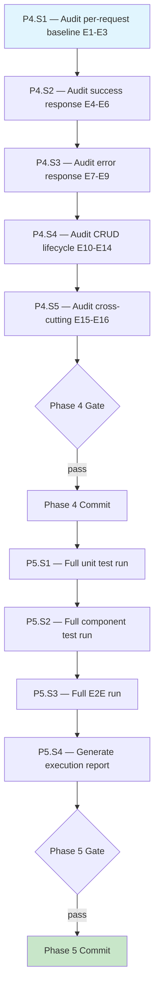

# Test Assertion Compliance: E2E + Final Verification — Execution Prompt

> **Workflow**: [`test-compliance-workflow.md`](../../../workflows/pending/test-compliance-workflow.md)
> **Project**: `core-api`
> **Dependencies**: Docker (TestContainers), running core-api instance + Newman (for E2E)
> **Series**: Prompt 3 of 3 — audit E2E Newman collection (E1-E16) + final verification across all tiers
> **Requires**: Prompt 1 (structural Rules 1-5) + Prompt 2 (coverage Rules 6-10) completed and committed

---

## 0. Pre-Execution Checklist

> **Temporal parallel**: Worker startup validation — the executor MUST complete
> these checks before running any step. If any check fails, STOP and resolve.

- [ ] Read the linked workflow document — audit scope, decision tree, constraints, risk matrix
- [ ] Read `core-api/docs/directives/CLAUDE.md` — hard rules, architecture
- [ ] Read `core-api/docs/directives/AI-CODE-REF.md` — section 4.11.1 (E1-E16 E2E rules)
- [ ] Verify Prompt 1 committed: `test(core-api): enforce unit test structural assertion rules 1-5`
- [ ] Verify Prompt 2 committed: `test(core-api): enforce unit test coverage assertion rules 6-10`
- [ ] Verify all unit tests pass: `mvn test`
- [ ] Verify all component tests pass: `mvn verify`
- [ ] Verify Docker is running
- [ ] Verify core-api is running with seeded data (required for Newman E2E)
- [ ] Confirm E2E collection exists: `ls core-api-e2e/Postman\ Collections/core-api-e2e.json`
- [ ] Read the E2E collection JSON to understand current request structure

---

## 1. Execution Rules

### Universal Rules

1. **One step at a time** — complete each step fully before moving to the next.
2. **Verify after each step** — run the step's verification command. If it fails, fix before proceeding.
3. **Never skip steps** — the DAG (section 2) defines the only valid execution order.
4. **Commit at phase boundaries** — each phase ends with a commit message. Commit only when the phase verification gate passes.
5. **Log execution** — after each step, append to the Execution Log (section 6).
6. **On failure** — follow the Recovery Protocol (section 5). Never brute-force past errors.

### Deterministic Constraints

- Do not modify production code — only the Newman collection JSON and test files.
- If a newly added E2E assertion fails, verify against the OpenAPI spec. If the API response is correct and the assertion is wrong, fix the assertion. If the API response is wrong, log as a known issue.
- E2E tests require core-api running — if unavailable, log and STOP Phase 4.

### Project-Specific Rules

- E2E assertions must reference OpenAPI spec field names and types exactly
- Every entity must have 9 mandatory CRUD scenarios (E10-E14)
- Create-GetById chains must use collection variables for ID chaining
- Auth enforcement (E15) and tenant isolation (E16) are cross-cutting requirements

---

## 2. Execution DAG



---

## 3. Compensation Registry

| Step | Forward Action | Compensation (Undo) | Idempotent? |
|------|---------------|---------------------|:-----------:|
| P4.S1-S5 | Add/modify assertions in Newman collection JSON | `git checkout -- core-api-e2e/Postman\ Collections/core-api-e2e.json` | Yes |

---

## Phase 4 — E2E Compliance (Newman Collection)

### Step 4.1 — Audit Per-Request Baseline (E1-E3)

| Attribute | Value |
|-----------|-------|
| **Preconditions** | Prompts 1 and 2 committed |
| **Action** | Audit every request in the Newman collection for E1, E2, E3 |
| **Postconditions** | Every request has status code, Content-Type, and response time assertions |
| **Verification** | Manual inspection of collection JSON — every request's `event[].script.exec` contains all three assertions |
| **Retry Policy** | On failure: fix assertion syntax, re-verify |
| **Compensation** | `git checkout -- core-api-e2e/Postman\ Collections/core-api-e2e.json` |
| **Blocks** | P4.S2 |

Read the Newman collection JSON. For every request in the collection, verify these three assertions exist in the `Tests` script:

**E1 — Exact HTTP status code**:
```javascript
pm.test("Status code is {expected}", () => {
    pm.response.to.have.status({expected});
});
```

**E2 — Content-Type** (skip for 204 responses):
```javascript
pm.test("Content-Type is application/json", () => {
    pm.response.to.have.header("Content-Type", /application\/json/);
});
```

**E3 — Response time**:
```javascript
pm.test("Response time is less than 200ms", () => {
    pm.expect(pm.response.responseTime).to.be.below(200);
});
```

If any request is missing any of these three, add them.

---

### Step 4.2 — Audit Success Response Assertions (E4-E6)

| Attribute | Value |
|-----------|-------|
| **Preconditions** | P4.S1 complete |
| **Action** | Audit all 2xx response requests for field-level schema assertions |
| **Postconditions** | Every success response asserts all DTO fields with correct types |
| **Verification** | Manual inspection — every 2xx request asserts all expected fields |
| **Retry Policy** | On failure: check OpenAPI spec for expected fields, fix assertions |
| **Compensation** | `git checkout -- core-api-e2e/Postman\ Collections/core-api-e2e.json` |
| **Blocks** | P4.S3 |

For every 2xx request:

**E4 — All fields with correct types**: Read the corresponding OpenAPI spec (`{module}/src/main/resources/openapi/{module}-module.yaml`) to know the expected DTO fields. Assert every field:
```javascript
pm.test("Response has correct schema", () => {
    const json = pm.response.json();
    pm.expect(json.fieldName).to.be.a("string").and.to.not.be.empty;
    pm.expect(json.numericField).to.be.a("number");
    pm.expect(json.dateField).to.match(/^\d{4}-\d{2}-\d{2}/);
});
```

**E5 — Entity IDs > 0**:
```javascript
pm.expect(json.entityId).to.be.a("number").and.to.be.above(0);
```

**E6 — Nested objects**: If the response contains nested DTOs, assert their fields too.

---

### Step 4.3 — Audit Error Response Assertions (E7-E9)

| Attribute | Value |
|-----------|-------|
| **Preconditions** | P4.S2 complete |
| **Action** | Audit all 4xx response requests for error code and message assertions |
| **Postconditions** | Every error response asserts exact error code and non-empty message |
| **Verification** | Manual inspection — every 4xx request asserts `code` and `message` |
| **Retry Policy** | On failure: verify error codes against controller advice, fix |
| **Compensation** | `git checkout -- core-api-e2e/Postman\ Collections/core-api-e2e.json` |
| **Blocks** | P4.S4 |

For every 4xx request:

**E7 — Error code exact match**:
```javascript
pm.test("Error code is ENTITY_NOT_FOUND", () => {
    const json = pm.response.json();
    pm.expect(json.code).to.eql("ENTITY_NOT_FOUND");
});
```

**E8 — Message present and non-empty**:
```javascript
pm.expect(json.message).to.be.a("string").and.to.not.be.empty;
```

**E9 — Validation details** (400 responses only):
```javascript
pm.test("Validation error has field details", () => {
    const json = pm.response.json();
    pm.expect(json.code).to.eql("VALIDATION_ERROR");
    pm.expect(json.details).to.be.an("array").and.to.not.be.empty;
});
```

---

### Step 4.4 — Audit CRUD Lifecycle (E10-E14)

| Attribute | Value |
|-----------|-------|
| **Preconditions** | P4.S3 complete |
| **Action** | Verify every entity has the 9 mandatory scenarios; add missing ones |
| **Postconditions** | Every entity in the collection has all 9 mandatory CRUD requests |
| **Verification** | Count requests per entity — minimum 9 |
| **Retry Policy** | On failure: read entity controller for expected behavior, fix |
| **Compensation** | `git checkout -- core-api-e2e/Postman\ Collections/core-api-e2e.json` |
| **Blocks** | P4.S5 |

For every entity in the collection, verify these 9 scenarios exist:

```
1. Create              → 201 + full schema + field types + ID > 0  (E10)
2. Create duplicate    → 409 + DUPLICATE_ENTITY                    (E13)
3. GetById             → 200 + full schema + matches created data  (E10)
4. GetById not found   → 404 + ENTITY_NOT_FOUND                   (E10)
5. GetAll              → 200 + array + contains created entity     (E11)
6. Delete              → 204                                       (E12)
7. Delete not found    → 404 + ENTITY_NOT_FOUND                   (E12)
8. Delete constrained  → 409 + DELETION_CONSTRAINT_VIOLATION      (E14)
9. GetById post-delete → 404 + ENTITY_NOT_FOUND (proves soft delete) (E12)
```

If any entity is missing any of these scenarios, add the request to the collection with all required assertions (E1-E3 baseline + E4-E9 as applicable).

**Important**: The Create-GetById chain (E10) requires the ID from the Create response to be stored in a collection variable and used in the GetById request URL. Verify this chaining exists.

---

### Step 4.5 — Audit Cross-Cutting Assertions (E15-E16)

| Attribute | Value |
|-----------|-------|
| **Preconditions** | P4.S4 complete |
| **Action** | Verify auth enforcement and tenant isolation tests exist |
| **Postconditions** | At least one 401 test (no JWT) and at least one tenant isolation test exist |
| **Verification** | Manual inspection — requests without auth header exist and assert 401 |
| **Retry Policy** | On failure: add missing cross-cutting requests |
| **Compensation** | `git checkout -- core-api-e2e/Postman\ Collections/core-api-e2e.json` |
| **Blocks** | Phase 4 Gate |

**E15 — Auth enforcement**: Verify at least one request exists that:
- Omits the JWT `Authorization` header
- Asserts HTTP 401 response

**E16 — Tenant isolation**: Verify at least one request exists that:
- Omits the `X-Tenant-Id` header (for tenant-scoped endpoints)
- Asserts rejection (400 or 403)

If these cross-cutting tests do not exist, add them to the collection.

---

### Phase 4 — Verification Gate

```bash
# Run Newman against the updated collection
# Requires core-api to be running with seeded data
newman run "core-api-e2e/Postman Collections/core-api-e2e.json" \
    --environment "core-api-e2e/Postman Collections/core-api-e2e-env.json"
```

**Checkpoint**: All E2E requests comply with E1-E16. Every entity has 9 mandatory scenarios. Auth and tenant isolation are tested. Newman passes.

**Commit**: `test(core-api-e2e): enforce E2E assertion rules E1-E16`

---

## Phase 5 — Final Verification & Report

### Step 5.1 — Full Unit Test Run

| Attribute | Value |
|-----------|-------|
| **Preconditions** | Phase 4 committed |
| **Action** | Run all unit tests across all modules |
| **Postconditions** | All unit tests pass |
| **Verification** | `mvn test` exits with BUILD SUCCESS |
| **Retry Policy** | On failure: identify failing module, fix test, re-run |
| **Blocks** | P5.S2 |

```bash
mvn test
```

---

### Step 5.2 — Full Component Test Run

| Attribute | Value |
|-----------|-------|
| **Preconditions** | P5.S1 passed |
| **Action** | Run all component tests to verify no regressions |
| **Postconditions** | All component tests pass |
| **Verification** | `mvn verify` exits with BUILD SUCCESS |
| **Retry Policy** | On failure: component tests should not have been modified — investigate regression cause |
| **Blocks** | P5.S3 |

```bash
mvn verify
```

---

### Step 5.3 — Full E2E Run

| Attribute | Value |
|-----------|-------|
| **Preconditions** | P5.S2 passed; core-api running with seeded data |
| **Action** | Run complete Newman collection |
| **Postconditions** | All E2E tests pass |
| **Verification** | `newman run` exits with zero failures |
| **Retry Policy** | On failure: identify failing request, fix assertion or flag as API issue |
| **Blocks** | P5.S4 |

```bash
newman run "core-api-e2e/Postman Collections/core-api-e2e.json" \
    --environment "core-api-e2e/Postman Collections/core-api-e2e-env.json" \
    --reporters cli,json \
    --reporter-json-export "core-api-e2e/reports/compliance-run.json"
```

---

### Step 5.4 — Generate Execution Report

| Attribute | Value |
|-----------|-------|
| **Preconditions** | P5.S1-S3 all passed |
| **Action** | Generate the execution report per workflow section 11 |
| **Postconditions** | Report contains all required sections |
| **Verification** | Report covers Part 1 (narrative) and Part 2 (technical detail) |
| **Blocks** | Phase 5 Gate |

Generate the report following the format in section 8 of this prompt.

---

### Phase 5 — Verification Gate

```bash
# All three tiers must pass
mvn test          # Unit tests
mvn verify        # Component tests
newman run ...    # E2E tests (see P5.S3 command)
```

**Checkpoint**: All test tiers pass. Execution report generated. Full compliance workflow complete.

**Commit**: `docs(core-api): add test compliance execution report`

---

## 5. Recovery Protocol

### Failure Categories

| Category | Symptoms | Response |
|----------|----------|----------|
| **E2E assertion failure** | Newman request fails with new assertion | Verify against OpenAPI spec. If API response is correct and assertion is wrong, fix assertion. If API response is wrong, log as known issue |
| **E2E environment failure** | core-api unreachable or data not seeded | Log, STOP. Requires running backend |
| **Unit test regression** | Previously passing unit test now fails | Should not happen — investigate if Phase 4 JSON changes somehow affected test state |
| **Context window exhaustion** | Session approaches limit | Commit current phase, update execution log, stop. Next session resumes from log |

### Backtracking Algorithm

1. Identify the failed step.
2. Check the Execution Log (section 6) for the last successful step.
3. Analyze the failure — is it fixable in the current step?
   - **Yes**: Fix, re-verify, continue.
   - **No**: Backtrack to the dependency (consult DAG section 2).
4. If the same step fails 3 times after fix attempts: escalate to Saga Unwind.

### Saga Unwind (Phase Rollback)

1. Read the Compensation Registry (section 3).
2. Execute compensations in reverse order.
3. Re-verify the previous phase's gate.
4. Analyze root cause before re-attempting.
5. If root cause requires production code changes: STOP, report to user.

---

## 6. Execution Log

| Step | Status | Verification | Notes |
|------|:------:|:------------:|-------|
| P4.S1 — E2E baseline E1-E3 | ⬜ | — | |
| P4.S2 — E2E success E4-E6 | ⬜ | — | |
| P4.S3 — E2E errors E7-E9 | ⬜ | — | |
| P4.S4 — E2E CRUD lifecycle E10-E14 | ⬜ | — | |
| P4.S5 — E2E cross-cutting E15-E16 | ⬜ | — | |
| Phase 4 Gate | ⬜ | — | |
| P5.S1 — Full unit test run | ⬜ | — | |
| P5.S2 — Full component test run | ⬜ | — | |
| P5.S3 — Full E2E run | ⬜ | — | |
| P5.S4 — Generate report | ⬜ | — | |
| Phase 5 Gate | ⬜ | — | |

> **Status symbols**: ⬜ pending, ✅ done, ❌ failed, 🔄 retrying, ⏭️ skipped (with reason)

---

## 7. Completion Checklist

| AC | Category | Description | Status | Verified By |
|----|----------|-------------|:------:|-------------|
| AC1 | Build | `mvn clean install -DskipTests` compiles with zero errors | ⬜ | P5.S1 |
| AC3 | Core Flow | All E2E requests audited against E1-E16 | ⬜ | Phase 4 gate |
| AC9 | Quality | ArchUnit tests pass — no layer violations | ⬜ | P5.S1 (included in `mvn test`) |
| AC10 | Testing | All `*Test.java` pass (full regression check) | ⬜ | P5.S1: `mvn test` |
| AC11 | Testing | All `*ComponentTest.java` pass (no regressions) | ⬜ | P5.S2: `mvn verify` |
| AC14 | Testing | Newman passes with E1-E16 compliant assertions, 9 scenarios per entity | ⬜ | P5.S3: `newman run` |

---

## 8. Execution Report

> After all phases complete (or on abort), generate the execution report
> following the specification in workflow section 11.

### Step 8.1 — Generate Report

| Attribute | Value |
|-----------|-------|
| **Preconditions** | All phases complete (or abort decision made) |
| **Action** | Generate structured execution report per workflow section 11 |
| **Postconditions** | Report written and returned to the user |
| **Verification** | Report contains all sections from workflow section 11 |

**Report format** (fill every section):

```markdown
# Execution Report — Test Assertion Compliance (Full)

---

## Part 1 — Narrative (for the user)

### What Was Done
3-5 sentence summary: how many modules were audited, how many test files were reviewed,
how many violations were found and fixed, and whether E2E tests were brought into compliance.

### Before / After
| Aspect | Before | After |
|--------|--------|-------|
| Unit tests with state+interaction assertions | {n}% | 100% |
| Unit tests with verifyNoMoreInteractions | {n}% | 100% |
| Unit tests with explicit times(1) | {n}% | 100% |
| Unit tests with InOrder where needed | {n}% | 100% |
| Exception tests with type+message | {n}% | 100% |
| Exception tests with cutoff verification | {n}% | 100% |
| E2E requests with E1-E3 baseline | {n}% | 100% |
| E2E entities with 9 mandatory scenarios | {n}/{total} | {total}/{total} |
| Total assertions added | — | {n} |
| Total new test methods added | — | {n} |

### Work Completed — Feature Map
{Generate Mermaid diagram showing all modules audited, grouped by phase,
color-coded: green = fully compliant, yellow = partial, red = skipped}

### What This Enables
Any structural change to production code — adding a dependency call, changing call order,
modifying an exception message, removing a guard clause — will now be caught by at least
one test failure. E2E tests enforce the full API contract per entity.

### What's Still Missing
- Unit test files for untested production classes (out of scope)
- Component test assertion audit (different rule set)
- Coverage metric enforcement (line coverage gates)

---

## Part 2 — Technical Detail (for the retrospective)

### Result
{COMPLETED / PARTIAL / ABORTED}

### Metrics
| Metric | Value |
|--------|-------|
| Total modules audited | {n} / 15 |
| Total unit test files audited | {n} |
| Total unit test methods audited | {n} |
| Rule 1-5 violations found | {n} |
| Rule 6-10 violations found | {n} |
| E2E violations found | {n} |
| Total assertions added | {n} |
| Total new test methods added | {n} |
| Phases completed | {X} / 5 |

### Files Modified
| File | Changes |
|------|---------|
| {path} | {summary} |

### Dependencies Added
None — no new dependencies.

### Deviations from Prompt
| Step | Expected | Actual | Cause | Classification |
|------|----------|--------|-------|----------------|
| {step} | {what DAG said} | {what happened} | {why} | {plan gap / environment / executor} |

### Verification Results
{Copy-paste terminal output from P5.S1, P5.S2, P5.S3}

### Known Issues
1. {Issue description — severity, impact, suggested fix}

### Acceptance Criteria
| AC | Result | Notes |
|----|:------:|-------|
| AC1 | pass/fail | {observations} |
| AC3 | pass/fail | |
| AC9 | pass/fail | |
| AC10 | pass/fail | |
| AC11 | pass/fail | |
| AC14 | pass/fail | |
```

> **Output**: Return this report as the final message to the user.
> Do NOT skip this step — even on abort, the report documents what was
> done and what remains.
