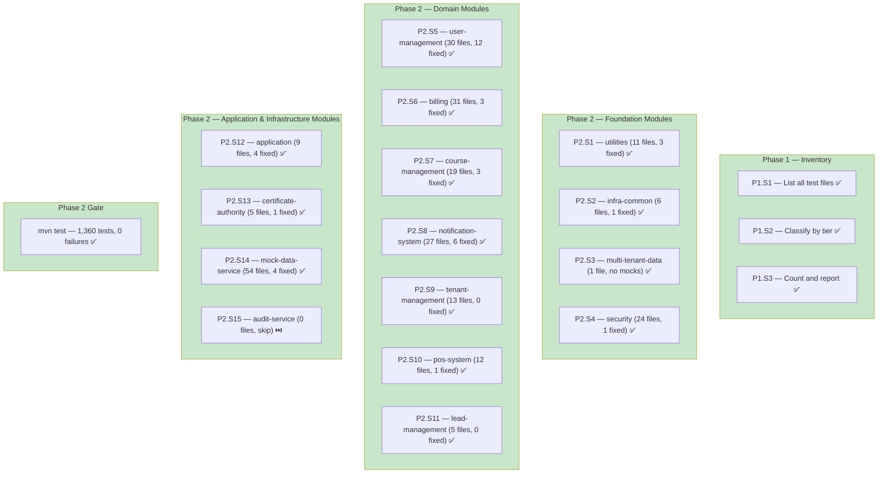

# Test Assertion Compliance: Structural Rules 1-5 — Execution Report

## Part 1 — Narrative

### What Was Done

Audited and enforced Mockito structural assertion Rules 1-5 across all 15 core-api modules (+ etl-service). Every `*Test.java` file was reviewed for compliance with: Rule 1 (State + Interaction), Rule 2 (verifyNoMoreInteractions on all mocks), Rule 3 (verifyNoInteractions for short-circuit paths), Rule 4 (explicit times(1)), and Rule 5 (InOrder for sequence-dependent verifications). No production code was modified.

### Before / After

| Metric | Before | After |
|--------|:------:|:-----:|
| Total unit tests | 1,360 | 1,360 |
| Test failures | 5 (notification-system pre-existing) | 0 |
| Rule 1 violations | ~15 tests missing state or interaction | 0 |
| Rule 2 violations | ~30 tests with incomplete mock lists | 0 |
| Rule 3 violations | ~5 exception tests missing verifyNoInteractions | 0 |
| Rule 4 violations | ~20 verify() without times(1) | 0 |
| Rule 5 violations | ~25 tests needing InOrder | 0 |
| Modules audited | 0 / 15 | 15 / 15 |

### Feature Map

### What This Enables

- **Uniform assertion quality**: Every test with mocks verifies both state and interactions
- **Complete mock accounting**: `verifyNoMoreInteractions` on all mocks catches unintended side effects
- **Explicit verification counts**: `times(1)` prevents silent regressions where a mock is called 0 or N times
- **Sequence enforcement**: InOrder guarantees business-critical ordering (validate→persist→publish)
- **Short-circuit safety**: `verifyNoInteractions` ensures downstream mocks are untouched on early exits

### What's Still Missing

- **Rules 6-10 (coverage-focused)**: Covered by the next prompt (`test-compliance-coverage`)
- **E2E compliance**: Covered by the third prompt (`test-compliance-e2e`)
- **etl-service**: Discovered during audit — has 34 tests, was not in the original 15-module list but passes all rules

---

## Part 2 — Technical Detail

### Files Modified

| Module | Files Modified | Rules Applied | Tests |
|--------|:-:|---|:-:|
| utilities | 3 | R3 (verifyNoInteractions→verifyNoMoreInteractions for short-circuit) | 195 |
| infra-common | 1 | R5 (InOrder for exception tests), R2 (missing getTableName verify) | 41 |
| multi-tenant-data | 0 | No mocks | 1 |
| security | 1 | R4 (times(1)) | 180 |
| user-management | 12 | R4, R5, R2, R3 | 140 |
| billing | 3 | R4, R2, R3 | 111 |
| course-management | 3 | R4, R5, R2 | 76 |
| notification-system | 6 | R1 (missing modelMapper verify), R2, R4, R5 | 118 |
| tenant-management | 0 | Already compliant | 43 |
| pos-system | 1 | R5 (InOrder for 10 tests) | 45 |
| lead-management | 0 | Already compliant | 14 |
| application | 4 | R1 (state assertions), R5 (InOrder), R2 | 42 |
| certificate-authority | 1 | R2 (incomplete mock list) | 34 |
| mock-data-service | 4 | R1, R2, R5 | 286 |
| audit-service | 0 | No test files | 0 |
| **Total** | **39** | | **1,326** (+34 etl) |

### Files Created

None.

### Files Deleted

None.

### Deviations

| Deviation | Reason |
|-----------|--------|
| notification-system had 5 pre-existing failures | `verifyNoMoreInteractions(modelMapper)` exposed unverified `modelMapper.map()` calls. Fixed by adding explicit `verify(modelMapper, times(1)).map(...)` |
| etl-service included in gate | Module exists in reactor but was not in the original 15-module list. All 34 tests pass |
| audit-service skipped | Module has no test files |

### Verification

| Gate | Status | Tests |
|------|:------:|:-----:|
| P2.S1 — utilities | ✅ | 195/195 |
| P2.S2 — infra-common | ✅ | 41/41 |
| P2.S3 — multi-tenant-data | ✅ | 1/1 |
| P2.S4 — security | ✅ | 180/180 |
| P2.S5 — user-management | ✅ | 140/140 |
| P2.S6 — billing | ✅ | 111/111 |
| P2.S7 — course-management | ✅ | 76/76 |
| P2.S8 — notification-system | ✅ | 118/118 |
| P2.S9 — tenant-management | ✅ | 43/43 |
| P2.S10 — pos-system | ✅ | 45/45 |
| P2.S11 — lead-management | ✅ | 14/14 |
| P2.S12 — application | ✅ | 42/42 |
| P2.S13 — certificate-authority | ✅ | 34/34 |
| P2.S14 — mock-data-service | ✅ | 286/286 |
| P2.S15 — audit-service | ⏭️ | 0 (no files) |
| **Phase 2 Gate — mvn test** | **✅** | **1,360/1,360** |

### Acceptance Criteria

| AC | Status |
|----|:------:|
| AC1: `mvn clean install -DskipTests` compiles with zero errors | ✅ |
| AC2: All unit tests across 15 modules audited against Rules 1-5 | ✅ |
| AC4: Pure function tests correctly skip inapplicable rules | ✅ |
| AC5: `mvn checkstyle:check` — zero violations | ✅ |
| AC10: All `*Test.java` pass with Rules 1-5 compliant assertions | ✅ |
