# Test Assertion Compliance: Inventory + Structural Rules 1-5 — Execution Prompt

> **Workflow**: [`test-compliance-workflow.md`](../../../workflows/pending/test-compliance-workflow.md)
> **Project**: `core-api`
> **Dependencies**: Docker (TestContainers for component test verification)
> **Series**: Prompt 1 of 3 — inventory all test files + enforce structural assertion rules (Rules 1-5) across 15 modules

---

## 0. Pre-Execution Checklist

> **Temporal parallel**: Worker startup validation — the executor MUST complete
> these checks before running any step. If any check fails, STOP and resolve.

- [ ] Read the linked workflow document — audit scope, decision tree, constraints, risk matrix
- [ ] Read `core-api/docs/directives/CLAUDE.md` — hard rules, architecture, test coverage requirements
- [ ] Read `core-api/docs/directives/AI-CODE-REF.md` — section 4.4 (10 unit rules), section 4.12 (checklist)
- [ ] Verify all existing unit tests pass: `mvn test` (at project root)
- [ ] Verify Docker is running (required for TestContainers in verification)

---

## 1. Execution Rules

### Universal Rules

1. **One step at a time** — complete each step fully before moving to the next.
2. **Verify after each step** — run the step's verification command. If it fails, fix before proceeding.
3. **Never skip steps** — the DAG (section 2) defines the only valid execution order.
4. **Commit at phase boundaries** — each phase ends with a commit message. Commit only when the phase verification gate passes.
5. **Log execution** — after each step, append to the Execution Log (section 6).
6. **On failure** — follow the Recovery Protocol (section 5). Never brute-force past errors.

### Deterministic Constraints

- Do not modify production code — only `*Test.java` files.
- If a newly added assertion causes a test to fail, do NOT remove the assertion. Instead, read the implementation to understand the correct behavior and fix the test logic.
- If `verifyNoMoreInteractions` reveals an unexpected interaction, investigate whether it is intentional or a test setup issue before proceeding.
- Each module's tests must pass before moving to the next module.

### Project-Specific Rules

- All `.hasMessage()` assertions MUST reference `public static final` constants from the implementation class — never inline string literals
- All `verify()` calls MUST include explicit `times(1)` — no implicit defaults
- All new test methods MUST use Given-When-Then comments and `shouldDoX_whenY()` naming
- All new test methods MUST have `@DisplayName` annotation
- All new `@Nested` classes MUST have `@DisplayName` annotation
- ZERO `any()` matchers — use exact values or `ArgumentCaptor`
- Copyright header (2026 ElatusDev) on any new test files created

---

## 2. Execution DAG

```mermaid
graph TD
    P1S1["P1.S1 — List all test files"] --> P1S2["P1.S2 — Classify by tier"]
    P1S2 --> P1S3["P1.S3 — Count and report inventory"]
    P1S3 --> P1Gate{"Phase 1 Gate"}
    P1Gate -->|pass| P1Commit["Phase 1 Commit"]

    P1Commit --> P2S1["P2.S1 — utilities: Rules 1-5"]
    P2S1 --> P2S2["P2.S2 — infra-common: Rules 1-5"]
    P2S2 --> P2S3["P2.S3 — multi-tenant-data: Rules 1-5"]
    P2S3 --> P2S4["P2.S4 — security: Rules 1-5"]
    P2S4 --> P2S5["P2.S5 — user-management: Rules 1-5"]
    P2S5 --> P2S6["P2.S6 — billing: Rules 1-5"]
    P2S6 --> P2S7["P2.S7 — course-management: Rules 1-5"]
    P2S7 --> P2S8["P2.S8 — notification-system: Rules 1-5"]
    P2S8 --> P2S9["P2.S9 — tenant-management: Rules 1-5"]
    P2S9 --> P2S10["P2.S10 — pos-system: Rules 1-5"]
    P2S10 --> P2S11["P2.S11 — lead-management: Rules 1-5"]
    P2S11 --> P2S12["P2.S12 — application: Rules 1-5"]
    P2S12 --> P2S13["P2.S13 — certificate-authority: Rules 1-5"]
    P2S13 --> P2S14["P2.S14 — mock-data-service: Rules 1-5"]
    P2S14 --> P2S15["P2.S15 — audit-service: Rules 1-5"]
    P2S15 --> P2Gate{"Phase 2 Gate"}
    P2Gate -->|pass| P2Commit["Phase 2 Commit"]

    style P1S1 fill:#e1f5fe
    style P2Commit fill:#c8e6c9
```



---

## 3. Compensation Registry

| Step | Forward Action | Compensation (Undo) | Idempotent? |
|------|---------------|---------------------|:-----------:|
| P2.S1-S15 | Add/modify assertions in unit test files | `git checkout -- {module}/src/test/` | Yes |

> **Usage**: When section 5 Recovery Protocol triggers a phase rollback, execute
> compensations in reverse order for all completed steps in that phase.

---

## Phase 1 — Inventory

### Step 1.1 — List All Test Files

| Attribute | Value |
|-----------|-------|
| **Preconditions** | Pre-execution checklist complete |
| **Action** | Find all test files across all 15 modules |
| **Postconditions** | Complete list of test files with full paths |
| **Verification** | List is non-empty and covers all modules with test directories |
| **Retry Policy** | N/A — read-only step |
| **Blocks** | P1.S2 |

Run the following commands to discover all test files:

```bash
# Unit tests
find core-api/ -path "*/src/test/*" -name "*Test.java" -not -name "*ComponentTest.java" | sort

# Component tests
find core-api/ -path "*/src/test/*" -name "*ComponentTest.java" | sort

# E2E collection
ls core-api-e2e/Postman\ Collections/*.json
```

---

### Step 1.2 — Classify by Tier and Module

| Attribute | Value |
|-----------|-------|
| **Preconditions** | P1.S1 complete — file list available |
| **Action** | Organize test files into a table by module and tier |
| **Postconditions** | Classification table complete |
| **Verification** | Every file from P1.S1 appears in the table |
| **Retry Policy** | N/A — read-only step |
| **Blocks** | P1.S3 |

Produce a table per module:

| Module | Unit Tests (*Test.java) | Component Tests (*ComponentTest.java) | Count |
|--------|:-----------------------:|:-------------------------------------:|:-----:|
| utilities | {list} | {list} | {n} |
| infra-common | {list} | {list} | {n} |
| ... | ... | ... | ... |

---

### Step 1.3 — Count and Report Inventory

| Attribute | Value |
|-----------|-------|
| **Preconditions** | P1.S2 complete — classification table available |
| **Action** | Produce summary counts |
| **Postconditions** | Inventory report with totals |
| **Verification** | Totals match file count from P1.S1 |
| **Retry Policy** | N/A — read-only step |
| **Blocks** | Phase 1 Gate |

Summary format:

```
Total modules with tests: {n} / 15
Total unit test files: {n}
Total component test files: {n}
Total E2E requests: {n} (from Newman collection)
Modules with no tests: {list}
```

---

### Phase 1 — Verification Gate

```bash
# No code changes in Phase 1 — verification is inventory completeness
# The inventory report must exist and cover all modules
```

**Checkpoint**: Complete inventory of all test files across all modules. No code changes. Ready for audit.

**Commit**: `docs(core-api): add test compliance inventory`

> Note: Phase 1 is read-only. If the inventory is tracked in the execution log only (no separate file), skip the commit and proceed directly to Phase 2.

---

## Phase 2 — Unit Test Compliance: Rules 1-5 (Structural Assertions)

> Execute for each module in dependency order (see workflow section 7).
> Each step below is a template — repeat for all 15 modules.

### Step 2.{N} — {Module Name}: Rules 1-5

| Attribute | Value |
|-----------|-------|
| **Preconditions** | Previous module's tests pass (or this is the first module) |
| **Action** | Audit and fix all unit test files in this module against Rules 1-5 |
| **Postconditions** | All unit tests in this module comply with Rules 1-5 and pass |
| **Verification** | `mvn test -pl {module}` |
| **Retry Policy** | On failure: read failing test, read implementation, fix assertion, re-verify. Max 3 attempts per test file |
| **Heartbeat** | After every 3 test files modified, run `mvn test -pl {module}` |
| **Compensation** | `git checkout -- {module}/src/test/` |
| **Blocks** | Next module in sequence |

For each unit test file (`*Test.java`, excluding `*ComponentTest.java`) in the module:

**Rule 1 — State + Interaction**: Read every `@Test` method.
- If it has state assertions (`assertThat`, `assertEquals`) but no `verify()` calls AND the class has `@Mock` fields: add interaction assertions.
- If it has `verify()` calls but no state assertions AND the method returns a value: add state assertions.
- Exception: Pure function tests (no mocks) need only state assertions.

**Rule 2 — verifyNoMoreInteractions**: Check the last line of every `@Test` method.
- If it does not end with `verifyNoMoreInteractions(mock1, mock2, ...)` listing ALL `@Mock` fields: add it.
- The argument list must include every `@Mock` field in the test class.
- Exception: Tests using `verifyNoInteractions` (short-circuit paths) may use that instead if ALL mocks are listed.

**Rule 3 — verifyNoInteractions**: Find every test that asserts an exception (`assertThatThrownBy`, `assertThrows`).
- If the exception is a short-circuit (early return before downstream calls): add `verifyNoInteractions(downstreamMock1, downstreamMock2)` for all mocks that should NOT have been called.
- Read the implementation to determine which mocks are downstream of the throwing line.

**Rule 4 — Explicit times(1)**: Find every `verify(mock)` call.
- If it does not include `times(1)`: add it.
- Pattern: `verify(mock).method(args)` becomes `verify(mock, times(1)).method(args)`.
- Also applies inside `InOrder`: `inOrder.verify(mock).method(args)` becomes `inOrder.verify(mock, times(1)).method(args)`.

**Rule 5 — InOrder**: Find tests with multiple `verify()` calls on different mocks.
- Read the implementation to determine if the call sequence matters (validation before persistence, persistence before publishing, etc.).
- If sequence matters and `InOrder` is not used: wrap the verify calls in `InOrder`.
- Replace standalone `verify()` calls with `inOrder.verify()` calls.
- End the `InOrder` block with `inOrder.verifyNoMoreInteractions()` (which replaces the standalone `verifyNoMoreInteractions`).

**After fixing all files in the module**, run:

```bash
mvn test -pl {module}
```

If any test fails, read the failure message, understand the cause, fix the test (NOT the production code), and re-run.

---

### Phase 2 — Verification Gate

```bash
# Run all unit tests across the entire project
mvn test
```

**Checkpoint**: All unit test files across all 15 modules comply with Rules 1-5. All tests pass. No production code changed.

**Commit**: `test(core-api): enforce unit test structural assertion rules 1-5`

---

## 5. Recovery Protocol

### Failure Categories

| Category | Symptoms | Response |
|----------|----------|----------|
| **Test compilation error** | `mvn test` fails with compilation error in test file | Fix syntax in the test file (likely missing import for `times`, `InOrder`, or `verifyNoMoreInteractions`). Re-verify |
| **Assertion failure — hidden interaction** | `verifyNoMoreInteractions` fails because a mock was called unexpectedly | Read implementation to understand the call. Either (a) add a `verify()` for the legitimate call, or (b) fix the test setup if the call is a test artifact |
| **Assertion failure — wrong times** | `times(1)` fails because mock was called 0 or N times | Read implementation. If 0: the test setup is wrong (mock not being used on this path). If N>1: either the impl calls it multiple times (adjust `times(N)`) or there is a loop/retry |
| **Context window exhaustion** | Session approaches limit | Commit current phase, update execution log, stop. Next session resumes from log |

### Backtracking Algorithm

1. Identify the failed step (e.g., P2.S5 — user-management Rules 1-5).
2. Check the Execution Log (section 6) for the last successful step.
3. Analyze the failure — is it fixable in the current step?
   - **Yes**: Fix, re-run `mvn test -pl {module}`, continue.
   - **No**: Backtrack to the dependency (consult DAG section 2).
4. If backtracking crosses a phase boundary:
   - Check if the prior phase commit is intact.
   - Re-verify the prior phase's gate.
   - Resume from the first step of the new phase.
5. If the same step fails 3 times after fix attempts: escalate to Saga Unwind.

### Saga Unwind (Phase Rollback)

1. Read the Compensation Registry (section 3).
2. Identify all steps completed in the current phase.
3. Execute compensations in reverse order (last module first).
4. After unwind, re-verify the previous phase's gate.
5. Analyze root cause before re-attempting the phase.
6. If root cause requires production code changes: STOP, report to user.

---

## 6. Execution Log

| Step | Status | Verification | Notes |
|------|:------:|:------------:|-------|
| P1.S1 — List all test files | ⬜ | — | |
| P1.S2 — Classify by tier | ⬜ | — | |
| P1.S3 — Count and report | ⬜ | — | |
| Phase 1 Gate | ⬜ | — | |
| P2.S1 — utilities | ⬜ | — | |
| P2.S2 — infra-common | ⬜ | — | |
| P2.S3 — multi-tenant-data | ⬜ | — | |
| P2.S4 — security | ⬜ | — | |
| P2.S5 — user-management | ⬜ | — | |
| P2.S6 — billing | ⬜ | — | |
| P2.S7 — course-management | ⬜ | — | |
| P2.S8 — notification-system | ⬜ | — | |
| P2.S9 — tenant-management | ⬜ | — | |
| P2.S10 — pos-system | ⬜ | — | |
| P2.S11 — lead-management | ⬜ | — | |
| P2.S12 — application | ⬜ | — | |
| P2.S13 — certificate-authority | ⬜ | — | |
| P2.S14 — mock-data-service | ⬜ | — | |
| P2.S15 — audit-service | ⬜ | — | |
| Phase 2 Gate | ⬜ | — | |

> **Status symbols**: ⬜ pending, ✅ done, ❌ failed, 🔄 retrying, ⏭️ skipped (with reason)
>
> **Instructions**: Update this table as you execute. On session resume,
> read this log to determine where to continue. The last ✅ entry is
> the safe resume point.

---

## 7. Completion Checklist

| AC | Category | Description | Status | Verified By |
|----|----------|-------------|:------:|-------------|
| AC1 | Build | `mvn clean install -DskipTests` compiles with zero errors | ⬜ | Phase 2 gate |
| AC2 | Core Flow | All unit tests across 15 modules audited against Rules 1-5 | ⬜ | Phase 2 gate |
| AC4 | Edge Case | Pure function tests correctly skip inapplicable rules | ⬜ | Phase 2 (Rule 1 exceptions logged) |
| AC5 | Quality | `mvn checkstyle:check` — zero violations | ⬜ | Phase 2 gate |
| AC10 | Testing | All `*Test.java` pass with Rules 1-5 compliant assertions | ⬜ | `mvn test` |

---

## 8. Execution Report

> After all phases complete (or on abort), generate the execution report
> following the specification in workflow section 11.

### Step 8.1 — Generate Report

| Attribute | Value |
|-----------|-------|
| **Preconditions** | All phases complete (or abort decision made) |
| **Action** | Generate structured execution report per workflow section 11 |
| **Postconditions** | Report written and returned to the user |
| **Verification** | Report contains all sections from workflow section 11 |

Output the report as the final message. Include both Part 1 (Narrative) and Part 2 (Technical Detail).
