# User Isolation API — Execution Prompt

> **Workflow**: [`user-isolation-api-workflow.md`](../../workflows/pending/user-isolation-api-workflow.md)
> **Project**: `core-api`
> **Dependencies**: Docker (Testcontainers), MariaDB

---

## 0. Pre-Execution Checklist

- [ ] Read the linked workflow document — architecture, domain model, invariants
- [ ] Read `docs/directives/CLAUDE.md` and `docs/directives/AI-CODE-REF.md`
- [ ] Read existing files: `JwtTokenProvider.java`, `TenantContextHolder.java`, `TenantContextLoader.java`
- [ ] Read existing files: `OAuthAuthenticationUseCase.java`, `MagicLinkVerificationUseCase.java`
- [ ] Read existing files: `AdultStudentDataModel.java`, `TutorDataModel.java`, `MinorStudentDataModel.java`
- [ ] Verify Docker Desktop is running (for Testcontainers)
- [ ] Verify `mvn clean install -DskipTests` passes before starting

---

## 1. Execution Rules

### Universal Rules

1. **One step at a time** — complete each step fully before moving to the next.
2. **Verify after each step** — run the step's verification command. If it fails, fix before proceeding.
3. **Never skip steps** — the DAG (§2) defines the only valid execution order.
4. **Commit at phase boundaries** — each phase ends with a commit message. Commit only when the phase verification gate passes.
5. **Log execution** — after each step, append to the Execution Log (§6).
6. **On failure** — follow the Recovery Protocol (§5). Never brute-force past errors.

### Deterministic Constraints

- Do not introduce randomness, timestamps, or environment-dependent logic into the execution order.
- If a step's precondition is not met, STOP — do not guess or skip.
- Each step's verification must pass before its dependents run — no optimistic execution.

### Project-Specific Rules

- All REST DTOs must be OpenAPI-generated (from `my-endpoints.yaml`)
- All text via `MessageService` — no hardcoded user-facing strings
- Copyright header on every new file
- Conventional Commits — no Co-Authored-By or AI attribution
- UserContextHolder follows the exact same pattern as TenantContextHolder
- profile_id always comes from JWT claims, NEVER from request parameters

---

## 2. Execution DAG

```mermaid
graph TD
    P1S1["P1.S1 — JWT claim constants"] --> P1S2["P1.S2 — UserContextHolder"]
    P1S2 --> P1S3["P1.S3 — UserContextLoader filter"]
    P1S3 --> P1S4["P1.S4 — Add claims in OAuth login"]
    P1S4 --> P1S5["P1.S5 — Add claims in MagicLink login"]
    P1S5 --> P1Gate{"Phase 1 Gate"}
    P1Gate -->|pass| P1Commit["Phase 1 Commit"]

    P1Commit --> P2S1["P2.S1 — OpenAPI spec"]
    P2S1 --> P2S2["P2.S2 — MyProfileController + GetMyProfileUseCase"]
    P2S2 --> P2S3["P2.S3 — UpdateMyProfileUseCase"]
    P2S3 --> P2S4["P2.S4 — GetMyCoursesUseCase"]
    P2S4 --> P2S5["P2.S5 — GetMyScheduleUseCase"]
    P2S5 --> P2S6["P2.S6 — GetMyMembershipsUseCase"]
    P2S6 --> P2S7["P2.S7 — GetMyPaymentsUseCase"]
    P2S7 --> P2S8["P2.S8 — GetMyChildrenUseCase + GetMyChildCoursesUseCase"]
    P2S8 --> P2S9["P2.S9 — MyEndpointsSecurityConfiguration"]
    P2S9 --> P2S10["P2.S10 — Extend GetCurrentUserUseCase for CUSTOMER"]
    P2S10 --> P2Gate{"Phase 2 Gate"}
    P2Gate -->|pass| P2Commit["Phase 2 Commit"]

    P2Commit --> P3S1["P3.S1 — Unit tests for use cases"]
    P3S1 --> P3S2["P3.S2 — Component tests for my/* endpoints"]
    P3S2 --> P3S3["P3.S3 — User isolation tests"]
    P3S3 --> P3Gate{"Phase 3 Gate"}
    P3Gate -->|pass| P3Commit["Phase 3 Commit"]

    style P1S1 fill:#e1f5fe
    style P3Commit fill:#c8e6c9
```



---

## 3. Compensation Registry

| Step | Forward Action | Compensation (Undo) | Idempotent? |
|------|---------------|---------------------|:-----------:|
| P1.S1 | Add constants to JwtTokenProvider | Remove constants | Yes |
| P1.S2 | Create UserContextHolder.java | Delete file | Yes |
| P1.S3 | Create UserContextLoader.java | Delete file | Yes |
| P1.S4 | Modify OAuthAuthenticationUseCase | Revert changes | Yes |
| P1.S5 | Modify MagicLinkVerificationUseCase | Revert changes | Yes |
| P2.S1 | Create my-endpoints.yaml | Delete file | Yes |
| P2.S2-S8 | Create use case + controller files | Delete files | Yes |
| P2.S9 | Create security config | Delete file | Yes |
| P2.S10 | Modify GetCurrentUserUseCase | Revert changes | Yes |
| P3.S1-S3 | Create test files | Delete files | Yes |

---

## Phase 1 — Foundation (JWT Claims + UserContext)

### Step 1.1 — JWT Claim Constants

| Attribute | Value |
|-----------|-------|
| **Preconditions** | Workflow read, codebase compiles |
| **Action** | Add `PROFILE_TYPE_CLAIM` and `PROFILE_ID_CLAIM` constants to `JwtTokenProvider` |
| **Postconditions** | Constants available for use in token creation and parsing |
| **Verification** | `mvn compile -pl security` |
| **Retry Policy** | On failure: fix compilation error. Max 3 attempts. |
| **Compensation** | Remove constants |
| **Blocks** | P1.S2 |

**File**: `security/src/main/java/com/akademiaplus/internal/interfaceadapters/jwt/JwtTokenProvider.java`

Add alongside existing claim constants:

```java
public static final String PROFILE_TYPE_CLAIM = "profile_type";
public static final String PROFILE_ID_CLAIM = "profile_id";
```

---

### Step 1.2 — UserContextHolder

| Attribute | Value |
|-----------|-------|
| **Preconditions** | P1.S1 complete |
| **Action** | Create `UserContextHolder` with ThreadLocal, following TenantContextHolder pattern |
| **Postconditions** | Class compiles, provides get/set/clear/require methods |
| **Verification** | `mvn compile -pl security` |
| **Retry Policy** | On failure: fix compilation error. Max 3 attempts. |
| **Compensation** | Delete file |
| **Blocks** | P1.S3 |

**File**: `security/src/main/java/com/akademiaplus/internal/interfaceadapters/UserContextHolder.java`

Model after `TenantContextHolder`:
- `UserContext` record: `profileType` (String), `profileId` (Long)
- ThreadLocal storage
- `set(String profileType, Long profileId)` — sets context
- `get()` — returns `Optional<UserContext>`
- `requireProfileId()` — throws `IllegalStateException` if empty
- `requireProfileType()` — throws `IllegalStateException` if empty
- `clear()` — removes from ThreadLocal
- Spring `@Component` with `@Scope("prototype")` if needed, or static utility class

---

### Step 1.3 — UserContextLoader Filter

| Attribute | Value |
|-----------|-------|
| **Preconditions** | P1.S2 complete |
| **Action** | Create servlet filter that reads JWT claims and populates UserContextHolder |
| **Postconditions** | Filter compiles, registered at order 4 (after JwtRequestFilter order 3) |
| **Verification** | `mvn compile -pl security` |
| **Retry Policy** | On failure: fix compilation error. Max 3 attempts. |
| **Compensation** | Delete file |
| **Blocks** | P1.S4 |

**File**: `security/src/main/java/com/akademiaplus/internal/interfaceadapters/filters/UserContextLoader.java`

Key behavior:
- `@Order(4)` — after JwtRequestFilter (order 3)
- Extends `OncePerRequestFilter`
- In `doFilterInternal`:
  1. Get `Authentication` from `SecurityContextHolder`
  2. If authentication is null or not authenticated → skip (chain.doFilter)
  3. Extract JWT from cookie/header (reuse `CookieService.extractToken()` or parse from Authentication details)
  4. Parse `profile_type` and `profile_id` claims from JWT using `JwtTokenProvider`
  5. If both present → `UserContextHolder.set(profileType, profileId)`
  6. Always call `chain.doFilter()` in try block
  7. Always call `UserContextHolder.clear()` in finally block

**Decision**: Read claims from the already-parsed JWT. The `JwtTokenProvider` has a method to extract claims. Since the token is already validated by `JwtRequestFilter`, we just need to re-parse it to read the custom claims. Add a helper method to `JwtTokenProvider`:

```java
public Optional<Claims> extractAllClaims(String token) {
    // Parse without validation (already done by JwtRequestFilter)
}
```

Or alternatively, store the claims in a request attribute during JwtRequestFilter and read them in UserContextLoader.

---

### Step 1.4 — Add Claims in OAuth Login

| Attribute | Value |
|-----------|-------|
| **Preconditions** | P1.S3 complete |
| **Action** | Modify OAuthAuthenticationUseCase to add profile_type + profile_id to JWT claims |
| **Postconditions** | OAuth login JWTs contain the new claims |
| **Verification** | `mvn compile -pl application` |
| **Retry Policy** | On failure: fix compilation error. Max 3 attempts. |
| **Compensation** | Revert changes |
| **Blocks** | P1.S5 |

**File**: `application/src/main/java/com/akademiaplus/oauth/usecases/OAuthAuthenticationUseCase.java`

Find where `additionalClaims` map is built and `JwtTokenProvider.createAccessToken()` is called.
Add to the claims map:

```java
additionalClaims.put(JwtTokenProvider.PROFILE_TYPE_CLAIM, "ADULT_STUDENT");
additionalClaims.put(JwtTokenProvider.PROFILE_ID_CLAIM, adultStudent.getAdultStudentId());
```

**Note**: The OAuth flow currently creates/finds an AdultStudentDataModel. The `adultStudentId` is known at this point. If the flow can also authenticate tutors (check the code), handle the tutor case with `"TUTOR"` + `tutorId`.

---

### Step 1.5 — Add Claims in MagicLink Login

| Attribute | Value |
|-----------|-------|
| **Preconditions** | P1.S4 complete |
| **Action** | Modify MagicLinkVerificationUseCase to add profile_type + profile_id to JWT claims |
| **Postconditions** | Magic-link login JWTs contain the new claims |
| **Verification** | `mvn compile -pl application` |
| **Retry Policy** | On failure: fix compilation error. Max 3 attempts. |
| **Compensation** | Revert changes |
| **Blocks** | Phase 1 Gate |

**File**: `application/src/main/java/com/akademiaplus/magiclink/usecases/MagicLinkVerificationUseCase.java`

Same pattern as P1.S4 — find where JWT is created, add the two claims.

---

### Phase 1 — Verification Gate

```bash
mvn compile -pl security,application
```

**Checkpoint**: JWT claim constants defined. UserContextHolder and UserContextLoader created.
OAuth and magic-link login flows embed profile_type + profile_id in JWT claims.

**Commit**: `feat(security): add UserContextHolder and embed profile claims in customer JWT`

---

## Phase 2 — My Endpoints

### Step 2.1 — OpenAPI Spec

| Attribute | Value |
|-----------|-------|
| **Preconditions** | Phase 1 complete |
| **Action** | Create OpenAPI spec for all /v1/my/* endpoints |
| **Postconditions** | DTOs generated by openapi-generator |
| **Verification** | `mvn generate-sources -pl application` |
| **Retry Policy** | On failure: fix YAML syntax. Max 3 attempts. |
| **Compensation** | Delete file |
| **Blocks** | P2.S2 |

**File**: `application/src/main/resources/openapi/my-endpoints.yaml`

Define schemas for:
- `MyProfileResponseDTO` — profile fields (firstName, lastName, email, phone, address, birthdate, profileType, profileId)
- `UpdateMyProfileRequestDTO` — updatable fields (firstName, lastName, phone, address, zipCode)
- `MyCourseDTO` — course summary (courseId, courseName, schedule info)
- `MyScheduleDTO` — schedule entries (day, startTime, endTime, courseName)
- `MyMembershipDTO` — membership (membershipId, type, fee, startDate, dueDate, courseName)
- `MyPaymentDTO` — payment record (paymentId, amount, paymentDate, paymentMethod, membershipInfo)
- `MyChildDTO` — minor student summary (minorStudentId, firstName, lastName)

---

### Step 2.2 — MyProfileController + GetMyProfileUseCase

| Attribute | Value |
|-----------|-------|
| **Preconditions** | P2.S1 complete, DTOs generated |
| **Action** | Create controller and use case for GET /v1/my/profile |
| **Postconditions** | Endpoint compiles and wired |
| **Verification** | `mvn compile -pl application` |
| **Retry Policy** | On failure: fix compilation error. Max 3 attempts. |
| **Compensation** | Delete files |
| **Blocks** | P2.S3 |

**Controller**: `application/src/main/java/com/akademiaplus/interfaceadapters/MyProfileController.java`
- `@RestController` with `@RequestMapping("/v1/my")`
- All methods use `UserContextHolder.requireProfileId()` — never accept ID from request

**Use Case**: `application/src/main/java/com/akademiaplus/usecases/my/GetMyProfileUseCase.java`
- Read `profileType` and `profileId` from UserContextHolder
- If ADULT_STUDENT → query AdultStudentRepository.findById(tenantId, profileId)
- If TUTOR → query TutorRepository.findById(tenantId, profileId)
- Map to MyProfileResponseDTO

---

### Step 2.3 — UpdateMyProfileUseCase

| Attribute | Value |
|-----------|-------|
| **Preconditions** | P2.S2 complete |
| **Action** | Create use case for PUT /v1/my/profile |
| **Postconditions** | Update endpoint compiles |
| **Verification** | `mvn compile -pl application` |
| **Retry Policy** | On failure: fix compilation error. Max 3 attempts. |
| **Compensation** | Delete file |
| **Blocks** | P2.S4 |

**File**: `application/src/main/java/com/akademiaplus/usecases/my/UpdateMyProfileUseCase.java`

- Read profileId from UserContextHolder
- Update only allowed fields: firstName, lastName, phoneNumber, address, zipCode
- ProfilePicture updates may be out of scope (check existing pattern)

---

### Step 2.4 — GetMyCoursesUseCase

| Attribute | Value |
|-----------|-------|
| **Preconditions** | P2.S3 complete |
| **Action** | Create use case for GET /v1/my/courses |
| **Postconditions** | Endpoint returns courses for logged-in student |
| **Verification** | `mvn compile -pl application` |
| **Retry Policy** | On failure: fix compilation error. Max 3 attempts. |
| **Compensation** | Delete file |
| **Blocks** | P2.S5 |

**File**: `application/src/main/java/com/akademiaplus/usecases/my/GetMyCoursesUseCase.java`

- profileId = UserContextHolder.requireProfileId()
- Query courses via junction table `adult_student_courses` for ADULT_STUDENT
- For TUTOR, query courses of their minor students
- Return list of MyCourseDTO

May need a new repository method in `CourseRepository` or a native query:
```sql
SELECT c.* FROM courses c
JOIN adult_student_courses asc ON c.tenant_id = asc.tenant_id AND c.course_id = asc.course_id
WHERE asc.tenant_id = :tenantId AND asc.adult_student_id = :studentId AND asc.deleted_at IS NULL AND c.deleted_at IS NULL
```

---

### Step 2.5 — GetMyScheduleUseCase

| Attribute | Value |
|-----------|-------|
| **Preconditions** | P2.S4 complete |
| **Action** | Create use case for GET /v1/my/schedule |
| **Postconditions** | Endpoint returns schedule for logged-in student's enrolled courses |
| **Verification** | `mvn compile -pl application` |
| **Retry Policy** | On failure: fix compilation error. Max 3 attempts. |
| **Compensation** | Delete file |
| **Blocks** | P2.S6 |

**File**: `application/src/main/java/com/akademiaplus/usecases/my/GetMyScheduleUseCase.java`

- Get enrolled course IDs from adult_student_courses
- Query schedules for those course IDs
- Return list of MyScheduleDTO (day, time, course name)

---

### Step 2.6 — GetMyMembershipsUseCase

| Attribute | Value |
|-----------|-------|
| **Preconditions** | P2.S5 complete |
| **Action** | Create use case for GET /v1/my/memberships |
| **Postconditions** | Endpoint returns memberships for logged-in student |
| **Verification** | `mvn compile -pl application` |
| **Retry Policy** | On failure: fix compilation error. Max 3 attempts. |
| **Compensation** | Delete file |
| **Blocks** | P2.S7 |

**File**: `application/src/main/java/com/akademiaplus/usecases/my/GetMyMembershipsUseCase.java`

- Use existing `MembershipAdultStudentRepository` — may already have `findByAdultStudentId`
- Filter by profileId from UserContextHolder
- Return list of MyMembershipDTO

---

### Step 2.7 — GetMyPaymentsUseCase

| Attribute | Value |
|-----------|-------|
| **Preconditions** | P2.S6 complete |
| **Action** | Create use case for GET /v1/my/payments |
| **Postconditions** | Endpoint returns payments for logged-in student |
| **Verification** | `mvn compile -pl application` |
| **Retry Policy** | On failure: fix compilation error. Max 3 attempts. |
| **Compensation** | Delete file |
| **Blocks** | P2.S8 |

**File**: `application/src/main/java/com/akademiaplus/usecases/my/GetMyPaymentsUseCase.java`

- Use existing `PaymentAdultStudentRepository.findByAdultStudentId(profileId)`
- Return list of MyPaymentDTO

---

### Step 2.8 — GetMyChildrenUseCase + GetMyChildCoursesUseCase

| Attribute | Value |
|-----------|-------|
| **Preconditions** | P2.S7 complete |
| **Action** | Create use cases for tutor-specific endpoints |
| **Postconditions** | Tutor can list children and their courses |
| **Verification** | `mvn compile -pl application` |
| **Retry Policy** | On failure: fix compilation error. Max 3 attempts. |
| **Compensation** | Delete files |
| **Blocks** | P2.S9 |

**Files**:
- `application/src/main/java/com/akademiaplus/usecases/my/GetMyChildrenUseCase.java`
- `application/src/main/java/com/akademiaplus/usecases/my/GetMyChildCoursesUseCase.java`

GetMyChildrenUseCase:
- profileType must be TUTOR
- Query MinorStudentRepository for minors where tutorId = profileId

GetMyChildCoursesUseCase:
- Verify the requested minorStudentId belongs to this tutor (invariant I3)
- Query courses for the minor student via `minor_student_courses` junction table

---

### Step 2.9 — MyEndpointsSecurityConfiguration

| Attribute | Value |
|-----------|-------|
| **Preconditions** | P2.S8 complete |
| **Action** | Create security config requiring CUSTOMER role for /v1/my/** |
| **Postconditions** | Internal users get 403, customers pass through |
| **Verification** | `mvn compile -pl application` |
| **Retry Policy** | On failure: fix compilation error. Max 3 attempts. |
| **Compensation** | Delete file |
| **Blocks** | P2.S10 |

**File**: `application/src/main/java/com/akademiaplus/config/MyEndpointsSecurityConfiguration.java`

Follow the pattern of `AnalyticsSecurityConfiguration` or `TaskSecurityConfiguration`.
Require role `CUSTOMER` for all `/v1/my/**` paths.

---

### Step 2.10 — Extend GetCurrentUserUseCase for CUSTOMER

| Attribute | Value |
|-----------|-------|
| **Preconditions** | P2.S9 complete |
| **Action** | Extend /v1/user-management/me to resolve CUSTOMER profile type |
| **Postconditions** | /me endpoint works for all user types |
| **Verification** | `mvn compile -pl user-management,application` |
| **Retry Policy** | On failure: fix compilation error. Max 3 attempts. |
| **Compensation** | Revert changes |
| **Blocks** | Phase 2 Gate |

**File**: `user-management/src/main/java/com/akademiaplus/currentuser/usecases/GetCurrentUserUseCase.java`

Current flow: JWT username → InternalAuth → Employee or Collaborator.
Extended flow: Check UserContextHolder first. If profile_type = ADULT_STUDENT or TUTOR,
resolve from the customer path. Otherwise, fall through to existing employee/collaborator resolution.

Add `ADULT_STUDENT` and `TUTOR` as UserTypeEnum values in the OpenAPI spec if not already present.

---

### Phase 2 — Verification Gate

```bash
mvn clean compile -pl security,application,user-management
```

**Checkpoint**: All /v1/my/* endpoints wired. Security config requires CUSTOMER role.
GetCurrentUserUseCase extended for customer profiles.

**Commit**: `feat(application): add /v1/my/* self-service endpoints for customer users`

---

## Phase 3 — Testing

### Step 3.1 — Unit Tests for Use Cases

| Attribute | Value |
|-----------|-------|
| **Preconditions** | Phase 2 complete |
| **Action** | Unit tests for all my/* use cases |
| **Postconditions** | All unit tests pass |
| **Verification** | `mvn test -pl application -Dtest="GetMyProfile*,UpdateMyProfile*,GetMyCourses*,GetMySchedule*,GetMyMemberships*,GetMyPayments*,GetMyChildren*,GetMyChildCourses*"` |
| **Retry Policy** | On failure: fix test or code. Max 3 attempts. |
| **Compensation** | Delete test files |
| **Blocks** | P3.S2 |

Test files in `application/src/test/java/com/akademiaplus/usecases/my/`:
- One test class per use case
- Mock UserContextHolder, repositories
- Verify: correct profileId used, correct repository called, correct DTO mapping
- Verify: wrong profile type → appropriate error
- Follow AI-CODE-REF.md §4.4 structural assertion rules

---

### Step 3.2 — Component Tests for My Endpoints

| Attribute | Value |
|-----------|-------|
| **Preconditions** | P3.S1 complete |
| **Action** | Component tests with Testcontainers for /v1/my/* endpoints |
| **Postconditions** | All component tests pass |
| **Verification** | `mvn test -pl application -Dtest="MyEndpointsComponentTest"` |
| **Retry Policy** | On failure: fix test or code. Max 3 attempts. |
| **Compensation** | Delete test files |
| **Blocks** | P3.S3 |

**File**: `application/src/test/java/com/akademiaplus/usecases/MyEndpointsComponentTest.java`

- Create a tenant, an adult student with customer auth, and seed course/membership/payment data
- Use `SecurityMockMvcRequestPostProcessors.authentication()` with a token that has profile claims
- Test all 8 endpoints return correct data
- Test internal user gets 403

---

### Step 3.3 — User Isolation Tests

| Attribute | Value |
|-----------|-------|
| **Preconditions** | P3.S2 complete |
| **Action** | Tests verifying cross-user data isolation |
| **Postconditions** | All isolation tests pass |
| **Verification** | `mvn test -pl application -Dtest="UserIsolationComponentTest"` |
| **Retry Policy** | On failure: fix isolation logic. Max 3 attempts. |
| **Compensation** | Delete test files |
| **Blocks** | Phase 3 Gate |

**File**: `application/src/test/java/com/akademiaplus/usecases/UserIsolationComponentTest.java`

- Create tenant with 2 adult students (A and B), each with memberships/payments/courses
- Authenticate as student A → call /v1/my/payments → verify ONLY student A's payments returned
- Authenticate as student B → call /v1/my/payments → verify ONLY student B's payments returned
- Authenticate as student A → call /v1/my/courses → verify ONLY student A's courses returned
- Create a tutor with minor students → verify tutor only sees own children
- Verify: student A's payments NEVER appear in student B's responses (and vice versa)

---

### Phase 3 — Verification Gate

```bash
mvn test -pl application -Dtest="GetMyProfile*,UpdateMyProfile*,GetMyCourses*,GetMySchedule*,GetMyMemberships*,GetMyPayments*,GetMyChildren*,GetMyChildCourses*,MyEndpointsComponentTest,UserIsolationComponentTest"
mvn clean install -DskipTests
```

**Checkpoint**: All unit tests, component tests, and isolation tests pass.
Full build green.

**Commit**: `test(application): add unit, component, and user isolation tests for my/* endpoints`

---

## 5. Recovery Protocol

### Failure Categories

| Category | Symptoms | Response |
|----------|----------|----------|
| **Compilation error** | Build command fails | Fix in current step, re-verify. Do NOT proceed. |
| **Test failure** | Tests fail after change | Analyze failure, fix code or test, re-verify. |
| **Precondition not met** | Prior step output missing | Backtrack to last successful step per DAG (§2). |
| **JWT claim not propagated** | UserContextLoader reads null claims | Check login use case — verify claims added before token creation. |
| **Repository method missing** | Query needed but doesn't exist | Add method to existing repository interface. |
| **Security config conflict** | 403 on endpoints that should be accessible | Check filter chain order, role matching, endpoint patterns. |

### Backtracking Algorithm

1. Identify the failed step.
2. Check the Execution Log (§6) for the last successful step.
3. Is it fixable in the current step?
   - **Yes**: Fix, re-run verification, continue.
   - **No**: Backtrack to the dependency (consult DAG §2).
4. If same step fails 3 times → escalate to Saga Unwind.

---

## 6. Execution Log

| Step | Status | Verification | Notes |
|------|:------:|:------------:|-------|
| P1.S1 | ⬜ | — | |
| P1.S2 | ⬜ | — | |
| P1.S3 | ⬜ | — | |
| P1.S4 | ⬜ | — | |
| P1.S5 | ⬜ | — | |
| Phase 1 Gate | ⬜ | — | |
| P2.S1 | ⬜ | — | |
| P2.S2 | ⬜ | — | |
| P2.S3 | ⬜ | — | |
| P2.S4 | ⬜ | — | |
| P2.S5 | ⬜ | — | |
| P2.S6 | ⬜ | — | |
| P2.S7 | ⬜ | — | |
| P2.S8 | ⬜ | — | |
| P2.S9 | ⬜ | — | |
| P2.S10 | ⬜ | — | |
| Phase 2 Gate | ⬜ | — | |
| P3.S1 | ⬜ | — | |
| P3.S2 | ⬜ | — | |
| P3.S3 | ⬜ | — | |
| Phase 3 Gate | ⬜ | — | |

---

## 7. Completion Checklist

| AC | Category | Description | Status | Verified By |
|----|----------|-------------|:------:|-------------|
| AC1 | Build | Full Maven reactor compiles | ⬜ | `mvn clean install -DskipTests` |
| AC2 | Core Flow | GET /v1/my/profile returns own profile | ⬜ | P3.S2 component test |
| AC3 | Core Flow | GET /v1/my/payments returns own payments | ⬜ | P3.S2 component test |
| AC4 | Core Flow | GET /v1/my/children returns tutor's minors | ⬜ | P3.S2 component test |
| AC5 | Edge Case | Cross-student data not leaked | ⬜ | P3.S3 isolation test |
| AC6 | Edge Case | Internal user gets 403 on /v1/my/* | ⬜ | P3.S2 component test |
| AC7 | Security | Tampered JWT fails signature validation | ⬜ | Existing JWT validation |
| AC8 | Security | profile_id from JWT only — no override | ⬜ | By construction |
| AC9 | Build | Zero compilation errors | ⬜ | Phase gates |
| AC10 | Testing | Unit tests pass >=80% coverage | ⬜ | P3.S1 |
| AC11 | Testing | Component tests pass | ⬜ | P3.S2 |
| AC12 | Testing | User isolation tests pass | ⬜ | P3.S3 |

---

## 8. Execution Report

### Step 8.1 — Generate Report

| Attribute | Value |
|-----------|-------|
| **Preconditions** | All phases complete (or abort decision made) |
| **Action** | Generate structured execution report per workflow §11 |
| **Postconditions** | Report written and returned to the user |
| **Verification** | Report contains all sections |

Generate report following the template in the workflow §11.
