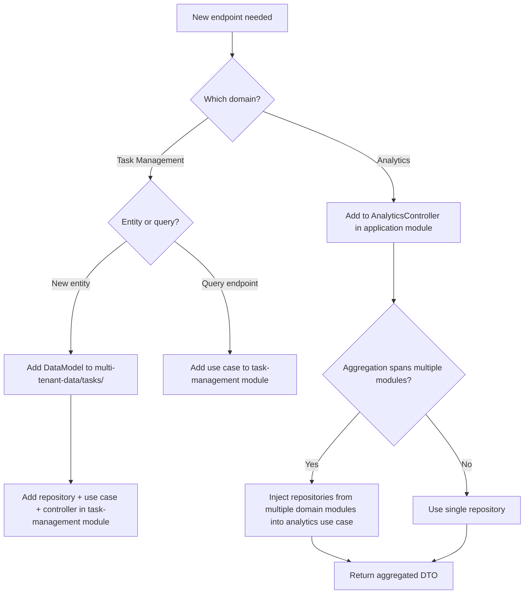
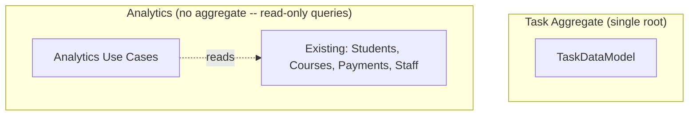
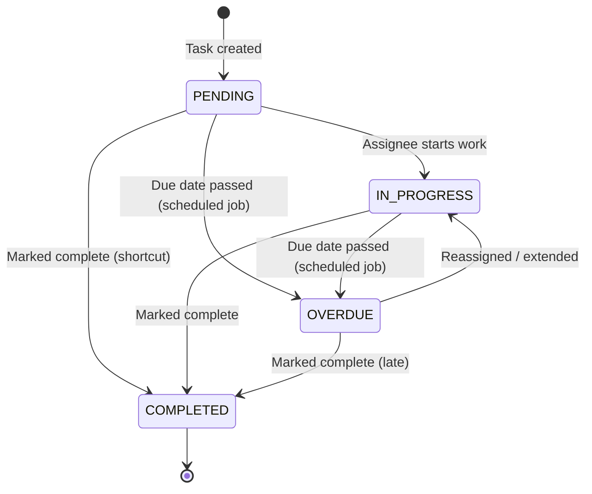
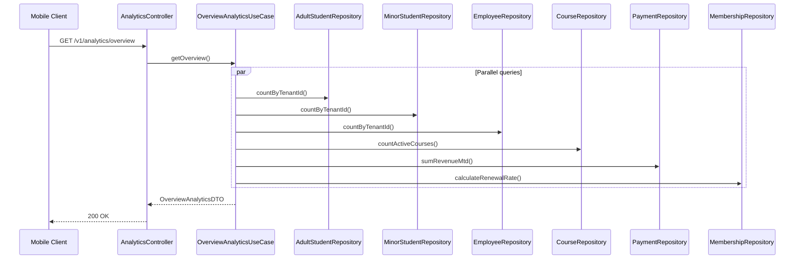
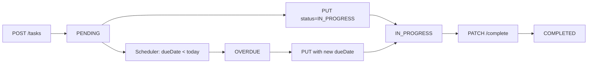
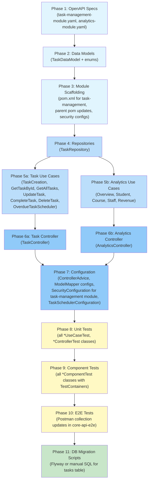
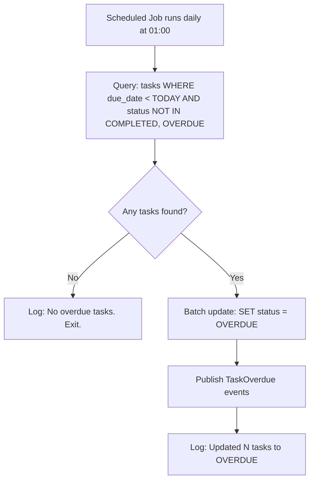

# Central Redesign API Endpoints -- Workflow

> **Scope**: New Task Management and Analytics modules/endpoints for the akademia-plus-central communication-first redesign
> **Project**: platform-core-api
> **Dependencies**: multi-tenant-data, infra-common, security, utilities, user-management (FK references), course-management (FK references), billing (analytics aggregation)
> **Estimated Effort**: L

---

## 1. Summary

The akademia-plus-central mobile app is being redesigned from a dashboard/CRUD admin tool to a communication-first notification hub. The core-api already provides 100+ endpoints across 11 modules covering notifications, user management, courses, and billing. Two domains are missing to support the new mobile experience: (1) a Task Management module for admin task tracking with status lifecycle, and (2) Analytics aggregation endpoints that compute school-wide KPIs from existing data without introducing new storage tables. Both domains follow the existing use-case-centric modular architecture, OpenAPI-first contract design, and multi-tenant row-level isolation patterns already established in the codebase.

---

## 2. Design Decisions + Decision Tree

### Decisions

| # | Decision | Alternatives Considered | Rationale |
|---|----------|------------------------|-----------|
| 1 | One new Maven module (task-management) + analytics controller in existing module | Single monolithic module for both, or analytics as its own module | Tasks are a distinct bounded context with their own entities and lifecycle -- a separate module prevents coupling. Analytics has no entities of its own -- it queries existing tables, so a new module would be empty boilerplate; a controller in the `application` module is sufficient |
| 2 | Analytics computed via JPQL/native queries -- no materialized views or new tables | Materialized views, pre-computed summary tables, CQRS read models | School tenants have low data volumes (hundreds to low thousands of records per entity). Real-time aggregation is fast enough. No new tables means zero migration risk and no cache invalidation complexity |
| 3 | Tasks are standalone entities (not linked to a specific domain object) | Tasks linked to specific entities (student, course, payment) via polymorphic FK | The first iteration keeps tasks simple -- free-text with assignee and due date. Linking to domain objects adds polymorphic FK complexity and cross-module coupling. Can be added later via an optional `referenceType` + `referenceId` pair |

### Decision Tree



---

## 3. Specification

### 3.1 Entities

#### Task Domain

| Entity | Table | Fields | Notes |
|--------|-------|--------|-------|
| TaskDataModel | `tasks` | taskId (Long, PK), tenantId (Long, PK), title (VARCHAR 200), description (TEXT, nullable), status (ENUM: PENDING, IN_PROGRESS, COMPLETED, OVERDUE), priority (ENUM: LOW, MEDIUM, HIGH), assigneeUserId (Long, nullable FK), createdByUserId (Long), dueDate (LocalDate, nullable), completedAt (LocalDateTime, nullable) | Extends TenantScoped. assigneeUserId references any user (employee/collaborator) |

#### Analytics Domain

No new entities. Analytics endpoints query existing tables: `adult_students`, `minor_students`, `employees`, `collaborators`, `courses`, `memberships`, `payment_adult_students`, `payment_tutors`, `compensations`.

### 3.2 API Endpoints

#### Task Management Module -- `/v1/tasks`

| Method | Path | Operation | Request Body | Response | Status |
|--------|------|-----------|--------------|----------|--------|
| GET | `/v1/tasks` | List tasks (filterable) | -- | TaskListDTO (paginated) | 200 |
| POST | `/v1/tasks` | Create task | TaskCreateRequestDTO | TaskDTO | 201 |
| GET | `/v1/tasks/{taskId}` | Get task by ID | -- | TaskDTO | 200 |
| PUT | `/v1/tasks/{taskId}` | Update task | TaskUpdateRequestDTO | TaskDTO | 200 |
| PATCH | `/v1/tasks/{taskId}/complete` | Mark task complete | -- | TaskDTO | 200 |
| DELETE | `/v1/tasks/{taskId}` | Soft-delete task | -- | -- | 204 |

**Query Parameters**:
- `GET /tasks`: `page` (int), `size` (int), `status` (String, optional: PENDING/IN_PROGRESS/COMPLETED/OVERDUE), `assigneeUserId` (Long, optional), `dueBefore` (LocalDate, optional), `dueAfter` (LocalDate, optional)

#### Analytics Endpoints -- `/v1/analytics`

| Method | Path | Operation | Response | Status |
|--------|------|-----------|----------|--------|
| GET | `/v1/analytics/overview` | School-wide KPIs | OverviewAnalyticsDTO | 200 |
| GET | `/v1/analytics/students` | Student analytics | StudentAnalyticsDTO | 200 |
| GET | `/v1/analytics/courses` | Course analytics | CourseAnalyticsDTO | 200 |
| GET | `/v1/analytics/staff` | Staff analytics | StaffAnalyticsDTO | 200 |
| GET | `/v1/analytics/revenue` | Revenue analytics | RevenueAnalyticsDTO | 200 |

**Query Parameters**:
- All analytics endpoints: `months` (int, default 6, max 24) for trend data range

### 3.3 Data Models (OpenAPI DTO Schemas)

```yaml
# Task DTOs
TaskCreateRequestDTO:
  type: object
  required: [title]
  properties:
    title: { type: string, maxLength: 200 }
    description: { type: string, maxLength: 2000 }
    priority: { type: string, enum: [LOW, MEDIUM, HIGH], default: MEDIUM }
    assigneeUserId: { type: integer, format: int64 }
    dueDate: { type: string, format: date }

TaskUpdateRequestDTO:
  type: object
  properties:
    title: { type: string, maxLength: 200 }
    description: { type: string, maxLength: 2000 }
    priority: { type: string, enum: [LOW, MEDIUM, HIGH] }
    status: { type: string, enum: [PENDING, IN_PROGRESS, COMPLETED, OVERDUE] }
    assigneeUserId: { type: integer, format: int64 }
    dueDate: { type: string, format: date }

TaskDTO:
  type: object
  properties:
    taskId: { type: integer, format: int64 }
    title: { type: string }
    description: { type: string }
    status: { type: string, enum: [PENDING, IN_PROGRESS, COMPLETED, OVERDUE] }
    priority: { type: string, enum: [LOW, MEDIUM, HIGH] }
    assigneeUserId: { type: integer, format: int64 }
    assigneeName: { type: string }
    createdByUserId: { type: integer, format: int64 }
    dueDate: { type: string, format: date }
    completedAt: { type: string, format: date-time }
    createdAt: { type: string, format: date-time }
    updatedAt: { type: string, format: date-time }

# Analytics DTOs
OverviewAnalyticsDTO:
  type: object
  properties:
    totalStudents: { type: integer }
    totalStaff: { type: integer }
    activeCourses: { type: integer }
    revenueMtd: { type: number, format: double }
    courseUtilizationPercent: { type: number, format: double }
    membershipRenewalRatePercent: { type: number, format: double }

StudentAnalyticsDTO:
  type: object
  properties:
    totalAdultStudents: { type: integer }
    totalMinorStudents: { type: integer }
    enrollmentTrend:
      type: array
      items:
        $ref: '#/components/schemas/MonthlyCountDTO'

CourseAnalyticsDTO:
  type: object
  properties:
    totalCourses: { type: integer }
    courseBreakdown:
      type: array
      items:
        $ref: '#/components/schemas/CourseEnrollmentDTO'
    capacityUtilizationPercent: { type: number, format: double }

StaffAnalyticsDTO:
  type: object
  properties:
    totalEmployees: { type: integer }
    totalCollaborators: { type: integer }
    roleDistribution:
      type: array
      items:
        $ref: '#/components/schemas/RoleCountDTO'

RevenueAnalyticsDTO:
  type: object
  properties:
    revenueTrend:
      type: array
      items:
        $ref: '#/components/schemas/MonthlyRevenueDTO'
    breakdownByPaymentType:
      type: array
      items:
        $ref: '#/components/schemas/PaymentTypeBreakdownDTO'
    totalOutstanding: { type: number, format: double }

MonthlyCountDTO:
  type: object
  properties:
    month: { type: string, format: date }
    count: { type: integer }

MonthlyRevenueDTO:
  type: object
  properties:
    month: { type: string, format: date }
    amount: { type: number, format: double }
```

---

## 4. Domain Model

### 4.1 Aggregates



**Transaction boundaries**:
- **Task**: Each task operation is a single-entity transaction. No child entities.
- **Analytics**: Read-only. No transactions modify data.

### 4.2 State Machine

#### Task Lifecycle



**Guards**:
- `PENDING -> COMPLETED`: No guard -- tasks can be completed directly without starting.
- `* -> OVERDUE`: Only triggered by a scheduled job comparing `dueDate < today` and `status != COMPLETED`. Never set by user action directly.
- `OVERDUE -> IN_PROGRESS`: Requires either a new `dueDate` (extension) or a new `assigneeUserId` (reassignment).
- `COMPLETED -> *`: Terminal state. Completed tasks cannot transition to any other status.

### 4.3 Domain Invariants

| # | Invariant | Enforced By | When |
|---|-----------|-------------|------|
| I1 | Task title must be non-empty and <= 200 characters | OpenAPI validation + TaskCreationUseCase | At request deserialization and use case entry |
| I2 | A completed task sets `completedAt` timestamp and cannot be re-opened | CompleteTaskUseCase | At status transition -- reject if already COMPLETED |
| I3 | Task OVERDUE status is system-managed only -- not settable via PUT /tasks | UpdateTaskUseCase | Validation rejects OVERDUE in request body |
| I4 | All task entities enforce tenant isolation via composite key and Hibernate filter | TenantScoped base class + TenantContextHolder | Every query and mutation |

### 4.4 Value Objects

| Value Object | Fields | Immutability | Equality |
|-------------|--------|:------------:|----------|
| TaskStatus | PENDING, IN_PROGRESS, COMPLETED, OVERDUE | Immutable (enum) | By name |
| TaskPriority | LOW, MEDIUM, HIGH | Immutable (enum) | By name |
| MonthlyMetric | month (YearMonth), value (Number) | Immutable (record) | By all fields |

### 4.5 Domain Events

| Event | Trigger | Consumers |
|-------|---------|-----------|
| TaskCreated | TaskCreationUseCase persists a new task | (Future: notification-system could notify assignee) |
| TaskCompleted | CompleteTaskUseCase marks task complete | (Future: notification-system could notify creator) |
| TaskOverdue | OverdueTaskScheduler detects overdue tasks | (Future: notification-system could notify assignee + creator) |

**Implementation approach**: Use Spring `ApplicationEventPublisher` for in-process events. Task events are published but have no active consumers yet -- they establish the contract for future notification integration.

---

## 5. Architecture

### 5.1 Component Interaction Diagram

#### Analytics -- Overview Flow



### 5.2 Data Flow Diagram

#### Task Status Transitions



### 5.3 Module / Folder Structure

```
task-management/
├── pom.xml
├── src/main/java/com/akademiaplus/
│   ├── config/
│   │   ├── TaskModuleSecurityConfiguration.java
│   │   ├── TaskControllerAdvice.java
│   │   ├── TaskModelMapperConfiguration.java
│   │   └── TaskSchedulerConfiguration.java
│   └── task/
│       └── interfaceadapters/
│       │   ├── TaskController.java
│       │   └── TaskRepository.java
│       └── usecases/
│           ├── TaskCreationUseCase.java
│           ├── GetTaskByIdUseCase.java
│           ├── GetAllTasksUseCase.java
│           ├── UpdateTaskUseCase.java
│           ├── CompleteTaskUseCase.java
│           ├── DeleteTaskUseCase.java
│           └── OverdueTaskScheduler.java

application/
└── src/main/java/com/akademiaplus/
    └── analytics/
        ├── interfaceadapters/
        │   └── AnalyticsController.java
        └── usecases/
            ├── OverviewAnalyticsUseCase.java
            ├── StudentAnalyticsUseCase.java
            ├── CourseAnalyticsUseCase.java
            ├── StaffAnalyticsUseCase.java
            └── RevenueAnalyticsUseCase.java

multi-tenant-data/
└── src/main/java/com/akademiaplus/
    └── tasks/
        ├── TaskDataModel.java
        ├── TaskStatus.java
        └── TaskPriority.java
```

### 5.4 Integration Points

| System | Direction | Protocol | Purpose |
|--------|-----------|----------|---------|
| user-management (repositories) | In | JPA (repository injection) | Resolve assignee names for TaskDTO |
| course-management (CourseRepository) | In | JPA | Analytics course utilization |
| billing (PaymentRepository, MembershipRepository) | In | JPA | Analytics revenue and membership renewal computations |
| Spring ApplicationEventPublisher | Out | In-process | Domain events (TaskCreated, TaskCompleted, TaskOverdue) |
| Spring @Scheduled | Internal | Cron | OverdueTaskScheduler runs daily to transition tasks to OVERDUE |

---

## 6. Element Relationship Graph

```mermaid
graph TD
    subgraph multiTenantData ["multi-tenant-data (entities)"]
        TaskDataModel
        TaskStatus
        TaskPriority
    end

    subgraph taskModule ["task-management (domain module)"]
        subgraph taskConfig ["config"]
            TaskModuleSecurityConfiguration
            TaskControllerAdvice
            TaskModelMapperConfiguration
            TaskSchedulerConfiguration
        end
        subgraph taskAggregate ["task"]
            TaskController
            TaskRepository
            TaskCreationUseCase
            GetTaskByIdUseCase
            GetAllTasksUseCase
            UpdateTaskUseCase
            CompleteTaskUseCase
            DeleteTaskUseCase
            OverdueTaskScheduler
        end
    end

    subgraph applicationModule ["application (analytics)"]
        AnalyticsController
        OverviewAnalyticsUseCase
        StudentAnalyticsUseCase
        CourseAnalyticsUseCase
        StaffAnalyticsUseCase
        RevenueAnalyticsUseCase
    end

    subgraph openapi ["OpenAPI specs"]
        TaskModuleYaml["task-management-module.yaml"]
        AnalyticsYaml["analytics-module.yaml"]
    end

    subgraph existing ["existing modules (dependencies)"]
        UserRepositories["User Repositories"]
        CourseRepository["CourseRepository"]
        PaymentRepositories["Payment Repositories"]
        MembershipRepository["MembershipRepository"]
    end

    TaskController --> TaskCreationUseCase
    TaskController --> GetTaskByIdUseCase
    TaskController --> GetAllTasksUseCase
    TaskController --> UpdateTaskUseCase
    TaskController --> CompleteTaskUseCase
    TaskController --> DeleteTaskUseCase
    OverdueTaskScheduler --> TaskRepository

    AnalyticsController --> OverviewAnalyticsUseCase
    AnalyticsController --> StudentAnalyticsUseCase
    AnalyticsController --> CourseAnalyticsUseCase
    AnalyticsController --> StaffAnalyticsUseCase
    AnalyticsController --> RevenueAnalyticsUseCase

    OverviewAnalyticsUseCase --> UserRepositories
    OverviewAnalyticsUseCase --> CourseRepository
    OverviewAnalyticsUseCase --> PaymentRepositories
    OverviewAnalyticsUseCase --> MembershipRepository
    StudentAnalyticsUseCase --> UserRepositories
    CourseAnalyticsUseCase --> CourseRepository
    StaffAnalyticsUseCase --> UserRepositories
    RevenueAnalyticsUseCase --> PaymentRepositories
    RevenueAnalyticsUseCase --> MembershipRepository
```



---

## 7. Implementation Dependency Graph



**Note**: Phases 5a and 5b are independent and can be built in parallel. Similarly, phases 6a and 6b are independent. Phase 11 (DB migrations) is listed last because existing modules use schema-on-first-run patterns, but migration scripts should be reviewed alongside entity creation in Phase 2.

---

## 8. Infrastructure Changes

### 8.1 Maven Modules

One new Maven module added to the parent `pom.xml`:

```xml
<!-- New module in parent pom.xml <modules> section -->
<module>task-management</module>
```

The module follows the same dependency pattern as existing domain modules:

```xml
<!-- task-management/pom.xml dependencies -->
<dependencies>
    <dependency>
        <groupId>com.akademiaplus</groupId>
        <artifactId>multi-tenant-data</artifactId>
        <version>${project.version}</version>
    </dependency>
    <dependency>
        <groupId>com.akademiaplus</groupId>
        <artifactId>security</artifactId>
        <version>${project.version}</version>
    </dependency>
    <dependency>
        <groupId>com.akademiaplus</groupId>
        <artifactId>utilities</artifactId>
        <version>${project.version}</version>
    </dependency>
    <dependency>
        <groupId>com.akademiaplus</groupId>
        <artifactId>infra-common</artifactId>
        <version>${project.version}</version>
    </dependency>
</dependencies>
```

The `task-management` module additionally depends on:

```xml
<!-- task-management needs user-management for assignee name resolution -->
<dependency>
    <groupId>com.akademiaplus</groupId>
    <artifactId>user-management</artifactId>
    <version>${project.version}</version>
</dependency>
```

The `application` module gains a dependency on the new module:

```xml
<dependency>
    <groupId>com.akademiaplus</groupId>
    <artifactId>task-management</artifactId>
    <version>${project.version}</version>
</dependency>
```

### 8.2 Database Tables (MariaDB DDL)

```sql
-- Task management table

CREATE TABLE tasks (
    task_id            BIGINT NOT NULL,
    tenant_id          BIGINT NOT NULL,
    title              VARCHAR(200) NOT NULL,
    description        TEXT,
    status             VARCHAR(20) NOT NULL DEFAULT 'PENDING',
    priority           VARCHAR(20) NOT NULL DEFAULT 'MEDIUM',
    assignee_user_id   BIGINT,
    created_by_user_id BIGINT NOT NULL,
    due_date           DATE,
    completed_at       DATETIME(6),
    created_at         DATETIME(6) NOT NULL,
    updated_at         DATETIME(6) NOT NULL,
    deleted_at         DATETIME(6),
    PRIMARY KEY (task_id, tenant_id),
    INDEX idx_tasks_tenant_status (tenant_id, status),
    INDEX idx_tasks_assignee (tenant_id, assignee_user_id),
    INDEX idx_tasks_due_date (tenant_id, due_date)
) ENGINE=InnoDB DEFAULT CHARSET=utf8mb4;
```

### 8.3 Maven Profile Updates

Add `task-management` to the `platform-core-api` default profile and the `mock-data-service` profile module lists in the parent `pom.xml`.

### 8.4 Application Properties

No new properties required beyond what existing modules use. The task scheduler uses Spring's `@Scheduled(cron = "...")` annotation with a default cron expression of `0 0 1 * * *` (daily at 01:00 AM).

---

## 9. Constraints & Prerequisites

### Prerequisites

- MariaDB instance running with the existing multi-tenant schema
- All existing modules compile cleanly (`mvn clean install -DskipTests` passes)
- user-management repositories (`EmployeeRepository`, `CollaboratorRepository`, `AdultStudentRepository`, `MinorStudentRepository`) are available for cross-module injection
- Tenant sequence table (`tenant_sequence`) supports the new entity names for ID generation

### Hard Rules

- **Multi-tenant isolation**: All new entities extend `TenantScoped` and use composite keys `(tenantId, entityId)`. The Hibernate tenant filter applies to all queries automatically
- **OpenAPI-first**: The two YAML specs (`task-management-module.yaml`, `analytics-module.yaml`) must be authored and generate DTOs before any controller code is written
- **IDs always Long**: All entity IDs, FK references, and cursor values are `Long`, never `Integer`
- **Copyright header**: All new Java files carry the ElatusDev copyright header
- **Soft delete**: All entities use `@SQLDelete` + `@SQLRestriction` pattern -- no physical deletes
- **Prototype-scoped entities**: All `@Entity` classes are `@Component @Scope("prototype")` beans
- **One use case per class**: Each operation gets its own `@Service` class -- no multi-method service classes
- **Constants for strings**: All error messages, regex patterns, and repeated strings extracted to `public static final` constants
- **Given-When-Then**: All tests use GWT comments, `shouldDoX_whenY()` naming, and zero `any()` matchers
- **No `any()` matchers**: Exact parameter matching in all Mockito stubs
- **Cross-module boundary**: The task-management module may import repositories from user-management but never import user-management use cases

### Out of Scope

- **Task comments or subtasks**: Tasks are flat entities with no threading
- **Task recurrence**: No repeating task patterns
- **Analytics caching**: No Redis caching layer for analytics queries -- assessed as unnecessary given data volumes
- **Analytics export**: No CSV/PDF export of analytics data

---

## 9.5 Error & Edge Case Paths

### Processing Errors (by lifecycle step)

| Step | Error Condition | System Response | User Impact | Recovery Path |
|------|----------------|-----------------|-------------|---------------|
| Create task | AssigneeUserId does not exist | 404 EntityNotFoundException | "User {userId} not found" | Client corrects userId |
| Update task | Setting status to OVERDUE via PUT | 400 validation error | "OVERDUE status is system-managed" | Client uses valid status value |
| Complete task | Task already completed | 409 DuplicateEntityException | "Task {id} is already completed" | Client refreshes task list |
| Delete task | Task has dependent resources (future) | 409 EntityDeletionNotAllowedException | "Cannot delete task with active references" | Deferred -- no dependencies in v1 |
| Analytics query | No data for tenant | Return zero-valued DTO | Dashboard shows zeros/empty charts | Normal behavior for new tenants |
| Analytics query | Payment table aggregation timeout | 500 InternalServerError (Spring default) | "Unable to load analytics" | Retry; if persistent, add query indexes |

### Boundary Condition: Task Overdue Transition



---

## 10. Acceptance Criteria

### Build & Infrastructure

**AC1**: Given the new Maven module (task-management) and its pom.xml configuration,
when `mvn clean install -DskipTests` runs from the parent project root,
then all modules compile without errors including generated OpenAPI sources.

**AC2**: Given the new database table (tasks),
when the application starts with Spring Boot against a clean MariaDB schema,
then the table is created with correct columns, indexes, and composite primary keys.

### Functional -- Core Flow

**AC3**: Given an authenticated admin user,
when `POST /v1/tasks` is called with title "Review enrollment forms" and priority HIGH,
then the task is created with status PENDING, the response includes taskId and createdAt, and the HTTP status is 201.

**AC4**: Given a task with status PENDING,
when `PATCH /v1/tasks/{id}/complete` is called,
then the task status changes to COMPLETED, completedAt is set to the current timestamp, and 200 is returned.

**AC5**: Given existing students, courses, and payments for a tenant,
when `GET /v1/analytics/overview` is called,
then the response contains non-null values for totalStudents, totalStaff, activeCourses, revenueMtd, courseUtilizationPercent, and membershipRenewalRatePercent.

**AC6**: Given existing payment records for the last 6 months,
when `GET /v1/analytics/revenue?months=6` is called,
then revenueTrend contains 6 MonthlyRevenueDTO entries (one per month) and breakdownByPaymentType has at least one entry.

### Functional -- Edge Cases

**AC7**: Given a task with status COMPLETED,
when `PATCH /v1/tasks/{id}/complete` is called again,
then a 409 Conflict is returned with message "Task is already completed".

**AC8**: Given a `PUT /v1/tasks/{id}` request body with status=OVERDUE,
when the request is processed,
then a 400 Bad Request is returned because OVERDUE is system-managed.

**AC9**: Given a tenant with no students, courses, or payments,
when any analytics endpoint is called,
then a valid DTO is returned with zero values and empty arrays (not 404 or 500).

### Security & Compliance

**AC10**: Given an unauthenticated request (no JWT token),
when any of the new endpoints is called,
then a 401 Unauthorized is returned.

**AC11**: Given tenant A's JWT token,
when tenant A calls `GET /v1/tasks`,
then only tenant A's tasks are returned.

**AC12**: Given tenant A's JWT token,
when tenant A calls `GET /v1/analytics/overview`,
then metrics are computed only from tenant A's data.

### Quality Gates

**AC13 -- Lint**: Given all new source files,
when `mvn checkstyle:check` runs,
then zero violations are reported.

**AC14 -- SonarQube**: Given SonarCloud analysis,
when scan completes on new/changed code,
then zero new bugs, zero new vulnerabilities, zero security hotspots,
and code coverage on new code >= 80%.

**AC15 -- Dependency Audit**: Given all dependencies (including transitive),
when `mvn dependency-check:check` runs,
then zero HIGH or CRITICAL CVEs are reported.

**AC16 -- Secret Scan**: Given all committed files,
when `gitleaks detect` runs against the branch,
then zero secrets are detected.

**AC17 -- Architecture Rules**: Given ArchUnit test suite,
when architecture tests run,
then no layer violations or circular dependencies exist across the new modules.

### Testing

**AC18 -- Unit Tests**: Given all new use cases, controllers, and services,
when `mvn test -pl task-management` runs,
then all `*Test.java` unit tests pass with >= 80% line coverage,
and every test verifies both state and structural interactions
(mock calls with exact parameters, explicit `times(1)`, call order via `InOrder`,
cutoff verification via `verifyNoInteractions` on downstream mocks,
and `verifyNoMoreInteractions` on all mocks).

**AC19 -- Component Tests**: Given TestContainers infrastructure,
when `mvn verify -pl task-management` runs,
then all `*ComponentTest.java` tests pass with full Spring context + real DB,
covering all CRUD operations and every exception path.

**AC20 -- API Contract**: Given the two OpenAPI specs,
when contract validation runs against live endpoints,
then all responses match declared schemas, status codes, and content types.

**AC21 -- E2E Tests**: Given a running system with seeded data,
when Newman runs the updated Postman collection,
then every new request asserts exact HTTP status code, Content-Type `application/json`,
and response time < 200ms; success responses assert all DTO fields with correct types
and entity IDs > 0; error responses assert exact error codes and non-empty messages;
every entity has the mandatory scenarios (Create 201, Create dup 409, GetById 200,
GetById 404, GetAll 200, Delete 204, Delete 404).

---

## 11. Execution Report Specification

### Report Structure

#### Part 1 -- Narrative (for the user)

| Section | Content |
|---------|---------|
| **What Was Done** | Summary of what the core-api could do before (notification delivery, user/course/billing CRUD, no task tracking or aggregated analytics) vs. what it can do after (admins can track and manage tasks with lifecycle, and the mobile app can display school-wide KPIs from a single API call) |
| **Before / After** | Metrics: modules (11 to 12), endpoints (+11 new), entities (+1 new table), OpenAPI specs (+2 new YAML files), test classes added |
| **Work Completed -- Feature Map** | Mermaid diagram grouping deliverables by module: task entities + endpoints + scheduler, analytics use cases + controller. Color-coded green for completed, yellow for partial |
| **What This Enables** | The akademia-plus-central mobile app can now connect to task and analytics endpoints. The communication-first redesign has backend support for task management and analytics |
| **What's Still Missing** | Task comments/subtasks, analytics caching, analytics export |

#### Part 2 -- Technical Detail (for the retrospective)

| Section | Content |
|---------|---------|
| **Result** | COMPLETED / PARTIAL / ABORTED |
| **Metrics** | Total phases, passed, failed, skipped |
| **Files Created** | All new Java files, YAML specs, pom.xml files, SQL scripts with purpose |
| **Files Modified** | Parent pom.xml, application module pom.xml, Postman collection |
| **Dependencies Added** | No new external dependencies (only internal module dependencies) |
| **Deviations** | Any steps that diverged from this workflow with cause and classification |
| **Verification** | Final `mvn clean install` output, test pass counts, SonarQube results |
| **Known Issues** | Numbered list of issues found but deferred |
| **Acceptance Criteria** | Final pass/fail status for AC1 through AC21 |

---

## 12. Risk Matrix

### Risk Register

| # | Risk | Probability | Impact | Score | Mitigation |
|---|------|:-----------:|:------:|:-----:|------------|
| R1 | Analytics aggregation queries slow on large tenants | Low | Med | Y | School tenants have <10K records per table. Add EXPLAIN analysis during component tests. If needed, add covering indexes or introduce query result caching with Redis (out of scope for v1) |
| R2 | Task OVERDUE scheduler race condition -- scheduler runs while user is completing a task | Low | Low | G | The scheduler uses a WHERE clause excluding COMPLETED tasks. Even if the scheduler and a complete operation overlap, the worst case is a benign OVERDUE->COMPLETED transition on the next complete call |
| R3 | OpenAPI code generation conflicts with existing generated code packages | Med | Med | Y | Use distinct package paths: `openapi.akademiaplus.domain.task.*`, `openapi.akademiaplus.domain.analytics.*`. Follow the existing module YAML naming convention |
| R4 | Application module gains analytics use cases that inject repositories from multiple domain modules, violating the "domain modules don't import use cases from other domain modules" rule | Med | Med | Y | Analytics use cases live in the `application` module which is the designated assembly point. They inject only repositories (not use cases) from domain modules, which is explicitly allowed by the cross-module boundary rule (CLAUDE.md rule 14) |
| R5 | Multi-tenant data model changes require careful EntityIdAssigner registration for new entity types | Med | High | R | The new Task entity must be verified against EntityIdAssigner's skip logic. It uses @IdClass composite keys (not @EmbeddedId or @GeneratedValue), so SequentialIDGenerator will assign IDs. Add tenant_sequence entries for the new entity name during DB migration |

### Matrix

```
              |  Low Impact  |  Med Impact  |  High Impact  |
--------------+--------------+--------------+---------------+
 High Prob    |              |              |               |
 Med Prob     |              |  R3, R4      |  R5           |
 Low Prob     |  R2          |  R1          |               |
```

- G **Accept** -- R2: Monitor only. Low probability and low impact. Existing patterns handle this naturally.
- Y **Mitigate** -- R1, R3, R4: Implement countermeasures during development. Package naming and index analysis are part of the implementation plan.
- R **Critical** -- R5: Must verify EntityIdAssigner compatibility and add tenant_sequence entries as part of Phase 2 (Data Models). Test ID generation in component tests before proceeding to use case implementation.
