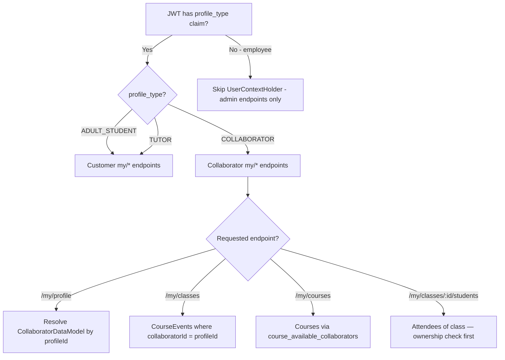
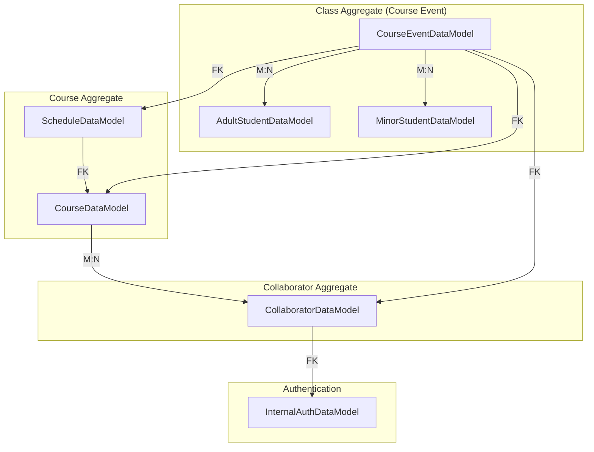
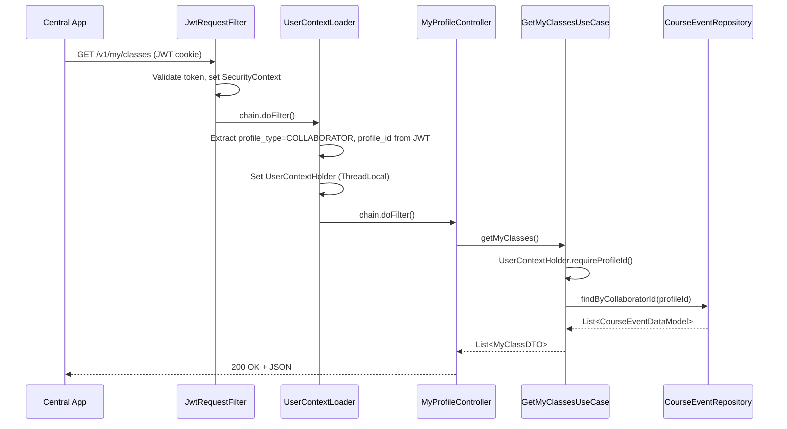
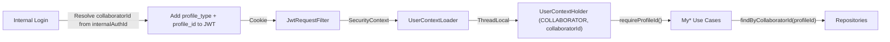
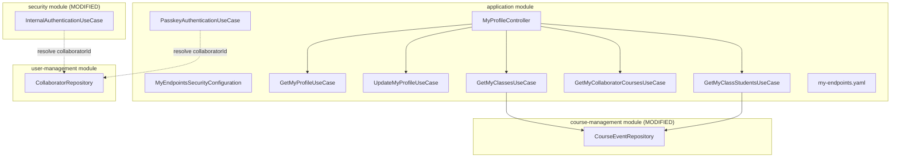
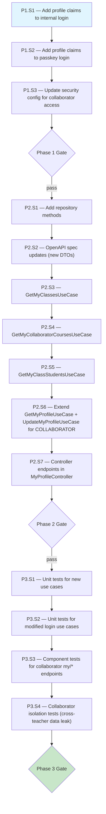
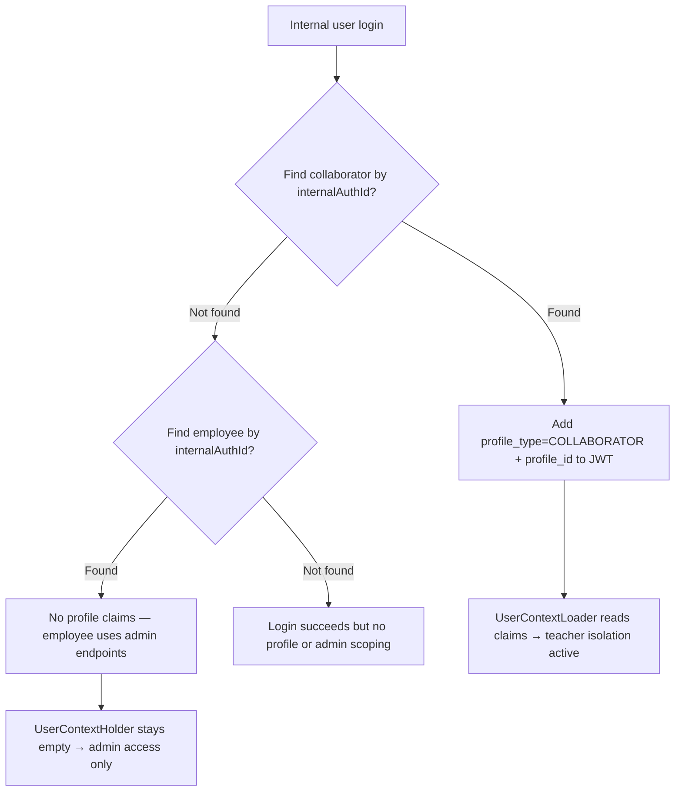

# Collaborator Isolation API — Workflow

> **Scope**: Server-enforced user-level data isolation for collaborator (teacher) endpoints
> **Project**: core-api
> **Dependencies**: security, user-management, course-management modules
> **Estimated Effort**: M

---

## 1. Summary

Collaborators (teachers) access the platform via akademia-plus-central (admin mobile app).
Currently, collaborator JWT tokens carry only `user_id` (internalAuthId) with no profile-level
scoping — they rely on admin endpoints that expose all tenant data. This workflow extends the
existing `UserContextHolder` isolation pattern to collaborators, adding `profile_type = COLLABORATOR`
and `profile_id = collaboratorId` claims to their JWT. New `/v1/my/*` endpoints let a teacher
see only their assigned classes (course events), their assigned courses (via
`course_available_collaborators`), and the students registered in those classes — never another
teacher's data.

### Terminology

| Term | Entity | Description |
|------|--------|-------------|
| **Course** | `CourseDataModel` | A course definition (e.g., "Piano 101") with schedules and available collaborators |
| **Class** | `CourseEventDataModel` | A specific instance of a course taking place — has a date, schedule, collaborator, and attendees |
| **Collaborator** | `CollaboratorDataModel` | A teacher/instructor assigned to classes and available for courses |

---

## 2. Design Decisions + Decision Tree

### Decisions

| # | Decision | Alternatives Considered | Rationale |
|---|----------|------------------------|-----------|
| 1 | Embed `profile_type=COLLABORATOR` + `profile_id=collaboratorId` in internal login JWT | Resolve collaboratorId on every request via `user_id` → `findByInternalAuthId` | Zero per-request DB lookup — matches the customer isolation pattern exactly |
| 2 | Reuse existing `UserContextHolder` + `UserContextLoader` — no changes needed | Create a separate `CollaboratorContextHolder` | The holder is already generic (profileType + profileId). UserContextLoader reads any JWT with these claims. No duplication. |
| 3 | Add new `/v1/my/*` endpoints for collaborator-specific views | Add collaboratorId filter to existing admin course-event endpoints | Clean separation: admin endpoints for admins, self-service endpoints for teachers. Same pattern as customer isolation. |
| 4 | Scope classes by `collaboratorId` FK on `course_events` | Scope by `course_available_collaborators` join table | `course_events.collaborator_id` is the authoritative assignment — a teacher is assigned to teach a specific class. `course_available_collaborators` defines eligibility, not assignment. |
| 5 | Scope courses via `course_available_collaborators` join table | Derive courses from assigned classes only | A teacher should see all courses they're available for (may not have a class yet). The join table is the correct scope. |
| 6 | Modify `InternalAuthenticationUseCase.login()` to embed profile claims | Add a post-login interceptor that enriches the JWT | Direct modification is simpler — the use case already has access to claims map. Need to add `CollaboratorRepository` dependency to resolve `collaboratorId` from `internalAuthId`. |
| 7 | Reuse `/v1/my/profile` for collaborators (extend `GetMyProfileUseCase`) | Create separate `/v1/my/collaborator-profile` | The profile endpoint already dispatches on `profileType`. Adding `COLLABORATOR` branch keeps the API surface minimal. |

### Decision Tree



---

## 3. Specification

### 3.1 JWT Claim Extensions for Collaborators

| Claim | Type | Set By | Value |
|-------|------|--------|-------|
| `profile_type` | String | InternalAuthenticationUseCase + PasskeyAuthenticationUseCase | `"COLLABORATOR"` |
| `profile_id` | Long | InternalAuthenticationUseCase + PasskeyAuthenticationUseCase | `collaboratorId` |

These claims are added alongside existing `user_id` and role claims. Employees do NOT get profile claims — only collaborators. The `UserContextLoader` filter (already deployed) will automatically read these into `UserContextHolder`.

### 3.2 New My Endpoints for Collaborators

All endpoints require role `COLLABORATOR` (or more precisely, internal user whose `profile_type = COLLABORATOR`). The `profile_id` is always derived from JWT, never from request params.

| Method | Path | Description | Isolation Key |
|--------|------|-------------|:-------------:|
| GET | `/v1/my/profile` | Get own collaborator profile | `collaboratorId` via composite PK |
| PUT | `/v1/my/profile` | Update own profile (name, phone, address) | `collaboratorId` via composite PK |
| GET | `/v1/my/classes` | List course events assigned to me | `course_events.collaborator_id = profileId` |
| GET | `/v1/my/courses` | List courses I'm available for | `course_available_collaborators.collaborator_id = profileId` |
| GET | `/v1/my/classes/{classId}/students` | List students in a specific class | ownership check: `courseEvent.collaboratorId == profileId` |

### 3.3 Security Configuration Update

The existing `MyEndpointsSecurityConfiguration` requires `CUSTOMER` role for `/v1/my/**`. This must be updated to allow both `CUSTOMER` and collaborator roles (internal users with `profile_type = COLLABORATOR`). Options:

- Split: `/v1/my/classes/**` and `/v1/my/courses` accessible to `COLLABORATOR` role; existing endpoints stay `CUSTOMER`-only
- Or: Allow both roles on `/v1/my/**` and let each use case validate the correct `profileType`

Decision: Each use case already validates `profileType` internally. Update security config to allow authenticated users with either `CUSTOMER` or the collaborator's internal role. The use cases enforce the correct profile type.

### 3.4 Query Specifications

**GET /v1/my/classes** (collaborator's assigned classes):
```sql
SELECT ce.* FROM course_events ce
WHERE ce.collaborator_id = :profileId
  AND ce.tenant_id = :tenantId
  AND ce.deleted_at IS NULL
```

**GET /v1/my/courses** (courses collaborator is available for):
```sql
SELECT c.* FROM courses c
JOIN course_available_collaborators cac
  ON c.tenant_id = cac.tenant_id AND c.course_id = cac.course_id
WHERE cac.collaborator_id = :profileId
  AND cac.tenant_id = :tenantId
  AND c.deleted_at IS NULL
```

**GET /v1/my/classes/{classId}/students** (students in a specific class):
```sql
-- First: verify courseEvent.collaboratorId == profileId (ownership check)
-- Then: return adult + minor attendees from join tables
SELECT ce.*, aa.*, ma.*
FROM course_events ce
LEFT JOIN course_event_adult_student_attendees ceasa ON ...
LEFT JOIN course_event_minor_student_attendees cemsa ON ...
WHERE ce.course_event_id = :classId
  AND ce.collaborator_id = :profileId
  AND ce.tenant_id = :tenantId
```

---

## 4. Domain Model

### 4.1 Aggregates



### 4.2 State Machine

No new state machines. Collaborator isolation is stateless — enforced per-request via JWT claims.

### 4.3 Domain Invariants

| # | Invariant | Enforced By | When |
|---|-----------|-------------|------|
| I1 | A collaborator can only see course events where they are the assigned teacher | GetMyClassesUseCase | GET /v1/my/classes |
| I2 | A collaborator can only see courses they are available for | GetMyCollaboratorCoursesUseCase | GET /v1/my/courses |
| I3 | A collaborator can only view students of a class they teach | GetMyClassStudentsUseCase | GET /v1/my/classes/{id}/students — ownership check |
| I4 | profile_id is derived from JWT claims — never from request params | UserContextHolder design | By construction |
| I5 | Employees (non-collaborator internal users) do NOT get profile claims | InternalAuthenticationUseCase | Login flow — only collaborators get claims |

### 4.4 Value Objects

No new value objects. Reuses existing `UserContext` record from customer isolation.

### 4.5 Domain Events

None — collaborator isolation is a request-scoped concern, not event-driven.

---

## 5. Architecture

### 5.1 Component Interaction Diagram



### 5.2 Data Flow Diagram



### 5.3 Module / Folder Structure

New and modified files:

```
security/
├── src/main/java/com/akademiaplus/internal/usecases/
│   └── InternalAuthenticationUseCase.java        ← MODIFIED (add profile claims)

application/
├── src/main/java/com/akademiaplus/
│   ├── config/
│   │   └── MyEndpointsSecurityConfiguration.java  ← MODIFIED (allow collaborator role)
│   ├── interfaceadapters/
│   │   └── MyProfileController.java               ← MODIFIED (add class/course endpoints)
│   └── usecases/my/
│       ├── GetMyProfileUseCase.java                ← MODIFIED (add COLLABORATOR branch)
│       ├── UpdateMyProfileUseCase.java             ← MODIFIED (add COLLABORATOR branch)
│       ├── GetMyClassesUseCase.java                ← NEW
│       ├── GetMyCollaboratorCoursesUseCase.java    ← NEW
│       └── GetMyClassStudentsUseCase.java          ← NEW
├── src/main/resources/openapi/
│   └── my-endpoints.yaml                           ← MODIFIED (add new DTOs)
├── src/test/java/com/akademiaplus/
│   ├── usecases/my/
│   │   ├── GetMyClassesUseCaseTest.java            ← NEW
│   │   ├── GetMyCollaboratorCoursesUseCaseTest.java ← NEW
│   │   └── GetMyClassStudentsUseCaseTest.java      ← NEW
│   └── usecases/
│       └── CollaboratorIsolationComponentTest.java ← NEW

course-management/
├── src/main/java/com/akademiaplus/event/interfaceadapters/
│   └── CourseEventRepository.java                  ← MODIFIED (add findByCollaboratorId)

application/ (passkey flow)
├── src/main/java/com/akademiaplus/passkey/usecases/
│   └── PasskeyAuthenticationUseCase.java           ← MODIFIED (add profile claims)
```

### 5.4 Integration Points

| System | Direction | Protocol | Purpose |
|--------|-----------|----------|---------|
| InternalAuthenticationUseCase | Modified | Method call | Resolve collaboratorId, add profile claims to JWT |
| PasskeyAuthenticationUseCase | Modified | Method call | Same — passkey login also needs profile claims |
| UserContextLoader | Unchanged | Servlet Filter | Already reads any profile_type/profile_id from JWT |
| UserContextHolder | Unchanged | ThreadLocal | Already stores any profile type + ID |
| CourseEventRepository | Modified | JPA | Add `findByCollaboratorId(Long)` query |
| CourseDataModel.availableCollaborators | Read | JPA | Traverse M:N for collaborator's courses |
| CollaboratorRepository | Read | JPA | Resolve collaboratorId from internalAuthId at login |

---

## 6. Element Relationship Graph



---

## 7. Implementation Dependency Graph



---

## 8. Infrastructure Changes

No infrastructure changes. No new services, databases, or Terraform modules.
The `course_events`, `course_available_collaborators`, and `collaborators` tables already exist.

---

## 9. Constraints & Prerequisites

### Prerequisites

- User isolation for customers complete (UserContextHolder, UserContextLoader deployed) — DONE
- Internal login flow operational (InternalAuthenticationUseCase, PasskeyAuthenticationUseCase)
- CourseEventDataModel has `collaboratorId` FK — DONE
- `course_available_collaborators` join table exists — DONE
- Docker (MariaDB Testcontainers) available for component tests

### Hard Rules

- profile_id MUST come from JWT claims — never from request parameters on /v1/my/* endpoints
- All existing admin endpoints remain unchanged — collaborator /v1/my/* is additive
- Only collaborators get profile claims — employees do NOT (they use admin endpoints)
- UserContextHolder MUST be cleared after each request (already ensured by UserContextLoader)
- Collaborator can ONLY see classes where `collaboratorId` matches — not all tenant classes

### Out of Scope

- Collaborator self-registration or onboarding flow
- Collaborator-to-collaborator messaging or scheduling
- Student visibility of their teacher's profile
- Grade/evaluation submission by collaborators (future feature)
- Attendance marking by collaborators (future feature)

---

## 9.5 Error & Edge Case Paths

### Processing Errors (by lifecycle step)

| Step | Error Condition | System Response | User Impact | Recovery Path |
|------|----------------|-----------------|-------------|---------------|
| Internal login | InternalAuthDataModel has no matching collaborator | JWT issued WITHOUT profile claims (treated as employee) | User sees admin view, not teacher view | Admin must link collaborator record to internal auth |
| UserContextLoader | JWT has profile_type=COLLABORATOR but no profile_id | Skip — UserContextHolder stays empty | Cannot access /v1/my/* endpoints | Re-login after admin fixes collaborator record |
| GET /my/classes | UserContextHolder empty | Return 401 Unauthorized | "Authentication required" | Re-login with collaborator account |
| GET /my/classes | Collaborator has no assigned classes | Return 200 with empty list | Empty state in app | Normal — new collaborator |
| GET /my/classes/{id}/students | classId not assigned to this collaborator | Return 404 Not Found | "Class not found" | Only access own classes |
| GET /my/courses | Collaborator not assigned to any courses | Return 200 with empty list | Empty state in app | Admin assigns courses |

### Boundary Condition: Employee vs Collaborator



---

## 10. Acceptance Criteria

### Build & Infrastructure

**AC1**: Given the full Maven reactor,
when `mvn clean install -DskipTests` runs,
then all modules compile without errors.

### Functional — Core Flow

**AC2**: Given a collaborator authenticated via internal login with `profile_type=COLLABORATOR`,
when `GET /v1/my/classes` is called,
then only course events where `collaboratorId` matches the authenticated collaborator are returned.

**AC3**: Given a collaborator authenticated via internal login,
when `GET /v1/my/courses` is called,
then only courses from `course_available_collaborators` for that collaborator are returned.

**AC4**: Given a collaborator authenticated via internal login,
when `GET /v1/my/classes/{classId}/students` is called for a class they teach,
then the attendees (adult + minor students) of that class are returned.

**AC5**: Given a collaborator authenticated via internal login,
when `GET /v1/my/profile` is called,
then the collaborator's own profile data (name, skills, PII) is returned.

### Functional — Edge Cases

**AC6**: Given collaborator A and collaborator B in the same tenant, each assigned to different classes,
when collaborator A calls `GET /v1/my/classes`,
then collaborator B's classes are NOT included in the response.

**AC7**: Given a collaborator,
when `GET /v1/my/classes/{classId}/students` is called for a class assigned to a DIFFERENT collaborator,
then the response is 404 Not Found.

**AC8**: Given an employee (non-collaborator internal user),
when any `/v1/my/*` endpoint is called,
then UserContextHolder is empty and the request returns 401 (no profile context).

### Security & Compliance

**AC9**: Given a collaborator JWT,
when the `profile_id` claim is tampered with,
then the JWT signature validation fails and the request returns 401.

**AC10**: Given a valid collaborator JWT,
when a request is made to any `/v1/my/*` endpoint,
then the server uses ONLY the `profile_id` from the JWT — no request parameter can override it.

### Quality Gates

**AC11 — Build**: Given all source files,
when `mvn clean install -DskipTests` runs,
then zero compilation errors.

### Testing

**AC12 — Unit Tests**: Given all new collaborator use cases,
when `mvn test -pl application` runs,
then all unit tests pass.

**AC13 — Component Tests**: Given Testcontainers MariaDB,
when `mvn verify -pl application` runs,
then all component tests for collaborator /v1/my/* endpoints pass.

**AC14 — Isolation Tests**: Given two collaborators in the same tenant assigned to different classes,
when collaborator A calls /v1/my/classes and collaborator B calls /v1/my/classes,
then each only sees their own data — zero cross-collaborator data leaks.

---

## 11. Execution Report Specification

The executor MUST produce a structured report per PROMPT-TEMPLATE.md §8.

---

## 12. Risk Matrix

### Risk Register

| # | Risk | Probability | Impact | Score | Mitigation |
|---|------|:-----------:|:------:|:-----:|------------|
| R1 | InternalAuthenticationUseCase gains new dependency (CollaboratorRepository) | Low | Low | G | Clean constructor injection, follows existing pattern |
| R2 | Employee login accidentally gets profile claims | Med | High | R | Check: only add claims when collaborator record is found. Employee = no collaborator record = no claims. Unit test covers this. |
| R3 | Existing internal auth tests break after adding CollaboratorRepository dependency | Med | Med | Y | Update test mocks for new dependency. Run full test suite. |
| R4 | Security config change allows unintended access to customer /v1/my/* endpoints | Med | High | R | Use case-level profileType validation as second gate. Component test verifies customer endpoints still require CUSTOMER. |
| R5 | CourseEventRepository.findByCollaboratorId returns events across tenants | Low | High | Y | Hibernate tenantFilter handles tenant scoping automatically. Integration test verifies. |

### Matrix

```
              |  Low Impact  |  Med Impact  |  High Impact  |
--------------+--------------+--------------+---------------+
 High Prob    |     Y        |     R        |      R        |
 Med Prob     |  G           |  R3 Y        |  R2,R4 R      |
 Low Prob     |  R1 G        |     Y        |   R5 Y        |
```

- G **Accept** — R1: monitor only
- Y **Mitigate** — R3, R5: update tests, verify tenant isolation
- R **Critical** — R2, R4: unit + component tests MUST verify employee exclusion and customer endpoint protection
