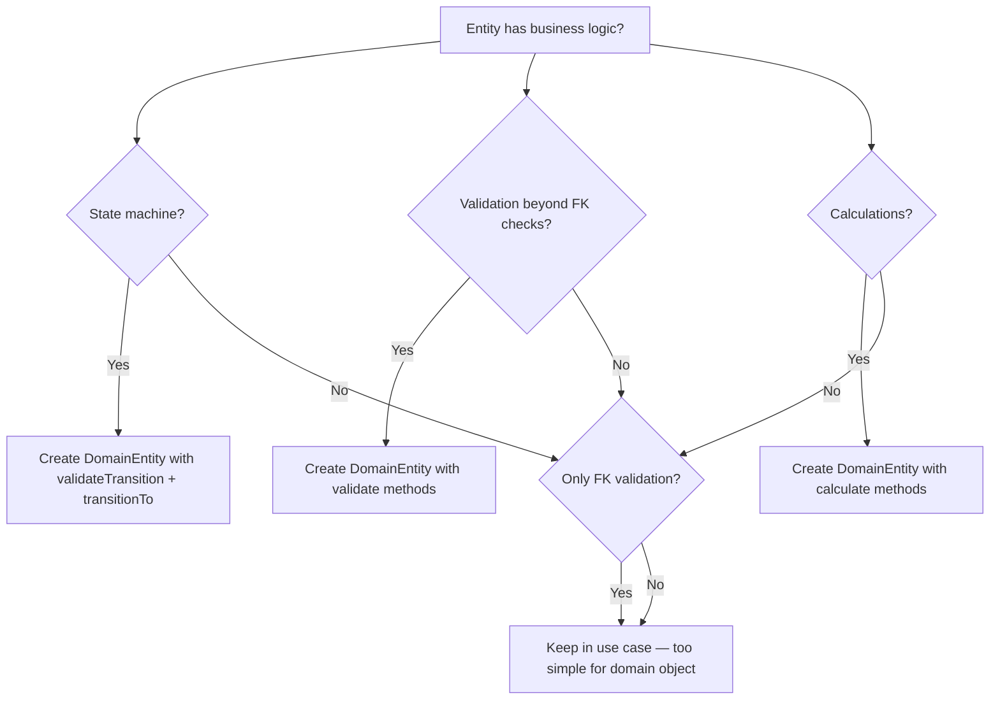
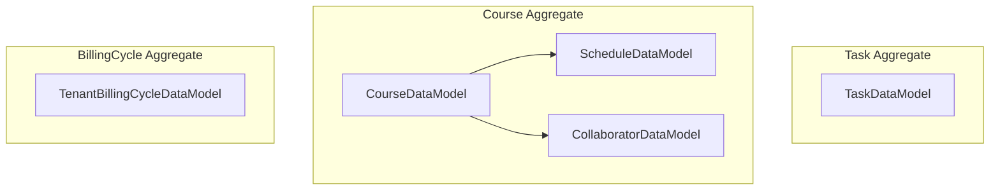
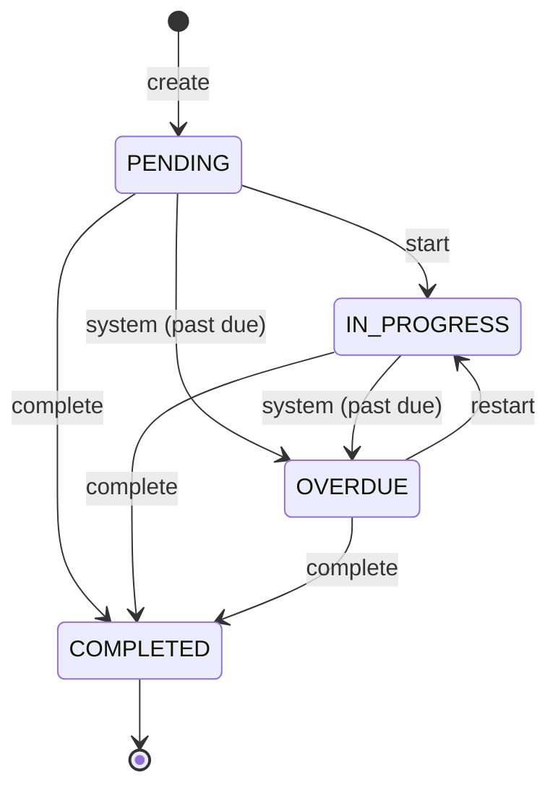
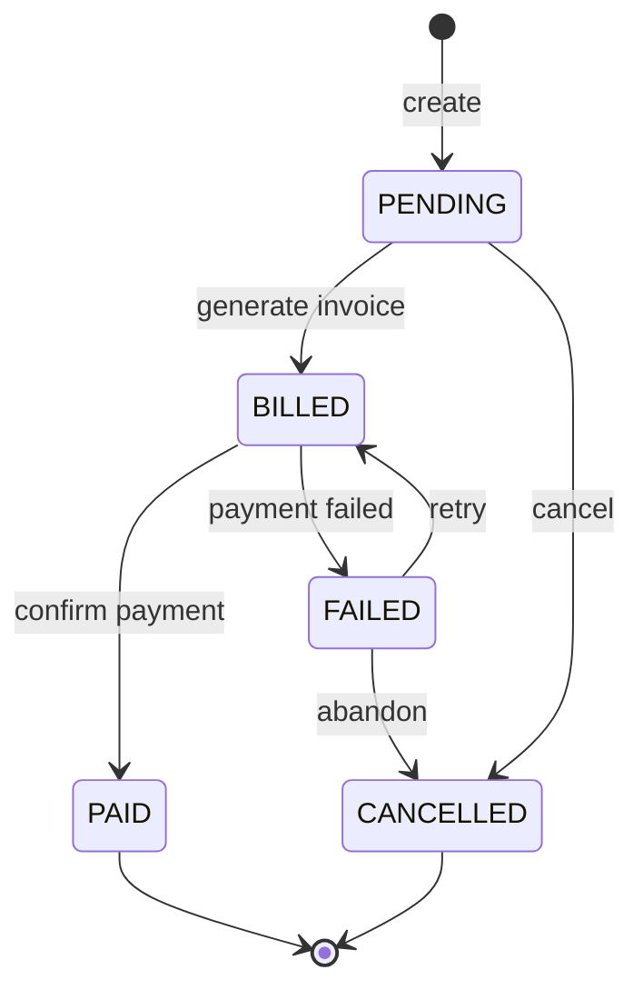
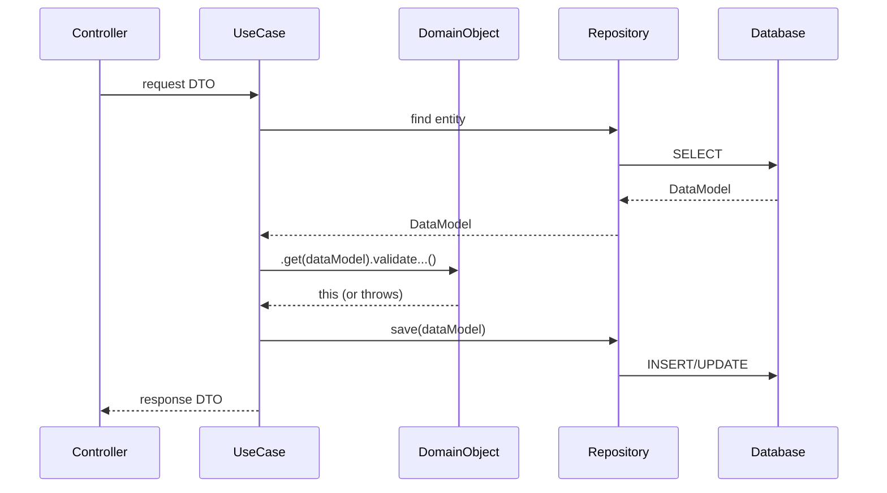
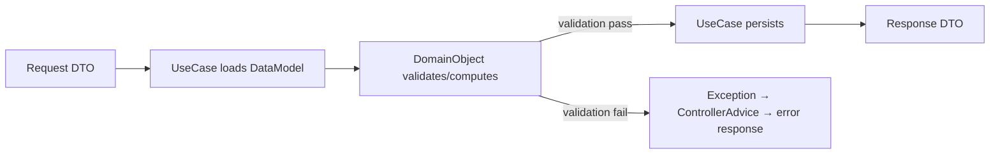
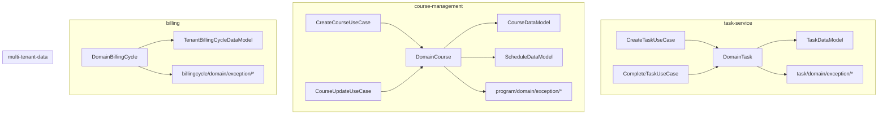
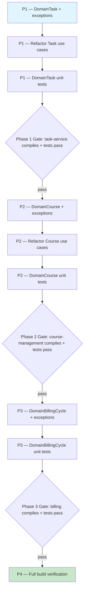
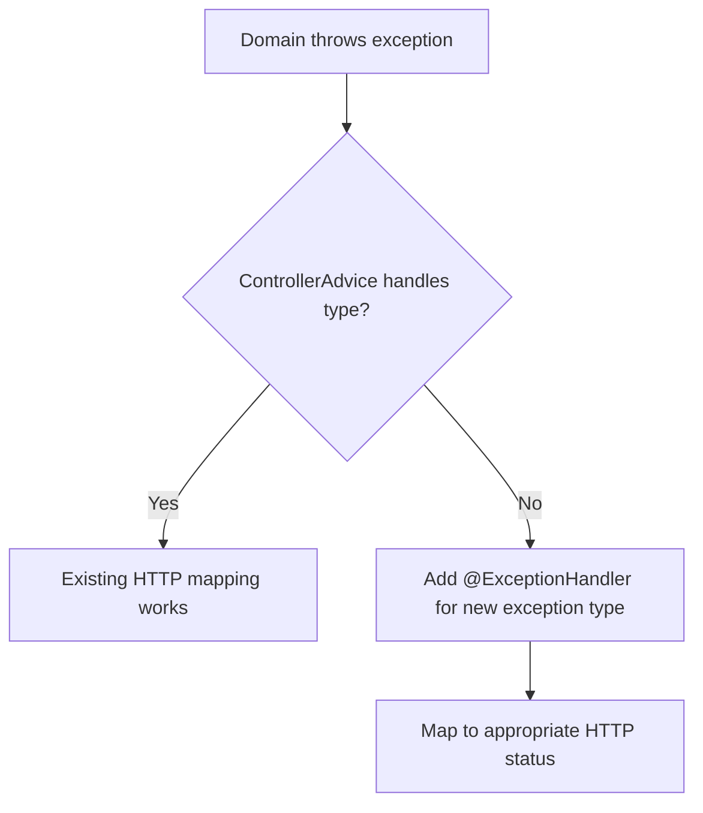

# Domain Object Pattern — Workflow

> **Scope**: Extract business logic from use case services into `Domain<Entity>` component beans
> **Project**: core-api
> **Dependencies**: None — pure refactoring, no new libraries
> **Estimated Effort**: M

---

## 1. Summary

Use case services across core-api contain scattered business logic — state machine transitions, validation chains, capacity checks, conflict detection — mixed with persistence orchestration. This workflow introduces `Domain<Entity>` Spring beans that encapsulate all business rules for entities with non-trivial logic, following the Domain Object Pattern documented in `knowledge-base/patterns/backend.md`.

The refactoring is incremental: one entity at a time, keeping existing tests as regression safety nets. CRUD-only entities remain anemic.

---

## 2. Design Decisions + Decision Tree

### Decisions

| # | Decision | Alternatives Considered | Rationale |
|---|----------|------------------------|-----------|
| D1 | `@Component` Spring beans, not pure Java | Pure Java with manual wiring | No practical benefit — Spring context is always available, constructor injection is simpler (D27 in decisions/log.md) |
| D2 | Domain objects in each module's `domain/` package | Separate `domain` module | Each module already has access to its own DTOs and DataModels. A separate module would need to import every module's DTOs — circular deps (D27) |
| D3 | No interface, no base class | `DomainApi<T>` interface | Methods are entity-specific. A generic interface would be either too generic or require per-entity inheritance chains (D27) |
| D4 | Exceptions in `domain/exception/` | Reuse `utilities/exceptions/` | Business rule exceptions are part of the domain, not generic infrastructure. Entity-specific exceptions belong next to the domain object that throws them |
| D5 | Fluent API with `.get(DataModel)` entry | Constructor parameter, setter | Fluent pattern enables validation chaining. `.get()` is reusable across calls since domain objects are singletons |
| D6 | Incremental migration — 3 entities in Phase 1-3 | Big-bang all entities | Lower risk, each phase independently verifiable. Remaining entities can follow in future prompts |

### Decision Tree



---

## 3. Specification

### 3.1 Domain Objects to Create

| Domain Object | Module | DataModel | Key Business Rules |
|--------------|--------|-----------|-------------------|
| `DomainTask` | task-service | `TaskDataModel` | State machine (PENDING→IN_PROGRESS→COMPLETED→OVERDUE), title validation, due date validation, completion timestamp |
| `DomainCourse` | course-management | `CourseDataModel` | Schedule conflict detection, collaborator reference validation, schedule reassignment rules |
| `DomainBillingCycle` | billing | `TenantBillingCycleDataModel` | State machine (PENDING→BILLED→PAID/FAILED/OVERDUE), transition guard, timestamp lifecycle |

### 3.2 Domain Exceptions to Create

| Exception | Module | Domain Object | Business Rule |
|-----------|--------|---------------|---------------|
| `InvalidTaskStateTransitionException` | task-service | DomainTask | Invalid status transition attempted |
| `TaskTitleRequiredException` | task-service | DomainTask | Blank or null title |
| `TaskDueDateInPastException` | task-service | DomainTask | Due date before today |
| `TaskAlreadyCompletedException` | task-service | DomainTask | Completing an already completed task |
| `ScheduleConflictException` | course-management | DomainCourse | Schedule already assigned to another course |
| `ScheduleNotFoundException` | course-management | DomainCourse | Referenced schedule does not exist |
| `CollaboratorNotFoundException` | course-management | DomainCourse | Referenced collaborator does not exist |
| `InvalidBillingTransitionException` | billing | DomainBillingCycle | Invalid billing status transition |
| `BillingCycleAlreadyClosedException` | billing | DomainBillingCycle | Operating on a PAID or CANCELLED cycle |

### 3.3 Use Cases to Refactor

| Use Case | Module | Current Logic to Extract | After Refactoring |
|----------|--------|------------------------|-------------------|
| `CreateTaskUseCase` | task-service | Title validation, due date validation, status init | `domainTask.get(dataModel).validateTitle().validateDueDate()` |
| `CompleteTaskUseCase` | task-service | State transition check, timestamp assignment | `domainTask.get(dataModel).complete()` → returns DTO |
| `UpdateTaskUseCase` | task-service | Field patching with nullable checks | Patching stays in use case (not domain logic) |
| `CourseUpdateUseCase` | course-management | Schedule reassignment, collaborator validation, conflict detection | `domainCourse.get(course).validateCollaborators(...).validateScheduleReassignment(...)` |
| `CreateCourseUseCase` | course-management | Collaborator validation | `domainCourse.get(course).validateCollaborators(...)` |
| *(BillingCycle use cases)* | billing | No existing use cases yet — BillingCycle entity exists but use cases are not yet implemented | Domain object created proactively for when billing use cases are built |

---

## 4. Domain Model

### 4.1 Aggregates



### 4.2 State Machine — Task



### 4.3 State Machine — BillingCycle

> Uses `BillingStatus` enum: PENDING, BILLED, PAID, FAILED, CANCELLED



### 4.4 Domain Invariants

| # | Invariant | Enforced By | When |
|---|-----------|-------------|------|
| I1 | Task title must not be blank | DomainTask.validateTitle() | Creation and update |
| I2 | Task due date must not be in the past | DomainTask.validateDueDate() | Creation |
| I3 | Completed tasks cannot be completed again | DomainTask.complete() | Status transition |
| I4 | Task status transitions must follow state machine | DomainTask.validateTransition() | Any status change |
| I5 | Schedules cannot be assigned to multiple courses | DomainCourse.validateScheduleReassignment() | Course update |
| I6 | All referenced collaborators must exist | DomainCourse.validateCollaborators() | Course create/update |
| I7 | BillingCycle transitions must follow state machine | DomainBillingCycle.validateTransition() | Any status change |
| I8 | PAID/CANCELLED billing cycles are terminal — no further transitions | DomainBillingCycle.validateTransition() | Any status change |

### 4.5 Value Objects

None — all domain state lives in existing DataModels and DTOs.

### 4.6 Domain Events

None in this iteration. Domain events can be added when notification triggers are needed.

---

## 5. Architecture

### 5.1 Component Interaction Diagram



### 5.2 Data Flow Diagram



### 5.3 Module / Folder Structure

```
task-service/
├── task/
│   ├── domain/
│   │   ├── DomainTask.java
│   │   └── exception/
│   │       ├── InvalidTaskStateTransitionException.java
│   │       ├── TaskTitleRequiredException.java
│   │       ├── TaskDueDateInPastException.java
│   │       └── TaskAlreadyCompletedException.java
│   ├── interfaceadapters/
│   │   ├── TaskController.java
│   │   └── TaskRepository.java
│   └── usecases/
│       ├── CreateTaskUseCase.java        ← refactored
│       ├── CompleteTaskUseCase.java       ← refactored
│       └── UpdateTaskUseCase.java        ← minimal change

course-management/
├── program/
│   ├── domain/
│   │   ├── DomainCourse.java
│   │   └── exception/
│   │       ├── ScheduleConflictException.java
│   │       ├── ScheduleNotFoundException.java
│   │       └── CollaboratorNotFoundException.java
│   ├── interfaceadapters/
│   └── usecases/
│       ├── CreateCourseUseCase.java       ← refactored
│       └── CourseUpdateUseCase.java       ← refactored

billing/
├── billingcycle/
│   ├── domain/
│   │   ├── DomainBillingCycle.java
│   │   └── exception/
│   │       ├── InvalidBillingTransitionException.java
│   │       └── BillingCycleAlreadyClosedException.java
│   ├── interfaceadapters/
│   └── usecases/
```

### 5.4 Integration Points

| System | Direction | Protocol | Purpose |
|--------|-----------|----------|---------|
| multi-tenant-data | In | Java import | DataModel classes consumed by domain objects |
| OpenAPI codegen | In | Generated | DTO classes produced by domain objects |
| ControllerAdvice | Out | Spring | Domain exceptions mapped to HTTP responses |

---

## 6. Element Relationship Graph



---

## 7. Implementation Dependency Graph



---

## 8. Infrastructure Changes

None. No new dependencies, no Docker changes, no config changes.

---

## 9. Constraints & Prerequisites

### Prerequisites

- core-api compiles: `mvn clean install -DskipTests`
- All existing tests pass: `mvn test`
- Pattern documented in `knowledge-base/patterns/backend.md`

### Hard Rules

- Domain objects are `@Component` beans — injectable via constructor
- Domain objects have ZERO I/O — no repository calls, no HTTP, no file access
- All business exceptions live in `domain/exception/` within the module
- Exception classes extend `RuntimeException`
- Existing API contracts (HTTP responses, status codes) MUST NOT change
- Existing tests MUST continue to pass — this is a refactoring, not a behavior change
- Copyright header on all new files
- Javadoc on all public classes and methods
- Constants extracted for all string literals

### Out of Scope

- User-management PII hashing logic (infrastructure concern, not domain logic)
- Notification enum conversion (too trivial for domain object)
- Payment processing (external API integration, not pure domain)
- New REST endpoints or API changes
- New component tests or E2E tests (existing ones serve as regression)
- Domain events or event sourcing

---

## 9.5 Error & Edge Case Paths

### Processing Errors (by lifecycle step)

| Step | Error Condition | System Response | User Impact | Recovery Path |
|------|----------------|-----------------|-------------|---------------|
| Domain validation | Business rule violated | Throw domain exception | Same HTTP error as before (via ControllerAdvice) | Fix input data |
| Use case refactoring | Existing test breaks | Compilation/test failure | None (pre-deployment) | Fix domain object or use case wiring |
| Exception migration | Old exception class removed before references updated | Compilation error | None (pre-deployment) | Keep old exception until all references migrated |

### Boundary Condition: Exception Mapping



---

## 10. Acceptance Criteria

### Build & Infrastructure

**AC1**: Given core-api source,
when `mvn clean install -DskipTests` runs,
then all modules compile successfully including new domain packages.

### Functional — Core Flow

**AC2**: Given a DomainTask with PENDING status,
when `.get(task).complete()` is called,
then it returns a DTO with status COMPLETED and completedAt set.

**AC3**: Given a DomainCourse with schedules,
when `.get(course).validateScheduleReassignment(newSchedules, existingSchedules)` is called with conflicting schedules,
then `ScheduleConflictException` is thrown.

**AC4**: Given a DomainBillingCycle with PENDING status,
when `.validateTransition("PAID")` is called,
then `InvalidBillingTransitionException` is thrown (PENDING→PAID is not valid).

### Functional — Edge Cases

**AC5**: Given a completed task,
when `domainTask.get(task).complete()` is called,
then `TaskAlreadyCompletedException` is thrown.

**AC6**: Given a PAID billing cycle,
when any transition is attempted,
then `BillingCycleAlreadyClosedException` is thrown.

### Security & Compliance

**AC7**: Given existing API contracts,
when domain objects are introduced,
then all HTTP responses, status codes, and error payloads remain identical.

### Quality Gates

**AC8 — Lint**: Given all source files,
when `mvn compile` runs with compiler warnings enabled,
then zero new warnings are introduced.

**AC9 — Architecture Rules**: Given ArchUnit test suite,
when architecture tests run,
then domain objects follow the layer rules (domain does not import interfaceadapters or usecases).

### Testing

**AC10 — Unit Tests**: Given all domain objects,
when `mvn test -pl task-service,course-management,billing` runs,
then all `Domain*Test.java` unit tests pass with >=80% line coverage.
Tests use `new Domain<Entity>()` (no Spring context), Given-When-Then format,
`shouldDoX_whenY()` naming, zero `any()` matchers.

**AC11 — Existing Tests**: Given all existing test suites,
when `mvn test` runs,
then zero regressions — all previously passing tests continue to pass.

---

## 11. Execution Report Specification

See `PROMPT-TEMPLATE.md` §8 for the standard report format.

The report must include:
- Before/After table: "business logic lines in use cases" vs "business logic lines in domain objects"
- Files Created table listing all new domain objects and exceptions
- Files Modified table listing all refactored use cases
- Deviation log for any use case where extraction was not straightforward
- Verification results for all three module builds

---

## 12. Risk Matrix

### Risk Register

| # | Risk | Probability | Impact | Score | Mitigation |
|---|------|:-----------:|:------:|:-----:|------------|
| R1 | Existing tests break after refactoring | Med | Med | Y | Run `mvn test` after each use case refactoring. Keep old exception types until all references migrated |
| R2 | ControllerAdvice doesn't handle new exception types | Low | Med | Y | Check ControllerAdvice for catch-all handlers. Add specific handlers only if needed |
| R3 | Domain object as singleton holds stale state between requests | Med | High | R | `.get()` must reassign `dataModel` field on every call. Add test verifying sequential `.get()` calls with different data |
| R4 | BillingCycle use cases don't exist yet — domain object is speculative | Low | Low | G | Pattern is proven by Task and Course phases. BillingCycle domain object is small and validates state machine only |
| R5 | Schedule conflict detection logic is complex to extract | Med | Med | Y | Read `CourseUpdateUseCase` thoroughly. Extract method by method, verifying compilation after each |

### Matrix

```
              |  Low Impact  |  Med Impact  |  High Impact  |
--------------+--------------+--------------+---------------+
 High Prob    |     Y        |     R        |      R        |
 Med Prob     |  G           |     Y        |      R        |
 Low Prob     |  G           |     Y        |      Y        |
```

- G **Accept** — monitor only (R4)
- Y **Mitigate** — implement countermeasure during development (R1, R2, R5)
- R **Critical** — must resolve before/during implementation (R3)
