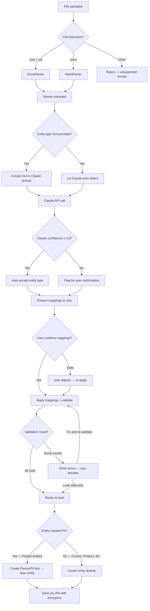
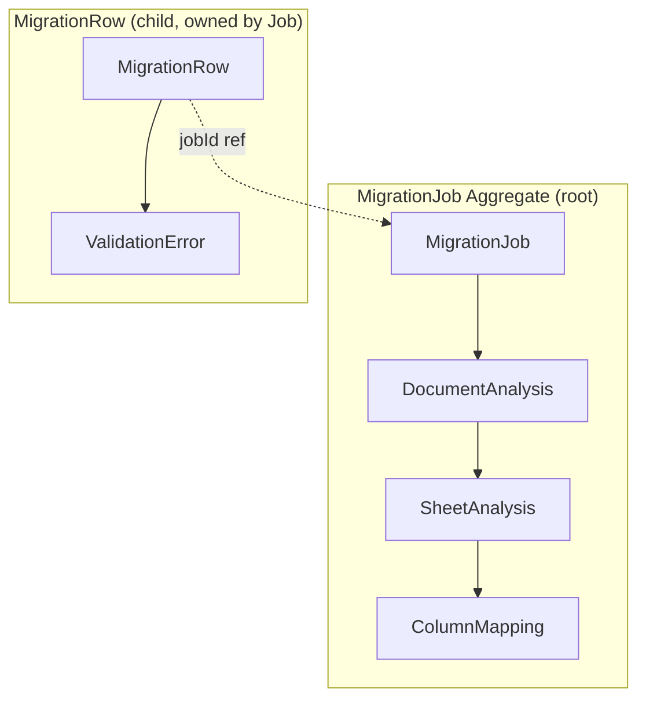
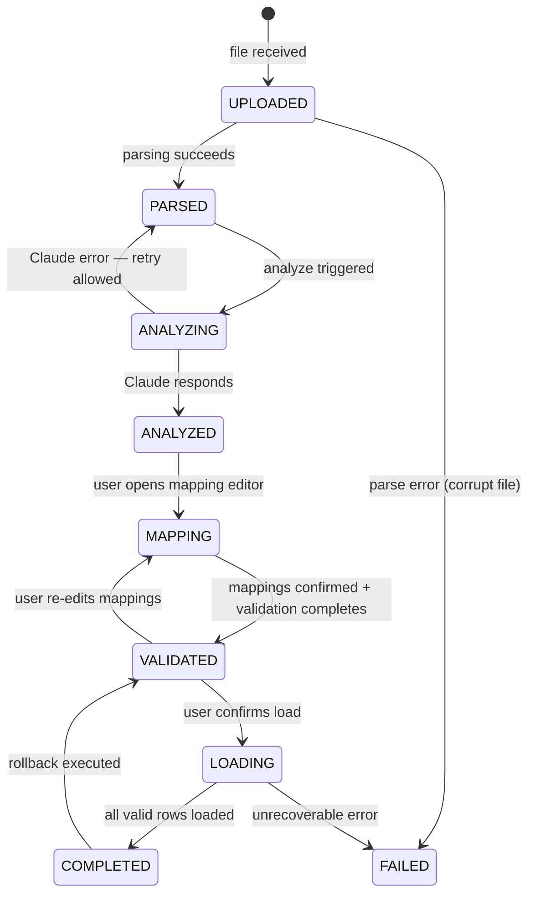
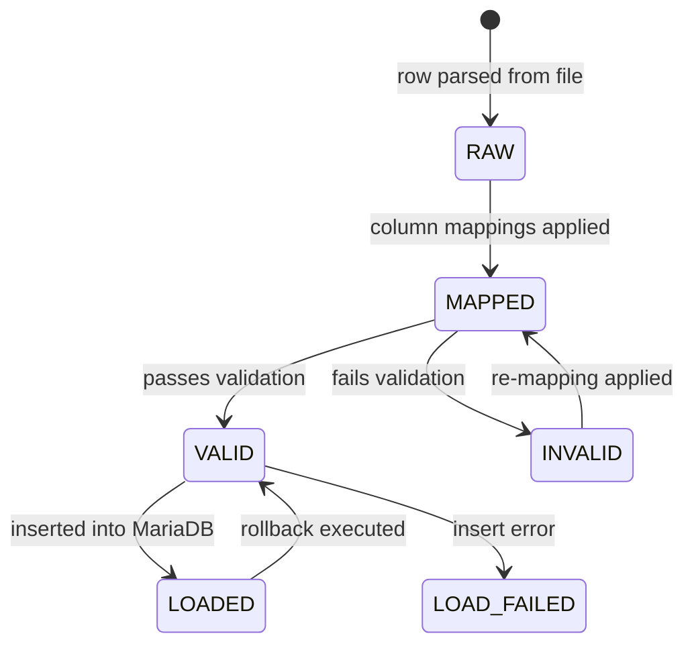
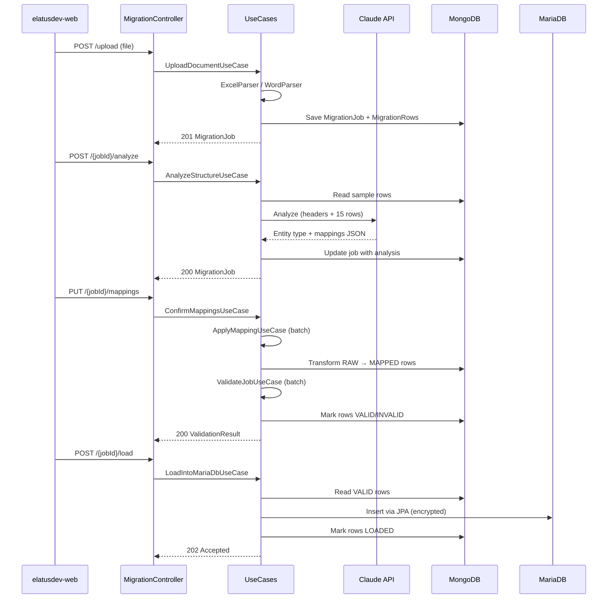
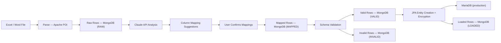
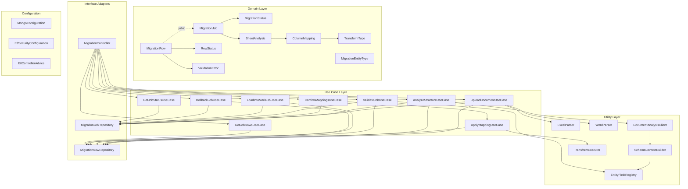
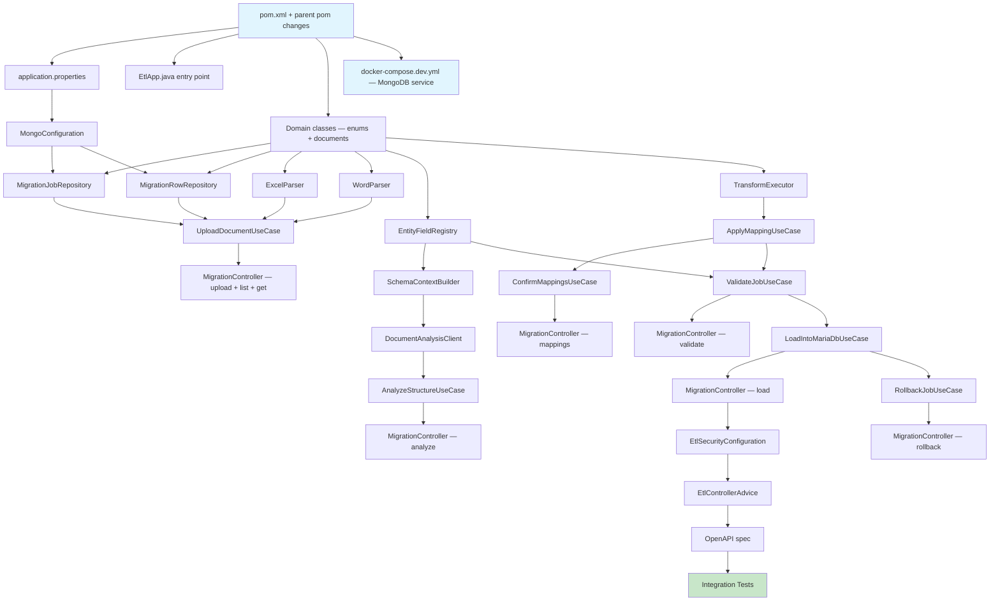
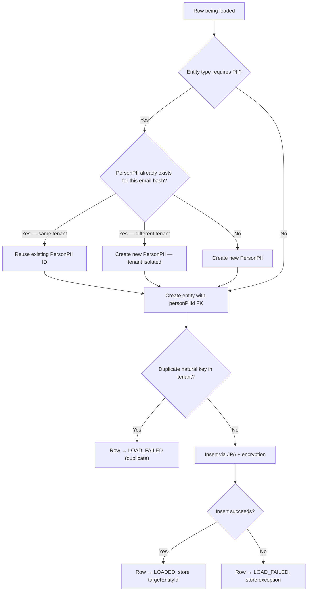
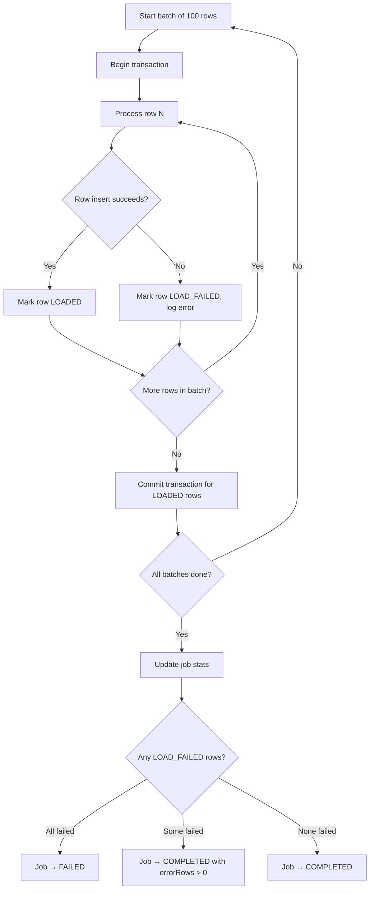

# ETL Service Module — Workflow

> **Scope**: New `etl-service` Maven module for client data migration
> **Project**: `core-api`
> **Dependencies**: Spring Data MongoDB, Apache POI, Anthropic Java SDK
> **Estimated Effort**: XL

---

## 1. Summary

New core-api module that ingests client data from Excel/Word files, uses Claude API
to auto-detect entity types and column mappings, stages data in MongoDB for progressive
enrichment, and loads validated rows into the platform's multi-tenant MariaDB schema.
Built as a core-api module (not standalone service) to reuse existing security, encryption,
and tenant infrastructure.

---

## 2. Design Decisions + Decision Tree

### Decisions

| # | Decision | Alternatives Considered | Rationale |
|---|----------|------------------------|-----------|
| 1 | MongoDB as staging DB | MariaDB temp tables, in-memory | Raw Excel data is semi-structured; MongoDB handles schema-less documents naturally while we enrich progressively |
| 2 | Claude API for document analysis | Heuristic column matching, manual-only mapping | Understands context, Spanish/English column names, compound fields ("Nombre Completo" → firstName + lastName), embedded Word tables |
| 3 | Core-api module (not standalone service) | Separate Spring Boot service | Reuses security filters, `StringEncryptor`, tenant infrastructure, JPA entities — no duplication |
| 4 | Row-level status tracking | Job-level only | Enables partial loads — valid rows proceed, invalid rows stay for correction |
| 5 | Apache POI for parsing | OpenCSV, EasyExcel | Handles both .xlsx and .docx, mature library, supports merged cells and formulas |

### Decision Tree



---

## 3. Specification

### 3.1 Supported Entity Types

| # | Entity Type | Module | Scoping | Key FK Dependencies | PII Required |
|---|------------|--------|---------|---------------------|:------------:|
| 1 | EMPLOYEE | user-management | Tenant-scoped | PersonPII | Yes |
| 2 | COLLABORATOR | user-management | Tenant-scoped | PersonPII | Yes |
| 3 | ADULT_STUDENT | user-management | Tenant-scoped | PersonPII | Yes |
| 4 | TUTOR | user-management | Tenant-scoped | PersonPII | Yes |
| 5 | MINOR_STUDENT | user-management | Tenant-scoped | PersonPII, Tutor | Yes |
| 6 | COURSE | course-management | Tenant-scoped | — | No |
| 7 | SCHEDULE | course-management | Tenant-scoped | Course | No |
| 8 | MEMBERSHIP | billing | Tenant-scoped | — | No |
| 9 | ENROLLMENT | billing | Tenant-scoped | Membership, Student | No |
| 10 | STORE_PRODUCT | pos-system | Tenant-scoped | — | No |

### 3.2 REST API Endpoints

| Method | Path | Description | Request | Response |
|--------|------|-------------|---------|----------|
| POST | `/v1/etl/migrations/upload` | Upload Excel/Word file | `multipart/form-data` (file + entityType hint) | `201` MigrationJob |
| POST | `/v1/etl/migrations/{jobId}/analyze` | Trigger Claude analysis | — | `200` MigrationJob with analysis |
| PUT | `/v1/etl/migrations/{jobId}/mappings` | Confirm/adjust column mappings | `ColumnMapping[]` | `200` MigrationJob |
| POST | `/v1/etl/migrations/{jobId}/validate` | Apply mappings + validate all rows | — | `200` ValidationResult |
| POST | `/v1/etl/migrations/{jobId}/load` | Execute final load into MariaDB | — | `202` Accepted (async) |
| DELETE | `/v1/etl/migrations/{jobId}/rollback` | Undo loaded rows | — | `200` RollbackResult |
| GET | `/v1/etl/migrations` | List jobs for tenant | `?status=&page=&size=` | `200` Page\<MigrationJob\> |
| GET | `/v1/etl/migrations/{jobId}` | Get job details + stats | — | `200` MigrationJob |
| GET | `/v1/etl/migrations/{jobId}/rows` | Paginated rows with filters | `?status=&page=&size=` | `200` Page\<MigrationRow\> |
| GET | `/v1/etl/migrations/entity-types` | List supported entity types + fields | — | `200` EntityType[] |

### 3.3 MongoDB Document Model

**Collection: `migration_jobs`**

```json
{
  "_id": "ObjectId",
  "tenantId": 1,
  "entityType": "ADULT_STUDENT",
  "sourceFileName": "alumnos-2025.xlsx",
  "sourceFileSize": 245760,
  "status": "ANALYZED",
  "totalRows": 150,
  "validRows": 142,
  "errorRows": 8,
  "loadedRows": 0,
  "documentAnalysis": {
    "model": "claude-haiku-4-5",
    "sheets": [
      {
        "sheetName": "Hoja 1",
        "detectedEntityType": "ADULT_STUDENT",
        "confidence": 0.92,
        "columnMappings": [
          { "source": "Nombre Completo", "target": "firstName+lastName", "transform": "SPLIT_NAME" },
          { "source": "Correo Electrónico", "target": "email", "transform": "NONE" }
        ],
        "warnings": ["Column 'Edad' found but schema uses birthdate"],
        "unmappedSourceColumns": ["Observaciones"],
        "missingRequiredFields": ["entryDate"]
      }
    ],
    "analyzedAt": "2026-03-09T10:30:00Z"
  },
  "confirmedMappings": {},
  "createdBy": "admin@academy.com",
  "createdAt": "2026-03-09T10:00:00Z",
  "updatedAt": "2026-03-09T10:30:00Z"
}
```

**Collection: `migration_rows`**

```json
{
  "_id": "ObjectId",
  "jobId": "ObjectId",
  "sheetName": "Hoja 1",
  "rowNumber": 3,
  "status": "VALID",
  "rawData": { "Nombre Completo": "Juan Pérez", "Correo Electrónico": "juan@mail.com" },
  "mappedData": { "firstName": "Juan", "lastName": "Pérez", "email": "juan@mail.com" },
  "validationErrors": [],
  "targetEntityId": null,
  "loadedAt": null
}
```

### 3.4 Claude API Prompt Structure

```
System: You are a data migration analyst for an educational platform.
Given the document structure below, identify what entity type each sheet/table
represents and suggest column mappings to our schema.

Our entity schemas:
{entityFieldDefinitions}

User: Analyze this document:
File: {fileName}
Sheets:
- Sheet "{sheetName}": headers={headers}, sample rows={first15Rows}

Return a JSON object with the structure: {responseSchema}
```

**Cost control**: Headers + 15 sample rows only, `claude-haiku-4-5` for simple sheets,
one call per upload, analysis cached in MigrationJob document.

---

## 4. Domain Model

### 4.1 Aggregates



**Transaction boundaries**:
- MigrationJob is the aggregate root — all status transitions go through it
- MigrationRows are bulk-operated (batch mapping, batch validation, batch load)
- Row operations update job stats (totalRows, validRows, errorRows, loadedRows)

### 4.2 State Machine — MigrationJob



### 4.3 State Machine — MigrationRow



### 4.4 Domain Invariants

| # | Invariant | Enforced By | When |
|---|-----------|-------------|------|
| I1 | Job cannot transition to LOADING unless `validRows > 0` | LoadIntoMariaDbUseCase | Before load starts |
| I2 | Row cannot be LOADED unless status is VALID | LoadIntoMariaDbUseCase | Per-row check |
| I3 | Rollback only available for COMPLETED jobs | RollbackJobUseCase | Before rollback |
| I4 | Confirmed mappings must cover all required target fields for the entity type | ConfirmMappingsUseCase | On mapping confirmation |
| I5 | One active job per file name per tenant (no duplicate uploads) | UploadDocumentUseCase | On upload |
| I6 | Job status transitions follow state machine — no skipping states | All use cases | Every transition |
| I7 | Row counts (totalRows, validRows, errorRows, loadedRows) must always sum correctly | All use cases modifying rows | After batch operations |
| I8 | PII fields must never be stored in plaintext in MariaDB | LoadIntoMariaDbUseCase | On entity creation |

### 4.5 Value Objects

| Value Object | Fields | Immutability | Equality |
|-------------|--------|:------------:|----------|
| ColumnMapping | source, target, transform | Immutable | By source + target |
| SheetAnalysis | sheetName, entityType, confidence, mappings, warnings | Immutable | By sheetName |
| ValidationError | field, message, severity | Immutable | By field + message |
| TransformType | enum: NONE, SPLIT_NAME, NORMALIZE_PHONE, DATE_FROM_AGE, UPPERCASE, LOWERCASE, TRIM | Immutable | By value |

### 4.6 Domain Events

| Event | Trigger | Consumers |
|-------|---------|-----------|
| JobParsed | File parsing completes | Updates job status + row counts |
| JobAnalyzed | Claude analysis completes | Stores analysis, updates status |
| MappingsConfirmed | User confirms mappings | Triggers batch mapping application |
| ValidationCompleted | All rows validated | Updates job stats (valid/error counts) |
| BatchLoaded | Batch of rows inserted into MariaDB | Updates loadedRows count |
| JobCompleted | All valid rows loaded | Final status update |
| JobRolledBack | Rollback completes | Resets row statuses, updates job stats |

---

## 5. Architecture

### 5.1 Component Interaction



### 5.2 Data Flow



### 5.3 Module Structure

```
etl-service/
├── pom.xml
└── src/
    ├── main/
    │   ├── java/com/akademiaplus/
    │   │   ├── EtlApp.java                              # Standalone entry point (port 8280)
    │   │   ├── config/
    │   │   │   ├── MongoConfiguration.java               # Connection + indexes
    │   │   │   ├── EtlControllerAdvice.java              # Error handling
    │   │   │   └── EtlSecurityConfiguration.java         # SecurityFilterChain
    │   │   ├── domain/
    │   │   │   ├── MigrationJob.java                     # @Document — aggregate root
    │   │   │   ├── MigrationRow.java                     # @Document — child entity
    │   │   │   ├── MigrationStatus.java                  # Enum: job lifecycle
    │   │   │   ├── RowStatus.java                        # Enum: row lifecycle
    │   │   │   ├── MigrationEntityType.java              # Enum: supported types
    │   │   │   ├── ColumnMapping.java                    # Value object
    │   │   │   ├── SheetAnalysis.java                    # Value object
    │   │   │   ├── ValidationError.java                  # Value object
    │   │   │   └── TransformType.java                    # Enum
    │   │   ├── interfaceadapters/
    │   │   │   ├── MigrationController.java              # REST endpoints
    │   │   │   ├── MigrationJobRepository.java           # Spring Data MongoDB
    │   │   │   └── MigrationRowRepository.java           # Spring Data MongoDB
    │   │   ├── usecases/
    │   │   │   ├── UploadDocumentUseCase.java
    │   │   │   ├── AnalyzeStructureUseCase.java
    │   │   │   ├── ConfirmMappingsUseCase.java
    │   │   │   ├── ApplyMappingUseCase.java
    │   │   │   ├── ValidateJobUseCase.java
    │   │   │   ├── LoadIntoMariaDbUseCase.java
    │   │   │   ├── GetJobStatusUseCase.java
    │   │   │   ├── GetJobRowsUseCase.java
    │   │   │   └── RollbackJobUseCase.java
    │   │   └── util/
    │   │       ├── ExcelParser.java
    │   │       ├── WordParser.java
    │   │       ├── DocumentAnalysisClient.java
    │   │       ├── SchemaContextBuilder.java
    │   │       ├── EntityFieldRegistry.java
    │   │       └── TransformExecutor.java
    │   └── resources/
    │       ├── application.properties
    │       └── openapi/
    │           └── etl-service-module.yaml
    └── test/
        └── java/com/akademiaplus/
```

### 5.4 Integration Points

| System | Direction | Protocol | Purpose |
|--------|-----------|----------|---------|
| MongoDB | Read/Write | Spring Data MongoDB | Staging: jobs + rows |
| Claude API | Outbound | HTTPS (Anthropic SDK) | Document structure analysis |
| MariaDB | Write | JPA/Hibernate | Final entity load with encryption |
| SecurityFilterChain | Inbound | HTTP | JWT auth on all endpoints |
| TenantContextHolder | Internal | ThreadLocal | Tenant isolation for MariaDB writes |
| StringEncryptor | Internal | JPA @Convert | PII field encryption |

---

## 6. Element Relationship Graph



---

## 7. Implementation Dependency Graph



---

## 8. Infrastructure Changes

### docker-compose.dev.yml

```yaml
mongodb:
  image: mongo:8.0
  ports:
    - "27017:27017"
  environment:
    MONGO_INITDB_DATABASE: etl_staging
  volumes:
    - mongodb_data:/data/db
```

### Parent pom.xml — dependencyManagement

```xml
<dependency>
    <groupId>org.springframework.boot</groupId>
    <artifactId>spring-boot-starter-data-mongodb</artifactId>
</dependency>
<dependency>
    <groupId>com.anthropic</groupId>
    <artifactId>anthropic-java</artifactId>
    <version>${anthropic-java.version}</version>
</dependency>
<dependency>
    <groupId>org.apache.poi</groupId>
    <artifactId>poi-ooxml</artifactId>
    <version>${apache-poi.version}</version>
</dependency>
```

### New Maven Profile

```xml
<profile>
    <id>etl-service</id>
    <modules>
        <module>etl-service</module>
        <module>multi-tenant-data</module>
        <module>utilities</module>
        <module>security</module>
        <module>infra-common</module>
        <module>user-management</module>
        <module>course-management</module>
        <module>billing</module>
        <module>pos-system</module>
        <module>tenant-management</module>
    </modules>
</profile>
```

### AWS (production)

- **Amazon DocumentDB** (MongoDB-compatible) — new Terraform module
- **Anthropic API key** — AWS Secrets Manager, referenced via Spring config

---

## 9. Constraints & Prerequisites

### Prerequisites

- MongoDB 8.0 running locally (via Docker Compose) or DocumentDB in production
- Valid Anthropic API key with access to claude-haiku-4-5
- All referenced modules (user-management, course-management, billing, pos-system) must compile
- Existing JPA entities and repositories for target entity types must exist

### Hard Rules

- All PII fields MUST go through existing JPA `@Convert(converter = StringEncryptor.class)` — never plaintext in MariaDB
- Every MongoDB document MUST include `tenantId` — no cross-tenant data leaks
- Every MariaDB operation MUST set `TenantContextHolder` before JPA calls
- Anthropic API key MUST come from environment variable / Secrets Manager — never hardcoded
- File uploads limited to 10 MB — enforced both client-side and server-side

### Out of Scope

- CSV file support (can be added later)
- Real-time progress via WebSocket/SSE (polling is sufficient for v1)
- Multi-file upload in single job (one file = one job)
- Automatic re-analysis after mapping edits (manual re-trigger required)
- PDF document parsing

---

## 9.5 Error & Edge Case Paths

### Processing Errors (by lifecycle step)

| Step | Error Condition | System Response | User Impact | Recovery Path |
|------|----------------|-----------------|-------------|---------------|
| Upload | File corrupt / unreadable | Job created → FAILED, error stored | `400` + error message | Re-upload |
| Upload | File > 10 MB | Reject before parsing | `400` + size limit message | Compress or split file |
| Upload | Duplicate file name for tenant | Reject | `409` + link to existing job | View existing or rename |
| Upload | Unsupported extension (.csv, .pdf) | Reject before processing | `400` + supported formats list | Convert to .xlsx or .docx |
| Upload | Sheet has 0 data rows (only headers) | Job → PARSED, totalRows=0 | Warning on analysis page | Re-upload correct file |
| Parse | Merged cells in Excel | Expand merged cells to repeated values | Transparent — rows appear duplicated | None needed |
| Parse | Mixed types in column (dates + text) | Coerce all to string | Warning in analysis | User verifies mapped data |
| Parse | Sheet has >10,000 rows | Accept, process in batches of 500 | Slower analysis (more sample rows not sent) | None needed |
| Analyze | Claude API timeout (>30s) | Job stays PARSED, error stored | "Analysis failed — retry" button | Manual retry |
| Analyze | Claude returns low confidence (<0.5) | Accept but flag as uncertain | Red warning: "Low confidence — verify entity type" | User must confirm type manually |
| Analyze | Claude returns unrecognized entity type | Map entityType to null | Entity type dropdown required | User selects from supported types |
| Analyze | Claude returns empty mappings | Store empty, flag | "No mappings detected — map manually" | User builds mappings from scratch |
| Analyze | Anthropic API key invalid/expired | Job stays PARSED, `403` error stored | "Analysis unavailable — configure API key" | Admin fixes key in config |
| Mapping | Required target field has no source mapped | Block validation transition | Red indicator on unmapped required fields | User must map or provide default |
| Mapping | SPLIT_NAME on single-word value | firstName = value, lastName = "" (empty) | Warning in validation | User accepts or edits |
| Mapping | NORMALIZE_PHONE on non-numeric string | Pass through unchanged, flag | Warning: "Could not normalize" | User fixes source data |
| Mapping | DATE_FROM_AGE on non-integer | Row → INVALID at validation | Error: "Cannot convert age to date" | User changes transform or fixes data |
| Validate | Required field empty after mapping | Row → INVALID | Error: "firstName is required" | Fix source data or adjust mapping |
| Validate | Email format invalid | Row → INVALID | Error: "Invalid email format" | Fix source data |
| Validate | Phone format unparseable | Row → INVALID | Error: "Cannot parse phone number" | Fix or skip phone field |
| Validate | FK reference not found (e.g., tutorId for MINOR_STUDENT) | Row → INVALID | Error: "Tutor ID X not found in tenant" | Load tutors first, then re-validate |
| Load | Duplicate entity (email hash already exists in tenant) | Row → LOAD_FAILED | Error: "Duplicate email" | Skip duplicate or rollback + fix |
| Load | DB connection lost mid-batch | Current batch rolls back, job → FAILED | Error with loaded count so far | Fix connection, re-load remaining VALID rows |
| Load | Encryption error on PII field | Row → LOAD_FAILED | Error: "Encryption failed for field X" | Investigate field value encoding |
| Load | Tenant sequence table missing for entity type | Batch fails, job → FAILED | Error: "Sequence not initialized" | Initialize tenant sequences first |
| Rollback | Entity modified after load (audit fields changed) | Soft-delete still applies | Warning: "Entity modified since import" | Manual review recommended |
| Rollback | Entity already soft-deleted | Skip row, mark VALID | No error — row was already cleaned | None needed |

### Boundary Condition: PII Entity Load



### Boundary Condition: Batch Load Failure



---

## 10. Acceptance Criteria

### Build & Infrastructure

**AC1**: Given the `etl-service` module pom.xml and parent pom.xml changes,
when `mvn compile -pl etl-service -am` runs,
then compilation succeeds with zero errors.

**AC2**: Given `docker-compose.dev.yml` with MongoDB service,
when `docker compose up mongodb` runs,
then MongoDB is accessible on port 27017
and the `etl_staging` database is created.

**AC3**: Given the etl-service Maven profile,
when `mvn spring-boot:run -pl etl-service` runs,
then the application starts on port 8280 and connects to MongoDB.

### Functional — Core Flow

**AC4**: Given a valid .xlsx file with one sheet of student data,
when uploaded via `POST /v1/etl/migrations/upload`,
then raw rows are stored in MongoDB with status `RAW`
and a MigrationJob is returned with status `PARSED`.

**AC5**: Given a parsed job,
when `POST /v1/etl/migrations/{jobId}/analyze` is called,
then Claude returns entity type detection + column mappings as structured JSON
and the job transitions to `ANALYZED` with analysis stored.

**AC6**: Given user-confirmed column mappings,
when `PUT /v1/etl/migrations/{jobId}/mappings` is called,
then all RAW rows are transformed to MAPPED using the confirmed mappings,
validated against schema constraints, and the job transitions to `VALIDATED`.

**AC7**: Given a validated job with `validRows > 0`,
when `POST /v1/etl/migrations/{jobId}/load` is called,
then valid rows are inserted into MariaDB via existing JPA entities with proper
encryption and tenant scoping, and loaded rows are marked `LOADED`.

### Functional — Edge Cases

**AC8**: Given a job with 100 valid rows and 10 invalid rows,
when load is triggered,
then 100 rows are loaded, 10 remain `INVALID`,
and the job completes with `loadedRows=100, errorRows=10`.

**AC9**: Given a completed job with loaded entities,
when `DELETE /v1/etl/migrations/{jobId}/rollback` is called,
then all loaded entities are soft-deleted from MariaDB,
rows reset to `VALID`, and the job returns to `VALIDATED`.

**AC10**: Given a .docx file with embedded tables,
when uploaded and analyzed,
then tables are extracted as sheets and Claude maps them correctly.

**AC11**: Given a corrupt or empty file,
when uploaded via POST,
then a `400 Bad Request` is returned with a descriptive error message.

### Security & Compliance

**AC12**: Given an unauthenticated request,
when any `/v1/etl/**` endpoint is called without a valid JWT,
then a `401 Unauthorized` response is returned.

**AC13**: Given mapped PII fields (email, phone, firstName, lastName),
when rows are loaded into MariaDB,
then all values are encrypted via existing JPA `@Convert` converters
and hash columns are populated for indexed lookups.

**AC14**: Given a tenant A admin,
when listing jobs via `GET /v1/etl/migrations`,
then only tenant A's jobs are returned — no cross-tenant leakage.

### Quality Gates

**AC15 — Lint**: Given all source files in etl-service,
when `mvn checkstyle:check -pl etl-service` runs,
then zero violations are reported.

**AC16 — SonarQube**: Given SonarCloud analysis on etl-service code,
when scan completes,
then zero new bugs, zero new vulnerabilities, zero new security hotspots,
and code coverage on new code ≥80%.

**AC17 — Dependency Audit**: Given all etl-service dependencies (including transitive),
when `mvn org.owasp:dependency-check-maven:check -pl etl-service` runs,
then zero HIGH or CRITICAL CVEs are reported.

**AC18 — Secret Scan**: Given all committed files in the etl-service branch,
when `gitleaks detect` runs,
then zero secrets are detected.

**AC19 — Architecture Rules**: Given ArchUnit test suite for etl-service,
when architecture tests run,
then no layer violations exist (controllers → usecases → repositories,
no circular dependencies, no domain → infrastructure imports).

### Testing

**AC20 — Unit Tests**: Given all use cases and utility classes,
when `mvn test -pl etl-service` runs,
then all unit tests pass with ≥80% line coverage on use case and utility layers.

**AC21 — Component Tests**: Given TestContainers (MongoDB + MariaDB),
when `mvn failsafe:integration-test -pl etl-service` runs,
then full-flow integration tests pass
(upload → analyze → map → validate → load → rollback).

**AC22 — API Contract**: Given the OpenAPI spec `etl-service-module.yaml`,
when contract validation runs against the live endpoints,
then all responses match declared schemas, status codes, and content types.

**AC23 — E2E Tests**: Given a running etl-service + seeded tenant in Docker Compose,
when the Newman E2E suite runs against `/v1/etl/**` endpoints,
then all requests pass with expected status codes and response structures.

---

## 11. Risk Matrix

### Risk Register

| # | Risk | Probability | Impact | Score | Mitigation |
|---|------|:-----------:|:------:|:-----:|------------|
| R1 | Claude API downtime or rate limit | Low | Medium | 🟡 | Graceful fallback to manual mapping; retry with backoff |
| R2 | PII stored in plaintext in MongoDB staging | Medium | High | 🔴 | DocumentDB encryption at rest; TTL cleanup (30 days); purge on job deletion |
| R3 | Large file causes OOM | Low | Medium | 🟡 | Stream-based POI parsing (SXSSF); 10 MB file size limit; reject early |
| R4 | Partial load leaves inconsistent MariaDB state | Medium | High | 🔴 | Transaction per batch; row-level status tracking; rollback capability |
| R5 | Claude returns wrong entity type or mappings | Medium | Low | 🟢 | User confirmation step required; confidence score displayed; easy to edit |
| R6 | MongoDB adds infra complexity | Low | Low | 🟢 | Staging-only; production data stays in MariaDB; DocumentDB is managed |
| R7 | Anthropic SDK version incompatibility | Low | Medium | 🟡 | Pin version in dependencyManagement; test on upgrade |
| R8 | Cross-tenant data leakage in MongoDB | Low | High | 🟡 | tenantId index on all collections; query filters enforced in repositories |

### Matrix

```
              │  Low Impact  │  Med Impact  │  High Impact  │
──────────────┼──────────────┼──────────────┼───────────────┤
 High Prob    │     🟡       │     🔴       │      🔴       │
 Med Prob     │  🟢 R5       │  🟡 R7       │  🔴 R2, R4    │
 Low Prob     │  🟢 R6       │  🟡 R1, R3   │  🟡 R8        │
```

- 🟢 **Accept** — monitor only
- 🟡 **Mitigate** — implement countermeasure during development
- 🔴 **Critical** — must resolve before/during implementation
