# Go & Web Missing API Endpoints — Workflow

> **Scope**: Add three missing endpoints for akademia-plus-go and akademia-plus-web: News Feed, Tenant Branding, and Public Store Catalog
> **Project**: platform-core-api
> **Dependencies**: notification-system module, tenant-management module, pos-system module, multi-tenant-data module
> **Estimated Effort**: M (3 small features, mostly reusing existing modules)

---

## 1. Summary

The core-api currently serves 100+ endpoints across 11 modules, but three frontend features remain unserviced: a news feed for school announcements (needed by both akademia-plus-go and akademia-plus-web), tenant branding configuration for dynamic theming (needed by akademia-plus-go), and a public-facing store catalog that excludes admin-sensitive fields (needed by akademia-plus-go). This workflow adds all three as lightweight extensions to existing modules — no new Maven modules are required. The key architectural choice is to build within existing module boundaries to minimize build complexity and leverage established patterns.

---

## 2. Design Decisions + Decision Tree

### Decisions

| # | Decision | Alternatives Considered | Rationale |
|---|----------|------------------------|-----------|
| D1 | **News Feed: Option B — dedicated entity** in notification-system module | Option A: filter existing notifications by category='NEWS' | News items have a distinct lifecycle (draft/published/archived), different fields (imageUrl, authorId, courseId), and are public-facing rather than user-targeted. Notifications are delivery-oriented with channels, priorities, and expiration — overloading them conflates two different domain concepts. Dedicated entity is cleaner and avoids polluting the notification query path |
| D2 | **Tenant Branding: new aggregate in tenant-management** module | Alternative: put in application module | Branding is tenant configuration — it belongs with tenant domain entities. The tenant-management module already owns TenantDataModel and can reference the same tenantId. Keeps the application module thin (assembly-only) |
| D3 | **Store Catalog: Option A — new endpoint in pos-system** with dedicated DTO | Option B: query parameter `?view=public` on existing endpoint | A separate endpoint (`/v1/store/catalog`) is more RESTful, easier to secure (no risk of leaking admin fields if the view param is omitted), and allows independent pagination/filtering without affecting the admin endpoint. The DTO projection is explicit rather than conditional |
| D4 | **News Feed entity in multi-tenant-data**, use cases in notification-system | Alternative: create a new news-feed module | The news feed is conceptually adjacent to notifications (school communications). Adding a new module increases Maven build complexity for a single entity. The notification-system module already handles school communications; a `newsfeed/` aggregate package keeps separation clean |
| D5 | **No Flyway — DDL managed via db_init scripts + Hibernate ddl-auto** | Alternative: introduce Flyway | Project uses `ddl-auto=update` for local/QA and `ddl-auto=validate` for prod with manual SQL scripts in `db_init_dev/` and `db_init_qa/`. Follow the existing pattern — add new tables to existing schema scripts and create JPA entities |

### Decision Tree

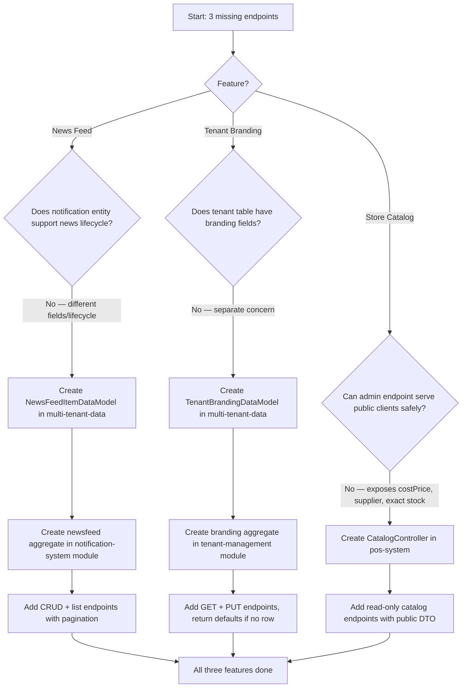

---

## 3. Specification

### 3.1 Domain Entities

#### NewsFeedItemDataModel

| Field | Type | Column | Constraints | Notes |
|-------|------|--------|-------------|-------|
| tenantId | Long | tenant_id | PK (composite), FK to tenants | Inherited from TenantScoped |
| newsFeedItemId | Long | news_feed_item_id | PK (composite) | Auto-generated per tenant |
| title | String | title | NOT NULL, max 200 | Display title |
| body | String | body | NOT NULL, TEXT | Rich content body |
| authorId | Long | author_id | NOT NULL | FK conceptual to employees/collaborators |
| courseId | Long | course_id | NULL | Optional course association |
| imageUrl | String | image_url | NULL, max 500 | Optional cover image |
| status | NewsFeedStatus | status | NOT NULL, max 20 | DRAFT, PUBLISHED, ARCHIVED |
| publishedAt | LocalDateTime | published_at | NULL | Set when status transitions to PUBLISHED |
| Auditable fields | — | created_at, updated_at | auto | Inherited from TenantScoped chain |
| SoftDeletable | — | deleted_at | NULL | Inherited — soft delete |

#### TenantBrandingDataModel

| Field | Type | Column | Constraints | Notes |
|-------|------|--------|-------------|-------|
| tenantId | Long | tenant_id | PK, FK to tenants | Single row per tenant — NOT composite key, tenantId IS the PK |
| schoolName | String | school_name | NOT NULL, max 200 | Display name (defaults to tenant.organizationName) |
| logoUrl | String | logo_url | NULL, max 500 | Logo image URL |
| primaryColor | String | primary_color | NOT NULL, max 7 | Hex color, default '#1976D2' (MUI blue) |
| secondaryColor | String | secondary_color | NOT NULL, max 7 | Hex color, default '#FF9800' |
| fontFamily | String | font_family | NULL, max 100 | CSS font family name |
| Auditable fields | — | created_at, updated_at | auto | Inherited |

> **Note**: TenantBrandingDataModel extends `Auditable` (not `TenantScoped`) because tenantId IS the primary key — it is the tenant definition's companion, similar to how TenantDataModel extends SoftDeletable rather than TenantScoped.

#### No new entity for Store Catalog

The catalog endpoint reads from the existing `store_products` table via `StoreProductDataModel`. A new DTO projection is created, not a new entity.

### 3.2 API Endpoints

#### News Feed (notification-system module)

| Method | Path | Auth | Description | Request | Response |
|--------|------|------|-------------|---------|----------|
| GET | `/v1/news-feed` | JWT (any role) | List published news items, paginated | Query: `courseId`, `page`, `size`, `sort` | 200: `Page<GetNewsFeedItemResponse>` |
| GET | `/v1/news-feed/{newsFeedItemId}` | JWT (any role) | Get single news item by ID | Path: newsFeedItemId | 200: `GetNewsFeedItemResponse`, 404 |
| POST | `/v1/news-feed` | JWT (ADMIN, PRINCIPAL) | Create a news item | Body: `NewsFeedItemCreationRequest` | 201: `NewsFeedItemCreationResponse` |
| PUT | `/v1/news-feed/{newsFeedItemId}` | JWT (ADMIN, PRINCIPAL) | Update a news item | Path + Body: `NewsFeedItemCreationRequest` | 200: `NewsFeedItemCreationResponse` |
| DELETE | `/v1/news-feed/{newsFeedItemId}` | JWT (ADMIN, PRINCIPAL) | Soft delete a news item | Path: newsFeedItemId | 204, 404, 409 |

#### Tenant Branding (tenant-management module)

| Method | Path | Auth | Description | Request | Response |
|--------|------|------|-------------|---------|----------|
| GET | `/v1/tenant/branding` | JWT (any role) | Get branding for current tenant | X-Tenant-Id header | 200: `GetTenantBrandingResponse` (returns defaults if no row) |
| PUT | `/v1/tenant/branding` | JWT (ADMIN) | Create or update branding | Body: `TenantBrandingUpdateRequest` | 200: `GetTenantBrandingResponse` |

#### Public Store Catalog (pos-system module)

| Method | Path | Auth | Description | Request | Response |
|--------|------|------|-------------|---------|----------|
| GET | `/v1/store/catalog` | JWT (any role) | List active products (public fields only) | Query: `category`, `page`, `size` | 200: `Page<GetCatalogItemResponse>` |
| GET | `/v1/store/catalog/{storeProductId}` | JWT (any role) | Get single product public details | Path: storeProductId | 200: `GetCatalogItemResponse`, 404 |

### 3.3 DTO Schemas

#### NewsFeedItemCreationRequest

```json
{
  "title": "string (required, max 200)",
  "body": "string (required)",
  "authorId": "integer (required, int64)",
  "courseId": "integer (optional, int64)",
  "imageUrl": "string (optional, max 500)",
  "status": "string (enum: DRAFT, PUBLISHED, ARCHIVED, default DRAFT)"
}
```

#### NewsFeedItemCreationResponse

```json
{
  "newsFeedItemId": "integer (int64)"
}
```

#### GetNewsFeedItemResponse

```json
{
  "newsFeedItemId": "integer (int64)",
  "title": "string",
  "body": "string",
  "authorId": "integer (int64)",
  "courseId": "integer (int64, nullable)",
  "imageUrl": "string (nullable)",
  "status": "string (enum)",
  "publishedAt": "string (date-time, nullable)",
  "createdAt": "string (date-time)",
  "updatedAt": "string (date-time)"
}
```

#### TenantBrandingUpdateRequest

```json
{
  "schoolName": "string (required, max 200)",
  "logoUrl": "string (optional, max 500)",
  "primaryColor": "string (required, max 7, regex: ^#[0-9A-Fa-f]{6}$)",
  "secondaryColor": "string (required, max 7, regex: ^#[0-9A-Fa-f]{6}$)",
  "fontFamily": "string (optional, max 100)"
}
```

#### GetTenantBrandingResponse

```json
{
  "schoolName": "string",
  "logoUrl": "string (nullable)",
  "primaryColor": "string",
  "secondaryColor": "string",
  "fontFamily": "string (nullable)",
  "updatedAt": "string (date-time)"
}
```

#### GetCatalogItemResponse

```json
{
  "storeProductId": "integer (int64)",
  "name": "string",
  "description": "string (nullable)",
  "price": "number (double)",
  "imageUrl": "string (nullable)",
  "category": "string (nullable)",
  "inStock": "boolean"
}
```

> **Note on StoreProductDataModel gap**: The existing `store_products` table lacks `image_url`, `category`, and `status` columns. Two columns (`image_url VARCHAR(500)`, `category VARCHAR(100)`) must be added to `StoreProductDataModel` and the DDL. The `inStock` field in the catalog DTO is derived: `stockQuantity > 0`. A `status` field is NOT added — the catalog endpoint uses `deleted_at IS NULL` (soft delete) to determine active products, consistent with the existing pattern.

---

## 4. Domain Model

### 4.1 Aggregates

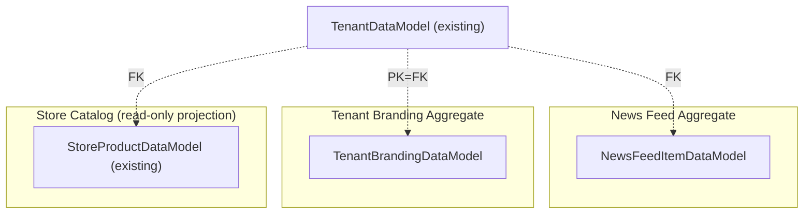

### 4.2 State Machine

#### NewsFeedItem Lifecycle

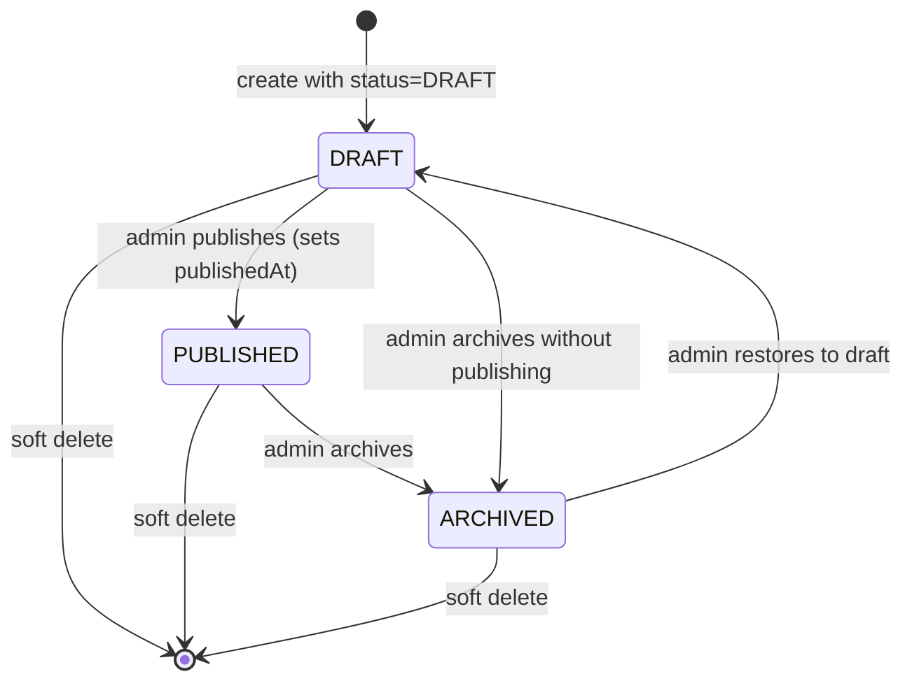

#### TenantBranding Lifecycle

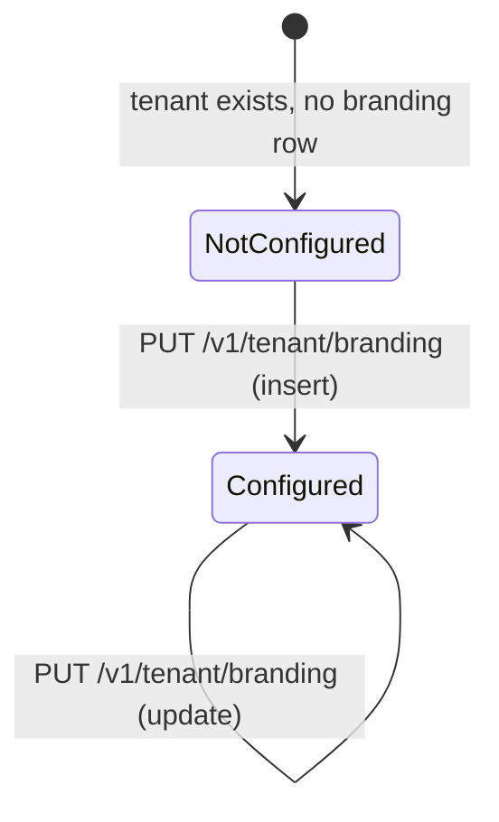

> No state machine for Store Catalog — it is a read-only projection of existing StoreProductDataModel.

### 4.3 Domain Invariants

| # | Invariant | Enforced By | When |
|---|-----------|-------------|------|
| I1 | NewsFeedItem.title must not be blank and <= 200 chars | OpenAPI validation + NewsFeedItemCreationUseCase | On create/update |
| I2 | NewsFeedItem.body must not be blank | OpenAPI validation + NewsFeedItemCreationUseCase | On create/update |
| I3 | NewsFeedItem.publishedAt is set only when status transitions to PUBLISHED | UpdateNewsFeedItemUseCase | On status change to PUBLISHED |
| I4 | NewsFeedItem.publishedAt is cleared if status reverts from PUBLISHED | UpdateNewsFeedItemUseCase | On status change from PUBLISHED to DRAFT |
| I5 | TenantBranding.primaryColor and secondaryColor must be valid hex (#RRGGBB) | OpenAPI regex pattern + TenantBrandingUpdateUseCase | On create/update |
| I6 | TenantBranding has at most one row per tenant (tenantId is PK) | Database PK constraint | On insert |
| I7 | GET /v1/tenant/branding returns defaults if no row exists | GetTenantBrandingUseCase | On read |
| I8 | Catalog endpoint only returns products where deleted_at IS NULL | Hibernate @SQLRestriction on StoreProductDataModel | On every query |
| I9 | Catalog DTO never exposes stockQuantity — only boolean inStock | CatalogController mapping logic | On response mapping |
| I10 | Public list endpoints (news-feed GET, catalog GET) filter by tenant from TenantContextHolder | Hibernate tenantFilter | On every query |

### 4.4 Value Objects

| Value Object | Fields | Immutability | Equality |
|-------------|--------|:------------:|----------|
| NewsFeedStatus | enum: DRAFT, PUBLISHED, ARCHIVED | Immutable (enum) | By name |
| HexColor | String value matching `^#[0-9A-Fa-f]{6}$` | Immutable (validated on construction) | By value |
| BrandingDefaults | static constants: DEFAULT_PRIMARY_COLOR, DEFAULT_SECONDARY_COLOR | Immutable (compile-time) | N/A |

### 4.5 Domain Events

| Event | Trigger | Consumers |
|-------|---------|-----------|
| NewsFeedItemPublished | Status changes to PUBLISHED | (Future) Push notification dispatch — not in scope |
| TenantBrandingUpdated | PUT /v1/tenant/branding | (Future) Cache invalidation — not in scope |

> Domain events are documented for future extensibility but NOT implemented in this workflow. No event bus or listener is created.

---

## 5. Architecture

### 5.1 Component Interaction Diagram

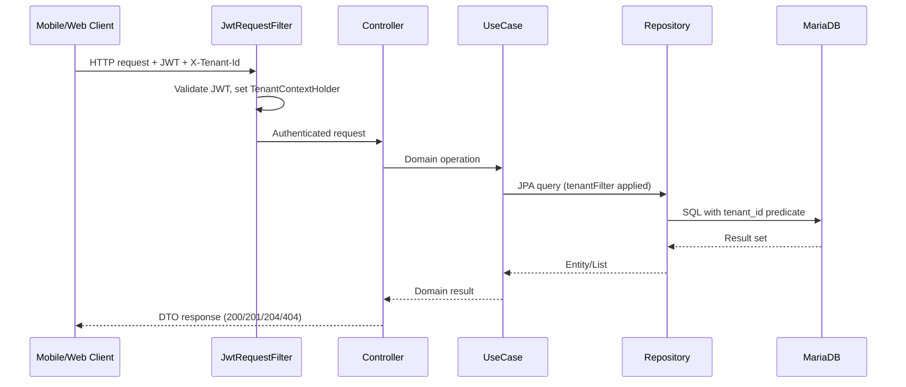

### 5.2 Data Flow Diagram

#### News Feed — List Published Items

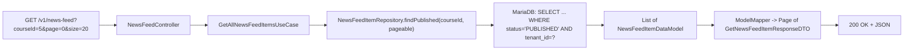

#### Tenant Branding — GET with Defaults Fallback

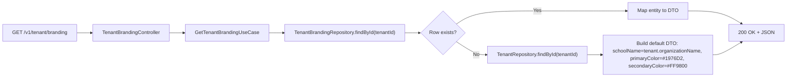

#### Store Catalog — Public Projection

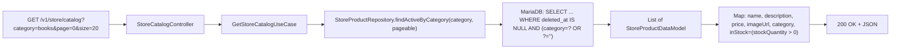

### 5.3 Module / Folder Structure

#### notification-system module (additions)

```
notification-system/
├── src/main/java/com/akademiaplus/
│   ├── newsfeed/
│   │   ├── interfaceadapters/
│   │   │   ├── NewsFeedItemController.java
│   │   │   └── NewsFeedItemRepository.java
│   │   └── usecases/
│   │       ├── NewsFeedItemCreationUseCase.java
│   │       ├── UpdateNewsFeedItemUseCase.java
│   │       ├── GetNewsFeedItemByIdUseCase.java
│   │       ├── GetAllNewsFeedItemsUseCase.java
│   │       └── DeleteNewsFeedItemUseCase.java
│   └── config/
│       └── (update existing NotificationModelMapperConfiguration or add NewsFeedModelMapperConfiguration)
└── src/main/resources/openapi/
    └── news-feed.yaml (new)
    └── notification-system-module.yaml (update to include news-feed paths)
```

#### tenant-management module (additions)

```
tenant-management/
├── src/main/java/com/akademiaplus/
│   ├── branding/
│   │   ├── interfaceadapters/
│   │   │   ├── TenantBrandingController.java
│   │   │   └── TenantBrandingRepository.java
│   │   └── usecases/
│   │       ├── GetTenantBrandingUseCase.java
│   │       └── TenantBrandingUpdateUseCase.java
│   └── config/
│       └── (update existing TenantModelMapperConfiguration or add BrandingModelMapperConfiguration)
└── src/main/resources/openapi/
    └── tenant-branding.yaml (new)
    └── tenant-management-module.yaml (update to include branding paths)
```

#### pos-system module (additions)

```
pos-system/
├── src/main/java/com/akademiaplus/
│   ├── store/
│   │   ├── interfaceadapters/
│   │   │   ├── StoreCatalogController.java (new)
│   │   │   └── StoreProductRepository.java (update — add catalog query methods)
│   │   └── usecases/
│   │       ├── GetStoreCatalogUseCase.java (new)
│   │       └── GetCatalogItemByIdUseCase.java (new)
│   └── config/
│       └── (update existing PosModelMapperConfiguration)
└── src/main/resources/openapi/
    └── store-catalog.yaml (new)
    └── pos-system-module.yaml (update to include catalog paths)
```

#### multi-tenant-data module (additions)

```
multi-tenant-data/
└── src/main/java/com/akademiaplus/
    ├── newsfeed/
    │   ├── NewsFeedItemDataModel.java
    │   └── NewsFeedStatus.java
    ├── tenancy/
    │   └── TenantBrandingDataModel.java
    └── billing/store/
        └── StoreProductDataModel.java (update — add imageUrl, category fields)
```

### 5.4 Integration Points

| System | Direction | Protocol | Purpose |
|--------|-----------|----------|---------|
| MariaDB | Both | JPA/Hibernate | Persistence for all three features |
| TenantContextHolder | In | Thread-local | Provides current tenantId for row-level isolation |
| JwtRequestFilter | In | HTTP Filter | Authenticates all requests, sets security context |
| ModelMapper | Internal | Java | Entity-to-DTO mapping |
| EntityIdAssigner | Internal | Hibernate event | Auto-generates IDs for new entities |

---

## 6. Element Relationship Graph

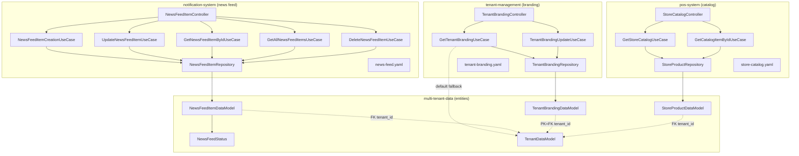

---

## 7. Implementation Dependency Graph

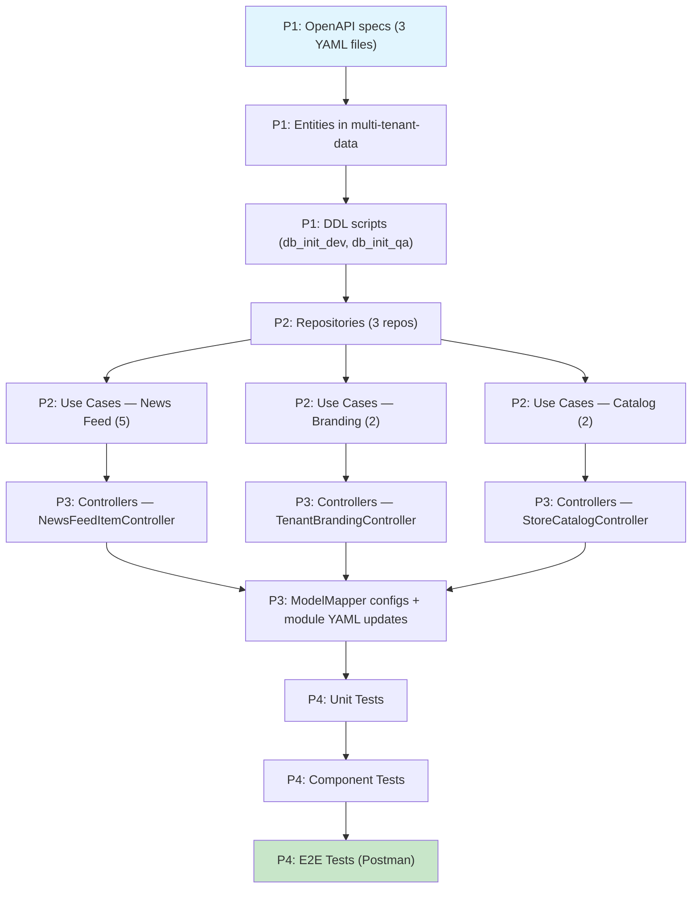

---

## 8. Infrastructure Changes

### 8.1 Database Schema Additions

Two new tables and two column additions to an existing table.

#### New table: `news_feed_items`

```sql
CREATE TABLE news_feed_items (
    tenant_id BIGINT NOT NULL,
    news_feed_item_id BIGINT NOT NULL,
    title VARCHAR(200) NOT NULL,
    body TEXT NOT NULL,
    author_id BIGINT NOT NULL,
    course_id BIGINT NULL,
    image_url VARCHAR(500) NULL,
    status VARCHAR(20) NOT NULL DEFAULT 'DRAFT',
    published_at TIMESTAMP NULL,
    created_at TIMESTAMP DEFAULT CURRENT_TIMESTAMP,
    updated_at TIMESTAMP DEFAULT CURRENT_TIMESTAMP ON UPDATE CURRENT_TIMESTAMP,
    deleted_at TIMESTAMP NULL,
    PRIMARY KEY (tenant_id, news_feed_item_id),
    FOREIGN KEY (tenant_id) REFERENCES tenants(tenant_id),
    INDEX idx_newsfeed_tenant_status (tenant_id, status, deleted_at),
    INDEX idx_newsfeed_tenant_course (tenant_id, course_id, deleted_at),
    INDEX idx_newsfeed_tenant_published (tenant_id, published_at DESC, deleted_at),
    INDEX idx_newsfeed_tenant_author (tenant_id, author_id, deleted_at)
);
```

#### New table: `tenant_branding`

```sql
CREATE TABLE tenant_branding (
    tenant_id BIGINT NOT NULL,
    school_name VARCHAR(200) NOT NULL,
    logo_url VARCHAR(500) NULL,
    primary_color VARCHAR(7) NOT NULL DEFAULT '#1976D2',
    secondary_color VARCHAR(7) NOT NULL DEFAULT '#FF9800',
    font_family VARCHAR(100) NULL,
    created_at TIMESTAMP DEFAULT CURRENT_TIMESTAMP,
    updated_at TIMESTAMP DEFAULT CURRENT_TIMESTAMP ON UPDATE CURRENT_TIMESTAMP,
    PRIMARY KEY (tenant_id),
    FOREIGN KEY (tenant_id) REFERENCES tenants(tenant_id)
);
```

#### Alter table: `store_products` (add columns)

```sql
ALTER TABLE store_products
    ADD COLUMN image_url VARCHAR(500) NULL AFTER description,
    ADD COLUMN category VARCHAR(100) NULL AFTER image_url;

CREATE INDEX idx_store_product_category ON store_products (tenant_id, category, deleted_at);
```

### 8.2 Entity ID Registration

Register `NewsFeedItemDataModel` in `EntityIdAssigner` so that per-tenant sequential IDs are generated via the `tenant_sequences` table. TenantBrandingDataModel does NOT need registration — its PK is the tenantId itself (no composite key, no sequence needed).

### 8.3 No New Maven Dependencies

All three features use existing Spring Boot starters, JPA, ModelMapper, and OpenAPI codegen already present in the modules.

---

## 9. Constraints & Prerequisites

### Prerequisites

- core-api builds cleanly: `mvn clean install -DskipTests`
- MariaDB dev instance is running (for component tests)
- Existing OpenAPI codegen plugin is configured in notification-system, tenant-management, and pos-system modules
- `EntityIdAssigner` supports registration of new entity names (it does — it reads from `tenant_sequences` table)

### Hard Rules

- **Multi-tenancy**: All new entities MUST have tenant_id in composite key (except TenantBranding where tenantId IS the PK). Hibernate tenantFilter MUST be enabled on all queries
- **Soft delete**: New entities extending TenantScoped get soft delete automatically via `@SQLDelete` and `@SQLRestriction`
- **OpenAPI-first**: YAML specs written and codegen run BEFORE writing controllers
- **Constants**: All string literals (error messages, default values) as `public static final` constants
- **Testing**: Given-When-Then, `shouldDoX_whenY()`, zero `any()` matchers, `@Nested` + `@DisplayName`
- **Copyright header**: Required on ALL new Java files
- **IDs**: Always `Long`, never `Integer`
- **No AI attribution**: No `Co-Authored-By` or `Generated with` in commit messages
- **Javadoc**: Required on all public classes, methods, and constants
- **Methods**: < 20 lines, cyclomatic complexity < 10

### Out of Scope

- Push notification dispatch when news items are published (future enhancement)
- Image upload/storage for news items or logos (URLs are provided externally, e.g., S3 presigned URLs)
- Cache invalidation for branding (no Redis cache layer for branding in this workflow)
- Full-text search on news feed body
- Store product categories management (CRUD for categories — category is a simple string field for now)
- Admin endpoint for managing news feed analytics (views, clicks)
- Internationalization of news feed content
- Frontend integration (akademia-plus-go and akademia-plus-web consume these endpoints independently)

---

## 9.5 Error & Edge Case Paths

### Processing Errors (by lifecycle step)

| Step | Error Condition | System Response | User Impact | Recovery Path |
|------|----------------|-----------------|-------------|---------------|
| POST /v1/news-feed | Title or body blank | 400 + VALIDATION_ERROR | Client shows validation message | Fix input and retry |
| POST /v1/news-feed | authorId refers to non-existent user | 201 (no FK check — authorId is logical) | News item created with unknown author | Admin corrects via PUT |
| GET /v1/news-feed/{id} | ID does not exist or is soft-deleted | 404 + ENTITY_NOT_FOUND | Client shows "not found" message | N/A |
| PUT /v1/news-feed/{id} | Entity is soft-deleted | 404 + ENTITY_NOT_FOUND | Client shows "not found" message | N/A |
| DELETE /v1/news-feed/{id} | Already soft-deleted | 404 + ENTITY_NOT_FOUND | Client shows "not found" message | N/A |
| GET /v1/tenant/branding | No branding row exists | 200 with default values | Client receives defaults — transparent | N/A |
| PUT /v1/tenant/branding | Invalid hex color format | 400 + VALIDATION_ERROR | Client shows validation message | Fix color and retry |
| PUT /v1/tenant/branding | First PUT for tenant (no existing row) | Upsert — INSERT new row, return 200 | Transparent to client | N/A |
| GET /v1/store/catalog | No active products | 200 with empty page | Client shows "no products available" | Admin adds products |
| GET /v1/store/catalog/{id} | Product is soft-deleted | 404 + ENTITY_NOT_FOUND | Client shows "product not found" | N/A |
| Any endpoint | Missing/invalid JWT | 401 + UNAUTHORIZED | Client redirects to login | Re-authenticate |
| Any endpoint | Missing X-Tenant-Id header | 400 + BAD_REQUEST | Client shows error | Fix tenant header |
| Any endpoint | Database connection failure | 500 + INTERNAL_SERVER_ERROR | Client shows generic error | Retry after DB recovery |

### Boundary Condition: Tenant Branding Upsert

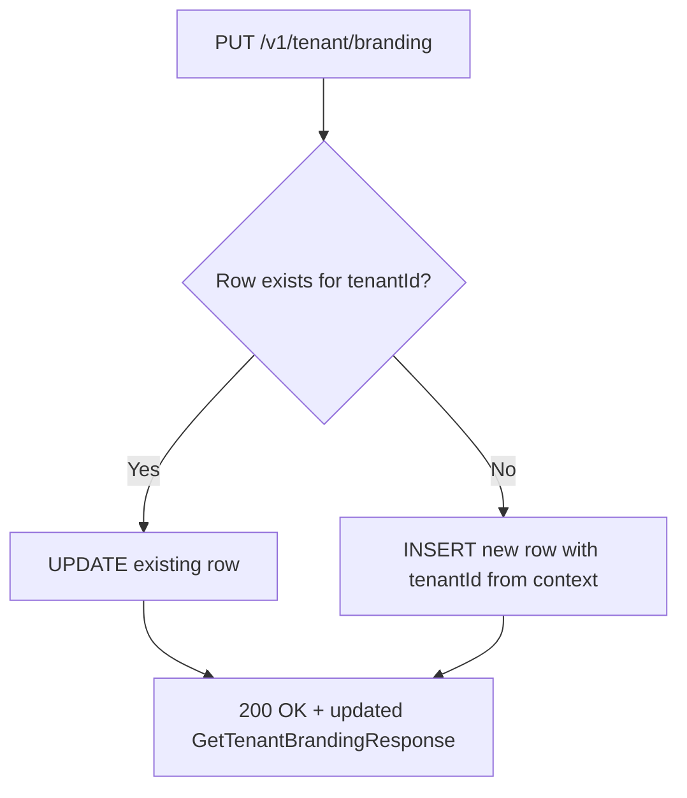

### Boundary Condition: News Feed Status Transition

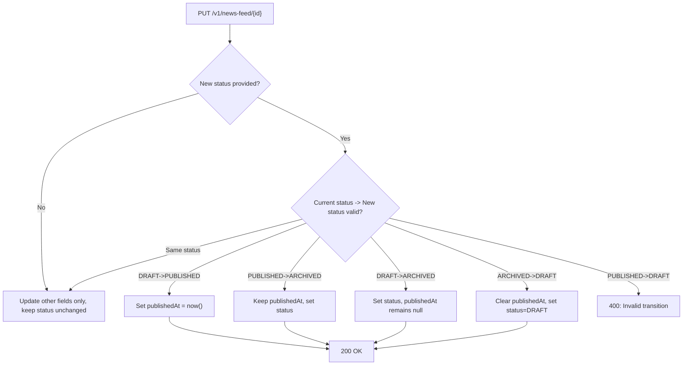

### Boundary Condition: Catalog Stock Boolean Derivation

```mermaid
flowchart TD
    A["StoreProductDataModel.stockQuantity"] --> B{stockQuantity > 0?}
    B -->|Yes| C["inStock = true"]
    B -->|No (0 or negative)| D["inStock = false"]
    C --> E["Include in GetCatalogItemResponse"]
    D --> E
```

---

## 10. Acceptance Criteria

### Build & Infrastructure

**AC1**: Given the three new OpenAPI YAML specs and updated module YAML files,
when `mvn clean install -DskipTests` runs,
then the project compiles with zero errors and DTOs are generated in `target/generated-sources/openapi`.

**AC2**: Given the new DDL statements added to `db_init_dev/00-schema.sql` and `db_init_qa/00-schema.sql`,
when the MariaDB dev container starts with the init scripts,
then tables `news_feed_items` and `tenant_branding` are created, and `store_products` has the new `image_url` and `category` columns.

### Functional — Core Flow

**AC3**: Given a JWT-authenticated request with valid X-Tenant-Id,
when `POST /v1/news-feed` is called with valid title, body, and authorId,
then a 201 response is returned with the generated newsFeedItemId.

**AC4**: Given published news items exist for the current tenant,
when `GET /v1/news-feed?page=0&size=20` is called,
then a 200 response is returned with a paginated list of published items sorted by publishedAt DESC.

**AC5**: Given a JWT-authenticated request with valid X-Tenant-Id and no branding row exists,
when `GET /v1/tenant/branding` is called,
then a 200 response is returned with default values (schoolName from tenant.organizationName, primaryColor=#1976D2, secondaryColor=#FF9800).

**AC6**: Given a JWT-authenticated ADMIN request,
when `PUT /v1/tenant/branding` is called with valid branding data,
then the branding is upserted and a 200 response is returned with the saved values.

**AC7**: Given active store products exist for the current tenant,
when `GET /v1/store/catalog` is called,
then a 200 response is returned with products containing only public fields (no costPrice, no exact stockQuantity — only inStock boolean).

**AC8**: Given a soft-deleted store product,
when `GET /v1/store/catalog/{id}` is called with that product's ID,
then a 404 response is returned.

### Functional — Edge Cases

**AC9**: Given a news feed item with status=PUBLISHED,
when `PUT /v1/news-feed/{id}` attempts to set status=DRAFT,
then a 400 response with error code INVALID_STATUS_TRANSITION is returned.

**AC10**: Given no news feed items exist for the current tenant,
when `GET /v1/news-feed` is called,
then a 200 response with an empty page (content: [], totalElements: 0) is returned.

**AC11**: Given a tenant branding PUT with primaryColor='INVALID',
when the request is processed,
then a 400 response with VALIDATION_ERROR is returned.

### Security & Compliance

**AC12**: Given an unauthenticated request (no JWT),
when any of the three new endpoints is called,
then a 401 response is returned.

**AC13**: Given a non-ADMIN user JWT,
when `POST /v1/news-feed` or `PUT /v1/tenant/branding` is called,
then a 403 response is returned.

**AC14**: Given tenant A's JWT,
when querying news feed, branding, or catalog,
then only tenant A's data is returned — zero leakage from tenant B.

### Quality Gates

**AC15 — Lint**: Given all source files,
when lint runs,
then zero violations are reported.

**AC16 — SonarQube**: Given SonarCloud analysis,
when scan completes on new/changed code,
then zero new bugs, zero new vulnerabilities, zero security hotspots,
and code coverage on new code >= 80%.

**AC17 — Secret Scan**: Given all committed files,
when `gitleaks detect` runs against the branch,
then zero secrets are detected.

**AC18 — Architecture Rules**: Given ArchUnit test suite,
when architecture tests run,
then no layer violations or circular dependencies exist.

### Testing

**AC19 — Unit Tests**: Given all new use cases, controllers, and mapping logic,
when `mvn test -pl notification-system,tenant-management,pos-system` runs,
then all `*Test.java` unit tests pass with >= 80% line coverage,
and every test verifies both state and structural interactions per AI-CODE-REF.md SS4.4.

**AC20 — Component Tests**: Given TestContainers infrastructure,
when `mvn verify -pl notification-system,tenant-management,pos-system` runs,
then all `*ComponentTest.java` tests pass with full Spring context + real DB,
covering CRUD + every exception path.

**AC21 — API Contract**: Given the three new OpenAPI specs,
when contract validation runs against live endpoints,
then all responses match declared schemas, status codes, and content types.

**AC22 — E2E Tests**: Given a running system with seeded data,
when Newman runs the updated Postman collection,
then every new endpoint asserts exact HTTP status code, Content-Type application/json,
response time < 200ms, all DTO fields with correct types,
and the 9 mandatory scenarios per entity (Create 201, Create dup 409, GetById 200, GetById 404, GetAll 200, Delete 204, Delete 404, Delete 409, GetById post-delete 404).

---

## 11. Execution Report Specification

> The executor MUST produce a structured report upon completion (or abort).

### Report Structure

#### Part 1 — Narrative (for the user)

| Section | Content |
|---------|---------|
| **What Was Done** | 3-5 sentence summary: what core-api served before, what it serves now (news feed, branding, catalog), and how it enables the go and web frontends |
| **Before / After** | Table: endpoints (100+ to 109+), modules with new aggregates (0 to 3), new tables (0 to 2), altered tables (0 to 1) |
| **Work Completed — Feature Map** | Mermaid graph showing: OpenAPI specs, entities, DDL, repositories, use cases, controllers, config, unit tests, component tests, E2E tests — grouped by phase, color-coded by status |
| **What This Enables** | akademia-plus-go can now display the Home news feed, apply school branding dynamically, and show the store catalog. akademia-plus-web can display the news feed on its home page |
| **What's Still Missing** | Push notifications on news publish, image upload, branding cache, catalog categories CRUD, analytics |

#### Part 2 — Technical Detail (for the retrospective)

| Section | Content |
|---------|---------|
| **Result** | COMPLETED / PARTIAL / ABORTED |
| **Metrics** | Total steps, passed, failed, skipped, phases completed |
| **Files Created** | Table: every new Java file, YAML file, SQL change, test file with path and purpose |
| **Files Modified** | Table: every modified file with summary of changes |
| **Dependencies Added** | None expected — all use existing deps |
| **Deviations** | Any step where actual diverged from plan |
| **Verification** | Final `mvn clean install`, `mvn verify`, `newman run` output |
| **Known Issues** | Any issues found but not fixed |
| **Acceptance Criteria** | AC1-AC22 final status |

---

## 12. Risk Matrix

### Risk Register

| # | Risk | Probability | Impact | Score | Mitigation |
|---|------|:-----------:|:------:|:-----:|------------|
| R1 | OpenAPI codegen plugin config not set up for news-feed.yaml or store-catalog.yaml | Med | Med | Y | Check existing pom.xml codegen config and replicate for new YAML files before starting |
| R2 | StoreProductDataModel ALTER TABLE breaks existing admin endpoint tests | Low | High | Y | Run existing pos-system tests immediately after entity change; new nullable columns should not break |
| R3 | TenantBranding upsert race condition (two concurrent PUTs) | Low | Low | G | Database PK constraint prevents duplicate inserts; second concurrent INSERT fails and retries as UPDATE |
| R4 | EntityIdAssigner not recognizing NewsFeedItemDataModel entity name | Med | Med | Y | Register entity name in tenant_sequences seed data and verify EntityIdAssigner scans the new package |
| R5 | news-feed.yaml path collides with existing notification paths in aggregated module YAML | Low | Med | Y | Use distinct path prefix `/news-feed` which does not overlap with `/notifications` |
| R6 | ModelMapper misconfigures mapping for new DTOs (field name mismatch) | Med | Low | G | Write explicit ModelMapper type maps in configuration class; verify with unit tests |
| R7 | Published news feed items returned to non-auth users | Low | High | Y | Verify JwtRequestFilter covers `/v1/news-feed/**` path; check module SecurityConfiguration |
| R8 | store_products ALTER TABLE fails on existing data in QA/prod | Low | Med | Y | New columns are nullable with no defaults — ALTER TABLE is safe on existing rows |

### Matrix

```
              |  Low Impact  |  Med Impact  |  High Impact  |
--------------+--------------+--------------+---------------+
 High Prob    |              |              |               |
 Med Prob     |  R6          |  R1, R4      |               |
 Low Prob     |  R3          |  R5, R8      |  R2, R7       |
```

- G **Accept** — R3, R6: monitor only
- Y **Mitigate** — R1, R4, R5, R7, R8: implement countermeasure during development
- R **Critical** — none identified
