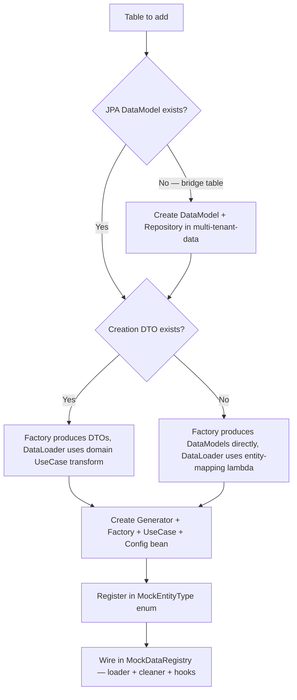
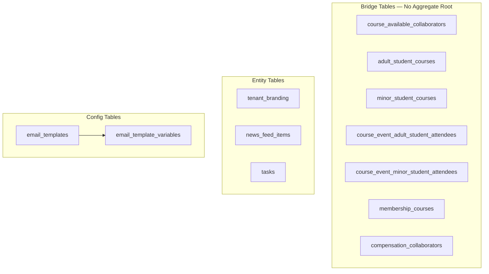
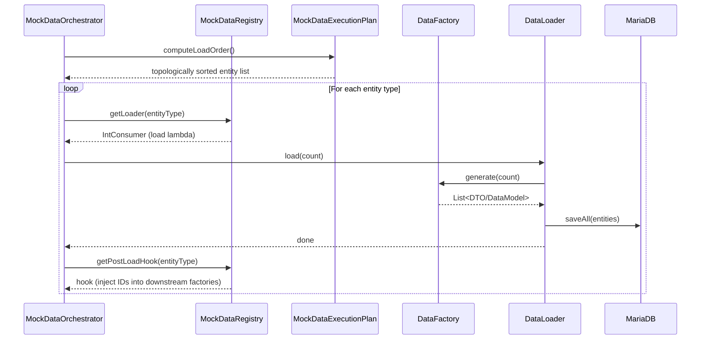
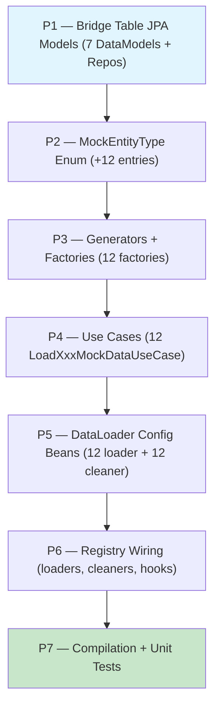
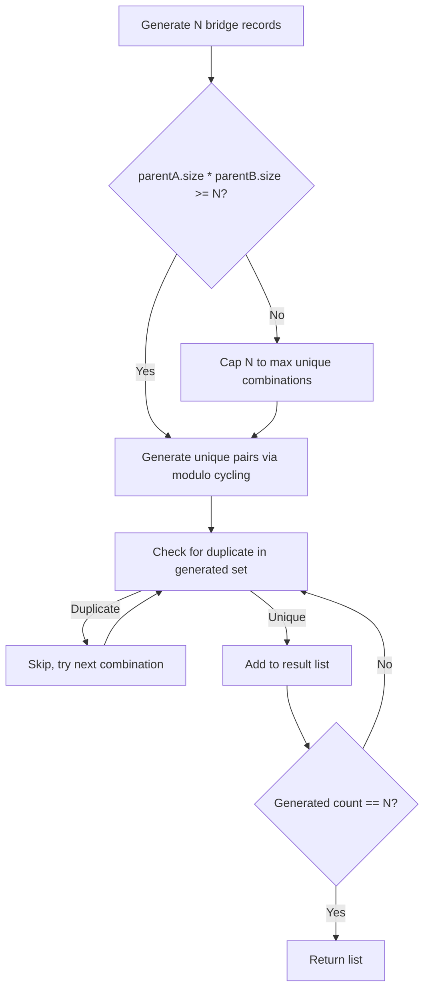

# Mock-Data Coverage Gaps — Workflow

> **Scope**: Add mock-data loaders for 12 unseeded tables (7 bridge + 3 entity + 2 config)
> **Project**: core-api (multi-tenant-data + mock-data-service modules)
> **Dependencies**: Existing mock-data-service infrastructure, multi-tenant-data JPA layer
> **Estimated Effort**: M

---

## 1. Summary

The mock-data-service currently covers 35/47 database tables. Twelve tables have no
mock-data generation: seven bridge/join tables (which also lack JPA DataModel classes),
three entity tables (tenant_branding, news_feed_items, tasks), and two config tables
(email_templates, email_template_variables). Without seed data for these tables,
E2E tests cannot exercise course-student enrollment, course-collaborator assignment,
event attendance, membership-course linking, compensation-collaborator linking,
tenant branding, news feed, task management, or email template flows.

This workflow adds JPA models for the 7 bridge tables in multi-tenant-data, then
creates the full mock-data pipeline (enum entry, factory, generator, use case,
configuration bean, registry wiring, post-load hooks) for all 12 tables.

---

## 2. Design Decisions + Decision Tree

### Decisions

| # | Decision | Alternatives Considered | Rationale |
|---|----------|------------------------|-----------|
| 1 | Create JPA DataModels for bridge tables in multi-tenant-data | Raw SQL inserts in mock-data-service | Consistent with existing architecture; enables Hibernate tenant filter; reusable by domain modules |
| 2 | Bridge table factories produce DataModels directly (no DTO) | Create DTOs for bridge tables | Bridge tables are simple join tables with no domain creation use case; direct entity mapping is the established pattern (see CourseDataLoaderConfiguration) |
| 3 | Entity tables (news_feed_items, tasks) use existing domain DTOs | Create mock-specific DTOs | DTOs already exist (generated from OpenAPI); reuse avoids duplication |
| 4 | TenantBranding uses direct DataModel mapping | Create a DTO | 1:1 relationship with tenant; no creation use case exists; model is simple |
| 5 | EmailTemplate + EmailTemplateVariable loaded together | Load independently | Template variables have FK to templates; loading together ensures referential integrity and simplifies ID wiring |

### Decision Tree



---

## 3. Specification

### 3.1 Bridge Tables (7) — Need JPA Models + Mock-Data Pipeline

| Table | PK | FK References | Extra Columns |
|-------|-----|---------------|---------------|
| `course_available_collaborators` | (tenant_id, course_id, collaborator_id) | courses, collaborators | created_at, updated_at, deleted_at |
| `adult_student_courses` | (tenant_id, adult_student_id, course_id) | adult_students, courses | created_at, updated_at, deleted_at |
| `minor_student_courses` | (tenant_id, minor_student_id, course_id) | minor_students, courses | created_at, updated_at, deleted_at |
| `course_event_adult_student_attendees` | (tenant_id, course_event_id, adult_student_id) | course_events, adult_students | created_at, updated_at, deleted_at |
| `course_event_minor_student_attendees` | (tenant_id, course_event_id, minor_student_id) | course_events, minor_students | created_at, updated_at, deleted_at |
| `membership_courses` | (tenant_id, membership_id, course_id) | memberships, courses | created_at, updated_at, deleted_at |
| `compensation_collaborators` | (tenant_id, compensation_id, collaborator_id) | compensations, collaborators | assigned_date DATE |

### 3.2 Entity Tables (3) — JPA Models Exist, Need Mock-Data Pipeline

| Table | PK | Key Columns | Existing Model |
|-------|-----|-------------|----------------|
| `tenant_branding` | (tenant_id) | school_name, logo_url, primary_color, secondary_color, font_family | `TenantBrandingDataModel` |
| `news_feed_items` | (tenant_id, news_feed_item_id) | title, body, author_id, course_id?, status, published_at | `NewsFeedItemDataModel` |
| `tasks` | (tenant_id, task_id) | title, description?, assignee_id, assignee_type, due_date, priority, status, created_by_user_id | `TaskDataModel` |

### 3.3 Config Tables (2) — JPA Models Exist, Need Mock-Data Pipeline

| Table | PK | Key Columns | Existing Model |
|-------|-----|-------------|----------------|
| `email_templates` | (tenant_id, template_id) | name, subject_template, body_html, body_text?, category?, is_active | `EmailTemplateDataModel` |
| `email_template_variables` | (tenant_id, template_variable_id) | template_id (FK), name, variable_type, is_required, default_value? | `EmailTemplateVariableDataModel` |

---

## 4. Domain Model

### 4.1 Aggregates



### 4.2 State Machine

Not applicable — bridge tables are stateless. Entity tables (news_feed_items, tasks)
have status fields but state transitions are managed by existing domain use cases,
not by the mock-data-service. The mock-data-service only generates initial records.

### 4.3 Domain Invariants

| # | Invariant | Enforced By | When |
|---|-----------|-------------|------|
| I1 | Bridge table FKs must reference existing parent records | MockDataExecutionPlan topological sort | Load order ensures parents load before children |
| I2 | Bridge table records must be unique (no duplicate pairs) | Factory modulo-cycling with dedup | At generation time |
| I3 | TenantBranding is 1:1 with tenant | Factory generates exactly 1 per tenant | At generation time — count capped to 1 |
| I4 | EmailTemplateVariable FK must point to existing template | Post-load hook injects templateIds | After EMAIL_TEMPLATE loads |
| I5 | NewsFeedItem author_id must reference a valid employee | Post-load hook injects employeeIds | After EMPLOYEE loads |
| I6 | Task assignee_id must reference a valid user | Post-load hook injects userIds by type | After user entities load |

### 4.4 Value Objects

Not applicable — no new value objects introduced.

### 4.5 Domain Events

Not applicable — mock-data loading does not fire domain events.

---

## 5. Architecture

### 5.1 Component Interaction Diagram



### 5.2 Module / Folder Structure

**New files in multi-tenant-data** (bridge table models):
```
multi-tenant-data/src/main/java/com/akademiaplus/
├── course/
│   ├── CourseAvailableCollaboratorDataModel.java
│   ├── AdultStudentCourseDataModel.java
│   ├── MinorStudentCourseDataModel.java
│   ├── CourseEventAdultStudentAttendeeDataModel.java
│   └── CourseEventMinorStudentAttendeeDataModel.java
├── billing/
│   ├── MembershipCourseDataModel.java
│   └── CompensationCollaboratorDataModel.java
```

**New files in mock-data-service**:
```
mock-data-service/src/main/java/com/akademiaplus/
├── config/
│   ├── TaskDataLoaderConfiguration.java
│   └── (modifications to existing configurations)
├── usecases/
│   ├── course/
│   │   ├── LoadCourseAvailableCollaboratorMockDataUseCase.java
│   │   ├── LoadAdultStudentCourseMockDataUseCase.java
│   │   ├── LoadMinorStudentCourseMockDataUseCase.java
│   │   ├── LoadCourseEventAdultStudentAttendeeMockDataUseCase.java
│   │   └── LoadCourseEventMinorStudentAttendeeMockDataUseCase.java
│   ├── billing/
│   │   ├── LoadMembershipCourseMockDataUseCase.java
│   │   └── LoadCompensationCollaboratorMockDataUseCase.java
│   ├── tenant/
│   │   └── LoadTenantBrandingMockDataUseCase.java
│   ├── notification/
│   │   ├── LoadNewsFeedItemMockDataUseCase.java
│   │   ├── LoadEmailTemplateMockDataUseCase.java
│   │   └── LoadEmailTemplateVariableMockDataUseCase.java
│   └── task/
│       └── LoadTaskMockDataUseCase.java
├── util/mock/
│   ├── course/
│   │   ├── CourseAvailableCollaboratorFactory.java
│   │   ├── AdultStudentCourseFactory.java
│   │   ├── MinorStudentCourseFactory.java
│   │   ├── CourseEventAdultStudentAttendeeFactory.java
│   │   └── CourseEventMinorStudentAttendeeFactory.java
│   ├── billing/
│   │   ├── MembershipCourseFactory.java
│   │   └── CompensationCollaboratorFactory.java
│   ├── tenant/
│   │   ├── TenantBrandingDataGenerator.java
│   │   └── TenantBrandingFactory.java
│   ├── notification/
│   │   ├── NewsFeedItemDataGenerator.java
│   │   ├── NewsFeedItemFactory.java
│   │   ├── EmailTemplateDataGenerator.java
│   │   ├── EmailTemplateFactory.java
│   │   └── EmailTemplateVariableFactory.java
│   └── task/
│       ├── TaskDataGenerator.java
│       └── TaskFactory.java
```

### 5.3 Integration Points

| System | Direction | Protocol | Purpose |
|--------|-----------|----------|---------|
| multi-tenant-data | Out | JPA/Hibernate | Bridge table DataModels + Repositories |
| mock-data-service | Out | Spring Data JPA | Persist generated mock data |
| MockDataExecutionPlan | In | Java enum dependencies | Topological ordering of new entity types |

---

## 6. Element Relationship Graph

```mermaid
graph TD
    subgraph "multi-tenant-data (new)"
        CAC_M[CourseAvailableCollaboratorDataModel]
        ASC_M[AdultStudentCourseDataModel]
        MSC_M[MinorStudentCourseDataModel]
        CEASA_M[CourseEventAdultStudentAttendeeDataModel]
        CEMSA_M[CourseEventMinorStudentAttendeeDataModel]
        MC_M[MembershipCourseDataModel]
        CC_M[CompensationCollaboratorDataModel]
    end

    subgraph "mock-data-service: Factories"
        CAC_F[CourseAvailableCollaboratorFactory]
        ASC_F[AdultStudentCourseFactory]
        MSC_F[MinorStudentCourseFactory]
        CEASA_F[CourseEventAdultStudentAttendeeFactory]
        CEMSA_F[CourseEventMinorStudentAttendeeFactory]
        MC_F[MembershipCourseFactory]
        CC_F[CompensationCollaboratorFactory]
        TB_F[TenantBrandingFactory]
        NFI_F[NewsFeedItemFactory]
        T_F[TaskFactory]
        ET_F[EmailTemplateFactory]
        ETV_F[EmailTemplateVariableFactory]
    end

    subgraph "mock-data-service: Config"
        ENUM[MockEntityType +12 entries]
        REG[MockDataRegistry +12 loaders/cleaners]
        HOOKS[PostLoadHooks +6 new hooks]
    end

    CAC_F --> CAC_M
    ASC_F --> ASC_M
    MSC_F --> MSC_M
    CEASA_F --> CEASA_M
    CEMSA_F --> CEMSA_M
    MC_F --> MC_M
    CC_F --> CC_M

    REG --> ENUM
    HOOKS --> REG
```



---

## 7. Implementation Dependency Graph



---

## 8. Infrastructure Changes

No infrastructure changes required. No new dependencies, Docker services, or
environment variables. All work is within existing multi-tenant-data and
mock-data-service Maven modules.

---

## 9. Constraints & Prerequisites

### Prerequisites

- multi-tenant-data module compiles (`mvn compile -pl multi-tenant-data -am`)
- mock-data-service module compiles (`mvn compile -pl mock-data-service -am`)
- Existing mock-data-service patterns are understood (read MockEntityType, MockDataRegistry, one existing factory)

### Hard Rules

- All DataModels use composite keys with `@IdClass` (bridge tables use 3-part composite)
- Bridge table DataModels extend `SoftDeletable` (they have `deleted_at`)
- `compensation_collaborators` does NOT have `deleted_at` — do NOT extend `SoftDeletable`
- All tenant-scoped entity DataModels extend `TenantScoped`
- Factory IDs injected via `@Setter` fields, validated with `IllegalStateException` in `generate()`
- All Faker instances use `Locale.of("es", "MX")`
- All string literals extracted to `static final` constants
- Standard ElatusDev copyright header on all new files
- Javadoc required on all public classes and methods
- Bridge table factories use modulo-cycling with deduplication to avoid duplicate pairs

### Out of Scope

- Domain use cases for bridge tables (no CRUD APIs — these are internal relationships)
- State machine logic for news_feed_items or tasks (existing domain use cases handle that)
- Unit tests for factories (covered in Phase 7 of prompt)
- Component tests (mock-data-service has no component test tier)

---

## 9.5 Error & Edge Case Paths

### Processing Errors (by lifecycle step)

| Step | Error Condition | System Response | User Impact | Recovery Path |
|------|----------------|-----------------|-------------|---------------|
| JPA Model creation | Missing parent entity import | Compilation error | None (build-time) | Fix import, recompile |
| Enum registration | Wrong dependency declaration | Topological sort cycle/error | Data load fails at runtime | Fix dependency array in enum |
| Factory generation | Injected ID list empty | IllegalStateException | Mock data partially loaded | Verify post-load hooks inject IDs correctly |
| Bridge table dedup | All combinations exhausted | Fewer records than requested | Less test coverage | Increase parent entity count or accept lower count |
| DataLoader saveAll | FK constraint violation | ConstraintViolationException | Batch fails | Check load order — parent must load before child |

### Boundary Condition: Bridge Table Deduplication



---

## 10. Acceptance Criteria

### Build & Infrastructure

**AC1**: Given all new files created,
when `mvn compile -pl multi-tenant-data -am` runs,
then compilation succeeds with zero errors.

**AC2**: Given all mock-data-service changes,
when `mvn compile -pl mock-data-service -am` runs,
then compilation succeeds with zero errors.

### Functional — Core Flow

**AC3**: Given the mock-data-service starts with the new loaders,
when `MockDataOrchestrator.generateAll(1, 10)` executes,
then all 12 new entity types are populated in the database without FK violations.

**AC4**: Given bridge table factories receive parent IDs via post-load hooks,
when `generate(10)` is called,
then all returned records have valid, non-null FK references.

### Functional — Edge Cases

**AC5**: Given a bridge table factory with empty ID lists,
when `generate(N)` is called,
then `IllegalStateException` is thrown with a descriptive message.

**AC6**: Given TenantBranding factory,
when `generate(N)` is called with N > 1,
then exactly 1 record is produced (1:1 with tenant).

### Security & Compliance

**AC7**: Given all new DataModels for bridge tables,
when Hibernate's tenant filter is active,
then queries are scoped to the current tenant's `tenant_id`.

### Quality Gates

**AC8 — Lint**: Given all new source files,
when `mvn compile` runs with compiler warnings enabled,
then zero warnings are reported on new files.

### Testing

**AC9 — Unit Tests**: Given all new factories,
when `mvn test -pl mock-data-service` runs,
then all factory tests pass verifying:
- Happy path: correct count, valid field values, non-null FKs
- Error path: IllegalStateException when IDs not injected
- Dedup: bridge table factories produce no duplicate pairs

---

## 11. Execution Report Specification

The executor MUST produce a structured report upon completion following the
standard report template (see PROMPT-TEMPLATE.md §8).

Key metrics to capture:
- Number of new files created (DataModels, Repositories, Factories, Generators, UseCases, Configs)
- Number of files modified (MockEntityType, MockDataRegistry, existing configurations)
- Compilation status of both modules
- Unit test results for new factories

---

## 12. Risk Matrix

### Risk Register

| # | Risk | Probability | Impact | Score | Mitigation |
|---|------|:-----------:|:------:|:-----:|------------|
| R1 | Bridge table composite 3-part keys cause Hibernate mapping issues | Low | High | Y | Follow existing MembershipAdultStudent pattern which also uses 3-part composite key |
| R2 | Topological sort cycle from incorrect dependency declarations | Low | Med | G | Test with existing MockDataExecutionPlan unit tests |
| R3 | Bridge table dedup logic produces fewer records than expected | Med | Low | G | Accept — bridge records are inherently bounded by parent counts |
| R4 | TenantBranding 1:1 constraint conflicts with count-based generation | Low | Low | G | Cap factory to generate exactly 1 per invocation |
| R5 | Missing OpenAPI-generated DTOs for some entities | Med | Med | Y | Fall back to direct DataModel mapping (no DTO needed) |

### Matrix

```
              |  Low Impact  |  Med Impact  |  High Impact  |
--------------+--------------+--------------+---------------+
 High Prob    |     Y        |     R        |      R        |
 Med Prob     |  G (R3)      |     Y (R5)   |      R        |
 Low Prob     |  G (R4)      |     Y (R2)   |      Y (R1)   |
```
