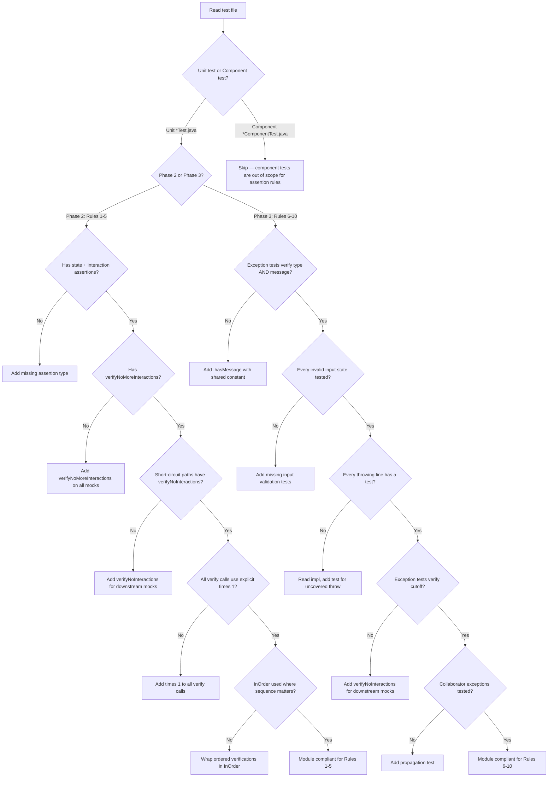
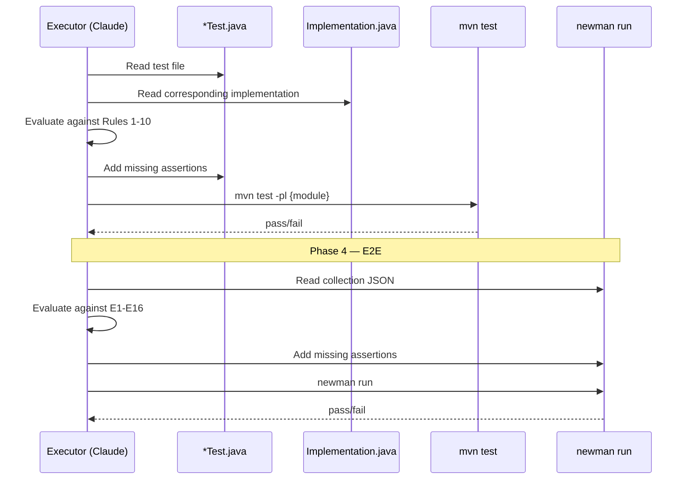
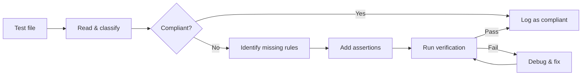
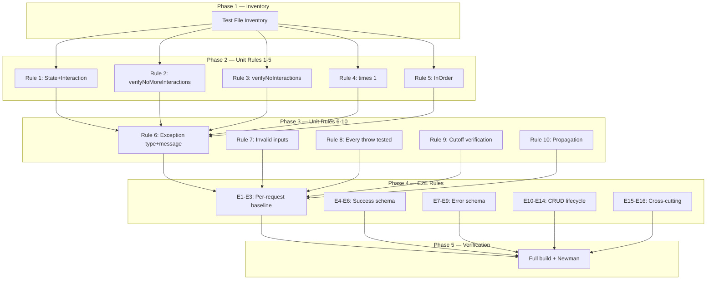
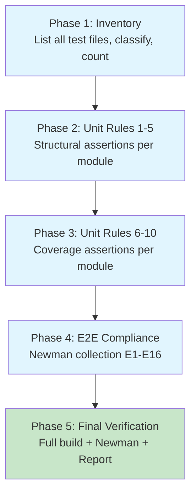
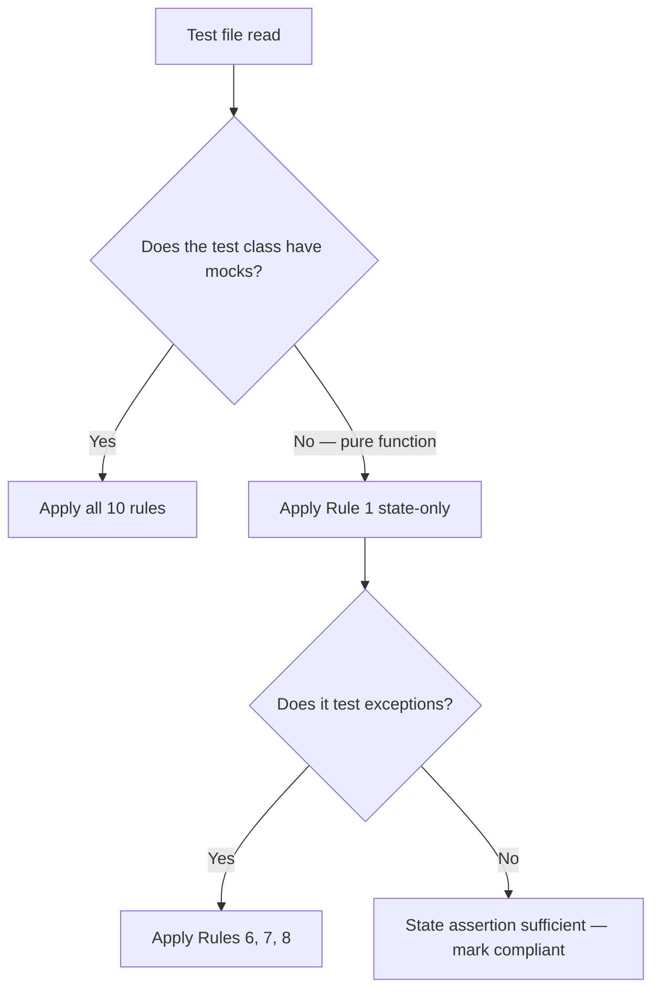
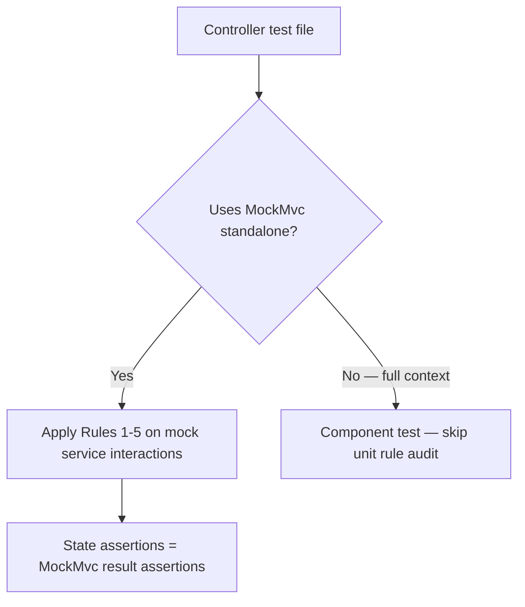

# Test Assertion Compliance — Workflow

> **Scope**: Audit and fix all existing unit tests and E2E tests to comply with AI-CODE-REF.md assertion rules
> **Project**: core-api
> **Dependencies**: MariaDB (TestContainers), Redis, Newman, running core-api instance (for E2E)
> **Estimated Effort**: XL

---

## 1. Summary

All features in core-api are complete and have existing tests across three tiers (unit, component, E2E). However, many tests were written before the 10 unit assertion rules (AI-CODE-REF.md section 4.4) and the 16 E2E assertion rules (section 4.11.1) were formalized. This workflow audits every test file across all 15 modules against those rules and fixes all non-compliant tests, ensuring that any structural or contractual change in the codebase is caught by at least one test failure.

---

## 2. Design Decisions + Decision Tree

### Decisions

| # | Decision | Alternatives Considered | Rationale |
|---|----------|------------------------|-----------|
| 1 | Audit module-by-module in dependency order (bottom-up) | Audit all modules at once, audit by rule | Bottom-up ensures foundation tests are fixed first; fixes propagate upward cleanly |
| 2 | Fix tests in-place (modify existing files) | Delete and rewrite all tests | Preserving existing test logic reduces risk; only missing assertions are added |
| 3 | Group unit rule audit into two phases: structural (Rules 1-5) then coverage (Rules 6-10) | All 10 rules in one pass | Two passes reduce cognitive load — structural rules are mechanical; coverage rules require reading implementation code |
| 4 | Audit E2E collection as a single phase (E1-E16) | Split E2E by rule groups | Newman collection is one JSON file — entity-by-entity review is more natural than rule-by-rule |
| 5 | Verify after each module, not just at phase boundaries | Verify only at phase end | Early detection of broken tests; avoids cascading failures across modules |

### Decision Tree



---

## 3. Specification

### 3.1 Audit Scope — Unit Tests

| Module | Test Location | Rule Set |
|--------|--------------|----------|
| utilities | `utilities/src/test/` | Rules 1-10 |
| infra-common | `infra-common/src/test/` | Rules 1-10 |
| multi-tenant-data | `multi-tenant-data/src/test/` | Rules 1-10 |
| security | `security/src/test/` | Rules 1-10 |
| user-management | `user-management/src/test/` | Rules 1-10 |
| billing | `billing/src/test/` | Rules 1-10 |
| course-management | `course-management/src/test/` | Rules 1-10 |
| notification-system | `notification-system/src/test/` | Rules 1-10 |
| tenant-management | `tenant-management/src/test/` | Rules 1-10 |
| pos-system | `pos-system/src/test/` | Rules 1-10 |
| lead-management | `lead-management/src/test/` | Rules 1-10 |
| application | `application/src/test/` | Rules 1-10 |
| certificate-authority | `certificate-authority/src/test/` | Rules 1-10 |
| mock-data-service | `mock-data-service/src/test/` | Rules 1-10 |
| audit-service | `audit-service/src/test/` | Rules 1-10 (if tests exist) |

### 3.2 Audit Scope — E2E Tests

| Collection | Location | Rule Set |
|------------|----------|----------|
| core-api-e2e | `core-api-e2e/Postman Collections/core-api-e2e.json` | E1-E16 |

### 3.3 Unit Assertion Rules Reference (AI-CODE-REF.md section 4.4)

| Rule | Name | Detection Pattern |
|------|------|-------------------|
| 1 | State + Interaction | Test has `assertThat`/`assertEquals` but no `verify()`, or has `verify()` but no state assertion |
| 2 | verifyNoMoreInteractions | Test method ends without `verifyNoMoreInteractions()` on all mocks |
| 3 | verifyNoInteractions | Short-circuit/exception test does not call `verifyNoInteractions()` on downstream mocks |
| 4 | Explicit times(1) | `verify(mock).method()` without `times(1)` |
| 5 | InOrder | Multiple `verify()` calls on different mocks without `InOrder` when business logic dictates sequence |
| 6 | Exception type + message | `assertThatThrownBy` without `.hasMessage()`, or `assertThrows` without message check |
| 7 | Invalid input coverage | Missing tests for null, empty, blank string, negative number, etc. |
| 8 | Every throwing line tested | Implementation has `if`/`throw` without corresponding test |
| 9 | Cutoff verification | Exception test does not verify downstream mocks were not called |
| 10 | Collaborator propagation | Collaborator can throw but no test stubs it to throw |

### 3.4 E2E Assertion Rules Reference (AI-CODE-REF.md section 4.11.1)

| Rule | Name | Detection Pattern |
|------|------|-------------------|
| E1 | Exact HTTP status code | Request has no `pm.response.to.have.status()` |
| E2 | Content-Type application/json | Non-204 request missing Content-Type assertion |
| E3 | Response time < 200ms | Request missing `pm.response.responseTime` assertion |
| E4 | All fields with correct types | Success response does not assert all DTO fields |
| E5 | Entity IDs > 0 | ID fields not asserted as `.to.be.above(0)` |
| E6 | Nested objects validated | Nested DTOs not validated |
| E7 | Error code exact match | 4xx response does not assert `json.code` |
| E8 | Message present and non-empty | Error response does not assert `json.message` |
| E9 | Validation details array | 400 response does not assert `json.details` array |
| E10 | Create-GetById chain | Created entity ID not used in subsequent GetById |
| E11 | GetAll includes created entity | GetAll does not verify the created entity is in the array |
| E12 | Delete-GetById 404 | No GetById request after Delete to verify soft delete |
| E13 | Duplicate creation 409 | No duplicate create request |
| E14 | Delete constrained 409 | No delete-with-dependents request |
| E15 | Auth enforcement 401 | No request without JWT |
| E16 | Tenant isolation | No request without X-Tenant-Id |

---

## 4. Domain Model

> This workflow audits and fixes test code only — no domain entities, aggregates, or state machines are created or modified. Domain model sections are not applicable.

### 4.1 Aggregates

N/A — no domain entities are created or modified in this workflow. The audit reads production code to understand throwing lines and collaborator interactions but does not change it.

### 4.2 State Machine

N/A — no state transitions. The audit process itself is stateless: each test file is evaluated independently.

### 4.3 Domain Invariants

| # | Invariant | Enforced By | When |
|---|-----------|-------------|------|
| I1 | No production code may be modified — only test files | Executor discipline + PR review | Every step |
| I2 | Existing passing tests must not be broken by assertion additions | `mvn test` verification after each module | After each module audit |
| I3 | All mock objects in a test class must appear in `verifyNoMoreInteractions` | Rule 2 enforcement | Phase 2 |
| I4 | Every `verify()` call must include `times(1)` | Rule 4 enforcement | Phase 2 |

### 4.4 Value Objects

N/A — no value objects created.

### 4.5 Domain Events

N/A — no domain events.

---

## 5. Architecture

### 5.1 Component Interaction Diagram



### 5.2 Data Flow Diagram



### 5.3 Module / Folder Structure

No new folders or structures are created. Tests are modified in-place within each module's existing `src/test/` directory.

### 5.4 Integration Points

| System | Direction | Protocol | Purpose |
|--------|-----------|----------|---------|
| Maven Surefire | Out | CLI | Run unit tests per module |
| Maven Failsafe | Out | CLI | Run component tests (verification only — not modified) |
| Newman | Out | CLI | Run E2E Postman collection |
| TestContainers | Out | Docker | MariaDB for component test verification |

---

## 6. Element Relationship Graph



---

## 7. Implementation Dependency Graph



### Module Execution Order (within Phases 2 and 3)

Bottom-up per the dependency graph:

```
1.  utilities              (zero deps)
2.  infra-common           (depends on utilities)
3.  multi-tenant-data      (depends on infra-common)
4.  security               (depends on multi-tenant-data)
5.  user-management        (depends on security)
6.  billing                (depends on security, user-mgmt)
7.  course-management      (depends on security, user-mgmt)
8.  notification-system    (depends on security)
9.  tenant-management      (depends on security)
10. pos-system             (depends on security, user-mgmt)
11. lead-management        (depends on security)
12. application            (depends on all domain modules)
13. certificate-authority  (standalone)
14. mock-data-service      (standalone)
15. audit-service          (standalone — may have no tests)
```

---

## 8. Infrastructure Changes

No infrastructure changes required. All tools (Maven, Newman, TestContainers, Docker) are already configured and operational.

---

## 9. Constraints & Prerequisites

### Prerequisites

- All existing tests currently pass: `mvn test` (unit), `mvn verify` (component), `newman run` (E2E)
- Docker is running (for TestContainers during component test verification)
- core-api E2E collection exists at `core-api-e2e/Postman Collections/core-api-e2e.json`
- AI-CODE-REF.md section 4.4 (unit rules) and section 4.11.1 (E2E rules) are the authoritative rule sets

### Hard Rules

- **No production code changes** — only test files and the E2E collection are modified
- **No test deletions** — existing test logic is preserved; only assertions are added
- **No `any()` matchers** — all added assertions use exact values or `ArgumentCaptor`
- **Shared constants** — all added `.hasMessage()` assertions reference `public static final` constants from the implementation class, never inline strings
- **Given-When-Then** — all new test methods follow G/W/T pattern with comments
- **Copyright header** — any new test files include the ElatusDev copyright header
- **Conventional Commits** — no AI attribution in commit messages

### Out of Scope

- Writing new unit tests for untested production classes (this workflow fixes EXISTING tests only)
- Component test modifications (component tests follow different assertion patterns)
- Frontend E2E tests (Playwright — covered by section 4.11.2, not this workflow)
- Mobile E2E tests (Detox — covered by section 3.10, not this workflow)
- Coverage metric enforcement (no minimum line coverage gate — audit is assertion-quality focused)
- SonarQube analysis or remediation

---

## 9.5 Error & Edge Case Paths

### Processing Errors (by lifecycle step)

| Step | Error Condition | System Response | User Impact | Recovery Path |
|------|----------------|-----------------|-------------|---------------|
| Inventory | Module has no test files | Log as "no tests — skip" | None | Continue to next module |
| Rule audit | Test method has no mocks (pure function test) | Rules 2-5, 9-10 are N/A | None | Apply only applicable rules (Rule 1 state-only is valid for pure functions) |
| Adding assertions | New assertion causes test to fail | Test was passing for wrong reason | Failing test discovered | Read implementation, determine correct behavior, fix test logic |
| Adding verifyNoMoreInteractions | Reveals unexpected mock interaction | Hidden dependency discovered | Test catches real issue | Investigate — may be a production bug or test setup issue |
| Adding times(1) | Reveals mock called more than once | Loop or duplicate call discovered | Test catches real issue | Verify if multiple calls are intentional; adjust times() if so |
| E2E assertion addition | Newman test fails with new assertion | API response doesn't match expected schema | Potential API issue | Verify against OpenAPI spec; adjust assertion or flag as API bug |

### Boundary Condition: Pure Function Tests



### Boundary Condition: Controller Tests with MockMvc



---

## 10. Acceptance Criteria

### Build & Infrastructure

**AC1**: Given all source files,
when `mvn clean install -DskipTests` runs,
then the build completes with zero compilation errors (no production code was changed).

### Functional — Core Flow

**AC2**: Given the test compliance audit,
when Phases 2-3 complete for all modules,
then every unit test file (*Test.java) across all 15 modules has been evaluated against Rules 1-10 and non-compliant tests have been fixed.

**AC3**: Given the E2E compliance audit,
when Phase 4 completes,
then every request in the Newman collection has been evaluated against E1-E16 and non-compliant requests have been fixed.

### Functional — Edge Cases

**AC4**: Given a unit test for a pure function (no mocks),
when Rules 2-5 and 9-10 are evaluated,
then they are marked N/A and only applicable rules (1-state-only, 6-8) are enforced.

### Security & Compliance

N/A — this workflow does not modify security logic. Existing security tests are audited for assertion completeness.

### Quality Gates

**AC5 — Lint**: Given all source files,
when lint runs (`mvn checkstyle:check`),
then zero violations are reported.

**AC6 — SonarQube**: N/A — no production code changes. Test-only modifications do not require SonarQube scan.

**AC7 — Dependency Audit**: N/A — no new dependencies added.

**AC8 — Secret Scan**: Given all committed files,
when `gitleaks detect` runs against the branch,
then zero secrets are detected.

**AC9 — Architecture Rules**: Given ArchUnit test suite,
when architecture tests run,
then no layer violations or circular dependencies exist.

### Testing

**AC10 — Unit Tests (Backend)**: Given all use cases and services,
when `mvn test` runs across all modules,
then all `*Test.java` unit tests pass,
and every test verifies both state (return value / exception) and structural interactions
(mock calls with exact parameters, explicit `times(1)`, call order via `InOrder`,
cutoff verification via `verifyNoInteractions` on downstream mocks,
and `verifyNoMoreInteractions` on all mocks) per AI-CODE-REF.md section 4.4.

**AC11 — Component Tests (Backend)**: Given TestContainers infrastructure,
when `mvn verify` runs across all modules,
then all `*ComponentTest.java` tests still pass (no regressions from test modifications).

**AC14 — E2E Tests (Backend)**: Given a running system with seeded data,
when Newman runs the Postman collection,
then every request asserts exact HTTP status code (E1), Content-Type `application/json` on non-204 responses (E2),
and response time < 200ms (E3); success responses assert all DTO fields with correct types (E4)
and entity IDs > 0 (E5); error responses assert exact error code (E7) and non-empty message (E8);
every entity has the 9 mandatory scenarios (E10-E14);
and cross-cutting tests verify auth enforcement 401 (E15) and tenant isolation (E16)
per AI-CODE-REF.md section 4.11.1.

---

## 11. Execution Report Specification

> The executor MUST produce a structured report upon completion (or abort).

### Report Structure

#### Part 1 — Narrative (for the user)

| Section | Content |
|---------|---------|
| **What Was Done** | Summary of audit scope, number of test files audited, number of violations found, number of fixes applied. Written for a non-technical stakeholder |
| **Before / After** | Table: modules audited, tests audited, Rule 1-10 violations before vs after, E1-E16 violations before vs after, total assertions added |
| **Work Completed — Feature Map** | Mermaid diagram showing each module audited grouped by phase, color-coded by compliance status: green = fully compliant, yellow = partially compliant (some rules N/A), red = issues remain |
| **What This Enables** | Any structural change to production code (added dependency, reordered calls, changed exception) will be caught by at least one test failure. E2E tests now enforce the full API contract |
| **What's Still Missing** | Test files for untested production classes (out of scope), component test assertion audit (out of scope), coverage gaps |

#### Part 2 — Technical Detail (for the retrospective)

| Section | Content |
|---------|---------|
| **Result** | COMPLETED / PARTIAL / ABORTED |
| **Metrics** | Total modules audited, total test files audited, total violations found, total assertions added, total new test methods added |
| **Files Modified** | Table: file path, changes summary (e.g., "added verifyNoMoreInteractions to 5 tests, added times(1) to 12 verify calls") |
| **Deviations** | Table: step, expected vs actual, cause, classification |
| **Verification** | `mvn test` output, `mvn verify` output, `newman run` output |
| **Known Issues** | Numbered list of issues discovered but not fixed |
| **Acceptance Criteria** | Final status of each AC from section 10 |

### Audit Report Per Module (generated during Phases 2-3)

For each module, the executor should produce a mini-report:

| Rule | # Violations Found | # Fixed | # N/A | Notes |
|------|:-----------------:|:-------:|:-----:|-------|
| Rule 1 | {n} | {n} | {n} | |
| Rule 2 | {n} | {n} | {n} | |
| ... | ... | ... | ... | |
| Rule 10 | {n} | {n} | {n} | |

---

## 12. Risk Matrix

### Risk Register

| # | Risk | Probability | Impact | Score | Mitigation |
|---|------|:-----------:|:------:|:-----:|------------|
| R1 | Adding `verifyNoMoreInteractions` reveals hidden mock interactions causing test failures | Med | Med | Y | Read implementation before adding; understand what mocks are expected to do |
| R2 | Adding `times(1)` reveals unintended multiple calls | Low | Med | Y | Investigate whether multiple calls are by design; adjust expected count if intentional |
| R3 | Adding `.hasMessage()` fails because implementation uses different message than expected | Med | Low | G | Use shared constants from implementation class — never inline strings |
| R4 | Module test suite too large to complete in one session | High | Med | R | Track progress in execution log; support session resume via log state |
| R5 | E2E collection assertions fail because API behavior doesn't match expected contract | Med | Med | Y | Cross-reference with OpenAPI spec; if API is correct, fix assertion; if API is wrong, log as known issue |
| R6 | New test methods for missing throwing lines break due to incorrect mock setup | Med | Low | G | Read implementation carefully; stub with exact parameters the impl passes |
| R7 | Context window exhaustion before completing all 15 modules | High | High | R | Phase-by-phase execution with commits at boundaries; execution log enables Continue-As-New |

### Matrix

```
              |  Low Impact  |  Med Impact  |  High Impact  |
--------------+--------------+--------------+---------------+
 High Prob    |              |  R4          |  R7           |
 Med Prob     |  R3, R6      |  R1, R5      |               |
 Low Prob     |              |  R2          |               |
```

- G **Accept** — monitor only (R3, R6)
- Y **Mitigate** — implement countermeasure during development (R1, R2, R5)
- R **Critical** — must resolve before/during implementation (R4, R7)

**R4/R7 Mitigation Strategy**: Execute module-by-module with commits after each module. The execution log (prompt section 6) enables session resume. If context window is exhausted mid-module, the executor resumes from the last committed module boundary.
