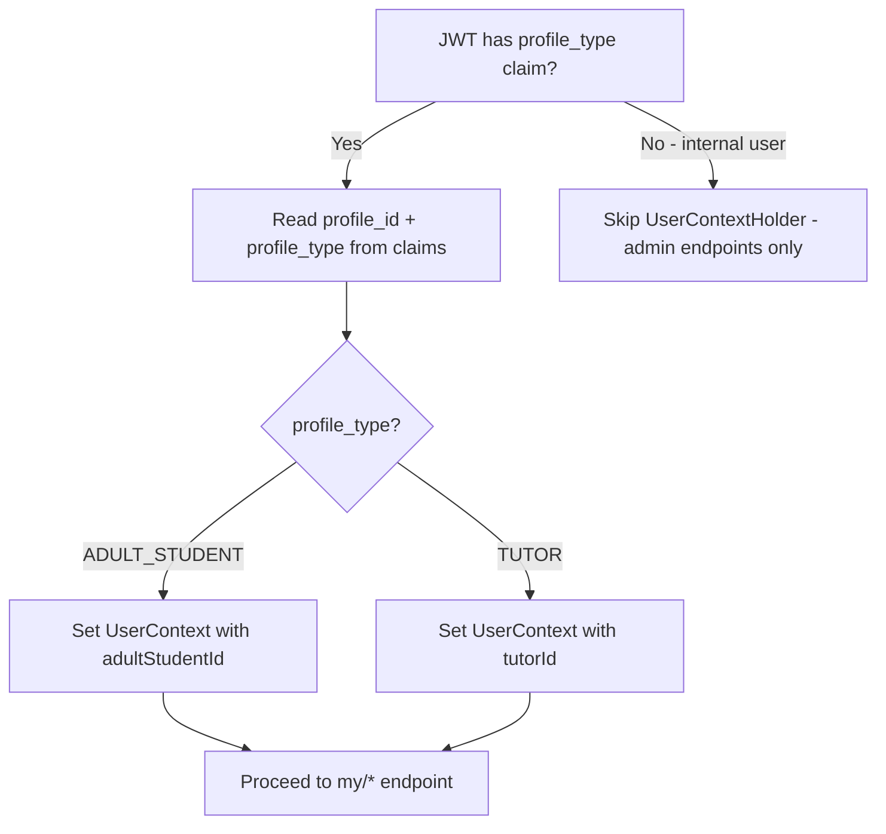
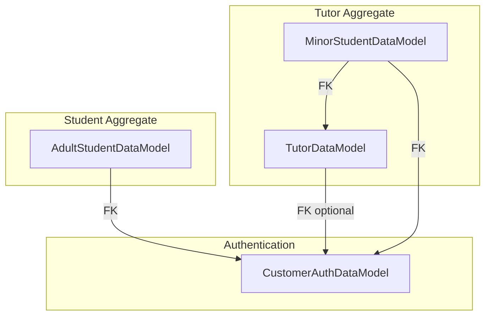
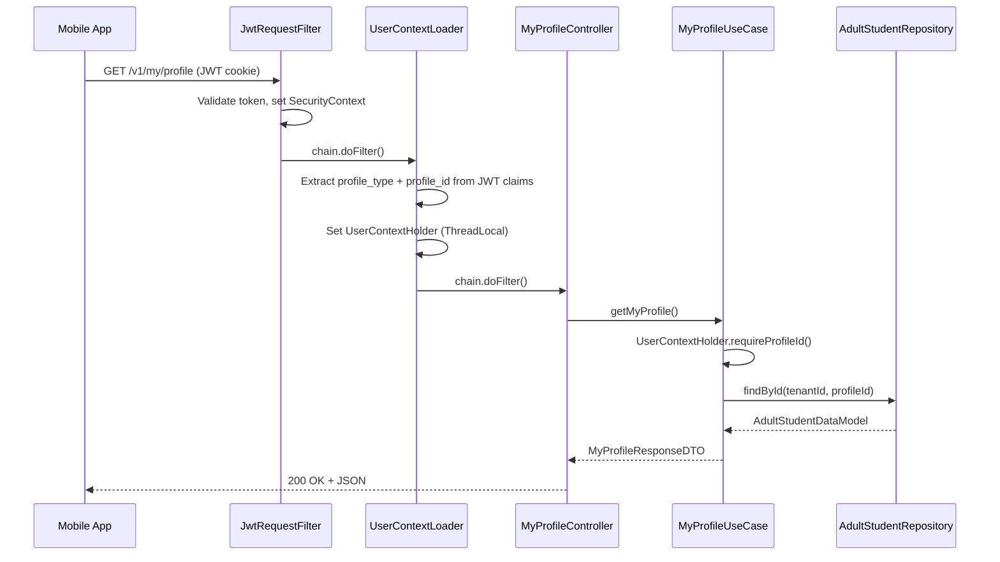
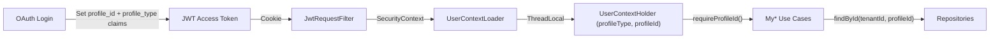
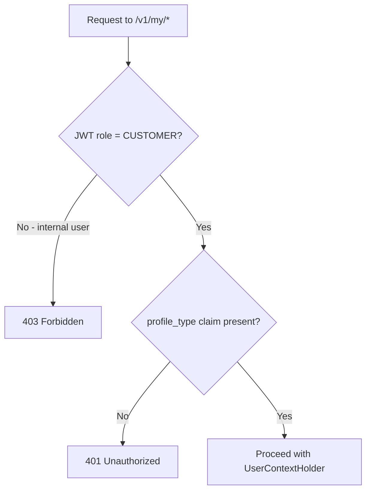

# User Isolation API — Workflow

> **Scope**: Server-enforced user-level data isolation for customer-facing endpoints
> **Project**: core-api
> **Dependencies**: security, user-management, billing, course-management modules
> **Estimated Effort**: M

---

## 1. Summary

Customer-facing endpoints (used by akademia-plus-go and akademia-plus-web) currently rely
on the frontend to pass the correct `adultStudentId` or `tutorId` — the server does not
enforce that a logged-in student can only see their own data. This workflow adds a
`UserContextHolder` (analogous to `TenantContextHolder`) that resolves the authenticated
user's profile ID from JWT claims and exposes it via a set of `/v1/my/*` endpoints where
the profile ID is server-derived, never client-supplied.

---

## 2. Design Decisions + Decision Tree

### Decisions

| # | Decision | Alternatives Considered | Rationale |
|---|----------|------------------------|-----------|
| 1 | Embed `profile_id` + `profile_type` in JWT claims at login time | DB lookup on every request via filter; Redis-cached resolution | Zero per-request overhead — profile IDs are known at login (OAuth/magic-link already resolve/create the student entity) |
| 2 | UserContextLoader filter (order 4, after JWT filter) reads claims into ThreadLocal | Inject directly via method-security SpEL; resolve in each use case manually | Consistent with TenantContextHolder pattern — centralized, testable, reusable across all modules |
| 3 | New `/v1/my/*` endpoints rather than modifying existing ones | Add userId filter param to existing endpoints; Hibernate user filter | "My" endpoints are a clean API contract for self-service; existing admin endpoints remain unchanged for akademia-plus-central/web |
| 4 | Extend GetCurrentUserUseCase to support CUSTOMER profile type | Create a separate GetCurrentCustomerUseCase | Single `/me` endpoint for all user types is simpler for mobile; the use case already has the resolution pattern |

### Decision Tree



---

## 3. Specification

### 3.1 JWT Claim Extensions

| Claim | Type | Set By | Value |
|-------|------|--------|-------|
| `profile_type` | String | OAuth/MagicLink login | `"ADULT_STUDENT"` or `"TUTOR"` |
| `profile_id` | Long | OAuth/MagicLink login | `adultStudentId` or `tutorId` |

These claims are added to the `additionalClaims` map passed to `JwtTokenProvider.createAccessToken()`.
Internal users (employee/collaborator) do NOT get these claims — they already have `user_id`.

### 3.2 My Endpoints

All endpoints require role `CUSTOMER` and a valid `profile_id` in JWT.

| Method | Path | Description | Profile Type |
|--------|------|-------------|:------------:|
| GET | `/v1/my/profile` | Get authenticated user's profile | ADULT_STUDENT, TUTOR |
| PUT | `/v1/my/profile` | Update own profile (name, phone, address) | ADULT_STUDENT, TUTOR |
| GET | `/v1/my/courses` | List courses I'm enrolled in | ADULT_STUDENT |
| GET | `/v1/my/schedule` | Get my class schedule | ADULT_STUDENT |
| GET | `/v1/my/memberships` | List my active memberships | ADULT_STUDENT |
| GET | `/v1/my/payments` | List my payment history | ADULT_STUDENT |
| GET | `/v1/my/children` | List my minor students | TUTOR |
| GET | `/v1/my/children/{minorStudentId}/courses` | List a child's enrolled courses | TUTOR |

### 3.3 UserContext Record

```java
public record UserContext(String profileType, Long profileId) {}
```

### 3.4 GetCurrentUserUseCase Extension

The existing `/v1/user-management/me` endpoint resolves employees and collaborators
via InternalAuthDataModel. Extend it to also resolve customers:

- If JWT has `profile_type = ADULT_STUDENT` → lookup AdultStudent by `profile_id`
- If JWT has `profile_type = TUTOR` → lookup Tutor by `profile_id`
- Return unified DTO with `userType = ADULT_STUDENT | TUTOR` and profile fields

---

## 4. Domain Model

### 4.1 Aggregates



### 4.2 State Machine

No new state machines. User isolation is stateless — enforced per-request via JWT claims.

### 4.3 Domain Invariants

| # | Invariant | Enforced By | When |
|---|-----------|-------------|------|
| I1 | A customer can only access their own profile data | MyProfileController + UserContextHolder | Every /v1/my/* request |
| I2 | profile_id in JWT must match an existing entity for the tenant | UserContextLoader filter | Request processing — returns 401 if invalid |
| I3 | A tutor can only see their own minor students (via tutorId FK) | MyChildrenUseCase | GET /v1/my/children |
| I4 | Internal users (employees/collaborators) cannot access /v1/my/* endpoints | SecurityConfiguration | Requires CUSTOMER role |
| I5 | profile_id is immutable in the JWT — cannot be overridden by request params | UserContextHolder design | By construction — no setter for client input |

### 4.4 Value Objects

| Value Object | Fields | Immutability | Equality |
|-------------|--------|:------------:|----------|
| UserContext | profileType, profileId | Immutable (Java record) | By fields |

### 4.5 Domain Events

None — user isolation is a request-scoped concern, not an event-driven feature.

---

## 5. Architecture

### 5.1 Component Interaction Diagram



### 5.2 Data Flow Diagram



### 5.3 Module / Folder Structure

New files distributed across existing modules:

```
security/
├── src/main/java/com/akademiaplus/internal/interfaceadapters/
│   └── UserContextHolder.java        ← NEW
│   └── UserContextLoader.java        ← NEW

application/
├── src/main/java/com/akademiaplus/
│   ├── config/
│   │   └── MyEndpointsSecurityConfiguration.java  ← NEW
│   ├── interfaceadapters/
│   │   └── MyProfileController.java               ← NEW
│   └── usecases/my/
│       ├── GetMyProfileUseCase.java                ← NEW
│       ├── UpdateMyProfileUseCase.java             ← NEW
│       ├── GetMyCoursesUseCase.java                ← NEW
│       ├── GetMyScheduleUseCase.java               ← NEW
│       ├── GetMyMembershipsUseCase.java            ← NEW
│       ├── GetMyPaymentsUseCase.java               ← NEW
│       ├── GetMyChildrenUseCase.java               ← NEW
│       └── GetMyChildCoursesUseCase.java           ← NEW
├── src/main/resources/openapi/
│   └── my-endpoints.yaml                           ← NEW
```

### 5.4 Integration Points

| System | Direction | Protocol | Purpose |
|--------|-----------|----------|---------|
| JwtTokenProvider | Out | JWT claims | Embed profile_id + profile_type at login |
| OAuthAuthenticationUseCase | Out | Method call | Add claims to additionalClaims map |
| MagicLinkVerificationUseCase | Out | Method call | Add claims to additionalClaims map |
| UserContextLoader | In | Servlet Filter | Read claims → ThreadLocal |
| AdultStudentRepository | In | JPA | Query by adultStudentId |
| TutorRepository | In | JPA | Query by tutorId |
| MembershipAdultStudentRepository | In | JPA | Query by adultStudentId |
| PaymentAdultStudentRepository | In | JPA | Already has findByAdultStudentId |
| CourseRepository | In | JPA | New: findByAdultStudentId (via junction table) |

---

## 6. Element Relationship Graph

```mermaid
graph TD
    subgraph security ["security module"]
        UCH[UserContextHolder]
        UCL[UserContextLoader]
    end

    subgraph application ["application module"]
        MSC[MyEndpointsSecurityConfiguration]
        MPC[MyProfileController]
        GMPU[GetMyProfileUseCase]
        UMPU[UpdateMyProfileUseCase]
        GMCU[GetMyCoursesUseCase]
        GMSU[GetMyScheduleUseCase]
        GMMU[GetMyMembershipsUseCase]
        GMPU2[GetMyPaymentsUseCase]
        GMCHU[GetMyChildrenUseCase]
        GMCCU[GetMyChildCoursesUseCase]
        OAS[my-endpoints.yaml]
    end

    subgraph login ["login modifications"]
        OAuth[OAuthAuthenticationUseCase]
        ML[MagicLinkVerificationUseCase]
        JTP[JwtTokenProvider]
    end

    UCL --> UCH
    MPC --> UCH
    MPC --> GMPU
    MPC --> UMPU
    MPC --> GMCU
    MPC --> GMSU
    MPC --> GMMU
    MPC --> GMPU2
    MPC --> GMCHU
    MPC --> GMCCU
    OAuth -.->|add claims| JTP
    ML -.->|add claims| JTP
    UCL -.->|reads claims from| JTP
```



---

## 7. Implementation Dependency Graph

```mermaid
graph TD
    P1S1["P1.S1 — JWT claim constants"] --> P1S2["P1.S2 — UserContextHolder"]
    P1S2 --> P1S3["P1.S3 — UserContextLoader filter"]
    P1S3 --> P1S4["P1.S4 — Add claims in OAuth login"]
    P1S4 --> P1S5["P1.S5 — Add claims in MagicLink login"]
    P1S5 --> P1Gate{"Phase 1 Gate"}

    P1Gate -->|pass| P2S1["P2.S1 — OpenAPI spec for my/* endpoints"]
    P2S1 --> P2S2["P2.S2 — MyProfileController + GetMyProfileUseCase"]
    P2S2 --> P2S3["P2.S3 — UpdateMyProfileUseCase"]
    P2S3 --> P2S4["P2.S4 — GetMyCoursesUseCase + repository method"]
    P2S4 --> P2S5["P2.S5 — GetMyScheduleUseCase"]
    P2S5 --> P2S6["P2.S6 — GetMyMembershipsUseCase"]
    P2S6 --> P2S7["P2.S7 — GetMyPaymentsUseCase"]
    P2S7 --> P2S8["P2.S8 — GetMyChildrenUseCase + GetMyChildCoursesUseCase"]
    P2S8 --> P2S9["P2.S9 — MyEndpointsSecurityConfiguration"]
    P2S9 --> P2Gate{"Phase 2 Gate"}

    P2Gate -->|pass| P3S1["P3.S1 — Unit tests for all use cases"]
    P3S1 --> P3S2["P3.S2 — Component tests for my/* endpoints"]
    P3S2 --> P3S3["P3.S3 — User isolation tests (cross-user data leak)"]
    P3S3 --> P3S4["P3.S4 — GetCurrentUserUseCase extension for CUSTOMER"]
    P3S4 --> P3Gate{"Phase 3 Gate"}

    style P1S1 fill:#e1f5fe
    style P3Gate fill:#c8e6c9
```



---

## 8. Infrastructure Changes

No infrastructure changes. No new services, databases, or Terraform modules.

---

## 9. Constraints & Prerequisites

### Prerequisites

- OAuth login flow operational (OAuthAuthenticationUseCase)
- Magic-link login flow operational (MagicLinkVerificationUseCase)
- Docker (MariaDB Testcontainers) available for component tests

### Hard Rules

- profile_id MUST come from JWT claims — never from request parameters on /v1/my/* endpoints
- All existing admin endpoints remain unchanged — /v1/my/* is additive
- UserContextLoader MUST run AFTER JwtRequestFilter (order 4 > order 3)
- UserContextHolder MUST be cleared after each request (finally block in filter)
- All PII fields use existing encryption (PersonPIIDataModel pattern)

### Out of Scope

- Minor student self-service login (minors authenticate through tutor oversight)
- Push notification isolation (notifications already scoped by recipient)
- Admin impersonation ("view as student") feature
- Rate limiting on /v1/my/* endpoints (inherits from existing elatus chain)

---

## 9.5 Error & Edge Case Paths

### Processing Errors (by lifecycle step)

| Step | Error Condition | System Response | User Impact | Recovery Path |
|------|----------------|-----------------|-------------|---------------|
| UserContextLoader | JWT has no profile_type claim (internal user) | Skip — do not set UserContext | None — internal user uses admin endpoints | N/A |
| UserContextLoader | JWT has profile_type but no profile_id | Return 401 Unauthorized | "Authentication required" | Re-login |
| My endpoint | UserContextHolder empty (no profile_id) | Return 401 Unauthorized | "Authentication required" | Re-login with customer account |
| My endpoint | profile_id does not match any entity | Return 404 Not Found | "Profile not found" | Contact support — data integrity issue |
| My endpoint | Tenant context missing | Return 400 Bad Request | "Tenant context required" | Re-send with X-Tenant-Id header |
| Tutor /my/children | Tutor has no minor students | Return 200 with empty list | Empty state in app | Normal — not all tutors have minors |

### Boundary Condition: Internal User Accessing /v1/my/*



---

## 10. Acceptance Criteria

### Build & Infrastructure

**AC1**: Given the full Maven reactor,
when `mvn clean install -DskipTests` runs,
then all 18 modules compile without errors.

### Functional — Core Flow

**AC2**: Given an adult student authenticated via OAuth with `profile_id` in JWT,
when `GET /v1/my/profile` is called,
then the response contains the student's own profile data (name, email, courses).

**AC3**: Given an adult student authenticated via OAuth,
when `GET /v1/my/payments` is called,
then only payments belonging to that student's `adultStudentId` are returned.

**AC4**: Given a tutor authenticated via OAuth with `profile_type = TUTOR`,
when `GET /v1/my/children` is called,
then only minor students linked to that tutor's `tutorId` are returned.

### Functional — Edge Cases

**AC5**: Given an adult student A and an adult student B in the same tenant,
when student A calls `GET /v1/my/payments`,
then student B's payments are NOT included in the response.

**AC6**: Given an internal user (employee) with valid JWT,
when `GET /v1/my/profile` is called,
then the response is 403 Forbidden (CUSTOMER role required).

### Security & Compliance

**AC7**: Given a customer JWT,
when the `profile_id` claim is tampered with (different student's ID),
then the JWT signature validation fails and the request returns 401.

**AC8**: Given a valid customer JWT for student A,
when a request is made to any `/v1/my/*` endpoint,
then the server uses ONLY the `profile_id` from the JWT — no request parameter can override it.

### Quality Gates

**AC9 — Build**: Given all source files,
when `mvn clean install -DskipTests` runs,
then zero compilation errors.

### Testing

**AC10 — Unit Tests**: Given all my/* use cases,
when `mvn test -pl application` runs,
then all unit tests pass with >=80% line coverage.

**AC11 — Component Tests**: Given Testcontainers MariaDB,
when `mvn verify -pl application` runs,
then all component tests for /v1/my/* endpoints pass.

**AC12 — User Isolation Tests**: Given two students in the same tenant,
when student A calls /v1/my/payments and student B calls /v1/my/payments,
then each only sees their own data — zero cross-user data leaks.

---

## 11. Execution Report Specification

The executor MUST produce a structured report per PROMPT-TEMPLATE.md §8.

---

## 12. Risk Matrix

### Risk Register

| # | Risk | Probability | Impact | Score | Mitigation |
|---|------|:-----------:|:------:|:-----:|------------|
| R1 | JWT claim size increases slightly | Low | Low | G | profile_type (string) + profile_id (long) = ~30 bytes — negligible |
| R2 | Existing OAuth login tests break after claim changes | Med | Med | Y | Update test mocks to include new claims; run full test suite |
| R3 | UserContextLoader adds latency to every request | Low | Low | G | No DB lookup — reads only from already-parsed JWT claims |
| R4 | Mobile app not updated to use /v1/my/* endpoints | Med | High | R | Coordinate release: API first, then mobile update. Old endpoints remain functional |

### Matrix

```
              |  Low Impact  |  Med Impact  |  High Impact  |
--------------+--------------+--------------+---------------+
 High Prob    |     Y        |     R        |      R        |
 Med Prob     |  G           |  R2 Y        |   R4 R        |
 Low Prob     |  R1,R3 G     |     Y        |      Y        |
```

- G **Accept** — R1, R3: monitor only
- Y **Mitigate** — R2: update tests during implementation
- R **Critical** — R4: coordinate mobile release timing
